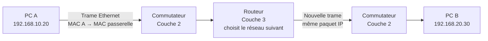

# Module 01 — Le modèle OSI test

**Séquence :** Bases des réseaux  
**Importance :** socle de la progression officielle  
**Sources consolidées :** 1 support(s) de cours, 0 énoncé(s), 0 correction(s)

!!! warning "Périmètre et versions"
    Les six modules sont explicitement nommés dans les dossiers et supports Réseaux. Les activités Packet Tracer sont conservées comme ressources binaires à ouvrir avec Cisco Packet Tracer.

## Objectifs et compétences

- Situer les sept couches du modèle OSI et leur responsabilité.
- Relier données, segments, paquets, trames et bits aux PDU correspondantes.
- Expliquer l’encapsulation et la désencapsulation de bout en bout.
- Associer protocoles, adresses, ports et équipements à la bonne couche.

!!! tip "Façon simple de le comprendre"
    Ce module sert à passer de la notion « Le modèle OSI » à une méthode que l’on peut expliquer, appliquer, vérifier et dépanner.

## Méthode de travail

1. Lire les concepts dans l’ordre du support.
2. Reproduire les exemples dans un environnement de laboratoire.
3. Noter le résultat attendu avant de modifier une configuration.
4. Vérifier avec l’outil ou la commande appropriée.
5. Revenir à l’état initial si le résultat diverge.

## Repères visuels

Le modèle OSI découpe une communication en **sept responsabilités complémentaires**. À l’émission, chaque couche prépare les données pour la couche inférieure ; à la réception, le traitement se fait dans l’ordre inverse.

<figure class="tssr-figure">
  

    

      
7<strong>Application</strong>Services visibles : HTTP, DNS, SMTP<small>Données</small>

      
6<strong>Présentation</strong>Format, chiffrement TLS, compression<small>Données</small>

      
5<strong>Session</strong>Ouverture, maintien et reprise du dialogue<small>Données</small>

      
4<strong>Transport</strong>TCP/UDP, fiabilité et numéros de port<small>Segment</small>

      
3<strong>Réseau</strong>IPv4/IPv6, choix du chemin, routeur<small>Paquet</small>

      
2<strong>Liaison</strong>Ethernet, adresse MAC, commutateur<small>Trame</small>

      
1<strong>Physique</strong>Câble, fibre, radio et signaux<small>Bits</small>

    

  

  <figcaption>Lecture de haut en bas à l’émission : des données applicatives jusqu’aux bits transportés sur le support.</figcaption>
</figure>

  
<b>Couche 2 · MAC</b>Identifie une interface sur le lien local ; utilisée par le commutateur.

  
<b>Couche 3 · IP</b>Identifie un hôte et son réseau ; utilisée par le routeur.

  
<b>Couche 4 · Port</b>Identifie le service ou l’application : 53/DNS, 80/HTTP, 443/HTTPS.

  
<b>Couche 7 · Protocole</b>Définit le service rendu à l’utilisateur ou à l’application.

### Encapsulation : ce qui s’ajoute à chaque étape

<figure class="tssr-figure">
  

    

      
<strong>L7–L5 · Données</strong>
Message applicatif

      
<strong>L4 · Segment</strong>
TCP · portsDonnées

      
<strong>L3 · Paquet</strong>
IP source/destinationTCPDonnées

      
<strong>L2 · Trame</strong>
MAC source/destinationIPTCPDonnéesFCS

      
<strong>L1 · Bits</strong>
10110100 01101001 …

    

  

  <figcaption>Chaque en-tête apporte les informations dont la couche a besoin. La désencapsulation retire ces informations à l’arrivée.</figcaption>
</figure>

### Où interviennent le commutateur et le routeur ?

Le commutateur relaie une trame selon les adresses MAC. Le routeur retire la trame, examine l’adresse IP de destination, choisit une route puis crée une nouvelle trame sur le lien suivant.

## Cours consolidé

Connaitre les couches du modèle OSI Manipuler les unités de mesure informatique Appréhender l’adressage IP Connaître la communication au sein d’un réseau Découvrir les premières commandes Modèle OSI : Une Structure en 7 Couches Le modèle OSI (Open Systems Interconnection) est une norme qui définit comment les communications se font entre deux systèmes sur un réseau. Ce modèle théorique est divisé en 7 couches distinctes, chaque couche ayant une fonction spécifique et communiquant avec celles situées directement au-dessus et en dessous d'elle.

Cette segmentation permet de structurer les processus réseau et de faciliter le développement et le débogage des protocoles réseau.

Le PDU (Protocol Data Unit) : Qu’est-ce que c’est ? Le PDU (Unité de Données de Protocole en français) est un terme utilisé dans le domaine des réseaux pour désigner une unité de données qui est échangée entre deux entités réseau dans le cadre d'une communication sur une couche spécifique du modèle OSI. Chaque couche du modèle OSI a son propre PDU, qui change en fonction du rôle et des tâches de la couche concernée. Le PDU comprend à la fois les données utilisateur et les informations de contrôle ajoutées par les protocoles de la couche pour garantir le bon acheminement des données sur le réseau.

Le PDU à travers les différentes couches du Modèle OSI Chaque couche du modèle OSI encapsule les données reçues de la couche supérieure en y ajoutant ses propres en-têtes (et éventuellement un pied de trame pour certaines couches) afin de former un nouveau PDU.

Encapsulation et Désencapsulation des PDU Chaque fois qu'une couche du modèle OSI reçoit des données de la couche supérieure, elle encapsule ces données dans un PDU en ajoutant des informations spécifiques à son rôle (adresses, numéro de séquence, contrôle d'erreur, etc.). Ce processus d'encapsulation se poursuit jusqu'à la couche physique, où les données sont converties en signaux et transmises sur le réseau.

À l'arrivée, le processus inverse se produit. Les données sont désencapsulées couche par couche, les informations ajoutées à chaque PDU étant retirées par la couche correspondante jusqu'à ce que les données d'origine soient reconstituées et livrées à l'application finale. PDU et SDU : Le Passage d’une Couche à l’Autre dans le Modèle OSI Dans le modèle OSI (Open Systems Interconnection), chaque couche a un rôle bien défini dans le traitement des données lors de la communication réseau. Le transfert de données entre ces couches implique deux concepts importants : le PDU (Protocol Data Unit) et le SDU (Service Data Unit).

PDU : C'est l'unité de données transmise d'une couche à une autre. Elle inclut les données utilisateur ainsi que les informations de contrôle propres à la couche qui traite le PDU. SDU : C'est l'unité de données fournie par une couche N+1 à la couche N. La couche N+1 donne des données brutes à la couche N pour qu'elle les prépare à la transmission.

Processus de Transformation : Du PDU au SDU et vice-versa Lorsqu'une couche (N+1) termine son travail sur les données, elle génère un PDU (par exemple, un segment pour la couche transport ou un paquet pour la couche réseau). Ce PDU devient alors le SDU pour la couche N, c'est-à-dire qu'il est transmis à la couche inférieure (la couche N) sous forme brute, sans aucune information spécifique à la couche N ajoutée.

Étapes principales

### Le PDU de la couche N+1 devient le SDU de la couche N

Lorsque la couche N+1 finit son travail, elle envoie son PDU à la couche N. La couche N considère alors ce PDU comme un SDU, une donnée à traiter.

#### Ajout du PCI (Protocol Control Information)

La couche N ajoute son propre PCI (Protocol Control Information), qui contient des informations de contrôle comme les adresses, les numéros de séquence, les mécanismes de gestion d’erreur, etc. Cette étape est appelée encapsulation. Le PCI est essentiel car il permet à la couche N d’assurer ses responsabilités, par exemple le routage à la couche réseau ou la segmentation à la couche transport.

#### Formation d’un nouveau PDU

Une fois que la couche N a ajouté son PCI au SDU, elle forme un nouveau PDU spécifique à sa propre couche. Ce PDU sera ensuite transmis à la couche inférieure (la couche N-1), où le même processus se répétera.

#### Exemple Concret (de la Couche Transport à la Couche Réseau)

Prenons l'exemple du transfert d'un segment TCP (couche transport) à un paquet IP (couche réseau) :

Couche Transport (N+1) : La couche transport prépare un PDU appelé segment TCP, contenant les données applicatives et les informations de contrôle de la couche transport (numéro de séquence, ports source et destination, etc.).

Transmission à la Couche Réseau (N) : Ce segment TCP devient alors le SDU pour la couche réseau. La couche réseau reçoit ce SDU et doit maintenant y ajouter ses propres informations.

Ajout du PCI Réseau : La couche réseau ajoute son PCI, qui contient des informations importantes comme l’adresse IP source, l’adresse IP de destination, et d'autres données de routage.

Formation du Paquet IP (PDU) : Après l'ajout du PCI, le SDU de la couche réseau devient un nouveau PDU sous forme de paquet IP. Ce paquet sera ensuite transmis à la couche inférieure (couche liaison de données) pour être envoyé physiquement à travers le réseau.

SDU : C'est le bloc de données brutes provenant de la couche supérieure.

PCI : C'est l'information de contrôle ajoutée par la couche pour gérer l'acheminement et le traitement des données.

PDU : C'est le résultat final de l’encapsulation, après ajout du PCI au SDU. Ce PDU est ensuite transmis à la couche inférieure, où le processus recommence.

À chaque étape de la communication, les données sont encapsulées dans un nouveau PDU en fonction des exigences de la couche concernée, avant d'être finalement transmises sur le réseau sous forme de bits (à la couche physique).

Les Ports et Protocoles dans le Modèle OSI Dans le modèle OSI (Open Systems Interconnection), chaque couche joue un rôle bien défini dans le processus de communication réseau.

Les protocoles sont des ensembles de règles qui régissent la manière dont les données sont échangées à chaque niveau, tandis que les ports sont des identifiants numériques utilisés par les applications au sein de la couche transport pour distinguer les différentes communications.

Le modèle OSI comporte 7 couches, et chaque couche utilise des protocoles spécifiques pour effectuer ses tâches.

Les ports sont principalement utilisés à la couche transport (couche 4), mais les protocoles existent à toutes les couches, jouant un rôle crucial dans la communication entre systèmes.

1. Couche Physique (Physique) Rôle : Transmission des bits sous forme de signaux électriques, optiques ou radio à travers des supports physiques (câbles, fibres optiques, ondes radio, etc.). Protocoles : Cette couche ne comporte pas vraiment de protocoles au sens classique, mais plutôt des normes et spécifications physiques comme Ethernet (IEEE 802.3), Wi-Fi (IEEE 802.11), ou encore Bluetooth, qui définissent la manière dont les bits sont transmis. Exemples

Ethernet Wi-Fi (802.11) 2. Couche Liaison de Données (Data Link) Rôle : Assurer une transmission fiable des trames entre deux équipements adjacents sur le même réseau. Elle gère les erreurs de transmission, la synchronisation des trames et l'accès au support physique.

#### Protocoles

Ethernet (IEEE 802.3) : Protocole dominant pour les réseaux locaux câblés. Wi-Fi (IEEE 802.11) : Protocole pour les réseaux locaux sans fil. PPP (Point-to-Point Protocol) : Utilisé pour la communication entre deux nœuds réseau, souvent pour les connexions internet via modem. HDLC (High-Level Data Link Control) : Protocole pour les connexions série synchrone. 3. Couche Réseau (Network) Rôle : Responsable de l’acheminement des paquets entre les différents réseaux et de la gestion des adresses logiques (par exemple, adresses IP).

#### Protocoles

`IP (Internet Protocol) : Le protocole principal pour l'acheminement des paquets sur l'Internet et d'autres réseaux.`

IPv4 : Version la plus répandue d'IP, utilisant des adresses 32 bits. IPv6 : Nouvelle version d'IP, avec des adresses 128 bits, pour répondre à l'épuisement des adresses IPv4. ICMP (Internet Control Message Protocol) : Utilisé pour envoyer des messages de diagnostic et de contrôle, comme les messages d'erreur ou de ping.

`ARP (Address Resolution Protocol) : Traduit les adresses IP en adresses MAC pour la communication au sein du même réseau local.`

OSPF (Open Shortest Path First) : Protocole de routage utilisé dans les réseaux internes pour déterminer le meilleur chemin. 4. Couche Transport (Transport) Rôle : Assurer une communication fiable de bout en bout entre les hôtes, gérant le contrôle d’erreurs, le flux et la segmentation des données. Ports : La couche transport utilise les ports pour identifier les différentes communications entre les applications. Un port est un identifiant numérique attribué à chaque application communicante (par exemple, HTTP utilise le port 80).

#### Protocoles

TCP (Transmission Control Protocol) : Protocole orienté connexion, garantissant la livraison fiable des données dans le bon ordre. Il utilise des mécanismes comme le contrôle de flux et la gestion des erreurs. UDP (User Datagram Protocol) : Protocole non orienté connexion, plus rapide mais sans garantie de livraison des données (utilisé pour les flux audio/vidéo en temps réel). Exemples de ports

Port 22 : SSH (Secure Shell) pour l'administration distante sécurisée. Port 25 : SMTP (Simple Mail Transfer Protocol) pour l'envoi d'emails. Port 53 : DNS (Domain Name System) pour la résolution de noms de domaine. Port 67 et 68 : DHCP (Dynamic Host Configuration Protocol) pour l'attribution d'adresses IP dynamiques. Port 80 : HTTP pour le web. Port 443 : HTTPS pour les communications web sécurisées. Port 143 : IMAP (Internet Message Access Protocol) pour la gestion des emails sur un serveur distant. Port 389 : LDAP (Lightweight Directory Access Protocol) pour les services d'annuaire. Port 3389 : RDP (Remote Desktop Protocol) pour la prise en main à distance de bureaux Windows. Port 161 et 162 : SNMP (Simple Network Management Protocol) pour la gestion des équipements réseau (161 pour les requêtes, 162 pour les notifications). 5. Couche Session (Session) Rôle : Établir, gérer et terminer les sessions entre deux applications. Elle est aussi responsable de la synchronisation et de la reprise des échanges en cas d’interruption.

#### Protocoles

RPC (Remote Procedure Call) : Permet à un programme d'exécuter des procédures sur un autre ordinateur. NetBIOS : Utilisé pour gérer les connexions et l’échange de données entre ordinateurs sur un réseau local. 6. Couche Présentation (Presentation) Rôle : Gérer la traduction des données entre le format utilisé par l'application et celui nécessaire pour la transmission réseau. Elle s’occupe également du chiffrement et de la compression des données.

#### Protocoles

SSL (Secure Sockets Layer) et TLS (Transport Layer Security) : Protocoles de sécurité pour le chiffrement des communications (utilisés pour HTTPS). JPEG, MPEG : Protocoles de codage des données multimédia pour garantir leur bonne transmission. 7. Couche Application (Application) Rôle : Fournir des services réseau aux applications utilisées par l'utilisateur final. C'est ici que se situent les protocoles que nous utilisons quotidiennement pour le web, les emails, le transfert de fichiers, etc.

#### Protocoles

HTTP/HTTPS (Hypertext Transfer Protocol / Secure) : Protocole utilisé pour naviguer sur le web. FTP (File Transfer Protocol) : Protocole de transfert de fichiers. SMTP (Simple Mail Transfer Protocol) : Utilisé pour l’envoi d’emails. DNS (Domain Name System) : Traduit les noms de domaine en adresses IP.

Exemple : l'encapsulation lors d'un envoi de mail 1. Couche Application (Couche 7) Rôle : L'utilisateur compose un email via une application de messagerie, et celui-ci est envoyé à travers le protocole SMTP (Simple Mail Transfer Protocol). Encapsulation : À ce niveau, les données brutes (l'email complet, y compris le texte et les pièces jointes) sont appelées APDU (Application Protocol Data Unit). L'APDU est la forme sous laquelle les données sont manipulées dans la couche Application, avant d'être transmises à la couche inférieure. L'APDU est ensuite transmis à la couche Présentation.

2. Couche Présentation (Couche 6) Rôle : La couche Présentation convertit les données dans un format standardisé pour la transmission, et peut aussi appliquer du chiffrement ou de la compression. Encapsulation : À ce niveau, l'APDU est encapsulé dans un PPDU (Presentation Protocol Data Unit). Si un chiffrement comme SSL ou TLS est utilisé, un en-tête spécifique sera ajouté à ce stade pour indiquer la méthode de cryptage. Le PPDU est ensuite transmis à la couche Session.
3. Couche Session (Couche 5) Rôle : La couche Session gère la communication entre l'application cliente (votre logiciel de messagerie) et le serveur de messagerie. Encapsulation : À cette couche, le PPDU est encapsulé dans un SPDU (Session Protocol Data Unit), qui contient des informations nécessaires à la gestion de la session, comme les mécanismes de synchronisation et les informations d'identification de session. Le SPDU est ensuite transmis à la couche Transport.
4. Couche Transport (Couche 4) Rôle : Cette couche est responsable du transport fiable des données entre l'hôte émetteur et le serveur de messagerie, en segmentant les données et en assurant le contrôle d’erreurs. Le protocole utilisé est généralement TCP pour garantir une transmission fiable. Encapsulation : Le SPDU est encapsulé dans un TPDU, également appelé Segment dans le cas de TCP. L'en-tête ajouté à cette couche contient des informations cruciales telles que le numéro de port (par exemple, port 25 pour SMTP), les numéros de séquence pour l'ordonnancement des segments, et les informations de contrôle d’erreurs. Les segments (TPDU) sont ensuite envoyés à la couche Réseau.
5. Couche Réseau (Couche 3) Rôle : Cette couche est responsable de l’acheminement des paquets à travers différents réseaux, en utilisant les adresses IP source et destination pour déterminer le chemin. Encapsulation : Le TPDU (Segment) est encapsulé dans un RPDU, ou paquet (PDU au niveau de la couche Réseau). L'en-tête ajouté à ce niveau contient les adresses IP de source et de destination, permettant au paquet de circuler à travers le réseau. Le RPDU (paquet) est ensuite transmis à la couche Liaison de Données.
6. Couche Liaison de Données (Couche 2) Rôle : La couche Liaison de Données assure la transmission fiable des données sur le lien physique, et gère les adresses MAC pour les communications entre deux appareils sur un même réseau. Encapsulation : Le RPDU (paquet) est encapsulé dans une LPDU, ou trame (PDU au niveau de la couche Liaison de Données). L'en-tête de la trame inclut les adresses MAC source et destination, ainsi que des informations de contrôle d’erreurs spécifiques au réseau local. La trame (LPDU) est ensuite envoyée à la couche Physique.
7. Couche Physique (Couche 1) Rôle : La couche Physique transforme la trame (LPDU) en bits (0 et 1) et les transmet sur le support physique sous forme de signaux électriques, optiques ou radio. Cette couche utilise des supports comme les câbles Ethernet ou les ondes Wi-Fi pour la transmission des bits. Encapsulation : À ce stade, aucune encapsulation supplémentaire n'est effectuée. Les bits sont simplement transmis à l'appareil destinataire. Déroulement du Processus de Réception Le serveur de messagerie destinataire reçoit les bits et, à travers un processus de désencapsulation, retire les en-têtes à chaque couche. Les bits sont convertis en trame (LPDU), puis en paquet (RPDU), et ainsi de suite, jusqu'à reconstituer l'APDU contenant l'email dans sa forme finale au niveau de la couche Application.

La Désencapsulation : Exemple de la Réception d’un Email Lorsque vous recevez un email, le processus de désencapsulation se déroule. Ce mécanisme inverse consiste à enlever les informations ajoutées par chaque couche lors de l'encapsulation à l’envoi, pour extraire les données brutes. À chaque couche, les en-têtes sont analysés et enlevés pour permettre aux données de remonter jusqu'à la couche Application.

#### Voici comment cela se passe pour un email reçu

1. Couche Physique (Couche 1) Rôle : Les bits sont reçus sous forme de signaux électriques, optiques ou radio, selon le support physique utilisé (par exemple, câble Ethernet ou Wi-Fi). Désencapsulation : Ces bits sont transmis à la couche Liaison de Données pour être reconstitués en LPDU (trames). À ce niveau, aucun traitement spécifique n'est effectué sur le contenu des données, on ne fait que transmettre les bits pour être analysés par la couche supérieure. Les bits sont convertis en une trame et transmis à la couche Liaison de Données.
2. Couche Liaison de Données (Couche 2) Rôle : La couche Liaison de Données vérifie les informations ajoutées à la trame, comme les adresses MAC (source et destination) et les mécanismes de contrôle d'erreurs. Désencapsulation : La LPDU (trame) est analysée. Une fois la vérification de l’adresse MAC de destination effectuée (qui correspond à l'appareil récepteur), l'en-tête de la trame est enlevé. Ce qui reste est le RPDU, ou paquet. Le paquet (RPDU) est transmis à la couche Réseau.
3. Couche Réseau (Couche 3) Rôle : La couche Réseau gère le routage des paquets en fonction des adresses IP. Elle vérifie si l'adresse IP de destination correspond à l'adresse de l'ordinateur récepteur. Désencapsulation : Le RPDU (paquet) est analysé, et son en-tête IP est enlevé. Cette en-tête contient des informations comme l'adresse IP source et destination. Si l'adresse IP de destination correspond à l'ordinateur récepteur, le paquet est accepté et transmis à la couche Transport. Ce qui reste est le TPDU, ou Segment. Le segment est ensuite envoyé à la couche Transport.
4. Couche Transport (Couche 4) Rôle : La couche Transport est responsable de l'acheminement fiable des données. Elle vérifie des informations comme le numéro de port de destination et le contrôle d'erreurs pour assurer une transmission correcte. Désencapsulation : Le TPDU (Segment) est analysé, et l'en-tête TCP est enlevé. Cette en-tête contient des informations telles que le numéro de port (par exemple, port 25 pour SMTP), les numéros de séquence des segments, et les mécanismes de correction d'erreurs. Après l’enlèvement de cet en-tête, ce qui reste est le SPDU (Session Protocol Data Unit). Le SPDU est ensuite transmis à la couche Session.
5. Couche Session (Couche 5) Rôle : La couche Session gère l’établissement, la gestion et la terminaison de la session de communication entre le serveur de messagerie et le client. Désencapsulation : Le SPDU est analysé, et l'en-tête de la couche Session est enlevé, révélant les PPDU (Presentation Protocol Data Unit), qui sont ensuite transmis à la couche Présentation. 6. Couche Présentation (Couche 6) Rôle : Cette couche s’assure que les données sont dans un format approprié pour l'application de destination, en effectuant la décompression ou le déchiffrement si nécessaire. Désencapsulation : Le PPDU est analysé, et l’en-tête de la couche Présentation est enlevé. Si du chiffrement a été appliqué (par exemple via SSL ou TLS), cette couche s’occupe de déchiffrer les données avant de les transmettre à la couche Application sous forme d'APDU (Application Protocol Data Unit). 7. Couche Application (Couche 7) Rôle : La couche Application est responsable de la gestion des services réseau à destination des applications utilisateur, comme l’affichage de l'email dans un client de messagerie (Outlook, Thunderbird, etc.). Désencapsulation : Le APDU est enfin reçu et interprété. À ce niveau, l'email complet (texte, pièces jointes, etc.) est reconstitué et présenté à l'utilisateur via l'application de messagerie.

Analogie du modèle OSI avec le cheminement d'une lettre via un transporteur Détail de la communication d'un utilisateur souhaitant accéder à un site web La couche physique : Fondement du Modèle OSI Dans le modèle OSI, la couche Physique est la première couche, responsable de la transmission des données brutes sous forme de signaux physiques à travers divers supports de communication, comme les câbles, les ondes radio, ou encore la fibre optique. En d’autres termes, c’est elle qui transforme les informations en impulsions électriques, en signaux lumineux ou en ondes radio pour les envoyer d'un point à un autre sur le réseau. Elle est chargée de l’envoi et de la réception des bits de données sous forme de signaux. Elle s’assure que chaque bit est transmis avec précision d’un dispositif à un autre sans se soucier de l’interprétation de ces bits. Son travail est de fournir un canal de communication fiable, sur lequel les couches supérieures peuvent s’appuyer pour transférer des informations complexes.

Les fonctions de la couche physique

#### Elle assure plusieurs fonctions importantes, notamment

Définition du support de transmission : Elle spécifie le type de support physique utilisé, qu'il s'agisse de câbles Ethernet, de fibres optiques ou de technologies sans fil comme le Wi-Fi. Cette couche dicte aussi les caractéristiques de ces supports, par exemple, la longueur maximale d'un câble ou la fréquence utilisée pour les signaux radio.

Encodage et synchronisation des bits : La couche physique encode les données en signaux compatibles avec le support de transmission. Elle permet également la synchronisation des bits pour que l’émetteur et le récepteur soient alignés sur le rythme des transmissions, garantissant ainsi une communication précise.

Débit de transfert : Elle contrôle le taux de transmission, c’est-à-dire la vitesse à laquelle les données sont envoyées, souvent mesurée en bits par seconde (bps). Ce débit varie en fonction de la capacité du support physique utilisé et peut être limité par les équipements en place.

Topologie physique du réseau : Elle définit la structure physique du réseau, comme la manière dont les différents périphériques sont interconnectés, que ce soit en étoile, en bus, en anneau ou en mesh (maillé).

Gestion des connexions physiques : La couche physique s’assure que les connexions physiques sont établies, maintenues et coupées selon les besoins. Elle supervise des aspects comme la détection de collision de signaux dans les réseaux partagés et la détection de l'état de la ligne (libre ou occupée).

La couche physique peut être comparée aux routes et voies de transport que nous utilisons pour nous déplacer d'un endroit à un autre. Par exemple, dans une autoroute, les voitures représentent les données, et les routes représentent le canal physique. La couche Physique se préoccupe seulement de fournir une route pour que les voitures passent, sans s'occuper du contenu transporté par chaque voiture. Matériel et Équipements de la Couche Physique Elle fait appel à divers équipements réseau pour transmettre les données, notamment :

Les câbles (Ethernet, fibre optique, coaxial) Les connecteurs (RJ45, par exemple) Les émetteurs et récepteurs radio pour les réseaux sans fil Les hubs et répéteurs, qui renforcent le signal sur les longues distances Les modems, qui convertissent les signaux numériques en signaux analogiques et vice versa La couche physique ne gère ni les erreurs ni la vérification de la destination des données ; elle se limite strictement au transport des bits. C’est pourquoi elle dépend des couches supérieures du modèle OSI pour assurer le bon fonctionnement de la communication réseau. Les Câbles Réseau : Types et Utilisations Dans les réseaux informatiques, les câbles sont essentiels pour permettre la transmission des données entre différents appareils, comme les ordinateurs, les commutateurs, ou encore les routeurs. L’un des types de câbles les plus utilisés est le câble à paires torsadées, qui se décline en plusieurs configurations selon le type de connexion souhaité : le câble droit et le câble croisé.

Couleurs associées aux cables à paires torsadéesCâble à Paires Torsadées (Twisted Pair Cable) Le câble à paires torsadées est un câble formé de fils de cuivre organisés en paires. Chaque paire de fils est torsadée pour réduire les interférences électromagnétiques. Ce type de câble est largement utilisé pour les réseaux Ethernet, notamment dans les catégories CAT5e, CAT6, et CAT6a, qui offrent des vitesses de transmission pouvant aller jusqu’à 10 Gbps.

Avantages des Paires Torsadées

Réduction des interférences : La torsion des paires de fils permet de réduire les interférences internes et externes. Fiabilité : Adapté aux environnements réseau courants avec des distances de câblage allant jusqu’à 100 mètres pour le câblage Ethernet standard. Types de Câbles à Paires Torsadées

#### Les câbles à paires torsadées peuvent être de deux types

UTP (Unshielded Twisted Pair) : Sans blindage, il est léger et moins coûteux, mais plus vulnérable aux interférences. STP (Shielded Twisted Pair) : Avec un blindage pour chaque paire ou pour l’ensemble du câble, il est mieux protégé contre les interférences électromagnétiques, mais plus cher. Câble Droit (Straight-Through Cable) Un câble droit est un type de câble à paires torsadées dans lequel les fils suivent exactement le même schéma de connexion aux deux extrémités du câble, en utilisant un des standards de câblage (T568A ou T568B). Ce câble est utilisé pour connecter des appareils de types différents dans un réseau.

Utilisation du Câble Droit

#### Le câble droit est couramment utilisé pour les connexions suivantes

Ordinateur vers commutateur (switch) Ordinateur vers routeur Commutateur vers routeur En général, le câble droit sert à relier des équipements qui n’appartiennent pas à la même catégorie, comme un poste de travail à un commutateur.

Schéma de câblage d’un Câble Droit Pour un câble droit, chaque fil est connecté dans le même ordre aux deux extrémités du câble. Par exemple, dans le standard T568B, les fils suivent cet ordre aux deux extrémités :

Blanc/orange Orange Blanc/vert Bleu Blanc/bleu Vert Blanc/marron Marron Câble Croisé (Crossover Cable)

Le câble croisé est un autre type de câble à paires torsadées, où les fils sont croisés pour permettre une communication directe entre deux appareils de même type, sans passer par un commutateur ou un routeur.

Utilisation du Câble Croisé

#### Le câble croisé est utilisé pour relier directement

Deux ordinateurs Deux commutateurs Deux routeurs Le but est d’inverser les connexions des fils pour que la sortie (transmission) d’un appareil soit reliée à l’entrée (réception) de l’autre. Cela permet aux deux appareils de communiquer directement entre eux.

Schéma de câblage d’un Câble Croisé Dans un câble croisé, un côté utilise le schéma T568A, et l’autre côté utilise le schéma T568B. Cela crée un croisement entre les fils de transmission et de réception :

#### Extrémité T568A

Blanc/vert Vert Blanc/orange Bleu Blanc/bleu Orange Blanc/marron Marron

#### Extrémité T568B

Blanc/orange Orange Blanc/vert Bleu Blanc/bleu Vert Blanc/marron Marron Avec ce câblage, les fils de transmission (TX) d’un appareil sont connectés aux fils de réception (RX) de l’autre appareil, permettant ainsi une communication bidirectionnelle.

Choisir le Bon Câble Le choix entre un câble droit et un câble croisé dépend des équipements à connecter :

Câble Droit : Utilisé pour connecter des appareils de types différents (par exemple, un ordinateur et un commutateur). Câble Croisé : Utilisé pour connecter des appareils de même type (par exemple, deux ordinateurs directement entre eux). Cependant, les équipements réseau modernes, comme les commutateurs et les cartes réseau, intègrent souvent la fonction Auto MDI-X qui détecte automatiquement le type de câble et ajuste les connexions en conséquence. Cela permet l'utilisation d’un câble droit à la place d’un câble croisé, même pour des appareils de même type.

Conclusion La couche Physique est donc la base de toute communication réseau. Elle fournit le support essentiel permettant aux couches supérieures de transmettre des informations en assurant la conversion des données en signaux, l’encodage des bits, la synchronisation et le débit de transmission. Bien que son rôle soit limité à la transmission des bits, c’est une couche cruciale, car sans elle, aucune communication ne pourrait avoir lieu entre les dispositifs. La couche Liaison de Données : Fondement du transfert fiable Dans le modèle OSI, la couche Liaison de données (ou Data Link Layer) est la deuxième couche, située juste au-dessus de la couche Physique. Son rôle principal est de fournir un transfert de données fiable entre deux dispositifs connectés sur un même réseau local. Elle permet de détecter et parfois corriger les erreurs de transmission, et garantit que les données envoyées par un émetteur sont correctement reçues par le récepteur sur le réseau local. Elle s'assure que les données peuvent être transférées sans erreurs au niveau de la trame entre deux périphériques connectés physiquement. Ce processus inclut l’encapsulation des paquets reçus de la couche Réseau sous forme de trames en ajoutant un en-tête et une fin de trame pour en définir les limites et les contrôles nécessaires. Elle définit également les adresses MAC, assurant ainsi l'identification des équipements connectés sur un réseau local.

Les Deux Sous-couches de la couche liaison La couche Liaison est souvent subdivisée en deux sous-couches, chacune ayant des responsabilités spécifiques :

Sous-couche de Contrôle de Liaison Logique (LLC) : La sous-couche LLC gère les connexions logiques entre les appareils et permet à plusieurs protocoles réseau (par exemple, IP ou IPX) de fonctionner sur un même support physique. Elle est responsable de l’identification des protocoles utilisés pour chaque trame et du multiplexage des protocoles.

Sous-couche de Contrôle d’Accès au Support (MAC) : La sous-couche MAC contrôle l’accès au support physique. Elle gère la méthode d’accès (par exemple, CSMA/CD dans les réseaux Ethernet) et est responsable de l’adressage physique (adresse MAC), qui identifie de manière unique chaque appareil sur le réseau.

Les Fonctions de la Couche Liaison de Données La couche Liaison de données assure plusieurs fonctions essentielles au transfert fiable des informations :

Encapsulation en trames : Les données reçues de la couche Réseau sont divisées en trames. Une trame est une unité de données spécifique à cette couche, contenant à la fois les données (paquets) et les informations de contrôle (en-têtes et fin de trame).

Contrôle d’erreurs : Elle détecte et, dans certains cas, corrige les erreurs qui pourraient survenir pendant la transmission. Cela se fait grâce à des techniques comme les bits de parité, le contrôle de redondance cyclique (CRC) ou les codes de Hamming.

Contrôle de flux : La couche Liaison peut ajuster le flux de données pour éviter une surcharge de l'équipement récepteur. Elle garantit que les données ne sont pas envoyées plus rapidement que le récepteur ne peut les traiter.

Adressage MAC : Elle utilise les adresses MAC (Media Access Control) pour identifier les dispositifs de façon unique sur le réseau. Chaque trame comporte une adresse MAC source et une adresse MAC de destination, permettant aux trames d'atteindre les bons dispositifs.

Contrôle d’accès au support : En réseaux partagés (comme Ethernet), cette couche décide quel appareil peut émettre des données à un moment donné, évitant ainsi les collisions.

On peut comparer la couche Liaison à un service postal de tri local. Imaginons qu'une lettre arrive à un centre de tri où elle est identifiée (grâce aux adresses) et contrôlée pour vérifier qu'elle est complète (contrôle d’erreurs). Ce centre de tri vérifie ensuite le bon acheminement vers la destination locale, sans s’occuper des étapes plus lointaines (relevant de la couche Réseau). Équipements Reliés à la Couche Liaison La couche Liaison de données fait appel à différents équipements de réseau, tels que :

Les commutateurs (switches) : qui fonctionnent en utilisant les adresses MAC pour transférer les trames entre les dispositifs sur le même réseau local. Les ponts (bridges) : qui relient plusieurs segments de réseau en opérant au niveau des adresses MAC. Exemple Pratique de Fonctionnement Imaginons un ordinateur A qui envoie un fichier à un ordinateur B sur le même réseau local :

Encapsulation en trame : L'ordinateur A encapsule les données en ajoutant un en-tête contenant l'adresse MAC de l’ordinateur B, ainsi qu'un contrôle de redondance pour s'assurer que les données ne sont pas altérées en chemin.

Contrôle d’accès au support : Si plusieurs appareils veulent émettre en même temps, la sous-couche MAC décide qui envoie la première trame pour éviter les collisions.

Transmission et réception : La trame est envoyée à l’ordinateur B, qui vérifie que l'adresse MAC de destination lui correspond, puis analyse le contenu pour vérifier s'il n’y a pas d’erreurs.

Confirmation : Si tout est en ordre, la trame est acceptée, et le transfert est réussi.

La couche Liaison est limitée à la communication entre dispositifs sur le même réseau local. Pour les communications inter-réseaux, elle dépend de la couche Réseau (couche 3), qui permet le routage des données vers d'autres réseaux. La couche Liaison de données joue un rôle essentiel dans la fiabilité de la communication locale. En assurant l'encapsulation des données en trames, la gestion des erreurs et le contrôle d'accès au support, elle garantit que les données peuvent circuler correctement au sein du même réseau local. Grâce à elle, les données passent de la couche Physique à la couche Réseau de manière ordonnée, avec un contrôle efficace et sécurisé. La Couche Réseau : Le Routage des Données Dans le modèle OSI, la couche Réseau (ou Network Layer) est la troisième couche, jouant un rôle crucial dans la transmission des données à travers différents réseaux. Sa fonction principale est de déterminer la manière dont les données sont envoyées d'un appareil à un autre, même lorsqu'ils sont situés sur des réseaux différents. La couche Réseau est responsable du routage des paquets de données, de l'adressage logique et de la gestion de la congestion sur le réseau. La couche Réseau s'assure que les données (sous forme de paquets) peuvent être transférées entre les dispositifs sur des réseaux distincts. Elle utilise des adresses logiques (généralement des adresses IP) pour identifier les sources et les destinations, ce qui lui permet d'acheminer les paquets de manière efficace et sécurisée.

Les Fonctions de la Couche Réseau

#### La couche Réseau remplit plusieurs fonctions essentielles

Routage : Le routage consiste à déterminer le chemin optimal que les paquets de données doivent emprunter pour atteindre leur destination. Cela implique l'utilisation d'algorithmes de routage qui prennent en compte différents critères, comme la distance, la bande passante et la congestion du réseau.

Adressage : La couche Réseau utilise des adresses IP pour identifier de manière unique chaque appareil sur le réseau. Contrairement aux adresses MAC qui sont physiques et fixes, les adresses IP peuvent être dynamiques (attribuées par DHCP) ou statiques.

Fragmentation et Réassemblage : Si un paquet de données est trop volumineux pour être transmis sur un réseau donné, la couche Réseau peut le fragmenter en paquets plus petits. Ces fragments sont ensuite réassemblés à la destination pour former le paquet original.

Contrôle de la congestion : La couche Réseau peut également gérer la congestion du réseau en contrôlant le flux de paquets. Elle surveille l'état du réseau et ajuste les transmissions en conséquence pour éviter de saturer les liaisons.

Gestion des erreurs : Bien que le contrôle des erreurs soit principalement effectué par la couche Liaison, la couche Réseau peut également détecter certains types d'erreurs lors du routage et prendre des mesures pour les corriger ou les signaler.

Protocoles Associés à la Couche Réseau Plusieurs protocoles fonctionnent au sein de la couche Réseau, les plus connus étant :

Internet Protocol (IP) : C'est le principal protocole de la couche Réseau, responsable de l’adressage et du routage des paquets sur Internet. Il existe deux versions principales : IPv4 et IPv6. IPv4 utilise des adresses sur 32 bits, tandis qu'IPv6 utilise des adresses sur 128 bits, permettant un plus grand nombre d'adresses uniques.

Internet Control Message Protocol (ICMP) : Utilisé pour les messages de contrôle et de diagnostic, comme les pings, ICMP aide à vérifier la connectivité et à signaler des erreurs.

Routing Information Protocol (RIP) et Open Shortest Path First (OSPF) : Protocoles de routage qui permettent aux routeurs d'échanger des informations sur les chemins disponibles et d'optimiser le routage des paquets.

Pour mieux comprendre le rôle de la couche Réseau, imaginez-la comme le système postal. Lorsqu'un colis est envoyé d'un pays à un autre, le système postal doit déterminer le meilleur itinéraire pour acheminer le colis à sa destination, en tenant compte des différents modes de transport (avion, camion, train) et des adresses (identification du destinataire). Équipements Associés à la Couche Réseau La couche Réseau utilise plusieurs équipements pour réaliser ses fonctions :

Routeurs : Dispositifs qui acheminent les paquets entre différents réseaux. Ils prennent des décisions de routage basées sur les adresses IP et les tables de routage.

Passerelles : Dispositifs qui relient différents réseaux (par exemple, un réseau local à Internet) et peuvent effectuer des traductions de protocole.

La couche Réseau ne s'occupe pas de la transmission physique des données, cela étant pris en charge par la couche Liaison et la couche Physique. De plus, bien qu'elle gère le routage, elle ne garantit pas la livraison des paquets (ce rôle est dévolu à la couche Transport). La couche Réseau joue un rôle fondamental dans la transmission des données à travers différents réseaux. En gérant le routage, l'adressage et la fragmentation des paquets, elle assure que les données parviennent à leur destination correcte de manière efficace. Une compréhension approfondie de cette couche est essentielle pour quiconque souhaite travailler dans le domaine des réseaux informatiques. La Couche Transport : La Gestion Fiable de la Communication Dans le modèle OSI, la couche Transport (ou Transport Layer) est la quatrième couche, située entre la couche Réseau et la couche Session. Elle est chargée d’assurer une transmission fiable et efficace des données entre deux appareils connectés au réseau. Elle fournit des services de gestion de la communication et veille à ce que les données envoyées par l’émetteur soient reçues correctement et dans le bon ordre par le récepteur. La couche Transport assure que les données peuvent être transférées entre deux points de manière fiable, même si le réseau est sujet à des erreurs, des pertes de paquets ou des variations de débit. Elle introduit les notions de segments (unité de données spécifique à cette couche) et de numérotation pour garantir que les données sont reconstituées dans le bon ordre à l’arrivée.

Les Fonctions de la Couche Transport La couche Transport remplit plusieurs fonctions essentielles pour assurer la qualité et la fiabilité des communications :

Segmentation et Réassemblage : Les données provenant de la couche Session sont découpées en segments avant d’être envoyées sur le réseau. Chaque segment est numéroté, ce qui permet à la couche Transport du récepteur de réassembler les segments dans le bon ordre.

Contrôle de Flux : La couche Transport ajuste la vitesse de transmission des données pour éviter de saturer le récepteur. Cela permet de contrôler la quantité de données envoyée en fonction de la capacité de réception.

Contrôle d’Erreur : Les segments sont accompagnés de vérifications d’erreurs pour s’assurer qu’ils ne sont pas corrompus pendant le transport. Si une erreur est détectée, le segment peut être renvoyé.

Gestion des Connexions : La couche Transport établit, maintient et termine les connexions logiques entre les applications des appareils communicants. Cela inclut la gestion des sessions de connexion et la détection des connexions coupées.

Multiplexage : Elle permet à plusieurs applications de partager la même connexion réseau en distinguant les flux de données grâce à l’utilisation de ports. Cela permet à différentes applications de s'exécuter en simultané sans conflit.

Protocoles Associés à la Couche Transport Les protocoles de la couche Transport sont responsables de la gestion des connexions et de la fiabilité des communications. Les principaux sont :

TCP (Transmission Control Protocol) : Un protocole orienté connexion, qui garantit la livraison des segments dans le bon ordre et sans erreurs. TCP assure une communication fiable, idéale pour les applications nécessitant une transmission intégrale, comme le transfert de fichiers ou l’affichage de pages web.

UDP (User Datagram Protocol) : Un protocole sans connexion, plus léger que TCP, qui n’assure pas le suivi de l’ordre ou de l’intégrité des paquets. UDP est utilisé pour des applications en temps réel (comme le streaming vidéo ou la VoIP) où la rapidité prime sur la fiabilité.

Exemple Pratique : Envoi d’un Fichier Pour illustrer le rôle de la couche Transport, imaginons l'envoi d'un fichier depuis un ordinateur A vers un ordinateur B :

Segmentation : Le fichier est découpé en segments par la couche Transport de l'ordinateur A, et chaque segment reçoit un numéro.

Transmission et Contrôle d’Erreur : Chaque segment est envoyé avec un code de contrôle. Si un segment est perdu ou corrompu, l'ordinateur B peut demander à A de le renvoyer.

Réassemblage : Une fois tous les segments reçus, la couche Transport de l'ordinateur B les réassemble en un fichier complet et vérifie qu’ils sont dans le bon ordre.

Port et Multiplexage La couche Transport utilise les numéros de port pour identifier les applications d’envoi et de réception. Par exemple, le port 80 est souvent utilisé pour les requêtes HTTP (web), et le port 443 pour le HTTPS (web sécurisé). Ainsi, plusieurs applications peuvent fonctionner simultanément sur le même appareil sans interférence.

Avantages et Inconvénients de TCP et UDP TCP garantit une communication fiable avec correction d’erreur, mais peut introduire de la latence car il vérifie que chaque segment est reçu correctement. Il est idéal pour des applications où l’intégrité des données est critique.

UDP, en revanche, est plus rapide car il n’implémente pas de vérification de réception des segments, mais il peut entraîner des pertes de données. Ce protocole est souvent choisi pour des applications de temps réel où quelques pertes de paquets sont acceptables pour une transmission plus rapide.

Équipements Reliés à la Couche Transport La couche Transport fonctionne principalement dans le logiciel, par exemple au niveau des systèmes d’exploitation et des applications réseau, sans impliquer d’équipement matériel spécifique comme les routeurs ou commutateurs (relevant des couches inférieures). Cependant, des équipements comme les firewalls utilisent la couche Transport pour filtrer le trafic selon les numéros de ports, ce qui contribue à la sécurité réseau.

La couche Transport est essentielle pour la fiabilité et le contrôle des communications. En gérant la segmentation, le contrôle d’erreur, le flux et le multiplexage, elle permet aux données de transiter entre les applications de manière fiable et organisée. Elle assure une expérience utilisateur cohérente et de haute qualité en prenant en compte les besoins spécifiques des applications. Cisco Packet Tracer Ce logiciel permet de créer, configurer et simuler des topologies de réseau sans nécessiter de matériel physique, offrant ainsi un environnement de formation interactif et flexible.

Il permet aux utilisateurs de concevoir et de tester différents types de réseaux.

Principales Fonctions

#### Voici les principales fonctionnalités de cet outil

Simulation de Réseau : Cisco Packet Tracer permet de simuler un large éventail de dispositifs réseau (routeurs, commutateurs, pare-feu, etc.), des protocoles et des technologies réseau comme les VLAN, OSPF, et le routage dynamique. Cela permet d’apprendre comment configurer ces dispositifs sans avoir accès à du matériel coûteux.

#### Mode Simulation et Mode Temps Réel

En mode Temps Réel, les paquets de données circulent en continu comme dans un réseau réel, permettant d’observer les flux de communication en temps réel. En mode Simulation, on peut suivre chaque étape de la transmission des paquets, visualiser les processus de routage et de commutation, et observer comment chaque couche du modèle OSI intervient. Ce mode est particulièrement utile pour l’analyse détaillée des échanges réseau. Configuration CLI : Packet Tracer permet d’utiliser l’interface en ligne de commande (CLI) pour configurer les dispositifs Cisco. Cela aide les utilisateurs à pratiquer les commandes Cisco IOS (Internetwork Operating System) et à se préparer aux certifications Cisco, comme le CCNA (Cisco Certified Network Associate).

Scénarios et Tests de Réseau : Les utilisateurs peuvent créer des scénarios de réseau variés, tester des configurations et même diagnostiquer des problèmes réseau en utilisant des outils intégrés comme le ping, le traceroute, et les captures de paquets.

Collaboration et Apprentissage à Distance : Cisco Packet Tracer dispose de fonctionnalités pour l’apprentissage collaboratif. Les étudiants peuvent travailler ensemble sur des projets en réseau et partager des fichiers Packet Tracer (.pkt) pour collaborer ou pour que les instructeurs évaluent leur travail.

Environnement de Programmation IoT : Le logiciel inclut des composants IoT (Internet of Things), permettant aux utilisateurs de créer des réseaux incluant des capteurs et des dispositifs intelligents, tout en configurant leurs interactions.

Utilisation Pédagogique de Cisco Packet Tracer Dans le cadre de l'apprentissage en réseau, Packet Tracer est un outil pédagogique qui aide à :

Visualiser les Concepts Réseau : Il facilite la compréhension des concepts abstraits, comme le routage, le DNS, DHCP, et les couches du modèle OSI, en les rendant visuels et interactifs. Pratiquer les Configurations : Les utilisateurs peuvent pratiquer les configurations réseau et développer des compétences pratiques, ce qui les prépare efficacement pour des environnements de production ou des examens de certification. Tester et Diagnostiquer : Grâce aux modes de simulation, les utilisateurs peuvent tester différents scénarios et apprendre à diagnostiquer les problèmes réseau, comme les défaillances de connexion ou les erreurs de configuration. La structure en 7 couches 1. Couche Physique (Physique) C'est la couche la plus basse du modèle. Elle est responsable de la transmission des données sous forme de signaux électriques ou optiques à travers le support de transmission (câbles, fibres optiques, ondes radio, etc.). Les équipements de cette couche incluent les répéteurs, les hubs et les câbles.

2. Couche Liaison de Données (Data Link) Elle assure un transfert fiable des données entre deux équipements adjacents, en gérant les erreurs de transmission et en structurant les données en trames. Cette couche comprend des sous-couches comme le MAC (Media Access Control) et le LLC (Logical Link Control). Les commutateurs (switches) opèrent souvent à ce niveau.
3. Couche Réseau (Network) Cette couche est responsable du routage des données à travers différents réseaux et de la gestion des adresses logiques (comme les adresses IP). Elle permet de choisir le chemin le plus approprié pour transmettre les paquets d'une source à une destination. Les routeurs sont des équipements de la couche réseau.
4. Couche Transport (Transport) Elle gère le contrôle de bout en bout des connexions et s'assure que les données arrivent sans erreur, dans le bon ordre, et sans duplication. Les protocoles couramment associés à cette couche sont TCP (Transmission Control Protocol) et UDP (User Datagram Protocol).
5. Couche Session (Session) Cette couche établit, gère et termine les sessions entre les applications sur les différentes machines. Elle est également chargée de synchroniser les échanges, assurant ainsi une communication fluide.
6. Couche Présentation (Presentation) Elle est souvent appelée "traductrice de données". Son rôle est de convertir les données en un format que l'application peut comprendre, gérer la compression des données et la cryptographie.

Par exemple, elle peut convertir des fichiers de texte brut en un format sécurisé.

7. Couche Application (Application) C'est la couche la plus élevée, où se trouvent les applications réseau que nous utilisons tous les jours (navigateur web, client de messagerie, etc.). Elle fournit des services directement aux utilisateurs, tels que l'accès à des fichiers, la gestion des bases de données ou encore l'envoi d'e-mails.

## Mise en pratique

- Aucun énoncé de TP distinct n’est fourni pour ce module.
- [Fiche de révision du module](../../revision/reseaux/module-01-le-modele-osi.md)

## Questions flash

1. Comment expliquer simplement « Le modèle OSI » à un collègue ?
2. Quelles étapes ou notions doivent être maîtrisées avant la manipulation ?
3. Quel contrôle permet de prouver que le résultat est correct ?
4. Quel est le premier risque ou piège à écarter ?

??? success "Éléments de réponse"
    - Situer les sept couches du modèle OSI et leur responsabilité.
    - Relier données, segments, paquets, trames et bits aux PDU correspondantes.
    - Expliquer l’encapsulation et la désencapsulation de bout en bout.
    - Associer protocoles, adresses, ports et équipements à la bonne couche.

## Voir aussi

- [Présentation de la séquence](index.md)
