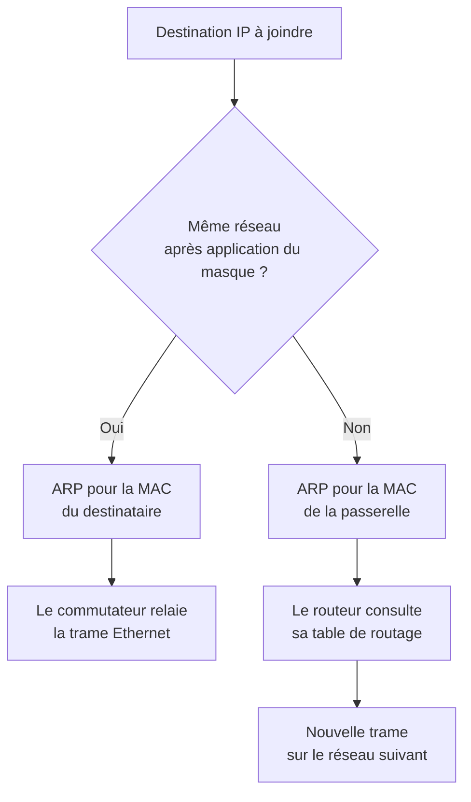
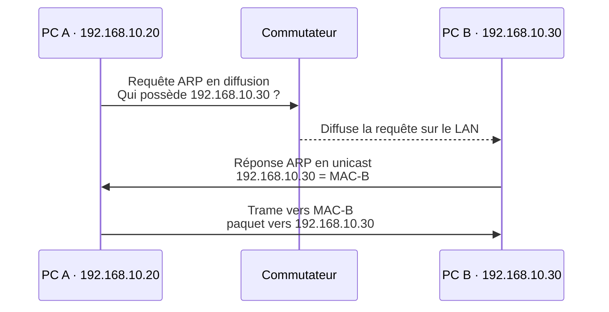
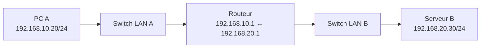

# Module 04 — La communication dans un réseau

**Séquence :** Bases des réseaux  
**Importance :** socle de la progression officielle  
**Sources consolidées :** 1 support(s) de cours, 2 énoncé(s), 1 correction(s)

!!! warning "Périmètre et versions"
    Les six modules sont explicitement nommés dans les dossiers et supports Réseaux. Les activités Packet Tracer sont conservées comme ressources binaires à ouvrir avec Cisco Packet Tracer.

## Objectifs et compétences

- Déterminer si une destination est locale ou distante.
- Comprendre l’emploi des adresses MAC, d’ARP et de la passerelle par défaut.
- Suivre une communication à travers commutateur et routeur.
- Vérifier un scénario de communication dans Packet Tracer.

!!! tip "Façon simple de le comprendre"
    Ce module sert à passer de la notion « La communication dans un réseau » à une méthode que l’on peut expliquer, appliquer, vérifier et dépanner.

## Méthode de travail

1. Lire les concepts dans l’ordre du support.
2. Reproduire les exemples dans un environnement de laboratoire.
3. Noter le résultat attendu avant de modifier une configuration.
4. Vérifier avec l’outil ou la commande appropriée.
5. Revenir à l’état initial si le résultat diverge.

## Repères visuels

Avant d’émettre, un hôte applique son masque à sa propre adresse et à l’adresse de destination. Si les identifiants réseau sont identiques, il cherche directement la MAC du destinataire ; sinon, il cherche la MAC de sa passerelle.

Décision locale ou distante : le paquet conserve les IP de bout en bout, tandis que les adresses MAC changent à chaque lien routé.

### ARP : obtenir la MAC correspondant à une IPv4 locale

ARP ne traverse pas le routeur. Pour une destination distante, le PC résout la MAC de la passerelle, pas celle du serveur final.

### Routage entre deux réseaux

Le routeur sépare les domaines de diffusion et relie les réseaux. Chaque hôte utilise comme passerelle l’interface du routeur située dans son propre réseau.

## Cours consolidé

La communication entre deux PC

La communication entre deux nœuds La communication entre deux nœuds - suite Le routage Le sur-réseau Démonstration - La communication réseau Enoncé du TP - Communication dans un réseau Enoncé du TP - Communication inter-réseau

Dans le cadre des réseaux informatiques, un domaine de diffusion (ou broadcast domain) est une portion logique du réseau dans laquelle une trame de diffusion (broadcast) est transmise à tous les appareils connectés. Cela permet à une machine d’envoyer un message destiné à tous les autres équipements présents dans le même domaine.

1. Définition de la Diffusion (Broadcast) La diffusion est un mécanisme dans lequel une trame ou un paquet est envoyé avec une adresse de destination spéciale appelée adresse de broadcast. En IPv4, cette adresse est constituée de tous les bits à 1 dans la partie hôte, par exemple 192.168.1.255 dans un réseau avec un masque 255.255.255.0.

Tous les appareils du domaine de diffusion reçoivent ce message, même si ce n’est pas explicitement destiné à eux. Les messages de broadcast sont souvent utilisés pour des tâches comme :

La découverte de machines (exemple : DHCP). La résolution d’adresses (exemple : ARP). 2. Composants du Domaine de Diffusion

### Un domaine de diffusion est limité par les équipements réseau suivants

Switchs (commutateurs) : Ils transmettent les diffusions à tous les ports d’un même VLAN. Routeurs : Ils délimitent les domaines de diffusion. Un routeur ne transmet pas les trames de diffusion d’un réseau à un autre, créant ainsi des frontières entre domaines. VLAN (Virtual LAN) : Chaque VLAN constitue un domaine de diffusion distinct, même s’ils sont configurés sur le même switch physique. 3. Importance du Domaine de Diffusion Un domaine de diffusion trop grand peut entraîner des problèmes de performances, car chaque appareil du domaine doit traiter les diffusions, même si elles ne lui sont pas destinées. Cela peut surcharger le réseau et les ressources des machines.

C’est pourquoi les réseaux modernes sont souvent segmentés en plusieurs domaines de diffusion pour :

Réduire le trafic inutile. Améliorer les performances globales. Sécuriser la communication entre différentes parties du réseau. 4. Exemple Pratique Dans un réseau local avec un switch, si 10 ordinateurs sont connectés au même VLAN, ils appartiennent tous au même domaine de diffusion. Si un ordinateur envoie une requête de type ARP (Who has 192.168.1.10?), cette requête est envoyée à tous les autres appareils. En revanche, si ce réseau est segmenté avec un routeur ou des VLANs, la diffusion sera limitée au sous-réseau correspondant.

5. Lien avec le Modèle OSI Le domaine de diffusion opère principalement à la couche 2 (Liaison de données) du modèle OSI. Les diffusions sont transmises à tous les appareils d’un même domaine via l’adresse MAC de destination FF:FF:FF:FF:FF:FF. À la couche 3 (Réseau), les diffusions utilisent des adresses IP spéciales comme 192.168.1.255.
6. Segmenter les Domaines de Diffusion Pour limiter les problèmes liés aux domaines de diffusion trop étendus, on peut utiliser :

Des routeurs : Ils créent des segments de réseau distincts. Des VLANs : Ils divisent logiquement un réseau en plusieurs sous-réseaux indépendants. Le domaine de diffusion est une notion clé pour comprendre comment le trafic de diffusion circule dans un réseau. Bien qu’il facilite certaines communications, il peut rapidement devenir une source de congestion si le réseau n’est pas correctement segmenté. L’utilisation de VLANs et de routeurs permet d’organiser et d’optimiser le trafic dans un réseau informatique.

Le Routage Le routage est un processus fondamental en réseau informatique qui consiste à déterminer le chemin que doivent emprunter les données (paquets) pour atteindre leur destination. Ce mécanisme se déroule principalement à la couche 3 (Réseau) du modèle OSI, où les routeurs et les équipements connectés décident de la meilleure route pour acheminer les paquets à travers un ou plusieurs réseaux.

1. Rôle du Routage

Le routage intervient lorsque des données doivent traverser plusieurs réseaux pour atteindre leur destination. Contrairement à la communication au sein d’un même réseau local (LAN), qui repose sur des commutateurs (switches), le routage est nécessaire pour connecter différents sous-réseaux ou réseaux distants via des équipements appelés routeurs.

#### Le rôle principal du routage est de

Acheminer les paquets IP vers leur destination. Trouver le chemin optimal pour minimiser le temps de transit et éviter les congestions. Séparer les domaines de diffusion, limitant ainsi le trafic inutile. 2. Les Routeurs

#### Un routeur est un équipement qui

Lit l’adresse IP de destination dans chaque paquet. Consulte sa table de routage, une base de données interne contenant les routes disponibles. Décide du meilleur chemin pour transmettre les données, en fonction de critères tels que la distance (nombre de sauts) ou la priorité d’une route. 3. Table de Routage La table de routage est au cœur du fonctionnement des routeurs. Elle contient des informations sur :

Les réseaux connus : Les sous-réseaux que le routeur peut atteindre. Les passerelles : Les routeurs voisins qui peuvent relayer les paquets. Les métriques : Des valeurs utilisées pour évaluer la "coût" ou l’efficacité de chaque route (distance, bande passante, etc.).

#### Exemple d’entrée dans une table de routage

Réseau Destination Masque Passerelle Interface Sortante 192.168.1.0 255.255.255.0 192.168.0.1 Ethernet 0 10.0.0.0 255.0.0.0 192.168.0.2 Ethernet 1 4. Types de Routage

#### Il existe deux types principaux de routage

a) Routage statique Les routes sont configurées manuellement par un administrateur réseau. Idéal pour les petits réseaux ou des routes fixes. Avantages : Simplicité, contrôle précis. Inconvénients : Manque de flexibilité en cas de panne ou de changement. b) Routage dynamique Les routes sont déterminées automatiquement à l’aide de protocoles de routage. Les protocoles de routage comme RIP, OSPF, ou BGP permettent aux routeurs d’échanger des informations et d’ajuster les routes en fonction des changements dans le réseau. Avantages : Adaptabilité, gestion automatique des pannes. Inconvénients : Configuration plus complexe et consommation de ressources. 5. Processus de Routage

#### Lorsqu’un paquet arrive sur un routeur

Le routeur lit l’adresse IP de destination dans l’en-tête du paquet. Il consulte sa table de routage pour déterminer où envoyer le paquet. Si aucune route n’est trouvée, il transmet généralement le paquet à une passerelle par défaut. Le paquet est ensuite envoyé vers le prochain routeur ou la destination finale. 6. Exemple : Routage d’un Paquet Un ordinateur avec l’adresse IP 192.168.1.100 (masque 255.255.255.0) envoie des données à une machine distante 10.0.0.1 :

L’ordinateur identifie que la destination 10.0.0.1 n’est pas sur le même réseau local (192.168.1.0/24). Le paquet est envoyé au routeur configuré comme passerelle par défaut (par exemple 192.168.1.1). Le routeur consulte sa table de routage et trouve une route vers le réseau 10.0.0.0/8. Il transmet le paquet au routeur suivant, ou directement à la destination si elle est atteignable. 7. Avantages du Routage Permet la communication entre différents réseaux. Optimise le trafic réseau en choisissant les meilleurs chemins. Assure la scalabilité en supportant des réseaux complexes et vastes (exemple : Internet).

Le sur-réseau, ou supernetting, est une technique utilisée en réseau pour regrouper plusieurs sous-réseaux en un seul réseau plus grand. C’est l’opération inverse du sous-réseau (subnetting). Le sur-réseau est souvent utilisé pour réduire la taille des tables de routage et simplifier la gestion des adresses IP dans des réseaux de grande envergure, comme l’Internet. 1. Principe du Sur-Réseau Dans un réseau, le sur-réseau consiste à fusionner plusieurs plages d’adresses IP contiguës pour en former une plus grande, en utilisant un masque de réseau moins restrictif (moins de bits à 1 dans le masque). Cela permet de représenter plusieurs sous-réseaux avec une seule entrée dans une table de routage.

#### Exemple sans sur-réseau

Les réseaux 192.168.0.0/24, 192.168.1.0/24, 192.168.2.0/24 et 192.168.3.0/24 sont représentés comme quatre routes distinctes dans une table de routage.

#### Exemple avec sur-réseau

Ces mêmes réseaux peuvent être regroupés en un seul sur-réseau : 192.168.0.0/22.

2. Avantages du Sur-Réseau Réduction de la taille des tables de routage : En combinant plusieurs réseaux, on simplifie les tables de routage, ce qui améliore la performance des routeurs. Meilleure gestion des ressources : Utile dans les grandes infrastructures où les adresses doivent être regroupées pour une administration simplifiée. Efficacité sur Internet : Le sur-réseau est utilisé dans le cadre du routage interdomaines (CIDR) pour regrouper des adresses IP en blocs. 3. Sur-Réseau et CIDR Le sur-réseau utilise la notation CIDR (Classless Inter-Domain Routing), qui est une méthode flexible pour attribuer des plages d’adresses IP.

Dans l’exemple 192.168.0.0/22, le préfixe /22 indique que les 22 premiers bits sont réservés pour l’identification du réseau. Cela laisse 10 bits pour les adresses d’hôtes, permettant de regrouper 4 sous-réseaux de 256 adresses (soit 1024 adresses). 4. Étapes pour Créer un Sur-Réseau

#### a) Identifier les sous-réseaux à regrouper

Les plages doivent être contiguës et alignées sur des limites binaires compatibles. Exemple : 192.168.0.0/24, 192.168.1.0/24, 192.168.2.0/24, 192.168.3.0/24.

#### b) Trouver le nouveau préfixe

Convertissez les adresses réseau des sous-réseaux en binaire.

#### Exemple pour les réseaux ci-dessus

192.168.0.0 = 11000000.10101000.00000000.00000000 192.168.1.0 = 11000000.10101000.00000001.00000000 192.168.2.0 = 11000000.10101000.00000010.00000000 192.168.3.0 = 11000000.10101000.00000011.00000000 Identifiez les bits communs partagés entre ces adresses.

#### Ici, les 22 premiers bits sont identiques

11000000.10101000.000000 Le masque est donc /22.

#### c) Regrouper les réseaux

Le sur-réseau correspondant est 192.168.0.0/22, couvrant les plages d’adresses 192.168.0.0 à 192.168.3.255. 5. Limites du Sur-Réseau Perte de granularité : Le regroupement des réseaux peut réduire la précision pour identifier ou isoler des plages spécifiques. Alignement des plages requis : Les sous-réseaux doivent être contigus et alignés sur des limites binaires, ce qui limite parfois son application. Risque de conflits : En superposant des plages d’adresses mal planifiées, des conflits d’adresses IP peuvent survenir. 6. Exemple Pratique Imaginons un fournisseur d’accès à Internet (FAI) qui attribue plusieurs sous-réseaux à ses clients :

192.168.0.0/24 pour Client 1 192.168.1.0/24 pour Client 2 192.168.2.0/24 pour Client 3 192.168.3.0/24 pour Client 4 Au lieu d’annoncer quatre routes distinctes sur Internet, le FAI peut utiliser un sur-réseau 192.168.0.0/22, simplifiant ainsi le routage.

Le sur-réseau est une technique de regroupement d’adresses IP qui permet de simplifier les tables de routage et d’améliorer l’efficacité du réseau, en particulier à grande échelle. Bien qu’il nécessite une planification attentive pour garantir l’alignement des plages d’adresses, il reste un outil puissant pour optimiser l’infrastructure des réseaux modernes.

### Quiz Kahoot — Modules 3 et 4

---

### Niveau Facile (1 à 12)

### 1. Combien de bits contient une adresse IPv4 ?

- A. 16
- B. 32 ✅
- C. 48
- D. 64

**Pourquoi ?** Une adresse IPv4 est composée de **4 octets**, donc **4 × 8 = 32 bits**.

**Exemple :** 192.168.1.10 = 4 nombres séparés par des points → chaque nombre = 1 octet.

---

### 2. Dans une adresse IPv4, à quoi sert le masque de sous-réseau ?

- A. À chiffrer l’adresse IP
- B. À séparer la partie réseau et la partie hôte ✅
- C. À convertir l’adresse en MAC
- D. À calculer la passerelle

**Pourquoi ?** Le masque sert à savoir **quels bits appartiennent au réseau** et **quels bits appartiennent à l’hôte**.

**Exemple :** Avec **192.168.1.10/24**, les **24 premiers bits** sont le réseau, les **8 derniers** sont la partie hôte.

---

### 3. Quelle classe IPv4 correspond aux petits réseaux dans le cours ?

- A. Classe A
- B. Classe B
- C. Classe C ✅
- D. Classe D

**Pourquoi ?** Dans le cours, la **classe C** est utilisée pour les **petits réseaux** et couvre **192.0.0.0 à 223.255.255.255**.

**Exemple :** 192.168.1.0/24 est un cas typique de réseau de type classe C.

---

### 4. Quelle classe IPv4 couvre les adresses de 128.0.0.0 à 191.255.255.255 ?

- A. Classe A
- B. Classe B ✅
- C. Classe C
- D. Classe D

**Pourquoi ?** Le cours indique que la **classe B** correspond à cette plage.

**Exemple :** 172.25.192.0 appartient à cette plage.

---

### 5. Quelle adresse est l’adresse de boucle locale (localhost) ?

- A. 192.168.1.1
- B. 10.0.0.1
- C. 127.0.0.1 ✅
- D. 255.255.255.255

**Pourquoi ?** 127.0.0.1 est l’adresse utilisée pour tester la machine elle-même.

**Exemple :** Quand tu fais un test local sur ton PC, tu peux viser **127.0.0.1**.

---

### 6. Quelle adresse permet d’envoyer un message à tous les hôtes d’un réseau ?

- A. Adresse MAC
- B. Adresse de broadcast ✅
- C. Adresse APIPA
- D. Adresse loopback

**Pourquoi ?** L’adresse de **broadcast** a tous les bits de la partie hôte à 1.

**Exemple :** Dans **192.168.1.0/24**, le broadcast est **192.168.1.255**.

---

### 7. Quelle plage correspond aux adresses privées de classe A ?

- A. 172.16.0.0 à 172.31.255.255
- B. 192.168.0.0 à 192.168.255.255
- C. 10.0.0.0 à 10.255.255.255 ✅
- D. 127.0.0.0 à 127.255.255.255

**Pourquoi ?** C’est l’une des trois plages privées RFC 1918 mentionnées dans le cours.

**Exemple :** Un grand réseau d’entreprise peut utiliser des adresses comme **10.1.20.5**.

---

### 8. Quelle plage correspond aux adresses privées de classe B ?

- A. 10.0.0.0 à 10.255.255.255
- B. 172.16.0.0 à 172.31.255.255 ✅
- C. 192.168.0.0 à 192.168.255.255
- D. 224.0.0.0 à 239.255.255.255

**Pourquoi ?** Le cours donne explicitement cette plage privée.

**Exemple :** **172.25.192.0** fait partie de cette plage.

---

### 9. Quelle plage correspond aux adresses privées de classe C ?

- A. 192.168.0.0 à 192.168.255.255 ✅
- B. 172.16.0.0 à 172.31.255.255
- C. 10.0.0.0 à 10.255.255.255
- D. 224.0.0.0 à 239.255.255.255

**Pourquoi ?** C’est la plage privée la plus courante dans les petits réseaux.

**Exemple :** Ta box à la maison utilise souvent **192.168.1.x**.

---

### 10. Quelle plage est utilisée par APIPA ?

- A. 10.x.x.x
- B. 172.16.x.x
- C. 169.254.x.x ✅
- D. 192.168.x.x

**Pourquoi ?** APIPA attribue automatiquement une adresse **169.254.x.x** quand aucun serveur DHCP ne répond.

**Exemple :** Si ton PC n’obtient pas d’adresse du DHCP, il peut s’auto-attribuer **169.254.12.8**.

---

### 11. APIPA permet surtout :

- A. d’accéder à Internet plus vite
- B. de communiquer localement sans DHCP ✅
- C. de chiffrer les paquets
- D. de remplacer le routage

**Pourquoi ?** APIPA permet de **continuer à communiquer sur le réseau local**, mais **pas sur Internet**.

**Exemple :** Deux PC en panne de DHCP peuvent encore échanger des fichiers localement via des adresses 169.254.x.x.

---

### 12. Que signifie la notation /24 dans une adresse IPv4 ?

- A. 24 bits pour les hôtes
- B. 24 bits pour la partie réseau ✅
- C. 24 octets dans le masque
- D. 24 adresses utilisables

**Pourquoi ?** Le **/24** indique que **24 bits** sont réservés au réseau.

**Exemple :** **192.168.1.0/24** → masque **255.255.255.0**.

---

### Niveau Moyen (13 à 24)

### 13. Quel masque correspond au préfixe CIDR /24 ?

- A. 255.255.0.0
- B. 255.255.255.0 ✅
- C. 255.255.255.128
- D. 255.255.255.192

**Pourquoi ?** /24 = **24 bits à 1**, puis 8 bits à 0 → **255.255.255.0**.

**Exemple :** 11111111.11111111.11111111.00000000 = 255.255.255.0

---

### 14. Quel masque correspond au préfixe CIDR /26 ?

- A. 255.255.255.0
- B. 255.255.255.128
- C. 255.255.255.192 ✅
- D. 255.255.255.240

**Pourquoi ?** /26 = 26 bits à 1 → le dernier octet vaut **11000000**, soit **192**.

**Exemple :** /26 = **255.255.255.192**

---

### 15. Quel masque correspond au préfixe /20 ?

- A. 255.255.255.0
- B. 255.255.240.0 ✅
- C. 255.255.224.0
- D. 255.255.255.240

**Pourquoi ?** /20 = 20 bits à 1 → **11111111.11111111.11110000.00000000**.

**Exemple :** Le cours utilise **172.25.192.0 / 255.255.240.0**, soit **/20**.

---

### 16. Quel préfixe CIDR correspond au masque 255.255.255.192 ?

- A. /24
- B. /25
- C. /26 ✅
- D. /28

**Pourquoi ?** 255.255.255.192 = **11111111.11111111.11111111.11000000** → **26 bits à 1**.

**Exemple :** Ce masque laisse **6 bits pour les hôtes**.

---

### 17. Quel préfixe CIDR correspond au masque 255.255.255.240 ?

- A. /26
- B. /27
- C. /28 ✅
- D. /29

**Pourquoi ?** 255.255.255.240 = **11110000** dans le dernier octet → **28 bits à 1** au total.

**Exemple :** Un /28 offre 16 adresses au total, dont 14 hôtes utilisables.

---

### 18. Quel est l’ID réseau de 192.168.1.10/24 ?

- A. 192.168.1.1
- B. 192.168.1.10
- C. 192.168.1.0 ✅
- D. 192.168.1.255

**Pourquoi ?** Avec un /24, le dernier octet est la partie hôte. On le met à 0 pour obtenir l’ID réseau.

**Exemple :** 192.168.1.10 AND 255.255.255.0 = **192.168.1.0**

---

### 19. Quel est le broadcast du réseau 192.168.10.0/24 ?

- A. 192.168.10.0
- B. 192.168.10.1
- C. 192.168.10.254
- D. 192.168.10.255 ✅

**Pourquoi ?** Le broadcast met **tous les bits hôte à 1**.

**Exemple :** Pour un /24, les hôtes vont de **1 à 254**, donc le broadcast est **255**.

---

### 20. Quelle est la plage d’hôtes utilisables du réseau 192.168.10.0/24 ?

- A. 192.168.10.0 à 192.168.10.255
- B. 192.168.10.1 à 192.168.10.254 ✅
- C. 192.168.10.1 à 192.168.10.255
- D. 192.168.10.0 à 192.168.10.254

**Pourquoi ?**

#### On retire

- l’adresse réseau → **192.168.10.0**
- l’adresse de broadcast → **192.168.10.255**

**Exemple :** Les hôtes utilisables sont donc **192.168.10.1 à 192.168.10.254**.

---

### 21. Quel est le broadcast de 172.25.192.0 avec le masque 255.255.240.0 ?

- A. 172.25.192.255
- B. 172.25.200.255
- C. 172.25.207.255 ✅
- D. 172.25.255.255

**Pourquoi ?** Le cours donne cet exemple complet : **172.25.192.0 /20** a pour broadcast **172.25.207.255**.

**Exemple :** La plage d’hôtes va de **172.25.192.1 à 172.25.207.254**.

---

### 22. Quelle est la plage d’hôtes du réseau 172.25.192.0/20 ?

- A. 172.25.192.0 à 172.25.207.255
- B. 172.25.192.1 à 172.25.207.254 ✅
- C. 172.25.192.1 à 172.25.255.254
- D. 172.25.193.1 à 172.25.207.254

**Pourquoi ?** On retire l’ID réseau et le broadcast.

**Exemple :**

- Réseau : **172.25.192.0**
- Broadcast : **172.25.207.255**
- Hôtes : **172.25.192.1 → 172.25.207.254**

---

### 23. Combien d’hôtes utilisables y a-t-il dans un /26 ?

- A. 30
- B. 62 ✅
- C. 64
- D. 126

**Pourquoi ?** Un /26 laisse **6 bits hôte**. Donc : **2⁶ = 64 adresses**, mais on retire **réseau + broadcast** → **62 hôtes**.

**Exemple :** 192.168.10.0/26 → 62 hôtes utilisables.

---

### 24. Combien d’hôtes utilisables y a-t-il dans un /28 ?

- A. 14 ✅
- B. 16
- C. 30
- D. 62

**Pourquoi ?** Un /28 laisse **4 bits hôte**. Donc : **2⁴ = 16 adresses**, moins 2 = **14 hôtes utilisables**.

**Exemple :** Un petit sous-réseau de 14 machines maximum.

---

### Niveau Difficile (25 à 35)

### 25. Si un réseau 192.168.1.0/24 est découpé en deux sous-réseaux /25, combien obtient-on de sous-réseaux ?

- A. 2 ✅
- B. 4
- C. 8
- D. 16

**Pourquoi ?** On passe de /24 à /25 : on **emprunte 1 bit** pour le sous-réseau. Nombre de sous-réseaux = **2¹ = 2**.

**Exemple :**

- 192.168.1.0/25
- 192.168.1.128/25

---

### 26. Si un réseau /24 devient /25, combien d’hôtes utilisables possède chaque sous-réseau ?

- A. 62
- B. 126 ✅
- C. 128
- D. 254

**Pourquoi ?**

#### Un /25 laisse **7 bits hôte**

**2⁷ = 128**, donc **126 hôtes utilisables**.

**Exemple :**

- Sous-réseau 1 : 192.168.1.0 à 192.168.1.127
- Sous-réseau 2 : 192.168.1.128 à 192.168.1.255

---

### 27. Quel est le premier sous-réseau obtenu dans l’exemple de découpage de 192.168.1.0/24 en /25 ?

- A. 192.168.1.0/25 ✅
- B. 192.168.1.64/25
- C. 192.168.1.128/25
- D. 192.168.1.255/25

**Pourquoi ?**

#### Le cours donne cet exemple explicitement

- 192.168.1.0/25
- 192.168.1.128/25

**Exemple :** Le premier couvre **192.168.1.0 à 192.168.1.127**.

---

### 28. Quel est le second sous-réseau obtenu dans ce même découpage ?

- A. 192.168.1.64/25
- B. 192.168.1.127/25
- C. 192.168.1.128/25 ✅
- D. 192.168.1.255/25

**Pourquoi ?** Le second bloc commence à **128**, car un /25 coupe le /24 en deux blocs de 128 adresses.

**Exemple :** 192.168.1.128/25 couvre **192.168.1.128 à 192.168.1.255**.

---

### 29. Quelle opération logique permet d’obtenir l’ID réseau à partir d’une IP et de son masque ?

- A. OR
- B. XOR
- C. AND ✅
- D. NOT

**Pourquoi ?** Le cours précise que l’ID réseau est obtenu en faisant **IP AND masque**.

**Exemple :** 192.168.1.10 AND 255.255.255.0 = 192.168.1.0

---

### 30. Quel équipement délimite les domaines de diffusion ?

- A. Hub
- B. Switch
- C. Routeur ✅
- D. Répéteur

**Pourquoi ?** Un routeur **ne transmet pas les diffusions** d’un réseau à un autre. Il sépare donc les broadcast domains.

**Exemple :** Deux sous-réseaux reliés par un routeur ne partagent pas le même broadcast.

---

### 31. Quel équipement transmet les diffusions à tous les ports d’un même VLAN ?

- A. Routeur
- B. Switch ✅
- C. Modem
- D. Pare-feu

**Pourquoi ?** Dans un même VLAN, le switch propage les trames de diffusion à tous les ports concernés.

**Exemple :** Une requête ARP est diffusée à toutes les machines du VLAN.

---

### 32. Quel est le rôle principal d’un routeur selon le cours ?

- A. Convertir les adresses MAC en IP
- B. Acheminer les paquets IP entre réseaux ✅
- C. Chiffrer les communications
- D. Attribuer automatiquement les adresses IP

**Pourquoi ?** Le routage sert à faire passer des paquets **d’un réseau à un autre**.

**Exemple :** Un PC du réseau **192.168.1.0/24** veut joindre **10.0.0.1** → il envoie le paquet à sa passerelle.

---

### 33. Que contient une table de routage ?

- A. Seulement les adresses MAC
- B. Les réseaux connus, les passerelles et les métriques ✅
- C. Les mots de passe Wi-Fi
- D. Les ports TCP ouverts

**Pourquoi ?**

#### Le cours liste

- réseaux connus
- passerelles
- métriques
- interface sortante

**Exemple :**

#### Une entrée peut dire

“Pour atteindre **10.0.0.0/8**, passe par **192.168.0.2**”.

---

### 34. Quelle différence caractérise le routage statique ?

- A. Les routes sont apprises automatiquement
- B. Les routes sont configurées manuellement ✅
- C. Il utilise forcément OSPF
- D. Il ne fonctionne qu’en IPv6

**Pourquoi ?** Le routage statique est **saisi par l’administrateur**.

**Exemple :** Sur un petit réseau, on ajoute à la main une route vers **10.0.0.0/8**.

---

### 35. Quel sur-réseau regroupe 192.168.0.0/24, 192.168.1.0/24, 192.168.2.0/24 et 192.168.3.0/24 ?

- A. 192.168.0.0/24
- B. 192.168.0.0/23
- C. 192.168.0.0/22 ✅
- D. 192.168.0.0/20

**Pourquoi ?**

#### Le cours donne précisément cet exemple de **supernetting**

4 réseaux /24 contigus peuvent être regroupés en **192.168.0.0/22**.

**Exemple :**

- 192.168.0.0/24
- 192.168.1.0/24
- 192.168.2.0/24
- 192.168.3.0/24

→ regroupés dans **192.168.0.0/22**

---

### Questions pièges / Vrai-Faux (36 à 42)

### 36. Vrai ou Faux

Une adresse APIPA permet normalement d’accéder à Internet.

❌ **Faux**

**Pourquoi ?** Le cours précise que les adresses APIPA **ne sont pas routables** hors du réseau local.

**Exemple :** Deux PC peuvent se parler en 169.254.x.x, mais pas aller sur Internet via cette adresse seule.

---

### 37. Vrai ou Faux

Dans un réseau /24, l’adresse se terminant par .255 peut être l’adresse de broadcast.

✅ **Vrai**

**Exemple :** Dans **192.168.1.0/24**, le broadcast est **192.168.1.255**.

---

### 38. Vrai ou Faux

Le sous-réseautage permet de réduire la taille des domaines de diffusion.

✅ **Vrai**

**Pourquoi ?** C’est un des objectifs du subnetting dans le cours : **réduire le broadcast** et améliorer les performances.

---

### 39. Vrai ou Faux

Un routeur transmet automatiquement toutes les diffusions d’un réseau à l’autre.

❌ **Faux**

**Pourquoi ?** Au contraire, il **délimite** les domaines de diffusion.

---

### 40. Vrai ou Faux

OSPF, RIP et BGP sont cités comme protocoles de routage dynamique.

✅ **Vrai**

**Pourquoi ?** Le cours les cite explicitement dans la partie routage dynamique.

---

### 41. Vrai ou Faux

Le masque 255.255.255.0 correspond à /24.

✅ **Vrai**

**Exemple :** 11111111.11111111.11111111.00000000 → 24 bits à 1.

---

### 42. Vrai ou Faux

Le sur-réseau est l’opération inverse du sous-réseautage.

✅ **Vrai**

**Pourquoi ?** Le cours dit explicitement que le **sur-réseau (supernetting)** est l’inverse du **subnetting**.

---

## Mise en pratique

- [Travaux pratiques du module](../../tp/reseaux/module-04/index.md)
- [Fiche de révision du module](../../revision/reseaux/module-04-la-communication-dans-un-reseau.md)

## Questions flash

1. Comment expliquer simplement « La communication dans un réseau » à un collègue ?
2. Quelles étapes ou notions doivent être maîtrisées avant la manipulation ?
3. Quel contrôle permet de prouver que le résultat est correct ?
4. Quel est le premier risque ou piège à écarter ?

??? success "Éléments de réponse"
    - Déterminer si une destination est locale ou distante.
    - Comprendre l’emploi des adresses MAC, d’ARP et de la passerelle par défaut.
    - Suivre une communication à travers commutateur et routeur.
    - Vérifier un scénario de communication dans Packet Tracer.

## Voir aussi

- [Présentation de la séquence](index.md)
