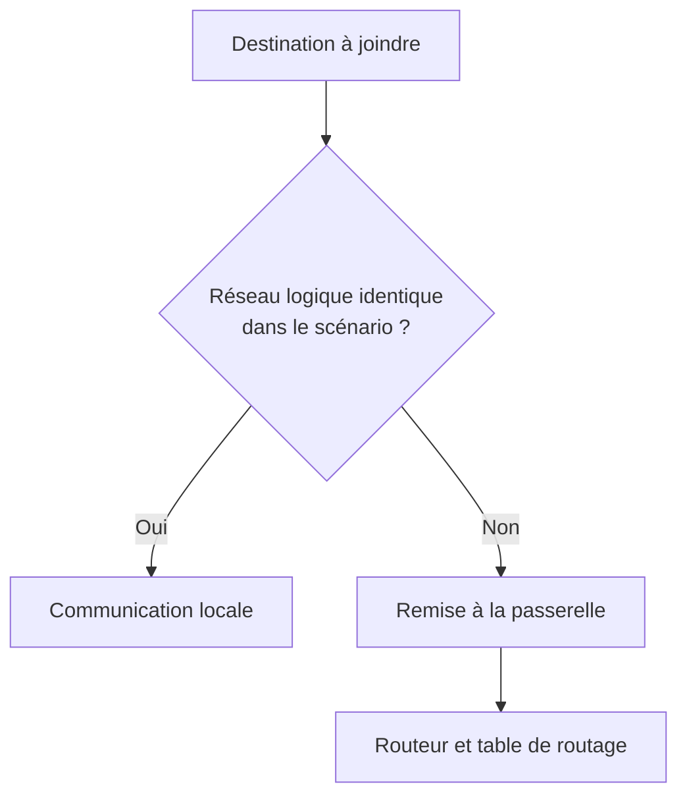

# Module 04 — La communication dans un réseau

**Séquence :** Bases des réseaux

**Pré-requis :** [adressage IPv4](module-03-l-adressage-ipv4.md) et lecture d’un masque IPv4.
**Sources de ce module :** support M03/M04, TP M04-01-01 et sa correction, TP M04-01-02 Packet Tracer.

## Objectifs

- Distinguer une communication dans un même réseau logique d’une communication qui doit passer par une passerelle.
- Lire les informations IP, masque, passerelle et MAC fournies dans un scénario.
- Expliquer le rôle d’un routeur et de sa table de routage.
- Identifier le rôle d’un domaine de diffusion et l’intérêt de sa segmentation.
- Mettre en pratique une communication inter-réseau dans Packet Tracer.

!!! note "Le périmètre de M04"
    M03 traite le calcul d’adresses, de masques et de sous-réseaux. Ici, ces éléments servent seulement à décider **comment un paquet circule** : directement dans le réseau logique ou par une passerelle. Les calculs détaillés d’adressage restent dans le module précédent.

## 1. Lire un scénario de communication

Les TP fournissent, pour chaque poste, une adresse IP, un masque, une passerelle et parfois une adresse MAC. La première question consiste à identifier le réseau logique auquel le poste rattache sa destination ; la seconde est de déterminer si l’échange peut rester local ou doit être remis à un routeur.

```mermaid
flowchart TD
    A[Destination à joindre] --> B{Réseau logique identique<br/>dans le scénario ?}
    B -->|Oui| C[Communication locale]
    B -->|Non| D[Remise à la passerelle]
    D --> E[Routeur et table de routage]
```

Schéma de synthèse B : il organise la décision demandée dans les scénarios du TP, sans ajouter de règle d’adressage au-delà des sources.

### Dans un même segment

Le premier scénario du TP place les postes A à F sur le même segment, sans routeur. Les adresses et les masques ne produisent pas pour autant le même réseau logique pour tous les postes. La correction montre que le résultat doit être justifié poste par poste : par exemple, A dialogue avec B, C et F, mais les réponses ne s’appuient pas toutes sur le même réseau logique.

**Méthode de vérification :** relever l’adresse et le masque du poste émetteur, relever ceux du destinataire, puis expliquer le résultat avant de remplir le tableau. Ne pas déduire une réponse de la seule proximité physique des machines.

## 2. Passerelle et communication inter-réseau

Dans les scénarios B et C, les postes, routeurs et passerelles sont explicitement renseignés. Le tableau utilise les repères suivants :

| Repère du TP | Signification dans le tableau |
|---|---|
| `V` | communication possible sans passerelle selon le scénario |
| `F` | communication non possible selon le scénario |
| `P` | communication passant par le routeur ou la passerelle |

Un routeur relie des réseaux distincts. Il lit l’adresse de destination, consulte sa table de routage et choisit l’acheminement proposé par ses routes. Les informations du TP permettent de confronter cette décision aux masques et passerelles effectivement déclarés, plutôt que de supposer qu’une adresse privée est automatiquement joignable.

### Table de routage : objectif du TP

Le TP demande de compléter des tables de routage pour huit routeurs après le découpage d’un bloc en neuf segments. Il attend des routes statiques en format abrégé : réseau, masque et routeur de destination. La correction conserve ces routes comme réponses de référence.

!!! tip "Contrôle avant de conclure"
    Dans un tableau de communication, vérifiez séparément le réseau logique, la passerelle indiquée et la présence d’un itinéraire. Une route correcte ne rend pas cohérente une adresse, un masque ou une passerelle qui ne le sont pas dans le scénario.

## 3. Domaine de diffusion et segmentation

Un domaine de diffusion est une portion logique du réseau dans laquelle une trame de diffusion est transmise aux équipements raccordés. Le support indique qu’un commutateur transmet les diffusions aux ports d’un même VLAN, tandis qu’un routeur délimite les domaines de diffusion et ne les transmet pas d’un réseau à l’autre.

Cette segmentation réduit le trafic inutile et aide à organiser les communications entre réseaux. Elle est à relier aux scénarios du TP : l’ajout d’un routeur introduit une frontière et rend la passerelle nécessaire pour atteindre un autre réseau.

## 4. Routage et agrégation de routes

Le routage sert à acheminer des paquets entre plusieurs réseaux. Le support distingue les routes statiques, configurées manuellement, des routes dynamiques, apprises par des protocoles de routage. Ici, le TP se concentre sur les routes statiques et sur le choix du nombre minimal d’itinéraires.

Le même TP demande également de calculer des résumés de routes en notation CIDR. Le support appelle cette opération le **sur-réseau** : regrouper des réseaux contigus et alignés dans une entrée plus large pour simplifier une table de routage. Les valeurs et réponses attendues restent dans l’[énoncé](../../tp/reseaux/module-04/enonces.md) et la [correction](../../tp/reseaux/module-04/corrections.md) ; elles ne sont pas recopiées ici.

## 5. Mise en pratique avec Packet Tracer

Le second TP demande de copier puis d’ouvrir le fichier Packet Tracer associé, après avoir suivi les vidéos du module et les précédents TP Packet Tracer. Son objectif est de mettre en place une communication inter-réseau en suivant les directives de l’activité.

!!! warning "Ressource binaire"
    Les fichiers `.pka` sont des activités Packet Tracer attestées. Leur contenu n’est pas interprété dans la documentation : ouvrez-les dans Cisco Packet Tracer et suivez l’énoncé correspondant.

## À retenir

- Une communication doit être lue à partir des informations du scénario : IP, masque, passerelle et topologie.
- Un routeur relie des réseaux et consulte une table de routage pour acheminer les paquets.
- Un domaine de diffusion est limité par un routeur ; les VLAN et routeurs servent à segmenter les échanges.
- Les routes statiques et les résumés CIDR sont exercés dans les activités M04.

## Pour pratiquer et réviser

- [TP M04 : énoncés](../../tp/reseaux/module-04/enonces.md)
- [TP M04 : corrections](../../tp/reseaux/module-04/corrections.md)
- [Ressources Packet Tracer](../../tp/reseaux/module-04/index.md#ressources)
- [Fiche de révision M04](../../revision/reseaux/module-04-la-communication-dans-un-reseau.md)
- [Kahoot M04 : communication réseau](../../kahoot/bases-reseaux-m04-communication-reseau.md)

## Sources et provenance

- **A — sources TSSR :** `cours kahoot module 3 et 4.txt`, `M04-01-01-TP-La_communication.pdf`, `M04-01-01-TP-La_communication_Correction.pdf`, `M04-01-02-TP-Packet_Tracer-La_communication.pdf`.
- **B — structuration pédagogique :** organisation web, tableaux, encadrés et schéma de décision, sans ajout de contenu technique externe.