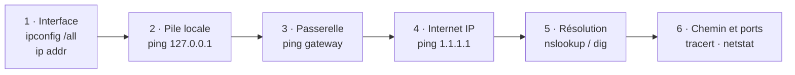

# Module 05 — Les premières commandes réseau

**Séquence :** Bases des réseaux  
**Importance :** socle de la progression officielle  
**Sources consolidées :** 1 support(s) de cours, 0 énoncé(s), 0 correction(s)

!!! warning "Périmètre et versions"
    Les six modules sont explicitement nommés dans les dossiers et supports Réseaux. Les activités Packet Tracer sont conservées comme ressources binaires à ouvrir avec Cisco Packet Tracer.

## Objectifs et compétences

- Afficher la configuration IP sous Windows et GNU/Linux.
- Tester la résolution de voisinage, la connectivité et le chemin réseau.
- Observer les connexions et les ports en écoute.
- Choisir une commande en fonction du symptôme observé.

!!! tip "Façon simple de le comprendre"
    Ce module sert à passer de la notion « Les premières commandes réseau » à une méthode que l’on peut expliquer, appliquer, vérifier et dépanner.

## Méthode de travail

1. Lire les concepts dans l’ordre du support.
2. Reproduire les exemples dans un environnement de laboratoire.
3. Noter le résultat attendu avant de modifier une configuration.
4. Vérifier avec l’outil ou la commande appropriée.
5. Revenir à l’état initial si le résultat diverge.

## Repères visuels

Une commande de diagnostic est utile seulement si elle répond à une question précise. La progression suivante part de l’interface locale et remonte jusqu’au service.

  
<b><code>ipconfig /all</code></b>Adresse, masque, passerelle, DNS et DHCP. Une adresse 169.254.x.x oriente vers DHCP.

  
<b><code>arp -a</code></b>Correspondances IP ↔ MAC apprises sur le lien local.

  
<b><code>ping</code></b>Teste la joignabilité IP et le temps de réponse, sous réserve que l’ICMP soit autorisé.

  
<b><code>tracert</code></b>Montre les sauts successifs et aide à localiser l’endroit où le chemin s’interrompt.

## Cours consolidé

### Module 5 - Les premières commandes

Objectifs Commande ARP Commandes IPCONFIG et IP Commande PING Commande NETSTAT Commandes TRACERT et TRACEROUTE Démonstration - Les commandes Fichiers pré-requis du TP TP du Module 05 - Utilisation des commandes

La commande ARP (Address Resolution Protocol) est un outil réseau essentiel utilisé pour gérer et diagnostiquer les associations entre les adresses IP (niveau réseau) et les adresses MAC (niveau liaison) au sein d'un réseau local (LAN).

1. Qu'est-ce que l'ARP ? L’Address Resolution Protocol est un protocole de la couche Liaison (couche 2) du modèle OSI, utilisé pour convertir une adresse IP en une adresse MAC.

#### Chaque machine dans un réseau local possède

Une adresse IP, qui identifie logiquement l’appareil sur un réseau. Une adresse MAC, qui est une identification physique unique associée à la carte réseau. L'ARP permet de faire correspondre une adresse IP à une adresse MAC pour que les données puissent être acheminées correctement au sein du réseau local.

2. Rôle de la commande ARP

#### La commande ARP permet

De consulter la table ARP locale (cache ARP). De forcer la mise à jour de cette table. D’ajouter ou de supprimer manuellement des entrées dans cette table. Chaque machine garde une table ARP en cache contenant les associations IP/MAC pour éviter de résoudre à chaque fois l’adresse MAC correspondante à une adresse IP.

3. Syntaxe Générale de la Commande ARP Sous Windows ou Linux, la commande arp s'utilise généralement comme suit :

a) Afficher la table ARP

`arp -a`

Cette commande liste toutes les associations IP/MAC actuellement connues par le système.

Interface: 192.168.1.1 --- 0x3 Adresse Internet Adresse physique Type 192.168.1.100 00-14-22-01-23-45 Dynamique 192.168.1.101 00-15-5d-8b-12-34 Dynamique Adresse Internet : L’adresse IP de l’hôte. Adresse physique : L’adresse MAC correspondante. Type : Indique si l’entrée a été obtenue dynamiquement (via ARP) ou ajoutée statiquement. b) Ajouter une entrée dans la table ARP

`arp -s &lt;adresse_IP&gt; &lt;adresse_MAC&gt;`

#### Exemple

`arp -s 192.168.1.200 00-14-22-01-23-45`

Cela crée une entrée statique liant l’adresse IP 192.168.1.200 à l’adresse MAC 00-14-22-01-23-45.

c) Supprimer une entrée de la table ARP Sous Windows, on ne peut pas supprimer une entrée spécifique, mais il est possible de vider tout le cache ARP avec :

`arp -d *`

#### Sous Linux, la commande est légèrement différente et utilise ip

sudo ip neigh flush all 4. Fonctionnement d'ARP Lorsqu'une machine veut communiquer avec une autre dans un réseau local, elle suit ces étapes :

Elle vérifie si l'adresse IP cible est déjà associée à une adresse MAC dans sa table ARP. Si ce n'est pas le cas, elle envoie une requête ARP broadcast à tous les appareils du réseau local.

#### Exemple de requête ARP

« Qui a l’adresse IP 192.168.1.100 ? Répondez à 192.168.1.1. » L’appareil correspondant à l’adresse IP cible répond avec son adresse MAC. La machine d'origine met à jour sa table ARP avec cette association pour de futures communications. 5. Problèmes Fréquents Liés à ARP Entrées erronées dans la table ARP : Une table ARP incorrecte peut empêcher la communication avec certains appareils. Attaques ARP (ARP Spoofing) : Un attaquant peut envoyer des réponses ARP falsifiées pour intercepter ou rediriger le trafic réseau. Cache ARP obsolète : Parfois, des entrées ARP expirées ou invalides empêchent la communication. 6. Cas d'Usage Courants a) Diagnostic réseau Si un appareil ne répond pas, vérifier la table ARP avec arp -a peut montrer si l’adresse MAC est connue et si la résolution ARP est correcte.

b) Détection d’attaques Une réponse ARP anormale (par exemple, deux IP associées à la même adresse MAC) peut indiquer une attaque ARP spoofing.

c) Configuration manuelle Dans des environnements critiques où ARP dynamique peut causer des problèmes, il est possible de configurer manuellement les associations IP/MAC.

7. Limites d'ARP

`ARP fonctionne uniquement sur les réseaux de type Ethernet et dans les réseaux locaux (LAN).`

Il n’est pas utilisé pour la communication inter-réseaux ; le routage intervient dans ce cas. Dans IPv6, ARP est remplacé par le protocole NDP (Neighbor Discovery Protocol).

La commande ipconfig La commande ipconfig est un outil en ligne de commande sous Windows qui permet d’afficher et de gérer les configurations réseau des interfaces d’un ordinateur. Elle est particulièrement utile pour diagnostiquer et résoudre les problèmes de connexion réseau.

1. Rôle de la commande ipconfig

#### La commande ipconfig fournit des informations détaillées sur

Les adresses IP attribuées à chaque interface réseau. Le masque de sous-réseau. La passerelle par défaut. Les informations DNS et DHCP.

#### Elle peut aussi être utilisée pour effectuer certaines actions comme

Libérer ou renouveler une adresse IP attribuée par un serveur DHCP. Vider ou actualiser le cache DNS. 2. Syntaxe Générale La commande ipconfig est utilisée directement dans une console Windows (CMD ou PowerShell). La syntaxe générale est la suivante :

`ipconfig [options]`

3. Options les Plus Courantes a) Afficher les informations réseau

`ipconfig`

Cette commande affiche un résumé des configurations réseau de toutes les interfaces actives.

#### Exemple de sortie

#### Carte Ethernet Ethernet

Suffixe DNS propre à la connexion. . . . : exemple.local Adresse IPv4 . . . . . . . . . . . . . . : 192.168.1.100 Masque de sous-réseau . . . . . . . . . : 255.255.255.0 Passerelle par défaut . . . . . . . . . : 192.168.1.1 b) Afficher des informations détaillées

`ipconfig /all`

Cette option fournit une vue exhaustive des paramètres réseau, y compris :

Adresses MAC. Serveurs DNS. Adresse IP attribuée manuellement ou par DHCP. Bail DHCP (heure de début et expiration).

#### Exemple de sortie pour /all

#### Carte Ethernet Ethernet

Suffixe DNS propre à la connexion. . . . : exemple.local Description . . . . . . . . . . . . . . : Realtek PCIe GBE Family Controller Adresse physique . . . . . . . . . . . : 00-1B-44-11-3A-B7 DHCP activé. . . . . . . . . . . . . . : Oui Adresse IPv4 . . . . . . . . . . . . . : 192.168.1.100 Masque de sous-réseau . . . . . . . . . : 255.255.255.0 Passerelle par défaut . . . . . . . . . : 192.168.1.1 Serveurs DNS . . . . . . . . . . . . . : 8.8.8.8 : 8.8.4.4 c) Libérer une adresse IP

`ipconfig /release`

Cette commande libère l’adresse IP attribuée par DHCP, mettant l’interface en état de recherche d’une nouvelle adresse.

d) Renouveler une adresse IP

`ipconfig /renew`

Cette commande demande une nouvelle adresse IP au serveur DHCP.

#### Utilisation combinée

#### Libérer une adresse

`ipconfig /release`

#### Puis demander une nouvelle

`ipconfig /renew`

e) Vider le cache DNS

`ipconfig /flushdns`

Cette commande efface les entrées obsolètes ou corrompues du cache DNS. Cela peut résoudre des problèmes liés à la résolution de noms de domaine.

f) Afficher le cache DNS

`ipconfig /displaydns`

Cette commande affiche les noms de domaine résolus et stockés en cache par le système.

g) Renouveler les paramètres DNS

`ipconfig /registerdns`

Elle force le renouvellement des enregistrements DNS dynamiques de la machine auprès du serveur DNS.

4. Cas d’Utilisation Pratique 1. Diagnostiquer une connexion réseau Utilisez ipconfig pour vérifier l’adresse IP actuelle de votre machine, la passerelle par défaut, et les serveurs DNS. Si vous n’avez pas d’adresse IP ou si elle commence par 169.254.x.x (APIPA), cela indique un problème avec le serveur DHCP.
2. Résoudre des problèmes DNS Si un site web ne se charge pas ou si vous suspectez un problème de résolution DNS, utilisez :

`ipconfig /flushdns`

Cela efface le cache DNS local et force le système à récupérer des informations DNS actualisées.

3. Changer d’adresse IP Si vous êtes sur un réseau où l’adresse IP est assignée dynamiquement et que vous suspectez un conflit d’adresse, libérez et renouvelez votre adresse IP :

`ipconfig /release`

`ipconfig /renew`

4. Confirmer une configuration réseau Avec ipconfig /all, vous pouvez vérifier si une interface est configurée en DHCP ou en IP statique, ainsi que les serveurs DNS configurés.

Elle est limitée aux systèmes Windows. Sous Linux, on utilise ifconfig (déprécié) ou ip.

Elle ne permet pas de configurer directement les interfaces réseau (contrairement à netsh ou ip sur Linux).

Elle ne donne pas d’informations sur le trafic réseau (utilisez netstat ou un outil comme Wireshark pour cela).

La commande ip est un outil en ligne de commande polyvalent utilisé sous Linux pour gérer et afficher les configurations réseau. Elle remplace progressivement l'ancienne commande ifconfig et offre une plus grande richesse de fonctionnalités. La commande ip fait partie de la suite d’outils iproute2, largement utilisée pour configurer les interfaces réseau, les routes, et analyser les connexions réseau. 1. Rôle de la commande ip

#### Avec la commande ip, vous pouvez

Afficher et configurer les interfaces réseau. Gérer les adresses IP. Ajouter, supprimer ou consulter les routes réseau. Configurer les tunnels réseau. Diagnostiquer les problèmes de connectivité. 2. Syntaxe Générale

`ip [options] [objet] [action]`

#### Options principales

-s : Afficher des statistiques. -4 : Afficher uniquement les informations IPv4. -6 : Afficher uniquement les informations IPv6.

#### Objets principaux

link : Gestion des interfaces réseau. addr : Gestion des adresses IP. route : Gestion des tables de routage. neigh : Gestion des tables ARP/voisinage. 3. Commandes Courantes a) Gestion des interfaces réseau

#### Afficher les interfaces réseau actives

`ip link`

Cela liste les interfaces réseau disponibles avec leurs statuts.

#### Exemple de sortie

1: lo: &lt;LOOPBACK,UP,LOWER_UP&gt; mtu 65536 qdisc noqueue state UNKNOWN mode DEFAULT group default link/loopback 00:00:00:00:00:00 brd 00:00:00:00:00:00 2: eth0: &lt;BROADCAST,MULTICAST,UP,LOWER_UP&gt; mtu 1500 qdisc fq_codel state UP mode DEFAULT group default link/ether 12:34:56:78:9a:bc brd ff:ff:ff:ff:ff:ff

#### Activer une interface réseau

`ip link set dev eth0 up`

#### Désactiver une interface réseau

`ip link set dev eth0 down`

b) Gestion des adresses IP

#### Afficher les adresses IP des interfaces réseau

`ip addr`

#### Ou uniquement IPv4

`ip -4 addr`

#### Ajouter une adresse IP à une interface

`ip addr add 192.168.1.200/24 dev eth0`

#### Supprimer une adresse IP

`ip addr del 192.168.1.200/24 dev eth0`

c) Gestion des routes

#### Afficher la table de routage

`ip route`

#### Exemple de sortie

default via 192.168.1.1 dev eth0 192.168.1.0/24 dev eth0 proto kernel scope link src 192.168.1.100

#### Ajouter une route

`ip route add 192.168.2.0/24 via 192.168.1.1 dev eth0`

#### Supprimer une route

`ip route del 192.168.2.0/24`

d) Gestion des voisins ARP

#### Afficher les entrées ARP (voisins)

`ip neigh`

#### Exemple de sortie

192.168.1.1 dev eth0 lladdr 12:34:56:78:9a:bc REACHABLE

#### Ajouter une entrée ARP statique

`ip neigh add 192.168.1.200 lladdr 12:34:56:78:9a:bc dev eth0`

#### Supprimer une entrée ARP

`ip neigh del 192.168.1.200 dev eth0`

La commande ping est un outil de diagnostic réseau indispensable. Son rôle est de tester la connectivité entre un ordinateur local et un autre appareil sur un réseau (local ou distant) en utilisant le protocole ICMP (Internet Control Message Protocol). Elle mesure également la latence, c'est-à-dire le temps nécessaire pour qu’un paquet atteigne la destination et que la réponse revienne. 1. Rôle de la commande ping

#### La commande ping permet

De vérifier si une machine (ou une adresse IP) est accessible sur le réseau. D’évaluer la qualité de la connexion (latence, pertes de paquets). D’identifier les problèmes de connectivité (pannes réseau, routeurs non fonctionnels, etc.). 2. Fonctionnement de la commande ping

#### Envoi d’une requête ICMP Echo Request

L'ordinateur envoie un paquet ICMP Echo Request à la machine cible (par son adresse IP ou son nom de domaine).

#### Réception d’une réponse ICMP Echo Reply

Si la machine cible est joignable, elle renvoie un paquet ICMP Echo Reply. Sinon, des messages d’erreur ou des délais expirés sont retournés.

#### Analyse des résultats

Les informations sur le délai (RTT : Round-Trip Time) et les éventuelles pertes de paquets sont affichées.

3. Syntaxe de la commande ping

`ping [options] destination`

destination : Adresse IP ou nom de domaine de la machine cible (par exemple : 8.8.8.8 ou www.google.com). 4. Exemple d’utilisation

`ping www.google.com`

#### Exemple de sortie

`PING www.google.com (142.250.74.68): 56 data bytes 64 bytes from 142.250.74.68: icmp_seq=0 ttl=115 time=18.3 ms 64 bytes from 142.250.74.68: icmp_seq=1 ttl=115 time=17.5 ms 64 bytes from 142.250.74.68: icmp_seq=2 ttl=115 time=17.8 ms --- www.google.com ping statistics --- 3 packets transmitted, 3 packets received, 0% packet loss round-trip min/avg/max/stddev = 17.5/17.8/18.3/0.3 ms`

#### Explications

icmp_seq= : Numéro de la requête ICMP. ttl= : "Time To Live", le nombre maximum de sauts que le paquet peut effectuer avant d'être abandonné. time= : Temps aller-retour du paquet en millisecondes. statistiques : Nombre de paquets envoyés/reçus, pourcentage de pertes, et temps moyen. 5. Options courantes Nombre de requêtes : Envoyer un nombre spécifique de requêtes (par exemple, 4) :

`ping -c 4 www.google.com`

#### Taille du paquet : Spécifier la taille des paquets ICMP

`ping -s 1000 www.google.com`

Intervalle entre les pings : Modifier l’intervalle (par défaut : 1 seconde) :

`ping -i 0.5 www.google.com`

`Ping continu (par défaut sous Linux) : La commande continue jusqu’à interruption manuelle (Ctrl+C) :`

`ping 8.8.8.8`

Afficher uniquement les résultats utiles : Ne pas afficher chaque réponse, seulement les statistiques :

`ping -q www.google.com`

6. Problèmes détectés par ping

#### 1. Aucune réponse

Request timeout for icmp_seq X

#### Cela peut indiquer

La machine cible est hors ligne. Un pare-feu bloque les paquets ICMP. Une erreur de configuration réseau.

#### 2. Latence élevée

#### Si le temps de réponse (time=) est élevé, cela peut indiquer

Une surcharge du réseau. Une distance importante entre les deux machines. Des problèmes de performances sur la machine ou le routeur.

#### 3. Pertes de paquets

#### Si des paquets sont perdus, cela peut indiquer

Un problème de connectivité réseau. Une mauvaise qualité de la liaison. Une saturation du réseau. 7. Cas pratiques

#### 1. Tester la connectivité vers une machine spécifique

`ping 192.168.1.1`

Utilisé pour vérifier si un routeur ou une machine locale est accessible.

#### 2. Vérifier l’accès à Internet

`ping 8.8.8.8`

Cette commande teste la connexion vers les serveurs DNS publics de Google.

#### 3. Diagnostiquer un problème de nom de domaine

Si le nom de domaine ne résout pas, utilisez l’adresse IP directement pour vérifier si le problème vient du DNS.

8. Limitations de la commande ping Blocage des paquets ICMP : Certains serveurs ou réseaux bloquent les requêtes ICMP pour des raisons de sécurité, ce qui rend ping inefficace dans ces cas. ICMP non fiable pour mesurer la latence réelle : ICMP est traité avec une priorité inférieure par certains routeurs, ce qui peut donner des résultats biaisés.

`Ping ne teste pas la bande passante : Il mesure uniquement la latence et la perte de paquets.`

La commande netstat (abréviation de "network statistics") est un outil réseau puissant utilisé pour afficher des informations sur les connexions réseau actives, les ports d'écoute, et diverses statistiques relatives au réseau. Elle est essentielle pour diagnostiquer les problèmes réseau et analyser les connexions entrantes ou sortantes sur un système. 1. Rôle de la commande netstat

`Netstat fournit des informations détaillées sur :`

Les connexions réseau actives (TCP/UDP). Les ports d'écoute ouverts sur le système. Les adresses IP et les ports distants. Les protocoles utilisés (TCP, UDP). Les statistiques d'interface réseau (nombre de paquets envoyés/reçus, erreurs, etc.). 2. Syntaxe générale

`netstat [options]`

3. Options courantes

`netstat -a : Affiche toutes les connexions actives (TCP et UDP) et les ports d'écoute.`

`netstat -n : Affiche les adresses et ports en format numérique (sans résolution de nom).`

`netstat -t : Affiche uniquement les connexions TCP actives.`

`netstat -u : Affiche uniquement les connexions UDP actives.`

`netstat -l : Liste uniquement les ports en écoute (listening).`

`netstat -p : Affiche les processus associés aux connexions (nécessite les droits d'administration sous Linux).`

`netstat -r : Montre la table de routage du système.`

`netstat -e : Affiche les statistiques détaillées des interfaces réseau (paquets, erreurs, etc.).`

4. Interpréter les connexions réseau

#### Les informations affichées par netstat incluent

Protocole : TCP ou UDP. Adresse locale : Adresse IP et port local. Adresse distante : Adresse IP et port du destinataire.

#### État de la connexion (TCP uniquement)

LISTEN : Le port attend des connexions entrantes. ESTABLISHED : Connexion active et opérationnelle. CLOSE_WAIT : Connexion fermée par l'autre partie, en attente de fermeture locale. TIME_WAIT : Connexion fermée, mais en attente pour éviter des collisions. SYN_SENT : Une requête de connexion a été envoyée, mais pas encore établie. 5. Pourquoi utiliser netstat ? Diagnostic réseau : Identifier les connexions non autorisées ou suspectes. Analyse de performance : Repérer les ports saturés ou les erreurs d'interface. Sécurité : Vérifier les services en écoute pour identifier les failles potentielles. Dépannage des applications : Comprendre les dépendances réseau des processus. Depuis plusieurs années, la commande netstat est progressivement remplacée par d'autres outils comme ss (sous Linux) ou Get-NetTCPConnection (sous PowerShell pour Windows). Ces outils sont plus performants et offrent des fonctionnalités modernes adaptées aux réseaux actuels. 6. Exemple d'utilisation concrète 1. Identifier les connexions suspectes Si un serveur montre des signes de lenteur ou de compromission, utilisez :

`netstat -an`

Analysez les connexions établies avec des adresses IP ou ports inhabituels.

2. Vérifier si un service est en écoute Pour vérifier si un service (par exemple, un serveur web sur le port 80) fonctionne correctement :

`netstat -an | grep :80`

3. Analyser les processus réseau Pour comprendre quel processus utilise un port spécifique (par exemple, le port 22 pour SSH) :

`netstat -p | grep :22`

La commande tracert (abréviation de "trace route") est un outil réseau utilisé pour déterminer le chemin emprunté par des paquets pour atteindre une destination donnée. Elle identifie tous les routeurs intermédiaires (ou "hops") que les paquets traversent entre le point de départ (votre machine) et l'adresse cible.

Sous Linux, l’équivalent de tracert est la commande traceroute.

Rôle de la commande tracert Analyse du chemin réseau : Elle montre les différentes étapes (routeurs) entre votre ordinateur et une destination spécifique. Diagnostic réseau : Identifie où un problème de connectivité peut survenir, comme un délai ou une rupture dans le chemin. Performance : Fournit les temps de réponse (latences) pour chaque routeur traversé. Syntaxe générale

`tracert [options] &lt;adresse-cible&gt;`

Fonctionnement La commande tracert utilise le protocole ICMP (Internet Control Message Protocol) pour envoyer des paquets à la destination. Elle fonctionne en augmentant progressivement la valeur du TTL (Time To Live) des paquets : TTL = 1 : Le premier routeur reçoit le paquet, le décrémente à 0, puis renvoie un message d'erreur ICMP (TTL exceeded). TTL = 2 : Le second routeur reçoit le paquet, et ainsi de suite. Chaque réponse ICMP permet à tracert d’identifier les routeurs intermédiaires. Exemple d'utilisation

`tracert www.google.com`

#### Exemple de sortie

1 &lt;1 ms &lt;1 ms &lt;1 ms 192.168.1.1 2 12 ms 10 ms 11 ms 10.0.0.1 3 25 ms 23 ms 22 ms 203.0.113.1 4 50 ms 48 ms 49 ms 8.8.8.8 Chaque ligne représente un routeur traversé. Les colonnes montrent les temps de réponse pour 3 essais successifs. Si une ligne contient des astérisques (* * *), cela indique que le routeur intermédiaire n’a pas répondu (peut être dû à un filtrage ICMP). Options courantes /d N'affiche pas les noms DNS des routeurs, uniquement leurs adresses IP (plus rapide). /h &lt;nombre&gt; Définit un nombre maximum de sauts (TTL). Par défaut, 30 sauts sont autorisés. /w &lt;millisecondes&gt; Définit le temps d’attente avant de déclarer un routeur injoignable. Par défaut, 4000 ms (4 secondes). /4 Force l’utilisation d’IPv4. /6 Force l’utilisation d’IPv6.

#### Exemple avec des options

`tracert /d /h 15 /w 1000 www.google.com`

/d : Pas de résolution DNS. /h 15 : Limite à 15 sauts. /w 1000 : Temps d’attente réduit à 1 seconde. Cas d’utilisation 1. Identifier un problème de connectivité Si vous ne pouvez pas atteindre un site ou une ressource réseau, tracert peut révéler où le trafic est bloqué ou ralentit.

#### Exemple

Si les premiers sauts répondent mais que certains sauts plus loin ne répondent pas, le problème est probablement externe (chez un FAI ou au-delà). Si le premier saut ne répond pas, le problème est sur votre réseau local. 2. Tester la latence

`Tracert peut montrer où la latence augmente significativement, indiquant des points de congestion dans le chemin.`

3. Comprendre les routes réseau

`Traceroute montre le chemin pris par les paquets, utile pour vérifier si le trafic suit une route attendue (utile dans les configurations multi-sites ou avec VPN).`

Filtrage ICMP : Certains routeurs ou pare-feu peuvent bloquer les messages ICMP, entraînant des lignes avec des astérisques dans les résultats. Routes dynamiques : Le chemin affiché par tracert peut changer rapidement si le routage dynamique est utilisé (BGP, OSPF, etc.). Temps d'attente limité : Un routeur lent ou surchargé peut ne pas répondre dans le délai imparti.

`Traceroute sous Linux`

Sous Linux, on utilise généralement traceroute au lieu de tracert.

sudo apt install traceroute # Ubuntu/Debian sudo yum install traceroute # CentOS/Red Hat

#### Exemple d'utilisation

`traceroute www.google.com`

## Mise en pratique

- Aucun énoncé de TP distinct n’est fourni pour ce module.
- [Fiche de révision du module](../../revision/reseaux/module-05-les-premieres-commandes-reseau.md)

## Questions flash

1. Comment expliquer simplement « Les premières commandes réseau » à un collègue ?
2. Quelles étapes ou notions doivent être maîtrisées avant la manipulation ?
3. Quel contrôle permet de prouver que le résultat est correct ?
4. Quel est le premier risque ou piège à écarter ?

??? success "Éléments de réponse"
    - Afficher la configuration IP sous Windows et GNU/Linux.
    - Tester la résolution de voisinage, la connectivité et le chemin réseau.
    - Observer les connexions et les ports en écoute.
    - Choisir une commande en fonction du symptôme observé.

## Voir aussi

- [Présentation de la séquence](index.md)
