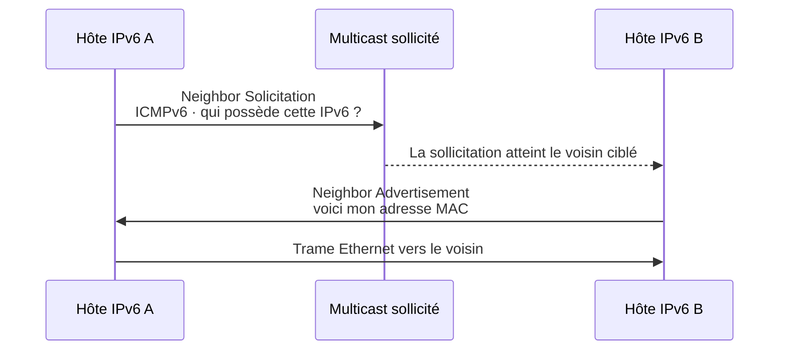

# Module 06 — L’adressage IPv6

**Séquence :** Bases des réseaux  
**Importance :** socle de la progression officielle  
**Sources consolidées :** 1 support(s) de cours, 0 énoncé(s), 0 correction(s)

!!! warning "Périmètre et versions"
    Les six modules sont explicitement nommés dans les dossiers et supports Réseaux. Les activités Packet Tracer sont conservées comme ressources binaires à ouvrir avec Cisco Packet Tracer.

## Objectifs et compétences

- Lire, compresser et développer une adresse IPv6.
- Distinguer unicast, multicast et anycast.
- Reconnaître les portées link-local, unique-local et globale.
- Comprendre le remplacement d’ARP par Neighbor Discovery.

!!! tip "Façon simple de le comprendre"
    Ce module sert à passer de la notion « L’adressage IPv6 » à une méthode que l’on peut expliquer, appliquer, vérifier et dépanner.

## Méthode de travail

1. Lire les concepts dans l’ordre du support.
2. Reproduire les exemples dans un environnement de laboratoire.
3. Noter le résultat attendu avant de modifier une configuration.
4. Vérifier avec l’outil ou la commande appropriée.
5. Revenir à l’état initial si le résultat diverge.

## Repères visuels

Une adresse IPv6 contient **128 bits**, écrits sous la forme de huit groupes hexadécimaux de 16 bits. Les zéros initiaux d’un groupe peuvent être supprimés et une seule suite contiguë de groupes nuls peut être remplacée par `::`.

<figure class="tssr-figure">
  <div class="tssr-figure__canvas">
    <div class="tssr-bits" role="img" aria-label="Huit groupes hexadécimaux de 16 bits formant une adresse IPv6 de 128 bits">
      <div class="tssr-bit"><b>2001</b><span>16 bits</span></div><div class="tssr-bit"><b>0db8</b><span>16 bits</span></div>
      <div class="tssr-bit"><b>85a3</b><span>16 bits</span></div><div class="tssr-bit"><b>0000</b><span>16 bits</span></div>
      <div class="tssr-bit"><b>0000</b><span>16 bits</span></div><div class="tssr-bit"><b>8a2e</b><span>16 bits</span></div>
      <div class="tssr-bit"><b>0370</b><span>16 bits</span></div><div class="tssr-bit"><b>7334</b><span>16 bits</span></div>
    </div>
  </div>
  <figcaption><code>2001:0db8:85a3:0000:0000:8a2e:0370:7334</code> → <code>2001:db8:85a3::8a2e:370:7334</code>.</figcaption>
</figure>

<div class="tssr-service-grid" aria-label="Principales portées IPv6">
  <div class="tssr-service-card" style="--card-color:#3978c5"><b>Globale · 2000::/3</b><span>Routable sur Internet ; équivalent fonctionnel des adresses IPv4 publiques.</span></div>
  <div class="tssr-service-card" style="--card-color:#159574"><b>Link-local · fe80::/10</b><span>Valable sur le lien ; créée automatiquement et non routée.</span></div>
  <div class="tssr-service-card" style="--card-color:#7c5bc4"><b>Unique-local · fc00::/7</b><span>Destinée aux communications privées internes.</span></div>
  <div class="tssr-service-card" style="--card-color:#c47a18"><b>Multicast · ff00::/8</b><span>Adresse un groupe de destinataires ; IPv6 n’utilise pas le broadcast.</span></div>
</div>

### Neighbor Discovery remplace ARP



<p class="tssr-caption">NDP s’appuie sur ICMPv6 et le multicast pour la découverte des voisins, des routeurs et de certains paramètres du lien.</p>

## Cours consolidé

### Module 6 - L'adressage IPv6

Objectifs La structure d'une adresse IPv6 (RFC 2800) Les différents types d'adresses IPv6 Adresse de monodiffusion de Lien-Local Adresses de monodiffusion globale unique Adresses de multidiffusion Adresses IPv6 d'un hôte Démonstration - Les adresses IPv6 Enoncé du TP - L'adressage IPv6 TP - Adressage IPv6

L'adresse IPv6 (Internet Protocol version 6) est la version la plus récente du protocole Internet, conçue pour résoudre les limitations de l'IPv4, notamment la pénurie d'adresses disponibles. Avec un espace d'adressage beaucoup plus grand et des fonctionnalités avancées, l'IPv6 est essentiel pour répondre aux besoins de l'Internet moderne. Structure d'une adresse IPv6 Une adresse IPv6 est composée de 128 bits, soit quatre fois la taille d'une adresse IPv4 (32 bits). Elle est représentée sous forme de huit groupes de quatre chiffres hexadécimaux, séparés par des deux-points (:) :

2001:0db8:85a3:0000:0000:8a2e:0370:7334 Chaque groupe (appelé quartet) représente 16 bits, soit deux octets.

#### Exemple d'adresse IPv6 décomposée

2001 : 0db8 : 85a3 : 0000 : 0000 : 8a2e : 0370 : 7334 2001:0db8 : Identifiant du réseau. 8a2e:0370:7334 : Identifiant de l'hôte. Format Comprimé des Adresses IPv6 Les adresses IPv6 peuvent être simplifiées pour une lecture et une écriture plus aisées.

#### Règles de simplification

Supprimez les zéros initiaux dans chaque quartet. Exemple : 2001:0db8:0000:0000:8a2e:0370:7334 devient 2001:db8:0:0:8a2e:370:7334.

Remplacez les séries continues de 0 par :: une seule fois dans l’adresse. Exemple : 2001:0db8:0000:0000:0000:ff00:0042:8329 devient 2001:db8::ff00:42:8329.

Plages Spéciales d'Adresses IPv6

#### Adresses locales de lien

Plage : FE80::/10 Utilisées pour la communication entre appareils sur un réseau local sans configuration particulière.

#### Adresses globales

Plage : 2000::/3 Correspondent aux adresses routables sur Internet.

#### Adresses multicast

Plage : FF00::/8 Utilisées pour envoyer des paquets à plusieurs destinataires.

#### Adresse de loopback (boucle locale)

Adresse : ::1 Équivalent à 127.0.0.1 en IPv4, utilisée pour tester la connectivité locale.

Avantages de l'IPv6 Espace d'Adressage Étendu IPv6 permet de générer 3,4 × 10^38 adresses (contre 4,3 milliards pour IPv4). Cela garantit des adresses suffisantes pour les décennies à venir, y compris avec l'expansion de l'IoT. Suppression du NAT (Network Address Translation)

Chaque appareil peut avoir une adresse unique, éliminant le besoin de traductions d'adresses. Meilleure Gestion des Flux

L'IPv6 inclut une prise en charge native de la QoS (Qualité de Service). Simplification de la Configuration

Grâce à l'auto-configuration stateless, les appareils peuvent générer automatiquement leurs adresses à partir du préfixe réseau. Sécurité Intégrée

L'IPv6 inclut IPsec (sécurité IP) pour chiffrer et authentifier les données. Compatibilité IPv6 et IPv4 IPv6 et IPv4 ne sont pas directement compatibles, car leurs structures diffèrent. Cependant, plusieurs techniques permettent leur coexistence :

Double Stack : Les appareils utilisent les deux protocoles simultanément. Tunneling : Les paquets IPv6 sont encapsulés dans des paquets IPv4. Traduction d'adresses (NAT64) : Permet aux appareils IPv6 de communiquer avec des appareils IPv4.

Types d'Adresses IPv6

#### Les adresses IPv6 sont classées en trois catégories principales

a) Adresses Unicast Utilisées pour identifier un unique appareil sur un réseau. Exemple : Adresse d'une machine spécifique. b) Adresses Multicast Permettent d'envoyer des paquets à plusieurs appareils en une seule transmission. Remplacent en grande partie les diffusions (broadcast) de l'IPv4. c) Adresses Anycast Permettent d'envoyer des paquets au nœud le plus proche parmi un groupe partageant la même adresse. Adresses spécifiques : : /0 Représente tous les réseaux Utilisé comme route par défaut ≈ 0.0.0.0/0 pour IPv4 : : /128 Adresse non spécifiée Utilisée par un hôte avant d’obtenir une adresse lien-local (link-local) : : 1 /128 Adresse de boucle locale ≈ 127.0.0.1 FE80 : : /10 Adresses monodiffusions d’auto-configuration de lien-local ≈ @APIPA IPv4 FF00 : : /8 Adresses multidiffusions FC00 : : /8 Adresses multidiffusions Le 8ième bit = 1 : FD00 : : /8 ≈ @IPv4 privées Non routable sur internet 2000 : : /3 Adresses locales uniques (Unique-Local) Routable sur Internet

Les adresses de monodiffusion globale unique (ou Global Unicast Addresses, GUA) en IPv6 sont des adresses routables sur Internet. Elles identifient de manière unique un appareil ou une interface sur un réseau mondial, similaire aux adresses publiques IPv4.

Elles sont utilisées pour la communication point-à-point entre des appareils sur Internet ou sur des réseaux privés. Chaque appareil avec une adresse GUA peut être directement atteint depuis n'importe quel autre appareil à travers le monde, à condition que les règles de routage et de pare-feu le permettent.

Structure des Adresses GUA Une adresse IPv6 GUA est une adresse de 128 bits divisée en plusieurs parties :

| Préfixe global | Sous-réseau | Identifiant d’interface | | 48 bits | 16 bits | 64 bits |

#### Détails

Préfixe global (48 bits)

Identifie un réseau spécifique au niveau mondial. Assigné par les registres Internet régionaux (RIR, comme RIPE ou ARIN). Identifiant de sous-réseau (16 bits)

Permet de diviser le réseau global en sous-réseaux plus petits au sein d'une organisation. Identifiant d’interface (64 bits)

Identifie une interface unique sur le réseau. Généralement dérivé de l'adresse MAC grâce à le format EUI-64 ou configuré manuellement.

Les Adresses de Multidiffusion en IPv6 Les adresses de multidiffusion (ou multicast addresses) en IPv6 permettent de transmettre des paquets à un groupe spécifique de nœuds plutôt qu’à un seul destinataire (comme en monodiffusion) ou à tous les nœuds d’un réseau (comme en diffusion). Cela est utile pour optimiser l’utilisation de la bande passante dans des cas où plusieurs destinataires doivent recevoir le même flux de données.

1. Définition d'une Adresse de Multidiffusion Une adresse de multidiffusion IPv6 est utilisée pour identifier un groupe de nœuds. Un paquet envoyé à une adresse de multidiffusion est livré à tous les nœuds faisant partie du groupe associé à cette adresse.
2. Format d’une Adresse de Multidiffusion IPv6 Les adresses de multidiffusion IPv6 appartiennent à la plage FF00::/8. Cela signifie que toutes les adresses de multidiffusion commencent par FF dans leurs 8 premiers bits. Elles sont composées de plusieurs champs définissant leur portée et leur type.

#### Structure générale

| 8 bits (préfixe) | 4 bits (flags) | 4 bits (scope) | 112 bits (identifiant de groupe) | Préfixe : Toujours FF, indiquant une adresse de multidiffusion. Flags : Indiquent des propriétés spécifiques de l’adresse. Scope : Définit l’étendue ou la portée de la diffusion (locale, globale, etc.). Identifiant de groupe : Identifie le groupe de nœuds destinataires. Exemples d’Adresses de Multidiffusion FF02::1

Scope : Lien local. Description : Groupe contenant tous les nœuds d’un réseau local. FF02::2

Scope : Lien local. Description : Groupe contenant tous les routeurs d’un réseau local. FF02::1:2

Scope : Lien local. Tous les serveurs et agents relais DHCP du lien local FF02::fb

Scope : Lien local. Multidiffusion DNS FF05::1

Scope : Site local. Description : Tous les nœuds au sein d’un site spécifique. FF0E::101

Scope : Global. Description : Une multidiffusion spécifique au niveau mondial. Utilisations des Adresses de Multidiffusion Les adresses de multidiffusion sont largement utilisées dans des applications nécessitant une diffusion simultanée vers plusieurs destinataires, notamment :

Diffusion Vidéo et Audio (Streaming) : Envoyer un flux multimédia à plusieurs utilisateurs sans répéter l'envoi à chaque destinataire. Routage Multicast : Protocoles comme PIM (Protocol Independent Multicast) utilisent des adresses de multidiffusion pour gérer les groupes. Découverte de Services : Protocoles comme mDNS (Multicast DNS) ou SSDP (Simple Service Discovery Protocol) utilisent des adresses multicast pour découvrir des périphériques ou services sur un réseau local. Protocoles Réseaux Internes : OSPF (Open Shortest Path First) utilise des adresses multicast pour échanger des informations entre routeurs.

### Quiz Kahoot — Modules 5 et 6

---

### Niveau Facile (1 à 12)

### 1. Que signifie ARP ?

- A. Address Routing Protocol
- B. Address Resolution Protocol ✅
- C. Automatic Relay Process
- D. Address Register Protocol

**Pourquoi ?**

`ARP signifie **Address Resolution Protocol**. Il sert à faire le lien entre une **adresse IP** et une **adresse MAC** sur un réseau local.`

**Exemple :** Un PC veut joindre **192.168.1.100** mais ne connaît pas sa MAC → il utilise ARP.

---

### 2. À quoi sert principalement ARP ?

- A. À convertir une adresse MAC en nom DNS
- B. À convertir une adresse IP en adresse MAC ✅
- C. À attribuer une adresse IP automatiquement
- D. À chiffrer les trames Ethernet

**Pourquoi ?**

`ARP sert à trouver l’adresse **MAC** correspondant à une adresse **IP** locale.`

**Exemple :** “Qui a **192.168.1.100** ?” → la machine répond avec sa MAC.

---

### 3. Quelle commande permet d’afficher la table ARP ?

- A. arp -s
- B. arp -a ✅
- C. arp -d
- D. ipconfig /all

**Pourquoi ?** `arp -a` affiche les associations **IP ↔ MAC** connues par la machine.

**Exemple :**

```bash

`arp -a`

```

---

### 4. Que contient principalement une table ARP ?

- A. Des noms de domaine
- B. Des associations IP / MAC ✅
- C. Des routes statiques
- D. Des mots de passe réseau

**Pourquoi ?** La table ARP contient le **cache des correspondances entre IP et MAC**.

**Exemple :**

- 192.168.1.100 → 00-14-22-01-23-45

---

### 5. Quelle commande permet d’ajouter une entrée ARP statique sous Windows ?

- A. arp -a
- B. arp -s &lt;IP&gt; &lt;MAC&gt; ✅
- C. arp -d *
- D. ip neigh show

**Pourquoi ?** `arp -s` crée une association IP/MAC **manuelle**.

**Exemple :**

```bash

`arp -s 192.168.1.200 00-14-22-01-23-45`

```

---

### 6. Quelle commande permet de vider le cache ARP sous Windows ?

- A. arp -flush
- B. arp -clear
- C. arp -d * ✅
- D. ipconfig /flusharp

**Pourquoi ?** Le cours indique que sous Windows, on vide le cache ARP avec **arp -d ***.

**Exemple :**

```bash

`arp -d *`

```

---

### 7. Sous Windows, quelle commande affiche un résumé des informations réseau ?

- A. ip addr
- B. ipconfig ✅
- C. netstat
- D. ping

**Pourquoi ?** `ipconfig` affiche un résumé des interfaces actives : IP, masque, passerelle.

**Exemple :**

```bash

`ipconfig`

```

---

### 8. Quelle commande Windows affiche des informations réseau détaillées, y compris DHCP et DNS ?

- A. ipconfig /all ✅
- B. ipconfig /displaydns
- C. ipconfig /renew
- D. ip link

**Pourquoi ?** `ipconfig /all` affiche la version détaillée : **MAC, DNS, DHCP, bail, passerelle…**

**Exemple :**

```bash

`ipconfig /all`

```

---

### 9. Quelle commande Windows libère l’adresse IP obtenue par DHCP ?

- A. ipconfig /renew
- B. ipconfig /release ✅
- C. ipconfig /flushdns
- D. ipconfig /displaydns

**Pourquoi ?** `/release` abandonne l’adresse IP actuelle fournie par DHCP.

**Exemple :**

```bash

`ipconfig /release`

```

---

### 10. Quelle commande Windows demande une nouvelle adresse IP au serveur DHCP ?

- A. ipconfig /release
- B. ipconfig /renew ✅
- C. ipconfig /all
- D. arp -a

**Pourquoi ?** `/renew` force la machine à demander une **nouvelle adresse IP**.

**Exemple :**

```bash

`ipconfig /renew`

```

---

### 11. Quelle commande vide le cache DNS sous Windows ?

- A. ipconfig /registerdns
- B. ipconfig /displaydns
- C. ipconfig /flushdns ✅
- D. netstat -r

**Pourquoi ?** `ipconfig /flushdns` efface les entrées DNS locales obsolètes ou corrompues.

**Exemple :**

```bash

`ipconfig /flushdns`

```

---

### 12. Quelle commande affiche le cache DNS sous Windows ?

- A. ipconfig /displaydns ✅
- B. ipconfig /flushdns
- C. ipconfig /all
- D. arp -a

**Pourquoi ?** `ipconfig /displaydns` montre les noms de domaine déjà résolus et mis en cache.

**Exemple :**

```bash

`ipconfig /displaydns`

```

---

### Niveau Moyen (13 à 24)

### 13. Sous Linux, quelle commande moderne remplace progressivement ifconfig ?

- A. ip ✅
- B. route
- C. ping
- D. arp

**Pourquoi ?** Le cours indique que la commande **ip** remplace progressivement **ifconfig**.

**Exemple :**

```bash

`ip addr`

```

---

### 14. Quel objet de la commande `ip` sert à gérer les adresses IP ?

- A. link
- B. addr ✅
- C. route
- D. neigh

**Pourquoi ?** `ip addr` sert à **afficher et gérer les adresses IP**.

**Exemple :**

```bash

`ip addr show`

```

---

### 15. Quelle commande Linux affiche uniquement les adresses IPv4 ?

- A. ip -6 addr
- B. ip -4 addr ✅
- C. ip route
- D. ip link

**Pourquoi ?** L’option `-4` filtre les informations **IPv4**.

**Exemple :**

```bash

`ip -4 addr`

```

---

### 16. Quel objet de la commande `ip` sert à gérer les interfaces réseau ?

- A. addr
- B. route
- C. link ✅
- D. neigh

**Pourquoi ?** `ip link` concerne les **interfaces réseau** (état, activation, désactivation…).

**Exemple :**

```bash

`ip link show`

```

---

### 17. Quel objet de la commande `ip` sert à afficher les routes réseau ?

- A. link
- B. addr
- C. route ✅
- D. neigh

**Pourquoi ?** `ip route` affiche ou modifie la **table de routage**.

**Exemple :**

```bash

`ip route show`

```

---

### 18. Quel objet de la commande `ip` permet de gérer la table de voisinage / ARP ?

- A. addr
- B. neigh ✅
- C. route
- D. link

**Pourquoi ?** `ip neigh` gère les voisins, donc l’équivalent moderne de certaines fonctions ARP.

**Exemple :**

```bash

`ip neigh show`

```

---

### 19. Quel protocole utilise la commande ping ?

- A. TCP
- B. UDP
- C. ICMP ✅
- D. ARP

**Pourquoi ?**

`Ping utilise des **ICMP Echo Request / Echo Reply**.`

**Exemple :**

```bash

`ping 8.8.8.8`

```

---

### 20. Quel est le rôle principal de ping ?

- A. Chiffrer le trafic
- B. Tester la connectivité réseau et mesurer la latence ✅
- C. Modifier la table de routage
- D. Attribuer une adresse IP

**Pourquoi ?**

`Ping permet de savoir si une machine répond, et d’observer le **temps de réponse** et les **pertes de paquets**.`

**Exemple :** Tester si la passerelle **192.168.1.1** est joignable.

---

### 21. Dans la sortie de ping, que représente `time=` ?

- A. La taille du paquet
- B. Le temps aller-retour du paquet ✅
- C. Le nombre de routeurs
- D. Le TTL maximum théorique

**Pourquoi ?** `time=` correspond au **RTT** (Round Trip Time), donc le temps aller-retour.

**Exemple :**

```text
time=18.3 ms
```

---

### 22. Dans la sortie de ping, que signifie `ttl=` ?

- A. Le nombre de paquets perdus
- B. Le numéro de séquence ICMP
- C. Le nombre maximum de sauts restants pour le paquet ✅
- D. Le temps d’attente avant renouvellement DHCP

**Pourquoi ?** TTL = **Time To Live** : chaque routeur le décrémente, et s’il atteint 0, le paquet est abandonné.

**Exemple :**

```text
ttl=115
```

---

### 23. Quelle option de ping permet d’envoyer un nombre précis de requêtes sous Linux ?

- A. -n
- B. -q
- C. -c ✅
- D. -r

**Pourquoi ?** `ping -c 4` envoie **4 requêtes ICMP**, puis s’arrête.

**Exemple :**

```bash

`ping -c 4 www.google.com`

```

---

### 24. Quelle option de ping permet d’afficher seulement les statistiques finales ?

- A. -i
- B. -s
- C. -q ✅
- D. -t

**Pourquoi ?** `-q` = **quiet**, donc moins de détails, surtout les statistiques.

**Exemple :**

```bash

`ping -q www.google.com`

```

---

### Niveau Difficile (25 à 38)

### 25. Quelle commande netstat affiche toutes les connexions actives et les ports en écoute ?

- A. netstat -r
- B. netstat -a ✅
- C. netstat -e
- D. netstat -u

**Pourquoi ?** `netstat -a` montre **toutes les connexions TCP/UDP** et les ports d’écoute.

**Exemple :**

```bash

`netstat -a`

```

---

### 26. Quelle option netstat affiche les adresses et ports en format numérique sans résolution de noms ?

- A. -l
- B. -n ✅
- C. -t
- D. -p

**Pourquoi ?** `-n` évite la résolution DNS et affiche les adresses **brutes**.

**Exemple :**

```bash

`netstat -an`

```

---

### 27. Quelle option netstat affiche uniquement les connexions TCP ?

- A. -u
- B. -r
- C. -t ✅
- D. -e

**Pourquoi ?** `netstat -t` filtre sur le protocole **TCP**.

---

### 28. Quelle option netstat affiche uniquement les connexions UDP ?

- A. -u ✅
- B. -t
- C. -n
- D. -l

**Pourquoi ?** `netstat -u` filtre sur **UDP**.

---

### 29. Que signifie l’état `LISTEN` dans netstat ?

- A. La connexion est fermée
- B. Le port attend des connexions entrantes ✅
- C. La connexion a expiré
- D. Le paquet a été perdu

**Pourquoi ?** `LISTEN` indique qu’un service est **en attente** sur un port.

**Exemple :** Un serveur web peut écouter sur le port **80**.

---

### 30. Que signifie l’état `ESTABLISHED` dans netstat ?

- A. La connexion est active et établie ✅
- B. Le port est fermé
- C. La route est invalide
- D. L’interface est désactivée

**Pourquoi ?** `ESTABLISHED` = une connexion TCP est en cours de fonctionnement.

**Exemple :** Ton navigateur a une connexion établie vers un site web.

---

### 31. Quelle option netstat affiche les processus associés aux connexions ?

- A. -e
- B. -p ✅
- C. -r
- D. -u

**Pourquoi ?** `netstat -p` permet de voir **quel processus utilise quel port**.

**Exemple :**

```bash

`netstat -p`

```

---

### 32. Quelle commande réseau sert à afficher le chemin emprunté par les paquets jusqu’à une destination ?

- A. ping
- B. arp
- C. tracert / traceroute ✅
- D. ipconfig

**Pourquoi ?** `tracert` (Windows) / `traceroute` (Linux) montre les **routeurs intermédiaires**.

**Exemple :**

```bash

`tracert www.google.com`

```

---

### 33. Sur quel principe fonctionne tracert ?

- A. Il modifie le masque de sous-réseau
- B. Il augmente progressivement le TTL des paquets ✅
- C. Il lit la table ARP distante
- D. Il ouvre une connexion TCP sur chaque routeur

**Pourquoi ?**

`Tracert envoie des paquets avec **TTL = 1, puis 2, puis 3…** pour découvrir chaque saut.`

**Exemple :**

- TTL 1 → premier routeur
- TTL 2 → second routeur

---

### 34. Sous Linux, quelle commande est l’équivalent de tracert ?

- A. route
- B. traceroute ✅
- C. traceip
- D. netpath

**Pourquoi ?**

#### Le cours indique clairement

- Windows → `tracert`
- Linux → `traceroute`

---

### 35. Combien de bits contient une adresse IPv6 ?

- A. 32
- B. 64
- C. 128 ✅
- D. 256

**Pourquoi ?** IPv6 utilise **128 bits**, soit 4 fois la taille d’une IPv4.

**Exemple :**

```text
2001:0db8:85a3:0000:0000:8a2e:0370:7334
```

---

### 36. Une adresse IPv6 est généralement écrite sous quelle forme ?

- A. 4 groupes décimaux
- B. 8 groupes hexadécimaux séparés par des deux-points ✅
- C. 6 groupes binaires
- D. 2 groupes de 64 bits visibles

**Pourquoi ?** Une IPv6 est représentée par **8 groupes de 4 chiffres hexadécimaux**.

**Exemple :**

```text
2001:0db8:85a3:0000:0000:8a2e:0370:7334
```

---

### 37. Quelle adresse IPv6 est l’adresse de boucle locale (loopback) ?

- A. ::
- B. ::1 ✅
- C. FE80::1
- D. FF02::1

**Pourquoi ?** `::1` est l’équivalent IPv6 de **127.0.0.1** en IPv4.

**Exemple :** Tester la pile IPv6 locale sur sa propre machine.

---

### 38. Quelle plage correspond aux adresses IPv6 de lien-local ?

- A. 2000::/3
- B. FC00::/8
- C. FE80::/10 ✅
- D. FF00::/8

**Pourquoi ?** Les adresses **FE80::/10** sont utilisées pour la communication locale sur le lien.

**Exemple :** Une interface réseau peut s’auto-attribuer une adresse **FE80::...**

---

### Niveau Avancé / Pièges (39 à 50)

### 39. Quelle plage correspond aux adresses IPv6 multicast ?

- A. FE80::/10
- B. 2000::/3
- C. FF00::/8 ✅
- D. ::1/128

**Pourquoi ?** Toutes les adresses multicast IPv6 commencent dans la plage **FF00::/8**.

**Exemple :** `FF02::1`

---

### 40. Quelle plage correspond aux adresses IPv6 globales routables sur Internet ?

- A. FF00::/8
- B. FE80::/10
- C. 2000::/3 ✅
- D. ::/128

**Pourquoi ?** Les adresses globales IPv6 (GUA) appartiennent à **2000::/3**.

**Exemple :**

```text
2001:db8::...
```

---

### 41. Dans la structure d’une adresse IPv6 GUA, quelle partie identifie généralement l’interface ?

- A. Le préfixe global
- B. Le sous-réseau
- C. L’identifiant d’interface de 64 bits ✅
- D. Le TTL

**Pourquoi ?**

#### Le cours donne

- 48 bits préfixe global
- 16 bits sous-réseau
- 64 bits identifiant d’interface

---

### 42. Quelle adresse multicast IPv6 désigne tous les nœuds du lien local ?

- A. FF02::2
- B. FF02::1 ✅
- C. FF05::1
- D. FF02::fb

**Pourquoi ?** `FF02::1` = **tous les nœuds** du réseau local.

---

### 43. Quelle adresse multicast IPv6 désigne tous les routeurs du lien local ?

- A. FF02::1
- B. FF02::2 ✅
- C. FF02::fb
- D. FF0E::101

**Pourquoi ?** `FF02::2` correspond au groupe **all-routers** sur le lien local.

---

### 44. Quelle adresse multicast IPv6 est associée au Multicast DNS (mDNS) dans le cours ?

- A. FF02::1:2
- B. FF02::2
- C. FF02::fb ✅
- D. FF05::1

**Pourquoi ?** Le cours donne explicitement **FF02::fb** pour la multidiffusion DNS.

---

### 45. Quelle adresse multicast IPv6 est associée aux serveurs et relais DHCP du lien local ?

- A. FF02::1
- B. FF02::1:2 ✅
- C. FF02::2
- D. FF0E::101

**Pourquoi ?** Le cours cite **FF02::1:2** pour DHCPv6 sur le lien local.

---

### 46. Quelle commande Windows peut aider à confirmer qu’une machine a reçu une adresse APIPA ?

- A. ping
- B. ipconfig /all ✅
- C. arp -a
- D. tracert

**Pourquoi ?** `ipconfig /all` permet de voir si l’interface a reçu une adresse **169.254.x.x**.

**Exemple :** Si tu vois **169.254.12.8**, ça signale souvent un problème DHCP.

---

### 47. Quel protocole remplace ARP en IPv6 ?

- A. ICMPv6 NDP ✅
- B. OSPFv3
- C. DHCPv6
- D. BGP

**Pourquoi ?** Le cours indique qu’en IPv6, **ARP est remplacé par NDP (Neighbor Discovery Protocol)**.

---

### 48. Quelle commande netstat affiche la table de routage du système ?

- A. netstat -a
- B. netstat -n
- C. netstat -r ✅
- D. netstat -u

**Pourquoi ?** `netstat -r` affiche la **routing table**.

---

### 49. Vrai ou Faux

`ARP fonctionne pour la communication entre réseaux différents via Internet.`

❌ **Faux**

**Pourquoi ?**

`ARP ne fonctionne que **dans un réseau local**. Pour aller vers un autre réseau, on passe par le **routage**.`

---

### 50. Vrai ou Faux

Une adresse IPv6 peut être compressée en remplaçant une suite continue de zéros par `::`, mais une seule fois dans l’adresse.

✅ **Vrai**

**Pourquoi ?** Le cours précise que la compression par `::` ne peut être utilisée **qu’une seule fois** dans une adresse IPv6.

**Exemple :**

```text
2001:db8::ff00:42:8329
```

---

### Bilan du quiz

#### Notions couvertes

- ARP
- ipconfig
- commande ip
- ping
- netstat
- tracert / traceroute
- IPv6
- multicast
- plages spéciales
- compression d’adresses
- NDP vs ARP

---

### Anomalie conservée

Un passage du cours sur les plages IPv6 semble incohérent entre **FC00::/8 / FD00::/8 / 2000::/3** : les libellés paraissent mélangés à un endroit du texte. Pour le quiz, seuls les éléments cohérents dans l’ensemble du module ont été retenus :

- FE80::/10 → lien-local
- FF00::/8 → multicast
- 2000::/3 → global unicast routable
- ::1 → loopback

et j’ai évité de bâtir des questions piégeuses sur la partie du cours qui semble mal rédigée.

---

## Mise en pratique

- Aucun énoncé de TP distinct n’est fourni pour ce module.
- [Fiche de révision du module](../../revision/reseaux/module-06-l-adressage-ipv6.md)

## Questions flash

1. Comment expliquer simplement « L’adressage IPv6 » à un collègue ?
2. Quelles étapes ou notions doivent être maîtrisées avant la manipulation ?
3. Quel contrôle permet de prouver que le résultat est correct ?
4. Quel est le premier risque ou piège à écarter ?

??? success "Éléments de réponse"
    - Lire, compresser et développer une adresse IPv6.
    - Distinguer unicast, multicast et anycast.
    - Reconnaître les portées link-local, unique-local et globale.
    - Comprendre le remplacement d’ARP par Neighbor Discovery.

## Voir aussi

- [Présentation de la séquence](index.md)
