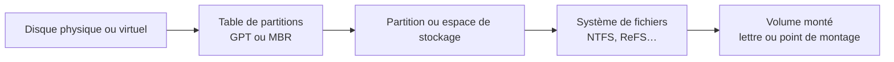

# Module 04 — La gestion du stockage

**Séquence :** Systèmes clients Microsoft  
**Importance :** socle de la progression officielle  
**Sources consolidées :** 2 support(s) de cours, 1 énoncé(s), 1 correction(s)

!!! warning "Périmètre et versions"
    Le support enseigne Windows 10. Windows 10 a atteint sa fin de support général le 14 octobre 2025 ; les manipulations restent utiles pour le laboratoire et les environnements hérités, mais un déploiement neuf doit viser une édition Windows encore prise en charge. Référence : [Cycle de vie Windows 10](https://learn.microsoft.com/en-us/lifecycle/products/windows-10-home-and-pro).

## Objectifs et compétences

- Distinguer MBR, GPT, partitions, volumes et systèmes de fichiers.
- Initialiser, partitionner et formater un disque.
- Utiliser Gestion des disques, DiskPart et PowerShell.
- Contrôler l’état et les lettres de lecteur avant toute opération destructive.

!!! tip "Façon simple de le comprendre"
    Ce module sert à passer de la notion « La gestion du stockage » à une méthode que l’on peut expliquer, appliquer, vérifier et dépanner.

## Méthode de travail

1. Lire les concepts dans l’ordre du support.
2. Reproduire les exemples dans un environnement de laboratoire.
3. Noter le résultat attendu avant de modifier une configuration.
4. Vérifier avec l’outil ou la commande appropriée.
5. Revenir à l’état initial si le résultat diverge.

## Du disque au lecteur utilisable



<p class="tssr-caption">Avant toute opération destructive, identifier le disque par sa taille et son numéro, puis distinguer la structure de partitionnement du système de fichiers qu’elle contient.</p>

## Commandes repérées dans les supports

```text
diskpart
select disk 1
create partition primary
Get-Disk
Initialize-Disk -Number 1 -PartitionStyle GPT
New-Partition -DiskNumber 1 -UseMaximumSize -AssignDriveLetter
Format-Volume -DriveLetter E -FileSystem NTFS -NewFileSystemLabel "Donnees"
Create a new virtuel disk &gt; Next
select volume X (où X correspond au volume de 15 Go bruts RAW, le volume n) ; 1 dans le
Get-Disk | select number,size,PartitionStyle
Get-Volume
Get-Volume -FriendlyName Informatique,Achat-Ventes,Compta
Get-Volume -FriendlyName Informatique,Achat-Ventes,Compta | Select DriveLetter,
Set-Volume -DriveLetter C -NewFileSystemLabel "System"
```

!!! warning
    Une commande extraite d’un support n’est pas à exécuter aveuglément. Vérifier la version, les droits, la cible et l’existence d’une sauvegarde avant toute action destructive.

## Synthèse Module 4 - Gestion du Stockage sous Windows V2

### Synthèse - Module 4 : La Gestion du Stockage sous Windows (V2)

### 1. Partitionnement : MBR vs GPT

Avant de pouvoir utiliser un disque dur, celui-ci doit être initialisé avec une table de partitionnement :

### 2. Disques de Base vs Disques Dynamiques & Systèmes de Fichiers

Disque de Base : Organisé en partitions principales et étendues.

Disque Dynamique : Organisé en volumes (simples, agrégés par bandes, miroir/RAID).

NTFS : Système de fichiers standard Windows supportant les permissions de sécurité (ACL), la compression et le chiffrement EFS.

ReFS : Resilient File System, conçu pour maximiser la disponibilité des données et la résilience aux pannes.

FAT32 : Format universel mais limité à des fichiers de 4 Go max.

### 3. Outils de Gestion du Stockage et Commandes

Le stockage se gère via la console diskmgmt.msc, l'outil CLI diskpart ou PowerShell :

:: Gestion du stockage via Diskpart (cmd.exe)

`diskpart`

list disk

`select disk 1`

clean

convert gpt

`create partition primary`

format fs=ntfs quick

assign letter=E

exit

# Administration du stockage via PowerShell

`Get-Disk`

`Initialize-Disk -Number 1 -PartitionStyle GPT`

`New-Partition -DiskNumber 1 -UseMaximumSize -AssignDriveLetter`

`Format-Volume -DriveLetter E -FileSystem NTFS -NewFileSystemLabel "Donnees"`

| Caractéristique | MBR (Master Boot Record) | GPT (GUID Partition Table) |

| --- | --- | --- |

| Firmware requis | BIOS traditionnel / Legacy | UEFI moderne |

| Nombre max de partitions | 4 partitions principales (ou 3 + 1 étendue) | Jusqu'à 128 partitions |

| Taille max du disque | 2,2 To | 256 To (et plus) |

| Redondance | Aucune (secteur LBA 0 unique) | Entête de secours en fin de disque |

## Module 04 - Support de cours

### Systèmes clients Microsoft

#### Module 04 — La gestion du stockage

#### Objectifs • Découvrir le partitionnement

- Initialiser le stockage

- Installer un système de fichier

- Utiliser les outils de gestion du stockage

### Le partitionnement

- Partitionnement

- Formats de table de partition

- Système de fichiers

- Outils

#### Partitionner un disque

#### =

#### "séparer" un disque en plusieurs "portions" logiques, étanches et

indépendantes.

#### P1 P2 P3 P4 P5 P6 P7…

- Table de partition

- Détermine les caractéristiques des partitions du disque

- « Sommaire » du disque

- Table de partition au format MBR

- Master Boot Record

- Format historique

- Lecture du MBR par le BIOS

- Stocké sur le premier secteur du disque (512 o)

- 4 partitions maximum

- Ne gère pas les disques de plus de 2,2 To

- Compatible avec les systèmes d'exploitation 32 bits et 64 bits

#### Le partitionnement

#### Partitionnement d'un disque

- DE BASE

- Possibilités d'étendre une partition grâce à l'espace libre contigu

- 4 partitions maximum

#### Partition

#### principale

#### Partition

#### principale

#### Espace libre

#### Partition

#### principale

#### Partition

#### principale

#### Partition

#### principale

#### Partition

#### principale

#### Partition

#### principale

#### Partition

#### principale

#### Partitionnement d'un disque

- DE BASE

- Possibilités d'étendre une partition grâce à l'espace libre contigu

- 4 partitions maximum

- Partition étendue et lecteurs logiques pour aller au-delà

#### Espace librePartition

#### principale

#### Partition

#### principale

#### Partition

#### principale

#### 3 Partition étendue

L.

#### Logique 1

L.

#### Logique 2

L.

#### Logique 3

#### Le partitionnement

#### Partitionnement d'un disque

- DYNAMIQUE (évolution du disque de base)

- Attention, pour Microsoft, les partitions contenues sur un disque dynamique s'appellent des volumes

- Possibilité d'étendre un volume grâce à l'espace libre disponible sur le disque source

- … et disponible sur un disque supplémentaire. Permet de gérer les disques par ensemble (RAID)

- Convertir un disque de base en disque dynamique ? Pas de perte de données

#### Volume 1 Volume 2 Volume 3

#### Espace libre

#### Volume 2

#### Volume 1 Volume 2 Volume 3 Volume 2

#### Table de partitionnement au format GPT

- GUID Partition Table

- Nouveau format qui gomme les inconvénients du MBR

- Dupliqué sur plusieurs secteurs du disque

- Lecture du GPT par l'UEFI (évolution du BIOS depuis 2013)

- 128 partitions maximum

- Taille maximale d'une partition : 256 To

- Seulement compatible avec les systèmes d'exploitation

#### 64 bits et les puces UEFI

#### Secondary GPT Header

#### GUID Partition Table Scheme

#### LBA 0

#### LBA 1

#### LBA 2

#### LBA 33

#### LBA 34

#### LBA -34

#### LBA -33

#### LBA -2

#### LBA -1

#### Protective MBR

#### Partition 1

#### Partition 2

#### Partition 1

#### Remaining Partitions

#### Entry 1 Entry 2 Entry 3 Entry 4

#### Entries 5-128

#### Entry 1 Entry 2 Entry 3 Entry 4

#### Entries 5-128

#### Secondary GPT Primary GPT

#### Les systèmes de fichiers

- Après le partitionnement, le formatage

- Formater une partition ou un lecteur logique, c'est installer un

#### système de fichiers

- Le FS organise les données. Une partition ou un lecteur logique

#### formaté s'appelle un volume

- Plusieurs systèmes de fichiers existent

#### Partition

#### principale

#### X

#### I

#### N

#### D

#### E

#### X

#### I

#### N

#### D

#### E

#### X

### Les systèmes de fichiers

#### NTFS

- Le système de fichiers par défaut chez Microsoft

- Nativement sécurisé (ACL)

- Chiffrement intégré (EFS)

- Compression intégrée

- Supporte des fonctionnalités supplémentaires

- Taille maximale du volume 256 To

#### Les systèmes de fichiers

#### Les autres

- FAT16 / FAT32 (File Allocation Table)

- Historique

- Standard

- Volume de 4 Go maximum

- Non sécurisé nativement

- ReFS (Resilient File System)

- Évolution de NTFS

- Taille des volumes quasi illimitée

- Correction proactive des erreurs

- Les autres

- Ext4, VMFS, UDF… et des dizaines d'autres

### Les disques durs virtuels

- VHD (Virtual Hard Drive) et VHDX

- Bootable

- Taille fixe ou dynamique

- Créés et utilisés pour les machines virtuelles

- Utilisable sur les machines physiques ! montable comme ISO !

- Manipulable comme un fichier (clonage, déplacement, compression,

#### versioning…)

- Disques durs virtuels par défaut pour HyperV

#### Stockage local et GUI

#### Les outils de gestion

- Avec la console graphique (diskmgmt.msc)

### Stockage local et cmd.exe

#### Les outils de gestion

- Avec diskpart (outil en ligne de commande très utilisé en production)

#### Stockage local et PowerShell

#### Les outils de gestion

- Avec les cmdlet PowerShell

- Get-disk

- Relever le numéro du nouveau disque

- Initialize-disk —number &lt;numéro relevé&gt;

- Par défaut en GPT

- Il faut préciser le paramètre —PartitionStyle MBR pour la rétrocompatibilité

- New-partition —DiskNumber &lt;numéro relevé&gt; -UseMaximumSize —AssignDriveLetter

- On peut assigner la lettre après avec set-partition —DiskNumber &lt;numéro relevé&gt; -PartitonNumber

&lt;numéro relevé&gt; -NewDriveLetter &lt;Lettre de votre choix&gt;

- Format-volume —DriveLetter &lt;Lettre de lecteur&gt;

- Format par défaut en NTFS

- Votre volume est prêt à l'utilisation

### Démonstration

#### TP

### Conclusion

- Recette pour bien utiliser le stockage

- Installer le média dans l’ordinateur

- Initialiser

- Partitionner

- Installer le système de fichier

- Attribuer une lettre de lecteur ou un point de montage

## Mise en pratique

- [Travaux pratiques du module](../../tp/systemes-clients/module-04/index.md)
- [Fiche de révision du module](../../revision/systemes-clients/module-04-la-gestion-du-stockage.md)

## Questions flash

1. Comment expliquer simplement « La gestion du stockage » à un collègue ?
2. Quelles étapes ou notions doivent être maîtrisées avant la manipulation ?
3. Quel contrôle permet de prouver que le résultat est correct ?
4. Quel est le premier risque ou piège à écarter ?

??? success "Éléments de réponse"
    - Distinguer MBR, GPT, partitions, volumes et systèmes de fichiers.
    - Initialiser, partitionner et formater un disque.
    - Utiliser Gestion des disques, DiskPart et PowerShell.
    - Contrôler l’état et les lettres de lecteur avant toute opération destructive.

## Voir aussi

- [Présentation de la séquence](index.md)
