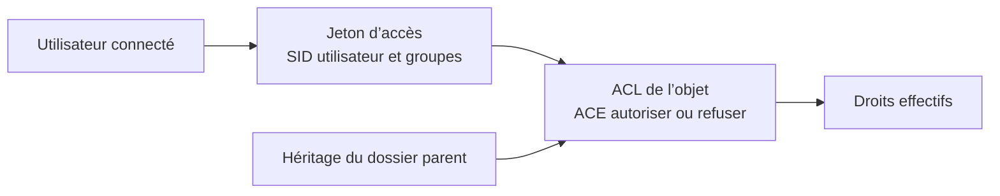

# Module 06 — La sécurité NTFS et les ACL

**Séquence :** Systèmes clients Microsoft  
**Importance :** socle de la progression officielle  
**Sources consolidées :** 1 support(s) de cours, 1 énoncé(s), 1 correction(s)

!!! warning "Périmètre et versions"
    Le support enseigne Windows 10. Windows 10 a atteint sa fin de support général le 14 octobre 2025 ; les manipulations restent utiles pour le laboratoire et les environnements hérités, mais un déploiement neuf doit viser une édition Windows encore prise en charge. Référence : [Cycle de vie Windows 10](https://learn.microsoft.com/en-us/lifecycle/products/windows-10-home-and-pro).

## Objectifs et compétences

- Lire une ACL et distinguer autorisations explicites et héritées.
- Appliquer le principe du moindre privilège.
- Comprendre la priorité d’un refus et l’effet des groupes.
- Tester les droits avec un compte réellement concerné.

!!! tip "Façon simple de le comprendre"
    Ce module sert à passer de la notion « La sécurité NTFS et les ACL » à une méthode que l’on peut expliquer, appliquer, vérifier et dépanner.

## Méthode de travail

1. Lire les concepts dans l’ordre du support.
2. Reproduire les exemples dans un environnement de laboratoire.
3. Noter le résultat attendu avant de modifier une configuration.
4. Vérifier avec l’outil ou la commande appropriée.
5. Revenir à l’état initial si le résultat diverge.

## Comment Windows évalue un accès



<p class="tssr-caption">Les droits effectifs résultent des entrées applicables à l’utilisateur et à ses groupes, de l’héritage et des refus explicites. Les vérifier dans l’onglet d’accès effectif évite de raisonner sur une seule entrée.</p>

## Commandes repérées dans les supports

```text
Get-Acl m:\2022
Set-Acl
```

!!! warning
    Une commande extraite d’un support n’est pas à exécuter aveuglément. Vérifier la version, les droits, la cible et l’existence d’une sauvegarde avant toute action destructive.

## Module 06 - Support de cours

### Systèmes clients Microsoft

#### Module 06 — La sécurité NTFS et les ACL

#### Objectifs • Définir et découvrir les ACL

- Connaître le fonctionnement et les bonnes

#### pratiques

- Configurer les accès

- Vérifier leur bon fonctionnement

### NTFS et les ACL

#### Sur un volume formaté en NTFS

- Tous les répertoires et tous les fichiers sont soumis à la sécurité NTFS

- Des autorisations définissent des privilèges d'accès

- L'utilisateur présente son jeton d'accès, qui est filtré par la ressource

- Les autorisations sont stockées dans l'index du système de fichier NTFS

- Consultable, modifiable dans l'onglet sécurité de chaque objet

#### NTFS et les ACL

#### L'onglet sécurité

- Accessible via les propriétés d'un objet

- DACL : (Liste de contrôle d'accès discrétionnaire)

#### contient les utilisateurs et groupes

- Les DACL filtrent

- Les groupes locaux

- Les groupes prédéfinis

- Les entités de sécurité

- Les utilisateurs

- ACE : (Access Control Entry) privilèges d'accès

#### du groupe en question

#### D

#### A

#### C

#### L

#### A

#### C

#### E

- Pour les besoins courants, les ACE de base sont utilisées et cumulatives

- Configurable depuis le menu Modifier

- LECTURE

- Affichage du contenu du dossier

- Lecture

- Lecture et exécution

- MODIFICATION

- Écriture

- Modification

- CONTRÔLE TOTAL

- Pour des besoins spécifiques, des autorisations spéciales peuvent être configurées

- Accessibles depuis le menu Avancé

- Affinent les privilèges (création de fichiers, suppression de sous-dossiers et fichiers, etc.)

#### NTFS et les ACL

- Permissions basées sur des règles explicites

- Un groupe absent de la DACL se verra l'accès refusé (refus implicite)

- Chaque règle peut accorder des privilèges (autoriser) ou les ôter (refuser)

- Plusieurs règles d’accès peuvent s’appliquer à un même utilisateur

- La règle la plus permissive l'emporte

- Le refus explicite l'emporte sur l'autorisation

- Les mécanismes d'héritage

- Par défaut, un répertoire propage ses autorisations à ses objets enfants

- Les autorisations héritées apparaissent grisées et ne sont pas modifiables

- Une autorisation d'accès l'emporte sur un refus explicite hérité

- Pour les modifier, il faut :

- Modifier les autorisations sur le dossier parent (voire parfois celles du volume racine)

- "Casser" l'héritage (à effectuer avec précaution)

- Gestion de l'héritage depuis le menu Avancé

#### NTFS et les ACL

- Que se passe-t-il lors de la copie ? Du déplacement ?

#### Au sein d'une même

#### partition/volume

#### Entre deux

#### partitions/volumes

#### Déplacement Conservation Héritage

#### Copie Héritage Héritage

#### Une fois les ACL configurées, que faire ?

- Testez les accès avec les utilisateurs !

- Ou/et vérifiez les accès depuis l'onglet Accès effectif du menu Avancé

#### NTFS et les ACL

- À manipuler avec précaution !

- Bonnes pratiques pour éviter les effets de bord et les mauvaises surprises

- Privilégier au maximum les groupes dans les DACL

- Utiliser au maximum ACE de base

- Garder en tête les mécanismes d'héritage (attention aux copies, aux déplacements)

- Privilégier l'héritage

- Privilégier le refus implicite

- Toujours tester/vérifier les accès aux ressources

- Attention au double jeton d'accès des administrateurs !

### Démonstration

#### TP

### Conclusion

- La gestion des ACL est indispensable

- ACL = DACL + ACE

- Liste de contrôle d’accès

- Liste de contrôle d’accès discrétionnaire

- Entrées de contrôle d’accès

- Tester les accès

- Respecter les bonnes pratiques Microsoft

## Mise en pratique

- [Travaux pratiques du module](../../tp/systemes-clients/module-06/index.md)
- [Fiche de révision du module](../../revision/systemes-clients/module-06-la-securite-ntfs-et-les-acl.md)

## Questions flash

1. Comment expliquer simplement « La sécurité NTFS et les ACL » à un collègue ?
2. Quelles étapes ou notions doivent être maîtrisées avant la manipulation ?
3. Quel contrôle permet de prouver que le résultat est correct ?
4. Quel est le premier risque ou piège à écarter ?

??? success "Éléments de réponse"
    - Lire une ACL et distinguer autorisations explicites et héritées.
    - Appliquer le principe du moindre privilège.
    - Comprendre la priorité d’un refus et l’effet des groupes.
    - Tester les droits avec un compte réellement concerné.

## Voir aussi

- [Présentation de la séquence](index.md)
