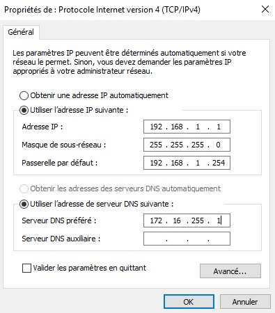
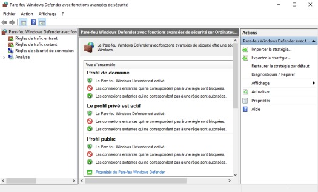

# Module 07 — La gestion du réseau et du pare-feu

**Séquence :** Systèmes clients Microsoft  
**Importance :** socle de la progression officielle  
**Sources consolidées :** 2 support(s) de cours, 1 énoncé(s), 1 correction(s)

!!! warning "Périmètre et versions"
    Le support enseigne Windows 10. Windows 10 a atteint sa fin de support général le 14 octobre 2025 ; les manipulations restent utiles pour le laboratoire et les environnements hérités, mais un déploiement neuf doit viser une édition Windows encore prise en charge. Référence : [Cycle de vie Windows 10](https://learn.microsoft.com/en-us/lifecycle/products/windows-10-home-and-pro).

## Objectifs et compétences

- Configurer une interface IPv4 et un profil réseau.
- Distinguer profils Domaine, Privé et Public.
- Créer et contrôler des règles de pare-feu.
- Diagnostiquer IP, passerelle, DNS et filtrage dans cet ordre.

!!! tip "Façon simple de le comprendre"
    Ce module sert à passer de la notion « La gestion du réseau et du pare-feu » à une méthode que l’on peut expliquer, appliquer, vérifier et dépanner.

## Méthode de travail

1. Lire les concepts dans l’ordre du support.
2. Reproduire les exemples dans un environnement de laboratoire.
3. Noter le résultat attendu avant de modifier une configuration.
4. Vérifier avec l’outil ou la commande appropriée.
5. Revenir à l’état initial si le résultat diverge.

## Repères d’interface Windows

<div class="grid cards" markdown>

-   **Configuration IPv4**

    [](../../assets/images/systemes-clients-microsoft-2/configuration-ipv4-windows.jpg){ .glightbox }

    L’adresse, le masque, la passerelle et le DNS doivent appartenir au plan d’adressage attendu. Source : support Windows, module 07, page 3.

-   **Pare-feu avancé**

    [](../../assets/images/systemes-clients-microsoft-2/pare-feu-windows-avance.jpg){ .glightbox }

    Une règle s’évalue avec son sens, son profil, son protocole, son port et son action. Source : support Windows, module 07, page 5.

</div>


<p class="tssr-caption">Ordre de diagnostic : valider la configuration et le chemin IP avant d’attribuer le symptôme au filtrage.</p>

## Commandes repérées dans les supports

```text
IP : 192.168.5.254/24
IP : 192.168.10.254/24
IP : 203.0.113.1/30
IP : 203.0.113.2/30
IP : 192.168.5.1/24
IP : 192.168.10.1/24
ipconfig (attention, votre adresse IP sera différente de celle de l'encadré ci-dessous).
ipconfig /all
ping 172.28.0.254
ipconfig
Ping &lt;adresse ip de votre VM Discovery&gt;
ping www.facebook.com
```

!!! warning
    Une commande extraite d’un support n’est pas à exécuter aveuglément. Vérifier la version, les droits, la cible et l’existence d’une sauvegarde avant toute action destructive.

## CONFIGURATION-VPN-FORTINET-ENIECOLE

### Procédure

#### SI

#### Procédure d’installation et de configuration du client

#### VPN pour l’accès des apprenants ENI ECOLE aux

#### machines de salles

#### V 2026-01

#### Procédure apprenant

Cette procédure indique comment installer et utiliser le VPN ENI Ecole pour accéder aux machines de salles.

#### Récupération et installation du client VPN

#### Le Web installeur est à télécharger directement depuis la section

du site Fortinet &gt; https://www.fortinet.com/fr/support/product-downloads Le récupérer et l’installer.

#### Configuration du client VPN

#### Une fois installé, lancer l’application client VPN : FortiClient VPN

#### Au lancement, cocher la case d’acceptation des conditions

#### d’utilisation, puis cliquer sur : Configurer le VPN

#### Renseigner les champs

#### suivants :

#### ➢ Le nom que vous

#### souhaitez voir

#### associé à cette

#### connexion

#### ➢ L’adresse de la

#### passerelle :

#### vpnssl.campus-

#### eni.fr

#### ➢ Cocher la case

#### Port personnalisé

#### ➢ Renseigner le

#### numéro de port :

#### Et cliquer sur Sauvegarder

#### SI

#### Procédure d’installation et de configuration du client

#### VPN pour l’accès des apprenants ENI ECOLE aux

#### machines de salles

#### V 2026-01

#### Procédure apprenant

#### Connexion au VPN

#### Pour vous connecter au VPN, renseignez les informations suivantes :

#### Renseigner votre identifiant de compte AD du domaine ad.campus-eni.fr

#### Rappel : format de votre identifiant

#### pnomAAAA

#### p = première lettre de votre prénom

#### nom = votre nom de famille

#### AAAA = l’année de votre entrée en formation

Le format indiqué ci-dessus correspond à un compte apprenant (différent pour les formateurs).

#### ➢ Mot de passe :

#### Indiquer le mot de passe de votre compte

#### Et cliquer sur le bouton : Connecter

#### Cliquer sur “Yes” pour accepter le certificat

Bravo, vous êtes maintenant connecté au VPN. Vous pouvez maintenant accéder via le bureau a distance à la machine de salle qui vous a été allouée. Quand vous n’aurez plus besoin d’accéder à cette machine de salle, pensez à vous déconnecter du

#### VPN (voir étape suivante)

#### Déconnexion du VPN

#### Pour vous déconnecter du VPN :

#### ➢ Dans la barre d’état système, cliquer sur

#### le chevron (1)

#### ➢ Localiser l’icône du client VPN Fortinet et

#### faire un clic droit dessus (2)

#### ➢ Cliquer sur Disconnect […]

## Module 07 - Support de cours

### Systèmes clients Microsoft

#### Module 07 — La gestion du réseau et du pare-feu

#### Objectifs • Rappel sur les bases des réseaux

- Configurer la carte et l’emplacement réseau
- Manipuler le pare-feu Windows

### Rappel

#### B

#### Cache ARP de la machine A

#### Adresse MAC Adresse IP

#### 10-11-12-13-14-15 192.168.5.254

#### A

`IP : 192.168.5.254/24`

#### MAC : 10-11-12-13-14-15

`IP : 192.168.10.254/24`

#### MAC : 02-46-80-13-57-90

`IP : 203.0.113.1/30`

#### MAC : 50-51-52-53-54-55

`IP : 203.0.113.2/30`

#### MAC : 1A-2B-3C-4D-5E-6F

#### Adresse IP

#### Source :

192.168.5.1

#### Données (Payload)

#### ?

#### Données de couche 3Données de couche 2

#### Adresse IP

#### Destination :

192.168.10.1

#### Réseau directement connecté :

203.0.113.0 via 203.0.113.1

#### Route vers le réseau

192.168.10.0 via 203.0.113.2

#### Nombre de sauts : 1

#### Réseau directement connecté :

192.168.5.0 via 192.168.5.254

#### Cache ARP de la routeur 1

#### Adresse MAC Adresse IP

#### 1A-2B-3C-4D-5E-6F 203.0.113.2

#### MAC Destination:

#### 10-11-12-13-14-15

#### MAC Source :

#### 00-01-02-03-04-05

#### Réseau directement connecté :

192.168.10.0 via 192.168.10.254

#### Réseau directement connecté :

203.0.113.0 via 203.113.0.2

#### Route vers le réseau

192.168.5.0 via 203.0.113.1

#### Nombre de sauts : 1

#### Cache ARP de la routeur 1

#### Adresse MAC Adresse IP

#### AA-BB-CC-DD-EE-FF 192.168.10.1

#### MAC Destination:

#### 1A-2B-3C-4D-5E-6F

#### MAC Source :

#### 50-51-52-53-54-55

#### MAC Destination:

#### AA-BB-CC-DD-EE-FF

#### MAC Source :

#### 02-46-80-13-57-90

`IP : 192.168.5.1/24`

#### MAC : 00-01-02-03-04-05

#### Passerelle : 192.168.5.254

`IP : 192.168.10.1/24`

#### MAC : AA-BB-CC-DD-EE-FF

#### Passerelle : 192.168.10.254

Le routeur trouve une correspondance dans sa table de routage. Pour atteindre le réseau 192.168.10.0 il doit passer par 203.0.113.2 et que le réseau de destination se trouve juste derrière (1 saut). La machine A souhaite envoyer un paquet à la machine BLa machine B est-elle dans mon réseau ?La machine B est sur un autre réseauLe poste A devra envoyer le paquet vers sa passerelle par défaut. Il doit trouver son adresse MAC…Le poste A regarde dans son cache ARP si l’adresse MAC de la passerelle y est stockée L’adresse MAC de la passerelle a été trouvée, la machine A encapsule la trameLa trame est transmise au routeurLe routeur reçoit le paquet, désencapsule la couche 2 et analyse l’adresse IP de destination du paquetLe routeur regarde dans sa table de routageLe routeur va rechercher dans son cache ARP l’adresse MAC de l’adresse du saut suivantLe routeur encapsule la trame et l’envoie à destination du routeur 2 Le routeur 2 désencapsule la trame et analyse l’adresse IP de destinationLe routeur 2 trouve une correspondance dans sa table de routage, le réseau 192.168.10.0 est

#### directement connecté à l’interface 192.168.10.254

Le routeur 2 recherche dans son cache ARP l’adresse MAC du poste BLe routeur encapsule et envoie la trame à destination du poste BLe poste B identifie qu’il est bien le destinataire du paquet et le traite

`IP : 192.168.5.1/24`

#### MAC : 00-01-02-03-04-05

#### Passerelle : 192.168.5.254

`IP : 192.168.10.1/24`

#### MAC : AA-BB-CC-DD-EE-FF

#### Passerelle : 192.168.10.254IP : 203.0.113.1/30

#### MAC : 50-51-52-53-54-55

`IP : 203.0.113.2/30`

#### MAC : 1A-2B-3C-4D-5E-6F

#### Configuration de la carte réseau

#### Le centre réseau et partage

- Accessible depuis l'icône réseau de la barre de notification
- Paramètre réseau et Internet &gt; Centre réseau et partage
- Accessible depuis le panneau de configuration
- Réseau et Internet &gt; Centre réseau et partage
- Donne des indications sur :
- La connectivité du poste
- Les connexions réseau détectées
- Les profils réseau et les emplacements associés
- Donne accès aux paramétrages :
- Des fonctionnalités de partage : découverte, partages, dossiers publics…
- Des cartes réseau (accès direct en lançant ncpa.cpl)
- Des nouvelles connexions

### Configuration de la carte réseau

#### Une carte réseau est associée à un emplacement réseau

- Détermine le comportement du pare-feu
- Réseau privé sur un poste autonome
- Réseau avec domaine non modifiable si le poste est joint à un domaine
- Réseau public si aucune passerelle n’a été définie, si le domaine n’a pas été détecté pour les

postes en domaine, si vous refusez de rendre votre ordinateur visible sur le réseau…

#### Configuration de la carte réseau

- Quels paramètres pour le poste de travail ?
- Adresse IP et masque
- Passerelle
- Serveurs DNS préférés et auxiliaires
- Le type d’adressage
- Statique : configuré manuellement
- Dynamique : fourni par le serveur DHCP ou APIPA
- APIPA : communication temporaire sur le réseau local
- Obtenir automatiquement une adresse grâce au système

#### d'exploitation Windows si aucun serveur DHCP n'est joignable

- Réseau 169.254.0.0/16
- Communication sur le réseau local possible
- Outils graphiques
- Zone de notification (état de la connexion)
- Composant Connexions réseau
- Assistant Résoudre les problèmes : orienté utilisateur…
- Rappel sur les outils invite de commande : les plus précis et efficaces
- ipconfig : afficher la configuration et interagir avec la pile réseau (DNS, DHCP)
- ping : tester la connectivité (bloqué par défaut par le pare-feu Windows !)
- tracert : tester la route empruntée par les paquets TPC/IP
- nslookup : diagnostic de la résolution de noms d’hôte

#### Pare-feu

- Pourquoi ?
- Délimiter quels flux réseau sont autorisés en entrée et en sortie
- Protéger le poste contre les accès non autorisés (utilisateurs, programmes)
- Élément de la stratégie globale de sécurité de l’entreprise
- Caractéristiques
- Activé par défaut, bloque certains flux en entrée et les autorise tous en sortie
- Se compose de règles prédéfinies activées (ou facilement activables)
- S'adapte à la situation du poste (emplacements réseau)
- Administrable de manière centralisée (stratégies, export)

### Pare-feu

- 3 niveaux de configuration
- Utilisateur depuis le composant Vérifier l'état du

#### Pare-feu pour l’activation / la désactivation

- Programme avec la fonction Autoriser une

#### application via le pare-feu Windows : fournit un

#### ensemble de règles génériques activées

#### automatiquement et paramétrables

- Avancé avec la console Pare-feu Windows

#### Defender avec fonctions avancées de sécurité :

#### donne accès au paramétrage détaillé de l’ensemble

#### des règles, permet également d’afficher une vue

#### globale des règles activées

- Accessible avec la commande firewall.cpl

#### Démonstration

### Conclusion

#### TP

- Tout poste client doit communiquer sur les

#### différents réseaux de l’entreprise

- Tester la communication et diagnostiquer lorsqu’il

#### y a dysfonctionnement

- Ouvrir et fermer des accès grâce au pare-feu

## Mise en pratique

- [Travaux pratiques du module](../../tp/systemes-clients/module-07/index.md)
- [Fiche de révision du module](../../revision/systemes-clients/module-07-la-gestion-du-reseau-et-du-pare-feu.md)

## Questions flash

1. Comment expliquer simplement « La gestion du réseau et du pare-feu » à un collègue ?
2. Quelles étapes ou notions doivent être maîtrisées avant la manipulation ?
3. Quel contrôle permet de prouver que le résultat est correct ?
4. Quel est le premier risque ou piège à écarter ?

??? success "Éléments de réponse"
    - Configurer une interface IPv4 et un profil réseau.
    - Distinguer profils Domaine, Privé et Public.
    - Créer et contrôler des règles de pare-feu.
    - Diagnostiquer IP, passerelle, DNS et filtrage dans cet ordre.

## Voir aussi

- [Présentation de la séquence](index.md)
