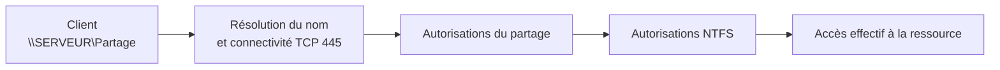

# Module 08 — Le partage de ressources

**Séquence :** Systèmes clients Microsoft  
**Importance :** socle de la progression officielle  
**Sources consolidées :** 1 support(s) de cours, 1 énoncé(s), 1 correction(s)

!!! warning "Périmètre et versions"
    Le support enseigne Windows 10. Windows 10 a atteint sa fin de support général le 14 octobre 2025 ; les manipulations restent utiles pour le laboratoire et les environnements hérités, mais un déploiement neuf doit viser une édition Windows encore prise en charge. Référence : [Cycle de vie Windows 10](https://learn.microsoft.com/en-us/lifecycle/products/windows-10-home-and-pro).

## Objectifs et compétences

- Créer un partage SMB et combiner permissions de partage et NTFS.
- Gérer les sessions et fichiers ouverts.
- Monter un partage et tester l’accès avec différents comptes.
- Configurer et sécuriser le Bureau à distance.

!!! tip "Façon simple de le comprendre"
    Ce module sert à passer de la notion « Le partage de ressources » à une méthode que l’on peut expliquer, appliquer, vérifier et dépanner.

## Méthode de travail

1. Lire les concepts dans l’ordre du support.
2. Reproduire les exemples dans un environnement de laboratoire.
3. Noter le résultat attendu avant de modifier une configuration.
4. Vérifier avec l’outil ou la commande appropriée.
5. Revenir à l’état initial si le résultat diverge.

## Accès à un partage SMB



<p class="tssr-caption">Lors d’un accès réseau, les autorisations de partage et NTFS se cumulent ; le résultat le plus restrictif s’applique. Tester avec le compte réellement concerné.</p>

## Commandes repérées dans les supports

```text
New-SmbMapping -LocalPath 'R:' -RemotePath '\\SRV-FIC\Compta'
Get-SMBShare
Get-FileShare mais peut-être un peu moins parlant comme cmdlet.
Get-SMBShare ADMIN$
Get-SMBShareAccess N$
```

!!! warning
    Une commande extraite d’un support n’est pas à exécuter aveuglément. Vérifier la version, les droits, la cible et l’existence d’une sauvegarde avant toute action destructive.

## Module 08 - Support de cours

### Systèmes clients Microsoft

#### Module 08 — Le partage de ressources

#### Objectifs • Utiliser le réseau pour accéder aux informations

#### de l’entreprise

- Accéder aux documents via des partages
- Accéder aux ordinateurs grâce au bureau à

#### distance

### Partages

#### Les principes du partage

- Permet d'accéder à une ressource
- hébergée par un serveur
- depuis un client
- à travers le réseau

#### RÉSEAU

#### Partages

- Les ressources ?
- Des fichiers (via le partage de dossier, d'arborescence entière ou de volume)
- Des imprimantes
- Les serveurs ?
- Tout type de système connecté au réseau de l'entreprise peut potentiellement partager ses

#### ressources

- Serveur, poste client fixe ou portable, copieur, tablette, Smartphone…
- Les clients ?
- Tout type de système connecté au réseau peut accéder aux ressources partagées de l'entreprise
- Serveur, poste client fixe ou portable, copieur, tablette, Smartphone…
- Qui peut partager ?
- Des droits administratifs sont requis ! Partager, c'est modifier le système !
- Qui a accès au partage ?
- Une authentification est requise (compte local, du domaine)
- 3 niveaux d'accès sont définis sur la ressource partagée
- Lecture, Modifier, Contrôle total
- 2 vérifications d'identités sont effectuées
- 1 — Au niveau du partage
- 2 — Puis au niveau des droits NTFS
- Les autorisations du partage sont restrictives

#### RÉSEAU

#### Partage de fichiers

#### Comment accéder aux fichiers partagés depuis

#### Windows 10 ?

- De façon momentanée, depuis l'explorateur avec le

#### chemin UNC \\serveur\partage

- Durablement, avec la fonctionnalité Connecter un

#### lecteur réseau

- Les lecteurs mappés sont mémorisés avec le profil utilisateur
- En ligne de commande avec net use
- Exemple net use z: \\serveur\partage
- La commande net view liste les partages
- En PowerShell avec la cmdlet New-SmbMapping
- Exemple

`New-SmbMapping -LocalPath 'R:' -RemotePath '\\SRV-FIC\Compta'`

### Partage de fichiers

#### Comment partager des fichiers ?

- Depuis l'explorateur Windows
- Ouverture du partage sur le conteneur
- Partage de base : partage simplifié

#### orienté utilisateur (à éviter)

- Partage avancé : onglet Partage depuis

#### les propriétés du conteneur

- Par défaut, l'entité Tout le monde est en

#### Lecture

- Bonne pratique : préférez l'entité de

#### sécurité Utilisateurs Authentifiés

#### Partage de fichiers

- Depuis le composant MMC Dossiers partagés (fsmgmt.msc)
- Visualisation des partages actifs
- Assistant de création de partages
- Vues Sessions et Fichiers ouverts
- Affichage des partages administratifs

#### générés par le système

- Depuis l'invite de commande
- net share pour lister et configurer les partages
- Exemple : net share commun=d:\Note_de_service /grant:"utilisateurs authentifiés",FULL
- En PowerShell avec la cmdlet New-SmbShare
- New-SmbShare -Name "VMSFiles" -Path "C:\ClusterStorage\Volume1\VMFiles" -FullAccess "Authenticated

#### Users"

### Démonstration

#### Session à distance

- Accès distant au poste
- Possible grâce à la fonctionnalité Bureau à distance
- Authentification avec un compte valide (local ou de domaine)
- Nécessite des privilèges spécifiques
- Même niveau de fonctionnement qu'une session locale
- Utilisation courante
- Maintenir des postes (1 seule session locale ou distante)
- Accéder à distance aux serveurs (2 sessions simultanées depuis Windows 2008)
- Accéder à son environnement de travail depuis l'extérieur (VPN)
- Les limites
- Mode maintenance sur un poste client (pas d'interaction possible avec l'utilisateur)
- Sur les serveurs, 2 sessions avec des comptes différents
- Blocage (à distance) si les sessions restent ouvertes

### Session à distance

- Comment se connecter à distance sur un poste Windows 10 ?
- Nativement, avec l'outil Connexion Bureau à distance
- Ensemble d'onglets pour personnaliser la connexion
- Sauvegarder les paramètres
- Mappez vos ressources locales sur le poste distant !
- En ligne de commande avec mstsc
- Exemple : mstsc /v:serveur

#### Session à distance

#### Configuration du poste cible ?

- Rubrique Système du panneau de configuration
- Menu Paramètres système avancés
- Onglet Utilisation à distance
- Nativement désactivé
- 2 niveaux d'authentification
- Authentification standard
- Authentification NLA
- Par défaut, accès autorisé aux administrateurs

#### Fonctionnement

- Protocole RDP (port 3389)
- Configuration automatique du pare-feu
- Attention aux emplacements réseau

### Démonstration

#### TP

### Conclusion

- Les réseaux sont les fondations des systèmes

d’informations des entreprises.

- Les systèmes d’exploitation tirent profit du réseau

#### pour organiser et sécuriser l’accès aux

#### informations

## Mise en pratique

- [Travaux pratiques du module](../../tp/systemes-clients/module-08/index.md)
- [Fiche de révision du module](../../revision/systemes-clients/module-08-le-partage-de-ressources.md)

## Questions flash

1. Comment expliquer simplement « Le partage de ressources » à un collègue ?
2. Quelles étapes ou notions doivent être maîtrisées avant la manipulation ?
3. Quel contrôle permet de prouver que le résultat est correct ?
4. Quel est le premier risque ou piège à écarter ?

??? success "Éléments de réponse"
    - Créer un partage SMB et combiner permissions de partage et NTFS.
    - Gérer les sessions et fichiers ouverts.
    - Monter un partage et tester l’accès avec différents comptes.
    - Configurer et sécuriser le Bureau à distance.

## Voir aussi

- [Présentation de la séquence](index.md)
