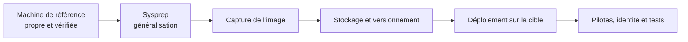

# Module 12 — Introduction à la capture et au déploiement d’image

**Séquence :** Systèmes clients Microsoft  
**Importance :** socle de la progression officielle  
**Sources consolidées :** 1 support(s) de cours, 1 énoncé(s), 1 correction(s)

!!! warning "Périmètre et versions"
    Le support enseigne Windows 10. Windows 10 a atteint sa fin de support général le 14 octobre 2025 ; les manipulations restent utiles pour le laboratoire et les environnements hérités, mais un déploiement neuf doit viser une édition Windows encore prise en charge. Référence : [Cycle de vie Windows 10](https://learn.microsoft.com/en-us/lifecycle/products/windows-10-home-and-pro).

## Objectifs et compétences

- Préparer un poste de référence.
- Généraliser le système avec Sysprep.
- Capturer et appliquer une image WIM.
- Distinguer déploiement manuel avec DISM et déploiement réseau PXE/WDS.

!!! tip "Façon simple de le comprendre"
    Ce module sert à passer de la notion « Introduction à la capture et au déploiement d’image » à une méthode que l’on peut expliquer, appliquer, vérifier et dépanner.

## Méthode de travail

1. Lire les concepts dans l’ordre du support.
2. Reproduire les exemples dans un environnement de laboratoire.
3. Noter le résultat attendu avant de modifier une configuration.
4. Vérifier avec l’outil ou la commande appropriée.
5. Revenir à l’état initial si le résultat diverge.

## De la machine de référence au poste déployé



<p class="tssr-caption">Généraliser avant la capture évite de cloner les informations propres au poste de référence. Après déploiement, contrôler identité, pilotes, activation, réseau et applications.</p>

## Commandes repérées dans les supports

```text
Sysprep
dism (présent dans WinPE et dans Windows)
remove-or-update-store-apps
```

!!! warning
    Une commande extraite d’un support n’est pas à exécuter aveuglément. Vérifier la version, les droits, la cible et l’existence d’une sauvegarde avant toute action destructive.

## 12 - Introduction à la capture et au déploiement d_image

### Systèmes clients Microsoft

#### Module 12 — Introduction à la capture et au déploiement

#### d’image

### Objectifs • S’ouvrir à l’industrialisation de l’installation de

#### Windows

- Créer un système modèle

- Déployer des « clones »

- Recherche de productivité dans le service informatique

- Tendre vers un parc informatique homogène pour réduire les configurations

- Tendre vers un ensemble de systèmes d'exploitation homogènes pour réduire le maintien

- Posséder des systèmes d'exploitation "clé en main" pour :

- Les nouveaux collaborateurs

- Les collaborateurs avec un poste défaillant

- Solution : posséder des images de référence

#### Problématique

### Préparation du master

- Installation du poste de référence

- Configuration initiale de son système d'exploitation

- Installation d'applications validées par la DSI

- Préparation pour le clonage avec l'outil sysprep

### Pour rendre les postes uniques dans l'entreprise

- Les paramètres personnalisés du Master sont remis à zéro

- Une version par génération de systèmes

- Outils graphiques et en ligne de commande

`Sysprep`

### interaction utilisateur au redémarrage

- Paramètres nécessaires

- OOBE (Out-of-Box Experience) :

- Généraliser

- Arrêter le système

- En ligne de commande

- C:\Windows\System32\sysprep\sysprep.exe /oobe

#### /generalize /shutdown

- En complément

- Audit : Pré-paramétrages spécifiques au poste avant

#### OOBE

- Journaux consultables après redémarrage dans les

#### répertoires Panther

#### (dans C:\Windows\System32\Sysprep, fichiers TXT et EVT)

`Sysprep`

- Incompatible avec toutes les configurations (certains rôles serveur, jonction, etc.)

- Incompatible avec des Apps installées depuis le Microsoft Store

- Pilotes installés manuellement

- Supprimés par défaut par sysprep

- Non supprimés avec le paramètre /PersistAllDeviceInstalls en ligne de commande

- Les comptes utilisateurs ne sont pas supprimés par sysprep

- Activez et utilisez le compte administrateur pour un paramétrage plus précis

#### (il sera réinitialisé par sysprep)

`Sysprep`

### Démonstration

#### Une fois le système de référence éteint :

- Ne pas le redémarrer avant d'avoir capturé l'image du système !

- Récupérer l'image système grâce au serveur de déploiement

- Méthode automatisée

- Amorçage PXE

- Images d’amorçage à disposition sur le serveur de déploiement

- Déploiement possible grâce au serveur

- Récupérer l'image système grâce à dism

- Méthode manuelle

- Nécessite un support WinPE amorçable (DVD, clé USB, etc.)

- Léger, contient des outils spécifiques pour la capture et le déploiement

- Commande puissante

#### Exploitation du master

### (Conseiller de mise à niveau, Application Compatibility Toolkit, etc.)

- Mise à jour des images

- Possible en mode « déconnecté » (offline) avec le format WIM et l’outil en ligne de commande

`dism (présent dans WinPE et dans Windows)`

- Le poste cible est-il prêt ?

- Des outils Microsoft permettent d’évaluer la compatibilité du matériel et des logiciels cibles

- WinPE comprend des outils de préparation (diskpart, mount, drvload, net use, Powershel, etc.)

#### Exploitation du master

- Automatisé grâce au serveur de déploiement

- Déploiement en masse

- Démarrer les postes sur le réseau (Boot PXE)

- Les clients requêtent puis se connectent au serveur de déploiement (ici WDS)

- Choix de l’image à déployer

- Manuel grâce à dism

- Déploiement au cas par cas

- Démarrer les postes sur le support amorçable WinPE

- Partitionnement du stockage d'accueil

#### Déploiement

### Démonstration

#### TP

### Conclusion

- Déployer un système est courant aujourd’hui en

#### entreprise

- Les systèmes de déploiement via un serveur se

#### démocratisent

## Mise en pratique

- [Travaux pratiques du module](../../tp/systemes-clients/module-12/index.md)
- [Fiche de révision du module](../../revision/systemes-clients/module-12-introduction-a-la-capture-et-au-deploiement-d-image.md)

## Questions flash

1. Comment expliquer simplement « Introduction à la capture et au déploiement d’image » à un collègue ?
2. Quelles étapes ou notions doivent être maîtrisées avant la manipulation ?
3. Quel contrôle permet de prouver que le résultat est correct ?
4. Quel est le premier risque ou piège à écarter ?

??? success "Éléments de réponse"
    - Préparer un poste de référence.
    - Généraliser le système avec Sysprep.
    - Capturer et appliquer une image WIM.
    - Distinguer déploiement manuel avec DISM et déploiement réseau PXE/WDS.

## Voir aussi

- [Présentation de la séquence](index.md)
