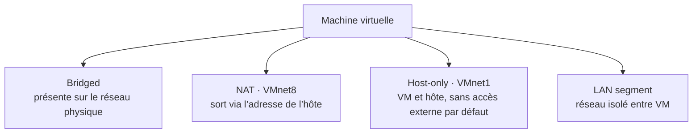

# Module additionnel — Workstation

**Séquence :** Systèmes clients Microsoft  
**Importance :** socle de la progression officielle  
**Sources consolidées :** 1 support(s) de cours, 0 énoncé(s), 0 correction(s)

!!! warning "Périmètre et versions"
    Le support enseigne Windows 10. Windows 10 a atteint sa fin de support général le 14 octobre 2025 ; les manipulations restent utiles pour le laboratoire et les environnements hérités, mais un déploiement neuf doit viser une édition Windows encore prise en charge. Référence : [Cycle de vie Windows 10](https://learn.microsoft.com/en-us/lifecycle/products/windows-10-home-and-pro).

## Objectifs et compétences

- Comprendre les principes de la virtualisation de postes.
- Dimensionner processeur, mémoire, disque et réseau d’une VM.
- Utiliser instantanés, clonage, import et export.
- Distinguer les modes de réseau virtuel.

!!! tip "Façon simple de le comprendre"
    Ce module sert à passer de la notion « Workstation » à une méthode que l’on peut expliquer, appliquer, vérifier et dépanner.

## Méthode de travail

1. Lire les concepts dans l’ordre du support.
2. Reproduire les exemples dans un environnement de laboratoire.
3. Noter le résultat attendu avant de modifier une configuration.
4. Vérifier avec l’outil ou la commande appropriée.
5. Revenir à l’état initial si le résultat diverge.

## Choisir le réseau virtuel adapté

Le mode dépend du besoin d’isolation et de connectivité. Vérifier ensuite que l’adresse IP appartient au réseau virtuel choisi.

## Module additionnel - Support de cours

### Systèmes clients Microsoft

#### Module additionnel — Workstation

#### Objectifs • Découvrir

- La virtualisation des systèmes
- Workstation et les ressources
- Workstation et le réseau
- Les spécificités de Workstation
- L’import et l’export de machines virtuelles

### Virtualisation des systèmes

- Faire cohabiter plusieurs systèmes invités, isolés et indépendants, grâce aux

#### ressources d'un ordinateur physique, appelé hôte

- Hôte
- Ordinateur physique (serveur ou PC client)
- Possède les ressources
- Système invité
- Ordinateur virtuel (ou VM pour Virtual Machine)
- Possède son propre OS
- Utilise les ressources de l'hôte
- Défini par un ensemble de fichiers
- Géré par l'hyperviseur
- Contenu dans un répertoire d'accueil

#### Virtualisation des systèmes

#### L'hyperviseur

- Élément indispensable de la virtualisation
- Lien entre l'hôte et les VM
- Sous la forme d'un logiciel ou d'un OS
- Propose des ressources disponibles de l'hôte
- Gère, partage et priorise les accès aux ressources de l'hôte lorsque les

#### VM en ont besoin

- Les 4 éléments indispensables au bon fonctionnement d'un ordinateur

#### physique

- Le processeur
- La mémoire vive
- Le disque dur
- La carte réseau
- Une VM possède les mêmes besoins pour fonctionner
- Autres besoins
- Lecteur DVD / Stockage externe
- Carte graphique, carte son
- Firmware

#### Virtualisation des systèmes

#### HYPERVISEUR

### Le processeur

#### Attribution des ressources CPU

#### La mémoire vive

- Attribuée à la VM au démarrage
- Configurable

### Le disque dur

- Est un fichier !
- De taille dynamique
- Taille maximale configurable

#### La carte réseau

- La VM peut communiquer avec :
- des VM de son réseau
- des VM de réseaux différents
- l'hôte
- d'autres machines physiques
- le monde entier
- Pour cela, elle doit être connectée à un switch

### La carte réseau

#### Les switchs sont virtuels :

- Host-Only
- VMnet et Lan Segment
- Bridge
- NAT (Translation d'adresse)

#### VM

#### Hôte

#### VMware NetWork

#### Adapter VMnet1

#### Host-Only

#### La carte réseau

#### Les switchs sont virtuels :

- Host-Only
- VMnet et Lan Segment
- Bridge
- NAT (Translation d'adresse)

#### VM

#### Hôte

#### VMware NetWork

#### Adapter VMnetX

#### VMnetX

#### Les switchs sont virtuels :

- Host-Only
- VMnet et Lan Segment
- Bridge
- NAT (Translation d'adresse)

#### VM

#### Lan Segment

#### La carte réseau

#### Les switchs sont virtuels :

- Host-Only
- Vmnet et Lan Segment
- Bridge
- NAT (Translation d'adresse)

#### Usine

#### Administratif

#### Imprimantes

#### Serveurs

#### Routeur

#### virtuel

#### Les switchs sont virtuels :

- Host-Only
- VMnet et Lan Segment
- Bridge
- NAT (Translation d'adresse)

#### VM

#### Bridge

#### Internet

#### La carte réseau

#### Les switchs sont virtuels :

- Host-Only
- VMnet et Lan Segment
- Bridge
- NAT (Translation d'adresse)

#### VM

#### Hôte

#### VMware

#### NetWork

#### Adapter

#### VMnet8

#### NAT Internet

#### Ethernet

### Les avantages

- IHM épurée, simple d'utilisation
- Pause, Snapshots, clonage
- Partages de dossier entre l'hôte et la machine virtuelle
- Glisser/Déposer et autres avantages grâce aux VMware Tools

#### Les inconvénients

- Prévu pour des maquettes simples
- Logiciel propriétaire VMware
- Temps d'adaptation aux différentes notions
- Virtualisation des OS, du stockage, des réseaux…

#### Quelques trucs à connaître

- Possibilité de paramétrer la séquence de démarrage dans le BIOS de la VM
- Les médias amovibles de type CD/DVD, USB, disquette sont gérés
- Par défaut la VM « capture » le clavier et la souris

####  Tapez la combinaison Ctrl + Alt pour reprendre la main

- Pour faire Ctrl + Alt + Suppr dans la VM, taper Ctrl + Alt + Inser

#### ou cliquer sur

### Démonstration

#### Import/export de VM

- Importer = Possibilité d'utiliser des VM existantes
- Ouvrir (ou Open) une VM depuis son dossier d'accueil
- Importer une VM depuis son archive .ovf ou .ova
- Exporter = Sauvegarder votre VM dans son état actuel
- Pour la réutiliser plus tard
- En copiant son dossier d'accueil
- En l'exportant dans une archive .ovf ou .ova
- Permet de maquetter des environnements pour

#### apprendre ou pour tester avant de mettre en

#### production

- Virtualise la puissance de calcul, le stockage et

#### l’accès au réseau

- C’est l’outil majeur de votre formation
- Vous en découvrirez davantage avec l’expérience

## Mise en pratique

- Aucun énoncé de TP distinct n’est fourni pour ce module.
- [Fiche de révision du module](../../revision/systemes-clients/module-additionnel-workstation.md)

## Questions flash

1. Comment expliquer simplement « Workstation » à un collègue ?
2. Quelles étapes ou notions doivent être maîtrisées avant la manipulation ?
3. Quel contrôle permet de prouver que le résultat est correct ?
4. Quel est le premier risque ou piège à écarter ?

??? success "Éléments de réponse"
    - Comprendre les principes de la virtualisation de postes.
    - Dimensionner processeur, mémoire, disque et réseau d’une VM.
    - Utiliser instantanés, clonage, import et export.
    - Distinguer les modes de réseau virtuel.

## Voir aussi

- [Présentation de la séquence](index.md)
