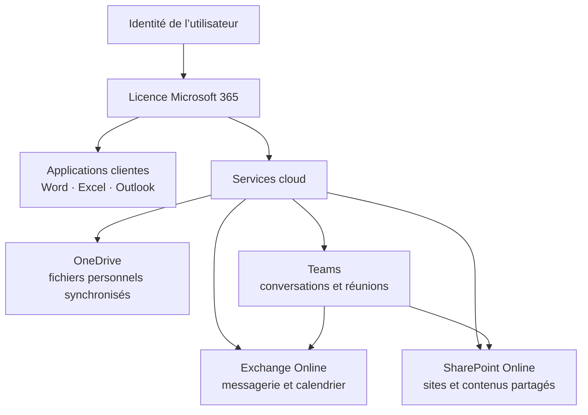

# Module 01 — Découverte de Microsoft 365

**Séquence :** Microsoft 365 — Outils collaboratifs  
**Importance :** socle de la progression officielle  
**Sources consolidées :** 1 support(s) de cours, 0 énoncé(s), 0 correction(s)

!!! warning "Périmètre et versions"
    Les interfaces et les licences Microsoft 365 évoluent régulièrement. « Office 365 ProPlus » est l’ancien nom de « Microsoft 365 Apps for enterprise » ; les chemins d’écran sont à rapprocher de la version disponible dans le tenant utilisé. Référence : [Cycle de vie Microsoft 365 Apps](https://learn.microsoft.com/en-us/lifecycle/products/microsoft-365-apps).

## Objectifs et compétences

- Comprendre le modèle SaaS et les enjeux du cloud.
- Identifier les principaux services Microsoft 365.
- Distinguer plans, licences et applications clientes.
- Reconnaître les prérequis d’une plateforme collaborative.

!!! tip "Façon simple de le comprendre"
    Ce module sert à passer de la notion « Découverte de Microsoft 365 » à une méthode que l’on peut expliquer, appliquer, vérifier et dépanner.

## Méthode de travail

1. Lire les concepts dans l’ordre du support.
2. Reproduire les exemples dans un environnement de laboratoire.
3. Noter le résultat attendu avant de modifier une configuration.
4. Vérifier avec l’outil ou la commande appropriée.
5. Revenir à l’état initial si le résultat diverge.

## Vue d’ensemble de la plateforme

La licence ouvre un ensemble cohérent de services : Teams s’appuie notamment sur SharePoint pour les fichiers d’équipe et sur Exchange pour certaines fonctions de calendrier et de messagerie.

## Module 01 - Support de cours

### Outils collaboratifs

- Comprendre les enjeux d’une plateforme Cloud

- Appréhender la gestion des licences dans Microsoft 365

- Découvrir les applications Office 365 disponibles

- Connaître les prérequis pour créer une plateforme

### L’environnement

#### Microsoft 365

#### L’environnement Microsoft 365

#### Qu’est-ce qu’une offre SaaS ?

#### Le Software as a Service ou logiciel en

#### tant que service, est un modèle

#### d'exploitation commerciale des logiciels dans

#### lequel ceux-ci sont installés sur des serveurs

#### distants plutôt que sur la machine de

#### l'utilisateur. Les clients ne paient pas de

#### licence d'utilisation pour une version, mais

#### utilisent librement le service en ligne ou, plus

généralement, payent un abonnement.

#### (Wikipédia)

#### Software as a Service

#### SaaS

### L’environnement Microsoft 365

#### Microsoft 365 et ses concurrents

#### L’environnement Microsoft 365

- Offres Cloud

- Multiples applications (Exchange,

#### SharePoint, Office, etc.)

- Multiplateformes

- S’adresse aux particuliers et aux

#### entreprises

- Moins de serveurs sur site

#### Qu’est-ce que Microsoft 365 ?

#### 75 M

#### d’utilisateurs

#### actifs par jour

#### fin mai 2020

#### Datacenters

#### en France

#### Les éléments de base de Microsoft 365

#### Exchange Online

#### Office 365 ProPlus

#### Microsoft Teams

#### SharePoint Online

#### Azure AD

#### OneDrive

#### L’environnement Microsoft 365

#### Plans et licences

#### Particuliers

#### Microsoft Office 365

#### PME

#### Education

#### Association

#### Gouvernement

#### Famille

#### Personnel

#### Famille et étudiant

#### Business

#### Standard

#### Business Basic

#### Business

#### Premium

#### A1

#### A3

#### A5

#### Business Basic

#### Pour les associations

#### Business Standard

#### Pour les associations

#### E1

#### Pour les associations

#### E3

#### Pour les associations

#### E5

#### Pour les associations

#### E1

#### Secteur public

#### E3

#### Secteur public

#### E5

#### Secteur public

#### Employés de terrain

#### F3

#### Entreprise

#### Entreprise E3

#### Entreprise E5

#### Apps for

#### Business

#### Apps for

#### Entreprise

#### Les services principaux

#### L’environnement Microsoft 365

#### Les services principaux

#### Yammer

#### (réseau social

#### d’entreprise)

#### OneNote

#### Dynamics 365

#### (liaison avec les

#### applications

#### métiers)

#### Delve

#### (les principales

#### activités de votre

#### entreprise)

#### Stream

#### (partage de vidéo)

#### …

#### Office 365 ProPlus

#### Office 365

#### Professional Plus

#### Office 365 Online

#### L’environnement Microsoft 365

#### SharePoint Online

#### Application

#### Mobile

#### Communauté

#### Réseau

#### social

#### Partage

#### Echanger des idées

#### et réinventer la

#### collaboration

#### OneDrive

#### Boîte aux

#### lettres de

#### site

#### Organisation

#### Gestion de l’information, des

#### utilisateurs et des projets

#### PowerPivot

#### et

#### PowerView

#### Règle

#### d’affichage

#### de

#### recherche

#### Gestion

#### Réduction des

#### coûts, des risques et

#### du temps pour

#### votre infrastructureRègle de

#### recherche

#### Application Design

#### Manager

#### Construire

#### Créer vos applications

#### et vos outils

#### SharePoint

#### Store

#### SharePoint

#### Online

### T enant Microsoft 365

#### Définition

#### Famille et plan

#### Microsoft Office 365 est

#### disponible en famille

(particulier, association,

#### entreprise…) de plans

#### (Business, E3 secteur

public, E5 entreprise).

#### C’est l’ensemble des

#### services de VOTRE

#### abonnement dans

#### Microsoft 365 associé à

#### VOTRE domaine pour

VOTRE entreprise.

#### Tenant

#### C’est l’utilisateur qui a

#### souscrit à l’abonnement

#### Microsoft 365 et qui a les

#### plus hauts privilèges sur

tout votre Tenant.

#### Administrateur global

#### Créer un Tenant Microsoft 365

#### Sélectionnez

#### un plan

#### Fournissez une

#### adresse mail

#### valide

#### Entrez les

#### données de

#### votre entreprise

#### Choisissez le

#### nom de votre

#### Tenant

#### Validez

#### Exemple : famille, A1, E5, F3 Exemple : prénom.nomannée@campus-eni.fr

#### Exemple : nom et

#### nombre de salariés

#### Exemple : admin@monentreprise.onmicrosoft.comTerminez l’inscription

#### T enant Microsoft 365

- Nom de Tenant type :

- nomdeladministrateurglobal@dom.onmicrosoft.com

- Possibilité d’envoyer ou de recevoir des courriels pour ce domaine

- Le Tenant n'est pas modifiable

- Afin d’avoir une adresse mail en @votreentreprise.fr :

- Location d’un domaine internet puis création d’un domaine personnalisé

#### dans Microsoft 365

#### Votre Tenant

#### Louer un domaine internet

#### T enant Microsoft 365

#### Louer un domaine internet

## Mise en pratique

- Aucun énoncé de TP distinct n’est fourni pour ce module.
- [Fiche de révision du module](../../revision/microsoft-365/module-01-decouverte-de-microsoft-365.md)

## Questions flash

1. Comment expliquer simplement « Découverte de Microsoft 365 » à un collègue ?
2. Quelles étapes ou notions doivent être maîtrisées avant la manipulation ?
3. Quel contrôle permet de prouver que le résultat est correct ?
4. Quel est le premier risque ou piège à écarter ?

??? success "Éléments de réponse"
    - Comprendre le modèle SaaS et les enjeux du cloud.
    - Identifier les principaux services Microsoft 365.
    - Distinguer plans, licences et applications clientes.
    - Reconnaître les prérequis d’une plateforme collaborative.

## Voir aussi

- [Présentation de la séquence](index.md)
