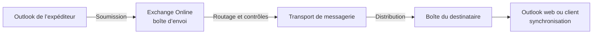
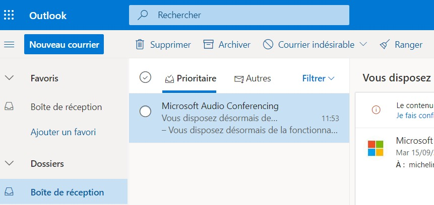

# Module 04 — Exploiter Outlook et savoir le dépanner

**Séquence :** Microsoft 365 — Outils collaboratifs  
**Importance :** socle de la progression officielle  
**Sources consolidées :** 1 support(s) de cours, 2 énoncé(s), 2 correction(s)

!!! warning "Périmètre et versions"
    Les interfaces et les licences Microsoft 365 évoluent régulièrement. « Office 365 ProPlus » est l’ancien nom de « Microsoft 365 Apps for enterprise » ; les chemins d’écran sont à rapprocher de la version disponible dans le tenant utilisé. Référence : [Cycle de vie Microsoft 365 Apps](https://learn.microsoft.com/en-us/lifecycle/products/microsoft-365-apps).

## Objectifs et compétences

- Comprendre le cheminement d’un message.
- Configurer un client de messagerie.
- Gérer dossiers, règles et carnet d’adresses.
- Diagnostiquer profil, authentification, connectivité et boîte aux lettres.

!!! tip "Façon simple de le comprendre"
    Ce module sert à passer de la notion « Exploiter Outlook et savoir le dépanner » à une méthode que l’on peut expliquer, appliquer, vérifier et dépanner.

## Méthode de travail

1. Lire les concepts dans l’ordre du support.
2. Reproduire les exemples dans un environnement de laboratoire.
3. Noter le résultat attendu avant de modifier une configuration.
4. Vérifier avec l’outil ou la commande appropriée.
5. Revenir à l’état initial si le résultat diverge.

## Cheminement d’un message

Pour dépanner, localiser d’abord la rupture : profil du client, authentification, connectivité, transport ou état de la boîte aux lettres.

<figure class="tssr-source-figure">
  
  <figcaption>Interface Outlook sur le web : navigation des dossiers, liste de messages et volet de lecture. Source : support de cours Microsoft 365, module 04, page 26.</figcaption>
</figure>

## Module 04 - Support de cours

### Outils collaboratifs

- Comprendre le cheminement d’un email
- Connaître l’utilisation des outils de communication asynchrone
- Paramétrer un logiciel de messagerie

### Cheminement d’un

#### courrier

#### Cheminement d’un courrier

- Jean-Pierre de Nantes écrit une lettre à Micheline de Rennes
- Jean-Pierre écrit sa lettre

#### Les étapes de cheminement d’un courrier

#### Nantes Rennes

#### Jean-Pierre

#### Micheline

#### Facteur de

#### Jean-Pierre

#### Facteur de

#### Micheline

#### Centre de tri

#### Bureau de

#### poste local

#### Centre de tri

#### Bureau de

#### poste local

### Cheminement d’un courrier

- Jean-Pierre de Nantes écrit une lettre à Micheline de Rennes
- Le facteur vient chercher sa lettre

#### Les étapes de cheminement d’un courrier

#### Nantes Rennes

#### Jean-Pierre

#### Micheline

#### Facteur de

#### Jean-Pierre

#### Facteur de

#### Micheline

#### Centre de tri

#### Bureau de

#### poste local

#### Centre de tri

#### Bureau de

#### poste local

#### Cheminement d’un courrier

- Jean-Pierre de Nantes écrit une lettre à Micheline de Rennes
- Le facteur donne la lettre au bureau de poste local de Jean-Pierre

#### Les étapes de cheminement d’un courrier

#### Nantes Rennes

#### Jean-Pierre

#### Micheline

#### Facteur de

#### Jean-Pierre

#### Facteur de

#### Micheline

#### Centre de tri

#### Bureau de

#### poste local

#### Centre de tri

#### Bureau de

#### poste local

- Jean-Pierre de Nantes écrit une lettre à Micheline de Rennes
- Le bureau de poste envoie la lettre au centre de tri de Nantes

#### Les étapes de cheminement d’un courrier

#### Nantes Rennes

#### Jean-Pierre

#### Micheline

#### Facteur de

#### Jean-Pierre

#### Facteur de

#### Micheline

#### Centre de tri

#### Bureau de

#### poste local

#### Centre de tri

#### Bureau de

#### poste local

#### Cheminement d’un courrier

- Jean-Pierre de Nantes écrit une lettre à Micheline de Rennes
- Le centre de tri de Nantes l’envoie au centre de tri de Rennes

#### Les étapes de cheminement d’un courrier

#### Nantes Rennes

#### Jean-Pierre

#### Micheline

#### Facteur de

#### Jean-Pierre

#### Facteur de

#### Micheline

#### Centre de tri

#### Bureau de

#### poste local

#### Centre de tri

#### Bureau de

#### poste local

- Jean-Pierre de Nantes écrit une lettre à Micheline de Rennes
- Le centre de tri de Rennes l’envoie au bureau de poste local de Micheline

#### Les étapes de cheminement d’un courrier

#### Nantes Rennes

#### Jean-Pierre

#### Micheline

#### Facteur de

#### Jean-Pierre

#### Facteur de

#### Micheline

#### Centre de tri

#### Bureau de

#### poste local

#### Centre de tri

#### Bureau de

#### poste local

#### Cheminement d’un courrier

- Jean-Pierre de Nantes écrit une lettre à Micheline de Rennes
- Le facteur de Micheline donne la lettre à Micheline

#### Les étapes de cheminement d’un courrier

#### Nantes Rennes

#### Jean-Pierre

#### Micheline

#### Facteur de

#### Jean-Pierre

#### Facteur de

#### Micheline

#### Centre de tri

#### Bureau de

#### poste local

#### Centre de tri

#### Bureau de

#### poste local

- Jean-Pierre de Nantes écrit une lettre à Micheline de Rennes
- Micheline prend le courrier dans sa boîte aux lettres puis lit la lettre de

#### Jean-Pierre

#### Les étapes de cheminement d’un courrier

#### Nantes Rennes

#### Jean-Pierre

#### Micheline

#### Facteur de

#### Jean-Pierre

#### Facteur de

#### Micheline

#### Centre de tri

#### Bureau de

#### poste local

#### Centre de tri

#### Bureau de

#### poste local

### Cheminement d’un mail

- Jean-Pierre de Nantes écrit un courriel à Micheline de Rennes
- Jean-Pierre écrit un email sur son logiciel (Outlook, Thunderbird, etc.)

#### Les étapes de cheminement d’un mail

#### Internet

Bonjour Micheline,

#### réunion mercredi

#### de 15h à 16h Serveur de

#### messagerie de

#### Jean-Pierre

#### Serveur de

#### messagerie de

#### Micheline

#### SMTP SMTP

#### Cheminement d’un mail

- Jean-Pierre de Nantes écrit un courriel à Micheline de Rennes
- Le serveur de messagerie de Jean-Pierre vient chercher l’email dans la boîte

d’envoi du logiciel (protocole soumission SMTP) et fait une copie dans les

#### éléments envoyés

#### Les étapes de cheminement d’un mail

#### Internet

Bonjour Micheline,

#### réunion mercredi

#### de 15h à 16h Serveur de

#### messagerie de

#### Jean-Pierre

#### SMTP

#### Serveur de

#### messagerie

#### de Micheline

#### SMTP

#### Soumission SMTP

- Jean-Pierre de Nantes écrit un courriel à Micheline de Rennes
- Le serveur de messagerie de Jean-Pierre envoie le mail au serveur de

#### messagerie de Micheline (protocole SMTP)

#### Les étapes de cheminement d’un mail

#### Internet

#### Serveur de

#### messagerie de

#### Jean-Pierre

#### SMTP

#### Serveur de

#### messagerie de

#### Micheline

#### SMTP

#### Cheminement d’un mail

- Jean-Pierre de Nantes écrit un courriel à Micheline de Rennes
- Le client de messagerie de Micheline peut télécharger ses mails dans sa

#### boîte de réception depuis son serveur de messagerie (protocole IMAP ou

#### POP ou ActiveSync ou HTTPS ou MAPI, etc.)

#### Les étapes de cheminement d’un mail

#### Internet

#### Serveur de

#### messagerie de

#### Jean-Pierre

#### SMTP

#### Serveur de

#### messagerie de

#### Micheline

#### SMTP

Bonjour Micheline,

#### réunion mercredi

de 15h à 16hPOP , IMAP , HTTPS,

#### ActiveSync

### Prérequis pour

#### l’exploitation réseau

#### Prérequis pour l’exploitation réseau

- Tous les ports nécessaires doivent être ouverts sur le pare-feu

#### Ports et protocoles

#### Protocole Port non sécurisé Port TLS/SSL

#### HTTP Hypertext Transfer Protocol 80 443

#### POP3 Post Office Protocol 110 995

#### IMAP4 Interactive Message Access

#### Protocol

#### SMTP Simple Mail Transfer Protocol 25

#### Soumission client SMTP 2525 587 ou 2525

#### (465 déprécié)

### Installation

- Se connecter à https://portal.office.com

#### Installer Outlook depuis Microsoft 365

#### Valider votre adresse de récupération

#### micheline@campus-eni.fr

- Paramétrer son compte

#### Installer Outlook depuis Microsoft 365

### Autodiscover

- C’est l’autoconfiguration de votre Outlook avec un serveur de

messagerie en renseignant votre adresse mail.

- Découverte automatique à partir d’Outlook 2007 et le client Skype

for business.

#### Définition

#### Autodiscover

- L'utilisateur entre son adresse mail à l'ouverture d'Outlook
- Outlook cherche puis se connecte au serveur de messagerie de l’utilisateur
- Le client envoie son adresse SMTP pour avoir les options de configuration

#### de cette adresse

- Un fichier .xml est téléchargé par le client avec les paramètres du serveur
- Outlook se connecte au serveur Exchange Online dans Microsoft 365 et

#### peut recevoir ses mails

#### Processus de la découverte automatique

#### Internet

#### web.xml

#### Serveur de messagerie

#### de Micheline

#### SMTP

#### POP , IMAP , HTTPS, MAPI

#### Micheline@campus-eni.fr

- CTRL + clic droit sur l’icône Outlook dans la zone de notification

#### pour afficher les menus État de la connexion et Tester la

#### configuration automatique de la messagerie

#### Test Autodiscover

#### Avec CTRL + clic droit sur l’icône Outlook

#### dans la zone de notification

#### Sans CTRL + clic droit sur l’icône Outlook

#### dans la zone de notification

#### Autodiscover

- Test de la configuration automatique de la messagerie

#### Test Autodiscover

#### Avec CTRL + clic droit sur l’icône Outlook

#### dans la zone de notification

#### Sans CTRL + clic droit sur l’icône Outlook

#### dans la zone de notification

#### micheline@campus-eni.fr

- Code retour HTTP du test
- 1xx Information
- 2xx Succès
- 3xx Redirection
- 4xx Erreur du client
- 5xx Erreur du serveur

#### Test Autodiscover

### Présentation d’Outlook

#### Versions Outlook

- À installer sur votre PC
- Disponible hors connexion (fichier .ost)
- Payant avec l’offre Office de Microsoft 365
- Nécessite des mises à jour de

#### fonctionnalité et de sécurité

- À toutes les fonctionnalités disponibles

#### Outlook 365

#### Outlook Online

- Accessible depuis un navigateur
- Nécessite une connexion Internet
- Ne gère pas de contact externe à

#### Microsoft tel que Gmail ou Yahoo!

- Ne prend pas en charge de compte

#### IMAP

#### Outlook 2019

- À installer sur votre PC
- Disponible hors connexion (fichier .ost)
- Payant avec l’offre pack Office
- Nécessite des mises à jour de sécurité
- À toutes les fonctionnalités disponibles

#### pour sa version

#### Présentation d’Outlook

- Microsoft Outlook permet de gérer :
- Sa messagerie électronique
- Ses rendez-vous
- Ses réunions
- Ses contacts
- Ses tâches

#### Utiliser Outlook

#### Outlook

#### L’interface Outlook

#### La barre de titre

#### Le ruban

#### Les volets

#### La barre de

#### navigation des

#### dossiers

#### volet contacts

#### volet calendrier

#### volet des tâches

#### volet de lecture

#### Le volet des dossiers

### Messagerie Outlook

- Affiche les rendez-vous, le nombre de messages reçus et la liste

#### des tâches

#### Outlook aujourd’hui

#### Messagerie Outlook

- Regroupe plusieurs messages avec le même objet dans une

#### conversation unique

#### L’affichage en conversions

#### Activer le mode conversation

#### Jean Pierre

- Envoie un message ou une alerte aux utilisateurs qui

#### essayent de vous joindre pendant une absence

#### Réponse automatique

#### Messagerie Outlook

- Donne des informations sur la disponibilité de chaque

#### destinataire lors de la création d’un mail

#### La barre d’infos-courrier et message d’absence

#### Jpierre@campus-eni.fr

- Crée des règles pour gérer, ranger, prioriser… vos messages

#### Règle de gestion des messages

#### Condition Action Exception

#### Messagerie Outlook

- Rappel d’un message non lu en cochant l’option Supprimer les

#### copies non lues de ce message

- Remplacer un message non lu en cochant l’option Supprimer les

#### copies non lues et les remplacer par un nouveau message

#### Rappel de message

### Calendrier

- Un rendez-vous
- Bloque une plage horaire dans votre calendrier
- Une réunion
- Demande d’inviter des utilisateurs et des ressources (salles, matériels…)
- Un événement
- Ne bloque pas de temps sur le calendrier et dure au minimum la journée entière

#### Rendez-vous, réunion, événement

- Créer un ou plusieurs groupes de calendriers afin d’afficher

#### plusieurs calendriers en même temps

- Fusionner plusieurs calendriers dans le même affichage

#### Groupes de calendriers

#### Calendrier

- Planification d’actions à mener que vous vous êtes ou que

#### l’on vous a attribuées sur votre calendrier

- Possibilité de prioriser et d’effectuer un suivi

#### Les tâches

### Autres éléments

- Un élément d’Outlook, c’est : un message, un rendez-vous, une

#### tâche, une réunion…

- Une catégorie : classer, prioriser vos éléments
- Avec les règles de gestion des messages : affectation

#### automatiquement d’une catégorie suivant certaine(s) condition(s)

#### Les éléments et les catégories

#### Affecter une catégorie

#### congés

- Lorsque la taille de votre boîte aux lettres devient trop importante,

#### il devient nécessaire de déplacer ces messages dans une boîte aux

#### lettres d’archivage

- Utilisation de l’archivage automatique

#### L’archivage

#### Fermer une fenêtre ou un menu Échap

#### Accédez à l’onglet Accueil Alt + H

#### Créer un message Ctrl + Maj + M

#### Envoyer un message Alt + S

#### Insérer un fichier Alt + N, A, F

#### Nouvelle tâche Ctrl + Maj + K

Supprimer un élément (lorsqu’un message, une tâche ou une réunion est sélectionné) Supprimer

#### Rechercher un élément Ctrl + E ou F3

#### Répondre à un courrier Alt + H, R, P

#### Transférer un courrier Alt + H, F, W

#### Sélectionnez l’option répondre à tous Alt + H, R, A

#### Accédez à l’onglet Envoyer/recevoir Alt + J, S

#### Accédez au calendrier Ctrl + 2

#### Créer un rendez-vous Ctrl + Maj + A

Ouvrir la boîte de dialogue Enregistrer sous dans l’onglet pièces jointes Alt + J, A, A, V

#### Vérifier l’arrivée de nouveaux courriers Ctrl + M ou F9

#### Autres éléments

#### Quelques raccourcis clavier

Source : https://support.microsoft.com/fr-fr/office/raccourcis-clavier-pour-outlook-3cdeb221-7ae5-4c1d-8c1d-9e63216c1efd

### Démo

#### Paramétrage d’Outlook

#### Utilisation d’Outlook

#### Démo

#### Utilisation et paramétrage

#### TP

### Dépanner Outlook

- Teste les accès externes de votre infrastructure Exchange

#### Test distant pour votre infrastructure Microsoft 365

#### https://testconnectivity.microsoft.com/

#### Validation du login/Password avec Outlook online

#### Dépanner Outlook

- La journalisation d’Outlook récupère des informations sur les

#### erreurs de connexion

#### Activer la journalisation

#### C:\Users\micheline\AppData\Local\Temp\Journalisation d’Outlook

#### Dépanner Outlook

#### Mode hors connexion

- Permet de diagnostiquer d’éventuels problèmes de performance

#### réseau et de proposer une solution viable en cas de coupure

#### réseau

#### Mode sans échec

- Le mode sans échec permet de réparer certains démarrages

#### d’Outlook et de démarrer le client sans les modules

#### complémentaires

#### Dépanner Outlook

#### Modules complémentaires

- Désactiver les modules inutiles ou trop gourmands en ressource

#### permet d’améliorer les performances d’Outlook

#### État de la connexion Outlook

#### micheline@campus-eni.fr

#### micheine@eni-ecole.fr

#### micheline@eni-ecole.fr

#### micheline.JP@campus-eni.fr

#### compta@campus-eni.fr

#### CTRL + clic droit sur l’icône

#### Outlook

#### dans la zone de notification

#### Dépanner Outlook

#### Refaire un profil

- En cas de problème sur Outlook,

#### il est possible de recréer un profil

#### avec l’Autodiscover pour la

configuration automatique.

- 1. Supprimer le profil avec Outlook fermé
- 2. Ouvrir Outlook pour un Autodiscover
- Contient les fichiers de configuration de chaque compte Outlook

#### Paramètres du compte

#### micheline@eni-ecole.fr

#### micheline@eni-ecole.fr\Boîte de réception

#### C:\Users\...\Outlook\micheline@eni-ecole.fr.ost

#### micheline@campus-eni.fr

#### micheline.JP@campus-eni.fr

#### compta@campus-eni.fr

#### micheline@eni-ecole.fr

#### Dépanner Outlook

- .pst « Personal Storage Table » : fichier contenant les messages

#### de certains logiciels Microsoft

- .ost « Offline Storage Table » : fichier contenant vos données

#### lorsque vous êtes hors connexion

- Les messages, le calendrier et les autres éléments sont stockés sur

#### le serveur Exchange

- Sans Exchange Server (POP3, IMAP4…), les messages, calendriers

#### et autres éléments sont stockés localement dans un fichier .pst

#### Les extensions .pst et .ost

- Les limites des fichiers .ost ou .pst
- MaxFileSize : 50 Go
- Taille maximale absolue que peuvent atteindre les fichiers .pst et .ost.
- WarnFileSize : 47,5 Go
- Quantité maximale de données que les fichiers .pst et .ost peuvent contenir,

#### mais des processus internes peuvent encore écrire dans ces fichiers

#### Limites d’Outlook

#### Dépanner Outlook

- Outil de réparation SCANPST.EXE pour analyser les erreurs dans le

#### fichier de données et les corriger

#### Contrôle des fichiers ost/pst

- (https://support.microsoft.com/fr-fr/kb/272227)

#### Microsoft\Outlook\micheline@eni-ecole.fr.ost

#### C:\Users\micheline\AppData\Local\Microsoft\Outlook\micheline@eni-

#### ecole.fr.ost

#### D:\backup\outlook\micheline@eni-ecole.fr.bak

- Même chose avec l’outil de réparation

#### MicrosoftEasyFix20101.mini.diagcab pour analyser les erreurs

#### dans le fichier de données et les corriger

#### Contrôle des fichiers ost/pst

#### Dépanner Outlook

- Problème de performance d’Outlook

#### (https://support.microsoft.com/fr-fr/kb/2768656)

#### Limites d’Outlook

- Connaître le nombre d’éléments dans une BAL

#### Limites d’Outlook

#### micheline@eni-ecole.fr

#### \\micheline@eni-ecole.fr

#### Dépanner Outlook

- Outlook Anywhere est activé par défaut et donne un accès avec

#### Outlook aux serveurs Exchange Online depuis Internet

- Vous n'avez pas besoin d'utiliser un réseau privé virtuel (VPN) pour

#### accéder à des serveurs Exchange Online depuis Internet

- Vous pouvez tester la connexion avec la commande :

#### Outlook Anywhere

#### PS&gt;Test-OutlookConnectivity

## Mise en pratique

- [Travaux pratiques du module](../../tp/microsoft-365/module-04/index.md)
- [Fiche de révision du module](../../revision/microsoft-365/module-04-exploiter-outlook-et-savoir-le-depanner.md)

## Questions flash

1. Comment expliquer simplement « Exploiter Outlook et savoir le dépanner » à un collègue ?
2. Quelles étapes ou notions doivent être maîtrisées avant la manipulation ?
3. Quel contrôle permet de prouver que le résultat est correct ?
4. Quel est le premier risque ou piège à écarter ?

??? success "Éléments de réponse"
    - Comprendre le cheminement d’un message.
    - Configurer un client de messagerie.
    - Gérer dossiers, règles et carnet d’adresses.
    - Diagnostiquer profil, authentification, connectivité et boîte aux lettres.

## Voir aussi

- [Présentation de la séquence](index.md)
