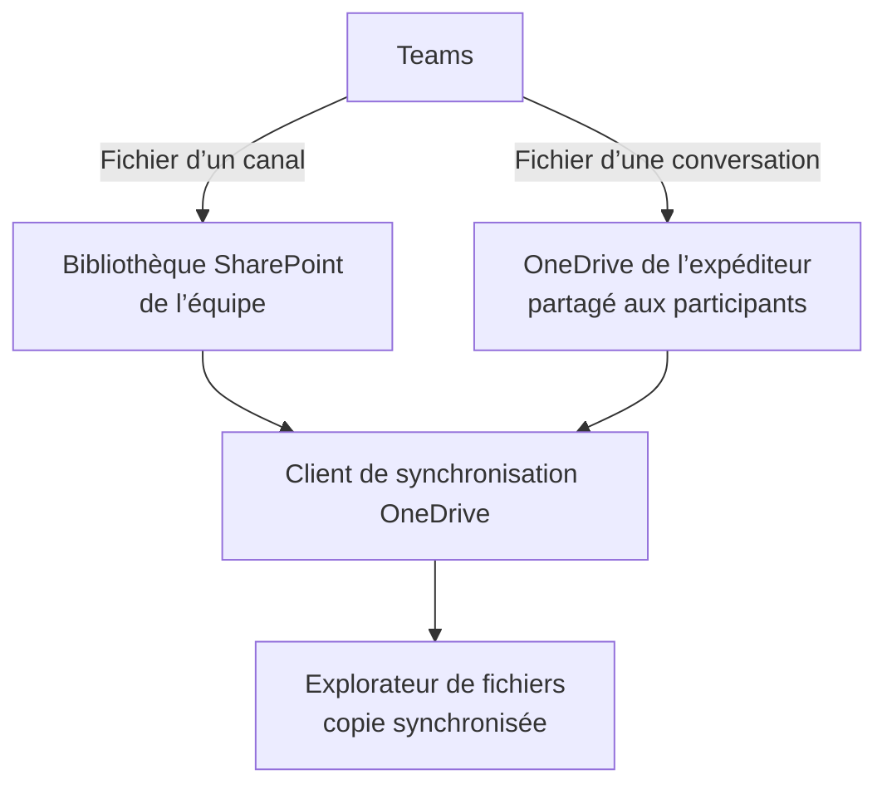

# Module 05 — Exploiter Teams, SharePoint et OneDrive

**Séquence :** Microsoft 365 — Outils collaboratifs  
**Importance :** socle de la progression officielle  
**Sources consolidées :** 1 support(s) de cours, 1 énoncé(s), 1 correction(s)

!!! warning "Périmètre et versions"
    Les interfaces et les licences Microsoft 365 évoluent régulièrement. « Office 365 ProPlus » est l’ancien nom de « Microsoft 365 Apps for enterprise » ; les chemins d’écran sont à rapprocher de la version disponible dans le tenant utilisé. Référence : [Cycle de vie Microsoft 365 Apps](https://learn.microsoft.com/en-us/lifecycle/products/microsoft-365-apps).

## Objectifs et compétences

- Comprendre les relations entre équipe, site SharePoint et stockage.
- Partager des documents avec le bon niveau d’accès.
- Synchroniser les fichiers avec OneDrive.
- Résoudre les conflits et vérifier l’état de synchronisation.

!!! tip "Façon simple de le comprendre"
    Ce module sert à passer de la notion « Exploiter Teams, SharePoint et OneDrive » à une méthode que l’on peut expliquer, appliquer, vérifier et dépanner.

## Méthode de travail

1. Lire les concepts dans l’ordre du support.
2. Reproduire les exemples dans un environnement de laboratoire.
3. Noter le résultat attendu avant de modifier une configuration.
4. Vérifier avec l’outil ou la commande appropriée.
5. Revenir à l’état initial si le résultat diverge.

## Où se trouve réellement le fichier ?

Teams fournit l’interface de collaboration ; SharePoint et OneDrive portent les fichiers selon le contexte. Identifier l’emplacement d’origine avant de modifier partage, synchronisation ou conservation.

## Module 05 - Support de cours

### Outils collaboratifs

#### Exploiter Teams, SharePoint et OneDrive dans un contexte

#### collaboratif

- Comprendre les enjeux d’une plateforme collaborative

- Utiliser une plateforme Cloud pour exploiter vos données

- Utiliser des outils de synchronisation des données

#### Exploiter T eams, SharePoint et OneDrive dans un contexte collaboratif

### Exploiter T eams, SharePoint et OneDrive dans un contexte collaboratif

#### SharePoint

- Suite de logiciels qui permet de créer des sites web internes

- SharePoint Online

- Service hébergé dans le cloud par Microsoft par un abonnement à Microsoft 365 ou

#### SharePoint Online autonome

- SharePoint Server

- Service installé en local (On-premises)

- SharePoint Designer

- Service gratuit permettant de gérer des flux de travail (basée sur Business

#### Connectivity Services)

- Synchronisation OneDrive Entreprise

- Service de synchronisation de documents à des fins d'utilisation Hors connexion

#### Qu’est-ce que SharePoint ?

### SharePoint

- Partager et collaborer

- Partage de documents et versioning

- Informer et prendre part

- Teams, blog et site d'actualités

- Transformer des flux métier

- Gérer des flux métier avec des ERP ou des logiciels tiers

- Exploiter et gérer des connaissances collectives

- Créer un Wiki d'entreprise

- Protéger et gérer vos données

- Anti-programme malveillant

#### À quoi sert SharePoint ?

#### Exploiter T eams, SharePoint et OneDrive dans un contexte collaboratif

#### OneDrive

### OneDrive

- Espace de stockage dans le cloud azure (1 To par défaut)

- Service SharePoint Online

- Stocke des fichiers depuis différentes plateformes :

- PC

- Tablette

- Mobile

- Vous pouvez stocker, consulter et partager des fichiers à partir de

#### n’importe quel ordinateur connecté à internet

- Vous pouvez travailler avec des utilisateurs externes ou internes

- Il est possible de sécuriser vos fichiers avec des fonctionnalités

#### avancées de chiffrement

#### Qu’est-ce que OneDrive ?

#### OneDrive

- Via le portail Microsoft 365

- Via l’application

#### Comment accéder à son OneDrive ?

#### Les icônes OneDrive

#### Les trois tirets bleus signifient que c'est un nouveau fichier

La croix rouge sur un fichier ou un dossier signifie qu'il ne peut pas être

#### synchronisé

#### Le nuage grisé signifie que vous n'êtes pas connecté à votre compte

#### Le symbole de pause signifie que votre OneDrive est en pause de

#### synchronisation

#### Les flèches circulaires signifient que la synchronisation est en cours

#### OneDrive

#### Les icônes OneDrive

Le nuage avec une personne signifie que le fichier ou le dossier a été partagé Le nuage signifie que le fichier ou le dossier n'est disponible qu'en ligne Le cercle vert avec la coche verte signifie que le fichier ouvert en ligne va être

#### téléchargé localement

Le cercle vert avec la coche blanche signifie que le fichier sera toujours téléchargé

#### localement

Le cadenas signifie que des paramètres vous empêchent de synchroniser ce dossier

#### ou ce fichier

- Partage :

- Par un lien

- Par un mail

#### Partager dans OneDrive

#### OneDrive

- Restauration d’un fichier

#### La corbeille dans OneDrive

#### Restaurer son espace OneDrive

#### OneDrive

- L'historique des versions vous permet de suivre toutes les

#### modifications sur votre fichier

- Il vous permet aussi de revenir à une version précédente sans

#### perdre la dernière version enregistrée

#### Le versioning dans OneDrive

- La co-édition permet d'avoir une notification lorsqu'un autre utilisateur

#### ouvre le même fichier que vous et de travailler avec lui en même temps

- OneDrive, OneDrive Entreprise, SharePoint Online et SharePoint Server

#### sont des zones de stockage partagées qui permettent la co-édition

- Prise en charge du co-authoring sur ces extensions :

- .docx (Word), .pptx (PowerPoint) et .xlsx (Excel)

#### La co-édition (co-authoring) dans OneDrive

#### Retrouver le curseur

#### du co-auteur avec

#### sa couleur associée

#### OneDrive

- Vous pouvez choisir les dossiers que vous voulez synchroniser

- Gérer les taux de chargement lors de la synchronisation

#### Les paramètres du client OneDrive

### Exploiter T eams, SharePoint et OneDrive dans un contexte collaboratif

#### T eams

- Un espace de travail centralisé

- Office et d'autres applications dans Teams en co-édition

- 1 To de stockage

- Conférence audio et vidéo

- Partage d'écran

- Planification de réunion

- Fil de conversation

- Enregistrement de réunion

- 250 équipes maximum qu’un utilisateur peut créer

- Multiplateformes (ordinateur, tablette, smartphone)

- Un calendrier

#### Qu’est-ce que Teams ?

### T eams

- Teams est composé de trois volets

#### L’interface de Teams

#### Volet Gauche Volet Central Volet Principal

#### Un ou des membres

#### T eams

#### Structure d’une équipe

#### Equipe

#### Canaux Général Groupe 1 Groupe 2 Groupe 3 Groupe 4

#### Onglets

#### publications

#### fichiers

#### notes

#### applications

#### publications

#### fichiers

#### notes

#### applications

#### publications

#### fichiers

#### notes

#### applications

#### publications

#### fichiers

#### notes

#### applications

#### publications

#### fichiers

#### notes

#### applications

#### Un ou des propriétaires

#### Qu’est-ce qu’une équipe dans Teams ?

- Une équipe est un ensemble d’utilisateurs, de contenus et d’outils

- 10000 membres par équipe maximum

- Un utilisateur peut être membre de 1000 équipes maximum

#### T eams

#### Créer une équipe dans Teams

- Lorsque vous créez une équipe Teams, il sera aussi créé :

- Un nouveau groupe Microsoft 365

- Un site SharePoint Online

- Une boîte aux lettres partagée (cachée par défaut dans Outlook)

- Un bloc-notes OneNote

#### Les paramètres d’une équipe Teams

- Vous pouvez gérer :

- L’image d’une équipe

- Les autorisations des membres

- Les autorisations invité

- L’utilisation des mentions @mentions

- L’utilisation de code d’invitation

- L’utilisation des outils amusants (emojis, GIF, autocollants…)

- La création de balises (seul le propriétaire peut en créer par défaut)

#### T eams

- Compartimente votre équipe par sujet

- Un canal peut être privé ou public

- Chaque équipe à un canal Général par défaut

- Vous pouvez gérer les notifications par canal

- Un canal supprimé peut être restauré avec un maximum de 30 jours

- 200 canaux au maximum par équipe

#### Qu’est-ce qu’un canal ?

- Un canal est un ensemble de conversations, de contenus et d'outils

#### Créer un canal dans Teams

#### Vous pouvez envoyer un mail dans un canal

#### Avoir une conversation au fil de l'eau de votre projet

#### Un connecteur permet d'associer une

#### application à votre canal

#### Vous pouvez ajouter des contenus à votre canal

#### Vous pouvez ajouter des onglets

#### vers des applications ou des

#### fichiers pour un accès rapide

#### T eams

- Un canal est scindé en plusieurs onglets par défaut

- Publications

- Fichiers

- Notes

- Vous pouvez créer d’autres onglets et y publier des applications

#### Qu’est-ce qu’un onglet ?

- Les fichiers sont accessibles par défaut par tous les membres de

#### l’équipe depuis l’onglet Fichiers

- Ils sont stockés dans une bibliothèque SharePoint créée pour

#### chaque canal

- Ils ont les mêmes fonctionnalités que dans OneDrive, c’est-à-dire le

#### versioning et le co-authoring

- Il est possible de transformer un fichier en onglet

#### La gestion des fichiers Teams

#### T eams

- Un message peut être privé ou public

- Un message public est visible par tous les membres de l’équipe ou du canal

- Un message privé ou une conversation ne sont lisibles que par la personne

#### sélectionnée

- Un message peut être enregistré

- Il est possible de faire une conférence audio ou vidéo à une ou

#### plusieurs personnes et de l’enregistrer dans l’application Stream

#### Les messages

- Une réunion peut être planifiée ou créée sur l’instant

- Maximum 250 utilisateurs

- Peut être créée depuis Outlook

- Lors d’une réunion, il est possible de partager :

- Une présentation PowerPoint

- Son écran

- Un tableau blanc

- Il existe une salle d’attente afin de faire patienter des utilisateurs avant

#### le début d’une réunion

- Il existe 3 rôles :

- L’organisateur qui a créé la réunion et qui dispose de tous les droits

- Le présentateur qui peut gérer la réunion et les utilisateurs, mais pas les rôles

- Le participant

#### Les réunions d’équipe

## Mise en pratique

- [Travaux pratiques du module](../../tp/microsoft-365/module-05/index.md)
- [Fiche de révision du module](../../revision/microsoft-365/module-05-exploiter-teams-sharepoint-et-onedrive.md)

## Questions flash

1. Comment expliquer simplement « Exploiter Teams, SharePoint et OneDrive » à un collègue ?
2. Quelles étapes ou notions doivent être maîtrisées avant la manipulation ?
3. Quel contrôle permet de prouver que le résultat est correct ?
4. Quel est le premier risque ou piège à écarter ?

??? success "Éléments de réponse"
    - Comprendre les relations entre équipe, site SharePoint et stockage.
    - Partager des documents avec le bon niveau d’accès.
    - Synchroniser les fichiers avec OneDrive.
    - Résoudre les conflits et vérifier l’état de synchronisation.

## Voir aussi

- [Présentation de la séquence](index.md)
