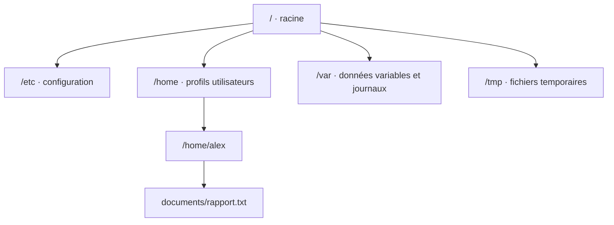

# Module 04 — Fichiers, dossiers et métacaractères

**Séquence :** Utilisation d’une distribution GNU/Linux  
**Importance :** socle de la progression officielle  
**Sources consolidées :** 0 support(s) de cours, 0 énoncé(s), 0 correction(s)

!!! warning "Périmètre et versions"
    Les supports fournis commencent au module 3 et ne contiennent pas les modules 1 et 2. Le portail conserve volontairement cette numérotation. Le module additionnel Workstation présent dans ce dossier est un doublon exact du support Windows et n’est pas traité comme un module Linux.

## Objectifs et compétences

- Créer, copier, déplacer et supprimer fichiers et répertoires.
- Employer chemins absolus et relatifs.
- Utiliser les métacaractères du shell sans élargir involontairement une cible.
- Contrôler le résultat avant une suppression récursive.

!!! tip "Façon simple de le comprendre"
    Ce module sert à passer de la notion « Fichiers, dossiers et métacaractères » à une méthode que l’on peut expliquer, appliquer, vérifier et dépanner.

## Méthode de travail

1. Lire les concepts dans l’ordre du support.
2. Reproduire les exemples dans un environnement de laboratoire.
3. Noter le résultat attendu avant de modifier une configuration.
4. Vérifier avec l’outil ou la commande appropriée.
5. Revenir à l’état initial si le résultat diverge.

## Arborescence et chemins

Chemin absolu : <code>/home/alex/documents/rapport.txt</code>. Depuis <code>/home/alex</code>, le chemin relatif est <code>documents/rapport.txt</code>.

!!! warning "Développer un métacaractère avant de supprimer"
    Contrôler d’abord la cible avec une commande non destructive, par exemple <code>printf '%s\n' *.log</code> ou <code>find … -print</code>, puis seulement exécuter la suppression explicitement validée.

## Concepts essentiels

Le support de cours autonome n’est pas présent dans l’archive. La progression ci-dessus et les travaux pratiques associés constituent la matière exploitable de ce module ; le portail ne complète pas artificiellement les parties absentes.

## Mise en pratique

- Aucun énoncé de TP distinct n’est fourni pour ce module.
- [Fiche de révision du module](../../revision/utilisation-linux/module-04-fichiers-dossiers-et-metacaracteres.md)

## Questions flash

1. Comment expliquer simplement « Fichiers, dossiers et métacaractères » à un collègue ?
2. Quelles étapes ou notions doivent être maîtrisées avant la manipulation ?
3. Quel contrôle permet de prouver que le résultat est correct ?
4. Quel est le premier risque ou piège à écarter ?

??? success "Éléments de réponse"
    - Créer, copier, déplacer et supprimer fichiers et répertoires.
    - Employer chemins absolus et relatifs.
    - Utiliser les métacaractères du shell sans élargir involontairement une cible.
    - Contrôler le résultat avant une suppression récursive.

## Voir aussi

- [Présentation de la séquence](index.md)
