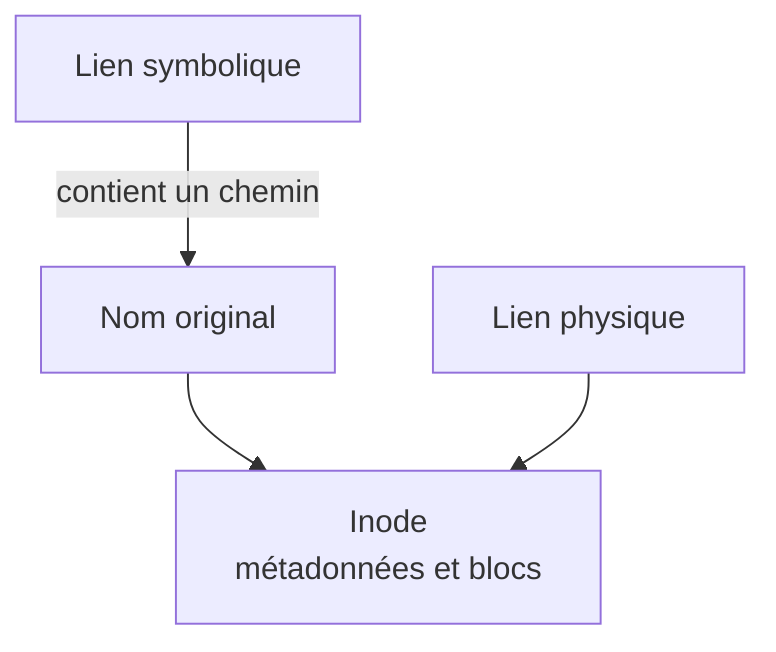

# Module 05 — Lire des fichiers et gérer les liens

**Séquence :** Utilisation d’une distribution GNU/Linux  
**Importance :** socle de la progression officielle  
**Sources consolidées :** 0 support(s) de cours, 0 énoncé(s), 0 correction(s)

!!! warning "Périmètre et versions"
    Les supports fournis commencent au module 3 et ne contiennent pas les modules 1 et 2. Le portail conserve volontairement cette numérotation. Le module additionnel Workstation présent dans ce dossier est un doublon exact du support Windows et n’est pas traité comme un module Linux.

## Objectifs et compétences

- Afficher le début, la fin ou le contenu paginé d’un fichier.
- Compter lignes, mots et caractères.
- Distinguer lien physique et lien symbolique.
- Vérifier inode et cible d’un lien.

!!! tip "Façon simple de le comprendre"
    Ce module sert à passer de la notion « Lire des fichiers et gérer les liens » à une méthode que l’on peut expliquer, appliquer, vérifier et dépanner.

## Méthode de travail

1. Lire les concepts dans l’ordre du support.
2. Reproduire les exemples dans un environnement de laboratoire.
3. Noter le résultat attendu avant de modifier une configuration.
4. Vérifier avec l’outil ou la commande appropriée.
5. Revenir à l’état initial si le résultat diverge.

## Lien physique ou lien symbolique

Un lien physique est un autre nom du même inode. Un lien symbolique contient un chemin vers une cible et peut devenir orphelin si cette cible disparaît.

## Concepts essentiels

Le support de cours autonome n’est pas présent dans l’archive. La progression ci-dessus et les travaux pratiques associés constituent la matière exploitable de ce module ; le portail ne complète pas artificiellement les parties absentes.

## Mise en pratique

- Aucun énoncé de TP distinct n’est fourni pour ce module.
- [Fiche de révision du module](../../revision/utilisation-linux/module-05-lire-des-fichiers-et-gerer-les-liens.md)

## Questions flash

1. Comment expliquer simplement « Lire des fichiers et gérer les liens » à un collègue ?
2. Quelles étapes ou notions doivent être maîtrisées avant la manipulation ?
3. Quel contrôle permet de prouver que le résultat est correct ?
4. Quel est le premier risque ou piège à écarter ?

??? success "Éléments de réponse"
    - Afficher le début, la fin ou le contenu paginé d’un fichier.
    - Compter lignes, mots et caractères.
    - Distinguer lien physique et lien symbolique.
    - Vérifier inode et cible d’un lien.

## Voir aussi

- [Présentation de la séquence](index.md)
