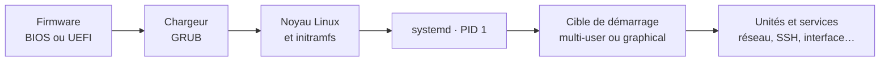

# Module 03 — Démarrage d’une distribution Debian

**Séquence :** Administration Debian GNU/Linux  
**Importance :** socle de la progression officielle  
**Sources consolidées :** 0 support(s) de cours, 0 énoncé(s), 0 correction(s)

!!! warning "Périmètre et versions"
    Les supports d’installation ciblent Debian 11 et certaines diapositives citent Debian 12. La version stable officielle en août 2026 est Debian 13 « trixie » ; les concepts restent valables, mais les écrans, dépôts et versions de paquets doivent être adaptés. Référence : [Versions Debian](https://www.debian.org/releases/).

## Objectifs et compétences

- Suivre la chaîne firmware, chargeur, noyau et systemd.
- Démarrer, arrêter et redémarrer proprement.
- Administrer les services avec systemctl.
- Lire l’état et les journaux d’une unité en échec.

!!! tip "Façon simple de le comprendre"
    Ce module sert à passer de la notion « Démarrage d’une distribution Debian » à une méthode que l’on peut expliquer, appliquer, vérifier et dépanner.

## Méthode de travail

1. Lire les concepts dans l’ordre du support.
2. Reproduire les exemples dans un environnement de laboratoire.
3. Noter le résultat attendu avant de modifier une configuration.
4. Vérifier avec l’outil ou la commande appropriée.
5. Revenir à l’état initial si le résultat diverge.

## Du firmware au service

  
<b><code>systemctl status</code></b>État actuel, code de sortie et dernières lignes utiles.

  
<b><code>journalctl -u</code></b>Journal de l’unité pour comprendre l’échec.

  
<b>Corriger la cause</b>Configuration, dépendance, port, permission ou ressource.

  
<b><code>restart</code> puis contrôle</b>Relancer et confirmer le service rendu, pas seulement l’état « active ».

## Concepts essentiels

Le support de cours autonome n’est pas présent dans l’archive. La progression ci-dessus et les travaux pratiques associés constituent la matière exploitable de ce module ; le portail ne complète pas artificiellement les parties absentes.

## Mise en pratique

- Aucun énoncé de TP distinct n’est fourni pour ce module.
- [Fiche de révision du module](../../revision/administration-linux/module-03-demarrage-d-une-distribution-debian.md)

## Questions flash

1. Comment expliquer simplement « Démarrage d’une distribution Debian » à un collègue ?
2. Quelles étapes ou notions doivent être maîtrisées avant la manipulation ?
3. Quel contrôle permet de prouver que le résultat est correct ?
4. Quel est le premier risque ou piège à écarter ?

??? success "Éléments de réponse"
    - Suivre la chaîne firmware, chargeur, noyau et systemd.
    - Démarrer, arrêter et redémarrer proprement.
    - Administrer les services avec systemctl.
    - Lire l’état et les journaux d’une unité en échec.

## Voir aussi

- [Présentation de la séquence](index.md)
