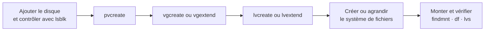

# Module 08 — Gestion des espaces de stockage avancée — LVM

**Séquence :** Administration Debian GNU/Linux  
**Importance :** socle de la progression officielle  
**Sources consolidées :** 0 support(s) de cours, 0 énoncé(s), 0 correction(s)

!!! warning "Périmètre et versions"
    Les supports d’installation ciblent Debian 11 et certaines diapositives citent Debian 12. La version stable officielle en août 2026 est Debian 13 « trixie » ; les concepts restent valables, mais les écrans, dépôts et versions de paquets doivent être adaptés. Référence : [Versions Debian](https://www.debian.org/releases/).

## Objectifs et compétences

- Comprendre PV, VG et LV.
- Créer un volume logique et son système de fichiers.
- Étendre stockage et système de fichiers dans le bon ordre.
- Contrôler avec pvs, vgs, lvs, lsblk et findmnt.

!!! tip "Façon simple de le comprendre"
    Ce module sert à passer de la notion « Gestion des espaces de stockage avancée — LVM » à une méthode que l’on peut expliquer, appliquer, vérifier et dépanner.

## Méthode de travail

1. Lire les concepts dans l’ordre du support.
2. Reproduire les exemples dans un environnement de laboratoire.
3. Noter le résultat attendu avant de modifier une configuration.
4. Vérifier avec l’outil ou la commande appropriée.
5. Revenir à l’état initial si le résultat diverge.

## Architecture LVM

<figure class="tssr-figure">
  

    

      
<b>PV · Physical Volumes</b>
/dev/sdb1/dev/sdc1

      
<b>VG · Volume Group</b>
vg_data · espace mutualisé

      
<b>LV · Logical Volumes</b>
lv_apps → /srv/appslv_backup → /backup

    

  

  <figcaption>Recréation du principe présenté dans le support Administration Linux, module 08, pages 5 et 9 à 11 : les PV alimentent un VG, découpé en LV formatés puis montés.</figcaption>
</figure>

Lors d’une extension, agrandir d’abord la couche de stockage concernée, puis le système de fichiers ; vérifier chaque étape avant de poursuivre.

## Concepts essentiels

Le support de cours autonome n’est pas présent dans l’archive. La progression ci-dessus et les travaux pratiques associés constituent la matière exploitable de ce module ; le portail ne complète pas artificiellement les parties absentes.

## Mise en pratique

- Aucun énoncé de TP distinct n’est fourni pour ce module.
- [Fiche de révision du module](../../revision/administration-linux/module-08-gestion-des-espaces-de-stockage-avancee-lvm.md)

## Questions flash

1. Comment expliquer simplement « Gestion des espaces de stockage avancée — LVM » à un collègue ?
2. Quelles étapes ou notions doivent être maîtrisées avant la manipulation ?
3. Quel contrôle permet de prouver que le résultat est correct ?
4. Quel est le premier risque ou piège à écarter ?

??? success "Éléments de réponse"
    - Comprendre PV, VG et LV.
    - Créer un volume logique et son système de fichiers.
    - Étendre stockage et système de fichiers dans le bon ordre.
    - Contrôler avec pvs, vgs, lvs, lsblk et findmnt.

## Voir aussi

- [Présentation de la séquence](index.md)
