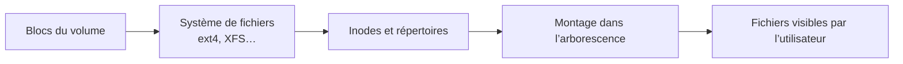

# Module 09 — Gestion des espaces de stockage — File System

**Séquence :** Administration Debian GNU/Linux  
**Importance :** socle de la progression officielle  
**Sources consolidées :** 0 support(s) de cours, 0 énoncé(s), 0 correction(s)

!!! warning "Périmètre et versions"
    Les supports d’installation ciblent Debian 11 et certaines diapositives citent Debian 12. La version stable officielle en août 2026 est Debian 13 « trixie » ; les concepts restent valables, mais les écrans, dépôts et versions de paquets doivent être adaptés. Référence : [Versions Debian](https://www.debian.org/releases/).

## Objectifs et compétences

- Créer et identifier un système de fichiers.
- Monter temporairement puis durablement un volume.
- Utiliser UUID dans /etc/fstab.
- Tester mount -a avant tout redémarrage.

!!! tip "Façon simple de le comprendre"
    Ce module sert à passer de la notion « Gestion des espaces de stockage — File System » à une méthode que l’on peut expliquer, appliquer, vérifier et dépanner.

## Méthode de travail

1. Lire les concepts dans l’ordre du support.
2. Reproduire les exemples dans un environnement de laboratoire.
3. Noter le résultat attendu avant de modifier une configuration.
4. Vérifier avec l’outil ou la commande appropriée.
5. Revenir à l’état initial si le résultat diverge.

## Du système de fichiers à l’espace visible

Un volume peut exister sans être monté ; un point de montage peut masquer temporairement le contenu déjà présent dans le répertoire. Vérifier la source avec <code>findmnt</code>.

## Concepts essentiels

Le support de cours autonome n’est pas présent dans l’archive. La progression ci-dessus et les travaux pratiques associés constituent la matière exploitable de ce module ; le portail ne complète pas artificiellement les parties absentes.

## Mise en pratique

- Aucun énoncé de TP distinct n’est fourni pour ce module.
- [Fiche de révision du module](../../revision/administration-linux/module-09-gestion-des-espaces-de-stockage-file-system.md)

## Questions flash

1. Comment expliquer simplement « Gestion des espaces de stockage — File System » à un collègue ?
2. Quelles étapes ou notions doivent être maîtrisées avant la manipulation ?
3. Quel contrôle permet de prouver que le résultat est correct ?
4. Quel est le premier risque ou piège à écarter ?

??? success "Éléments de réponse"
    - Créer et identifier un système de fichiers.
    - Monter temporairement puis durablement un volume.
    - Utiliser UUID dans /etc/fstab.
    - Tester mount -a avant tout redémarrage.

## Voir aussi

- [Présentation de la séquence](index.md)
