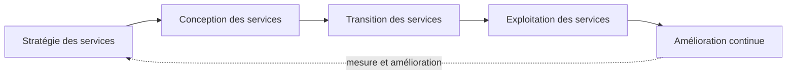

# Module 01 — Présentation d’ITIL et historique

**Séquence :** Sensibilisation ITIL et gestion de parc  
**Importance :** socle de la progression officielle  
**Sources consolidées :** 1 support(s) de cours, 0 énoncé(s), 0 correction(s)

!!! warning "Périmètre et versions"
    La progression suit principalement les publications du cycle de vie ITIL v3, complétées par une introduction à ITIL 4. Cette structure historique est conservée car elle constitue l’ordre officiel des supports.

## Objectifs et compétences

- Définir ITIL et son objectif de bonnes pratiques.
- Situer les grandes évolutions du référentiel.
- Distinguer référentiel, norme et certification.
- Comprendre le passage d’une logique de moyens à une logique de services.

!!! tip "Façon simple de le comprendre"
    Ce module sert à passer de la notion « Présentation d’ITIL et historique » à une méthode que l’on peut expliquer, appliquer, vérifier et dépanner.

## Méthode de travail

1. Lire les concepts dans l’ordre du support.
2. Reproduire les exemples dans un environnement de laboratoire.
3. Noter le résultat attendu avant de modifier une configuration.
4. Vérifier avec l’outil ou la commande appropriée.
5. Revenir à l’état initial si le résultat diverge.

## Cycle de vie étudié dans les supports

Le portail conserve la structure ITIL v3 des supports : l’amélioration continue mesure les résultats et alimente les décisions tout au long du cycle.

## Module 01 - Support de cours

### Sensibilisation ITIL

#### Module 01 — Présentation d’ITIL et historique

- Qu’est-ce qu’ITIL ?

- Découvrir ITIL

#### Présentation d'ITIL et historique

### Présentation d'ITIL et historique

- ITIL : Information Technology Infrastructure Library.

- En français : bibliothèque pour l’infrastructure des technologies de

l’information.

- ITIL définit les bonnes pratiques informatiques afin d’avoir un

système d’information le plus efficace et efficient que possible.

#### Présentation d’ITIL

#### Présentation d'ITIL et historique

- ISO 9001

- Norme qui s’adresse à tous les secteurs d’activité, qui définit un

système de gestion de qualité par le processus.

- ISO 20000

- Norme internationale, spécifique à la gestion des systèmes

#### d’information, définie en treize processus (ces processus sont

définis dans ITIL).

- Cette certification est facilitée si l’on possède ISO 9001 et ITIL v2

minimum.

#### Historique

- Fin des années 80

- Le gouvernement britannique lance une étude nationale pour connaître les

#### pratiques utilisées dans la gestion des informations au niveau de

l’administration et afin de garder les meilleures. Le but est d’homogénéiser

#### le traitement des informations

- Création d’une bibliothèque de 42 livres baptisée « ITIL »

- Le système d’information est un fournisseur de moyens

- 1991

- Création d’un forum permettant aux utilisateurs d’ITIL d’échanger les idées

#### et leurs expériences. Il deviendra l’ITSMF

- 2004

- Évolution vers ITIL v2 qui repose sur 9 livres centraux

- Apparition de processus orientés sécurité et des SLA

- Le système d’information est un fournisseur de services

#### Historique

#### Présentation d'ITIL et historique

- 2007

- ITIL v3 qui repose sur 5 livres centraux

- Ajout de la notion de « cycle de vie des services »

- Janvier 2020

- ITIL 4 n’est pas une version, mais un dépoussiérage de la version 3 en gardant les

#### principes fondamentaux

- Référentiel international de gestion des services informatiques

#### Historique

- ITIL repose sur l’évolution de l’informatique dans une gestion de

#### projets vers une gestion de service

- Contenu :

- Les bonnes pratiques de la gestion des services informatiques

- Définition d’un langage commun

- Définition d’un cadre de travail

#### Présentation d’ITIL v3

#### Présentation d'ITIL et historique

- Les différents acteurs

- OGC (Office of Government Commerce) : office public britannique du

#### commerce

- Propriétaire du référentiel — initialise et contrôle les publications

- Axelos : entreprise créée en 2014 par l’OGC pour gérer ITIL

- Organismes de gestion des certifications et des examens

- APM Group, EXIN, ISEB, Loyalist College, Dansk IT, DF Certifiering

- Définissent un langage commun

- ITSMF (IT Service Management Forum)

- Association d’utilisateurs

- Les organismes de formation et les formateurs agréés

- Les experts et les consultants en gestion de service certifiés ITIL

#### Présentation d’ITIL v3

- ITIL 4 n’est pas une nouvelle version, mais représente la 4e

génération industrielle.

- Nouveautés :

- Gestion de projet Agile

- Le Lean

- Le Cloud

#### Apport d’ITIL 4

## Mise en pratique

- Aucun énoncé de TP distinct n’est fourni pour ce module.
- [Fiche de révision du module](../../revision/itil/module-01-presentation-d-itil-et-historique.md)

## Questions flash

1. Comment expliquer simplement « Présentation d’ITIL et historique » à un collègue ?
2. Quelles étapes ou notions doivent être maîtrisées avant la manipulation ?
3. Quel contrôle permet de prouver que le résultat est correct ?
4. Quel est le premier risque ou piège à écarter ?

??? success "Éléments de réponse"
    - Définir ITIL et son objectif de bonnes pratiques.
    - Situer les grandes évolutions du référentiel.
    - Distinguer référentiel, norme et certification.
    - Comprendre le passage d’une logique de moyens à une logique de services.

## Voir aussi

- [Présentation de la séquence](index.md)
