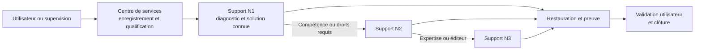

# Module 06 — Exploitation des services

**Séquence :** Sensibilisation ITIL et gestion de parc  
**Importance :** socle de la progression officielle  
**Sources consolidées :** 1 support(s) de cours, 0 énoncé(s), 0 correction(s)

!!! warning "Périmètre et versions"
    La progression suit principalement les publications du cycle de vie ITIL v3, complétées par une introduction à ITIL 4. Cette structure historique est conservée car elle constitue l’ordre officiel des supports.

## Objectifs et compétences

- Définir le rôle de l’exploitation au quotidien.
- Comprendre centre de services et niveaux de support.
- Distinguer incident, problème, événement et demande.
- Organiser l’escalade et le suivi opérationnel.

!!! tip "Façon simple de le comprendre"
    Ce module sert à passer de la notion « Exploitation des services » à une méthode que l’on peut expliquer, appliquer, vérifier et dépanner.

## Méthode de travail

1. Lire les concepts dans l’ordre du support.
2. Reproduire les exemples dans un environnement de laboratoire.
3. Noter le résultat attendu avant de modifier une configuration.
4. Vérifier avec l’outil ou la commande appropriée.
5. Revenir à l’état initial si le résultat diverge.

## Qualifier avant d’escalader

  
<b>Événement</b>Fait détectable dans le SI ; il n’entraîne pas toujours une interruption.

  
<b>Incident</b>Interruption ou dégradation non planifiée ; restaurer le service rapidement.

  
<b>Problème</b>Cause inconnue d’un ou plusieurs incidents ; rechercher et maîtriser la cause.

  
<b>Demande</b>Requête standard d’un utilisateur, traitée selon un catalogue et des droits.

L’escalade fonctionnelle transfère vers la compétence adaptée ; l’escalade hiérarchique alerte lorsqu’un niveau de service ou un impact le justifie.

## Module 06 - Support de cours

### Sensibilisation ITIL

#### Module 06 — Les publications centrales

#### « Exploitation des services »

- Définir le rôle de l’exploitation des services

- Définir le centre de services

- Différencier les types de support

- Identifier les types d’architecture d’un centre de services

- Identifier les processus

#### Les publications centrales « Exploitation des services »

### Les publications centrales « Exploitation des services »

- Objectif

- Coordonner les activités des processus garantissant l’atteinte des niveaux de

#### service convenus

- Gérer l’exploitation au quotidien

- Ses missions

- Coordonner et réaliser les activités nécessaires à la fourniture des services

- Exploitation — Supervision — Pilotage — Support — Maintenance

- Être efficace puis efficient tout au long de la vie des services (coût)

- Produire des indicateurs pour permettre à la phase d’amélioration continue

#### de faire des propositions d’optimisation de la DSI

#### L’exploitation des services

#### Les publications centrales « Exploitation des services »

- Stabilité

- Le SI fonctionne normalement et est disponible : on ne change plus rien

- Réduction du nombre de changements et donc de Mises En Production au

#### minimum (MEP)

- Réactivité

- Réaction aux sollicitations des métiers pour les rendre les plus performantes

#### possibles

- Coûts par rapport à qualité

- Éviter la surqualité, réduire les coûts en gardant le niveau de qualité demandé :

#### industrialisation de l’exploitation, supervision et pilotage

- Réactivité par rapport à proactivité

- Agir en fonction des évènements ou incidents

- Essayer d’anticiper en recherchant des moyens d’optimiser le SI

- Investir pour garantir un bon fonctionnement

#### L’exploitation des services

#### Les 4 fonctions ITIL v3

#### Centre de services

#### Gestion technique Gestion des applicationsGestion des opérations

#### Mainframes

#### Serveurs

Autres env.

#### Réseaux

#### Stockage

#### Applications métiers

#### Applications

#### financières

#### Applications RH

#### Contrôle des opérations

#### Gestion des consoles

#### Ordonnancement

#### Impressions/sorties

#### Sauvegardes

#### Moyens généraux

#### Datacenters

#### Sites de secours

#### Contrats

#### Consolidation

#### Les publications centrales « Exploitation des services »

#### Le centre de service : au cœur de l’exploitation

#### Exploitation et

#### supervision

#### Centre de services

#### Appels

#### utilisateurs

#### Gestion des

#### évènements

#### Gestion des

#### problèmes

#### Gestion des

#### accès

#### Gestion des

#### incidents

#### Gestion des

#### demandes

#### État

#### Ses missions

- Le « service desk »

- Être point de contact unique pour les utilisateurs

- Porter toute la relation avec les utilisateurs : relation bidirectionnelle

- Servir les utilisateurs et les satisfaire

- Garantir la bonne image de la DSI auprès des utilisateurs

- Être vitrine du département informatique

- Répondre aux questions et demandes des utilisateurs

- Restaurer le service dans un état normal, standard le plus rapidement possible

#### dans le respect des délais définis et contractuels

- Assurer les activités de N1, gérer les escalades aux groupes supérieurs et

#### coordonner

#### Fonction centre de service

#### Centre de services (service desk)

#### Les publications centrales « Exploitation des services »

#### Les concepts

- Le centre d’appels (Call Center)

- Le centre d’assistance (Help Desk)

- Le centre de services (Service Center)

#### Fonction centre de service

#### Centre d’assistance

#### (help desk)

#### Services couverts

#### Faibles compétences

#### Compétences de résolution

#### d’incidents de 1er niveau

#### Compétences étendues à

#### tout type de demandes

#### Centre d’appels

#### (call centers)

- Prendre des appels

- Passer des appels en masse

- Un standard téléphonique est en place

- On l’appelle / Il nous rappelle

- On s’identifie (nom, numéro de contrat, etc.)

- On explique les raisons de l’appel

- La réponse du centre d’appel est souvent : « On vous rappellera »,

#### « Un technicien vous rappellera »

- Très peu de valeur ajoutée, réponse minimale pour l’appelant

- Il est le niveau 0

- Gère très peu d’actions, amène une forte frustration des utilisateurs

- Transfert le ticket d’appel

#### Le centre d’appels

#### Les publications centrales « Exploitation des services »

- Gère les pannes et les dysfonctionnements remontés par les utilisateurs

- Gère et coordonne toutes les activités liées au dépannage de l’utilisateur

- Donne des informations sur l’avancement du dépannage si l’utilisateur le

#### demande

- Est dans des actions de type réactif

- Attend que l’utilisateur appelle pour le renseigner

- Le centre d’assistance

- Est là en support des utilisateurs qui appellent

- Répond aux sollicitations des utilisateurs

- À peu ou pas d’actions proactives vers les utilisateurs

#### Le centre d’assistance

- Est un surensemble du centre d’assistance en ajoutant des activités

#### de proactivité

- Intervient dans tous les processus de l’exploitation des services

- Et dans une partie des activités de deux processus de la transition

#### des services

- La gestion des changements

- La gestion des déploiements et des mises en production

- Ses activités

- La prise en compte de l’appel de l’utilisateur

- Ouverture du ticket d’appel dans l’outil de gestion du centre de services

- Enregistrement des informations liées à l’appel de l’utilisateur

- La catégorisation

#### Le centre de service

#### Les publications centrales « Exploitation des services »

- Ses activités suite

- La codification

- L’investigation et le diagnostic

- La réponse dépendra de la demande utilisateur

- Escalade vers les groupes support de niveau 2 et de niveau 3 si nécessaire

- Le suivi de l’appel

- La résolution / clôture du ticket

- La gestion des enquêtes de satisfaction des utilisateurs

- La mise à jour de la base de connaissance

#### Le centre de service

#### Le centre de service : configuration et architecture

- Le périmètre (fonctionnalités, horaires, etc.)

- La typologie des appels gérés

- Les périodes de charge et les périodes creuses

- Les moyens nécessaires (les outils)

#### Va dépendre de

#### différents

#### paramètres

- Le centre de services local

- Le centre de services centralisé

- Le centre de services virtuel

- Le centre de services qui suit le soleil

#### Quatre types

#### d’architecture

#### Les publications centrales « Exploitation des services »

- Implanté sur le même site que les utilisateurs

- Architecture souvent représentée par un guichet, un bureau où les utilisateurs

#### peuvent venir

- Implémente des environnements très spécialisés avec des besoins spécifiques

#### Le centre de service local

- Proximité des utilisateurs

- Forte réactivité, délai d’intervention rapide

- Meilleure compréhension de la problématique des utilisateurs

- Connaissance des utilisateurs eux-mêmes

#### Avantages

- Pas de mutualisation des ressources et leur optimisation

- Moins de partage de connaissance avec les autres centres de

#### services locauxInconvénients

#### Le centre de service local

#### Support tiers

#### (externe)

#### Support aux

#### réseaux et à

#### l’exploitation

#### Support

#### applicatif

#### Support

#### bureautique

#### Support de niveau 1

#### Centre de services

#### Utilisateur

#### local

#### Utilisateur

#### local

#### Utilisateur

#### local

#### Les publications centrales « Exploitation des services »

- Implanté sur un site unique

- Externalisé

- Contacté par des canaux de télécommunication (téléphone, e-mail, intranet)

#### Le centre de service centralisé

- Mutualisation des ressources et des moyens

- Meilleur partage de l’information et des connaissances : Procédures homogènesAvantages

- Pas de proximité avec les utilisateurs

- La réactivité sera moins forteInconvénients

- Outils de prise en mains à distance, technicien de proximité, mixité centre de

#### service local

#### Pour limiter ces

#### inconvénients

#### Le centre de service centralisé

#### Centre de services centralisé

#### Gestion des opérations

#### informatiques

#### Gestion des applications

#### Gestion des systèmes

#### d’information

#### Gestion des moyens

#### généraux

#### Mainframe

#### Serveurs

#### Réseau

#### Stockage

#### Virtu

#### BDD

#### Annuaire

#### Bureautique

#### Middleware

#### Internet

#### … …

#### Application financière

#### Application RH

#### Application business

#### …

#### Site central

#### Site distant

#### Gestion technique

#### Les publications centrales « Exploitation des services »

- Mettre le demandeur en relation avec le technicien possédant le

#### meilleur profil

- En fonction de :

- L’heure

- Du pays ou du site d’appel

- Du profil de l’utilisateur appelant

- Du métier du demandeur

#### Le centre de service virtuel

- Une meilleure crédibilité et réactivitéAvantages

- Mise en place d’outils téléphoniques spécifiques avec SVI

- Problème de coordination des différentes entités

- Pour limiter ces inconvénients : utilisation d’un responsable unique

#### Inconvénients

### Site distant Moscou Site distant Londres Site distant Paris

#### Les publications centrales « Exploitation des services »

#### Le centre de service virtuel

#### Centre de

#### service Moscou

#### Centre de

#### service Londres

#### Centre de

#### service Paris

#### Gestion des opérations

#### informatiques

#### Gestion des applications

#### Gestion des systèmes

#### d’information

#### Gestion des moyens

#### généraux

#### Mainframe

#### Serveurs

#### Réseau

#### Stockage

#### Virtu

#### BDD

#### Annuaire

#### Bureautique

#### Middleware

#### Internet

#### … …

#### Application financière

#### Application RH

#### Application business

#### …

#### Gestion technique

#### Les publications centrales « Exploitation des services »

- Couvre une problématique particulière

- Fonctionne 24h/24

- Réparti dans plusieurs entités aux quatre coins du monde dans des faisceaux

#### horaires différents

- À toute heure du jour ou de la nuit, l’appel est aiguillé vers un centre ou une

#### équipe de jour présente

- Choix des moyens et des outils

- Avoir des procédures et des escalades communes et partagées

- Avoir une langue commune (souvent l’anglais)

#### Le centre de service qui suit le soleil

### Les publications centrales « Exploitation des services »

#### Le centre de service qui suit le soleil

#### Site distant Moscou Site distant Londres Site distant Paris

#### Centre de

#### service Moscou

#### Centre de

#### service Londres

#### Centre de

#### service Paris

#### Gestion des opérations

#### informatiques

#### Gestion des applications

#### Gestion des systèmes

#### d’information

#### Gestion des moyens

#### généraux

#### Mainframe

#### Serveurs

#### Réseau

#### Stockage

#### Virtu

#### BDD

#### Annuaire

#### Bureautique

#### Middleware

#### Internet

#### … …

#### Application financière

#### Application RH

#### Application business

#### …

#### Gestion technique

#### Les publications centrales « Exploitation des services »

- L’autocommutateur téléphonique intelligent

- Serveur Vocal Interactif

- Couplage téléphonique informatique

- Logiciel de relation utilisateur (CRM)

- Intégration avec les autres outils

- Le CMS

- La base des erreurs connues (KEDB)

- La gestion documentaire de l’entreprise (SKMS)

- Les outils de gestion de services

- Centre de services dit en libre-service (utilisateurs autonomes)

#### Le centre de service : les outils

#### TAPEZ 1

#### TAPEZ 2

#### TAPEZ 3

- L’exécution des requêtes

- Traiter les demandes de services provenant des utilisateurs

- La gestion des accès

- Traiter les requêtes relatives à l’accès, aux droits et aux privilèges des

#### utilisateurs

- La gestion des incidents

- Restauration au plus vite du service dégradé ou arrêté dans les délais

#### impartis

- La gestion des problèmes

- Rechercher les causes et solutions à des incidents récurrents

- La gestion des évènements

- Interpréter et gérer tous les faits détectables qui arrivent sur l’infrastructure,

#### qu’ils soient normaux ou anormaux

#### Les processus de l’exploitation des services

#### Les publications centrales « Exploitation des services »

- Objectifs

- Fournir un canal privilégié vers la DSI aux utilisateurs pour émettre et traiter

#### leurs demandes

- Fournir de l’assistance auprès des utilisateurs sur l’utilisation des services

- Approvisionner des composants standards des services suivant les

#### demandes des utilisateurs

- Fournir un canal pour faire remonter les plaintes des utilisateurs vers la DSI

- Une requête : demande de service provenant d’un utilisateur

- Assistance

- Conseil

- Information

- Changement standard simple

#### L’exécution des requêtes

- Approvisionnement de consommable

- Accès à un service

- Une plainte

- Tout ce qui n’est pas un incident

- Une requête va réaliser une action

- Limitée dans le temps

- À faible risque et coût

- Traitée par une seule personne

- Le catalogue des requêtes

- Base du fonctionnement de ce processus

- Liste précise et détaillée des demandes de services provenant des

#### utilisateurs

- Identifie précisément quel profil d’utilisateur a le droit de demander telle

#### requête

- Diffusion et promotion de ce catalogue auprès de tous les utilisateurs sont

#### un enjeu majeur

#### L’exécution des requêtes

#### Les publications centrales « Exploitation des services »

- Objectifs

- Mettre en place les procédures définies par :

- La politique de sécurité de la DSI

- Les recommandations de la gestion de la disponibilité

- Les procédures doivent aussi être connues et diffusées auprès de tous

- Fournir aux utilisateurs les droits et privilèges d’un service ou d’un groupe

#### de services

- Les droits

- Ensemble des règles qui vont définir les types d’accès à un service ou un

#### groupe de services

- L’identité

- Gestion d’une identification fiable des utilisateurs qui vont accéder à ce

#### service

#### La gestion des accès

- L’accès au service

- Est le niveau, le périmètre de fonctionnalités ou de données auquel un

#### utilisateur peut avoir accès

- Notions de confidentialité, gestion des mots de passe et règles associées

#### (initialisation, validation et revalidation)

- L’identité des groupes

- Cartographie des groupes de l’entreprise nécessaire

- Notions de groupe de services offerts à un utilisateur ou groupe

#### d’utilisateurs

- Cartographie des services mettant en avant les familles de services en

#### fonction des droits

#### La gestion des accès

#### Les publications centrales « Exploitation des services »

- Objectifs

- Rétablir le service dans un état normal de plus rapidement possible

#### conformément au SLA

- Rétablir c’est trouver une solution, un palliatif, qui va relancer le service dans

#### son état normal

- Minimiser l’impact de l’incident sur les utilisateurs (les conséquences pour

#### l’utilisateur)

- Rétablir le service dans les délais contractuels (engagement auprès du

#### client)

- Ce processus ne s’occupe pas de trouver la cause de l’incident

#### La gestion des incidents

- Définition d’un incident

- Ne pas confondre incident, évènement et problème

- Un évènement est un fait détectable qui arrive du SI alors que l’incident est

#### un évènement qui altère ou dégrade le service rendu

- Il survient lorsque le service est arrêté ou quand la qualité du service est

#### diminuée

- L’incident a pour origine un évènement (détecté ou non), mais tous les

#### évènements ne créent pas d’incident

- Il est détecté soit par un utilisateur, des outils de supervision ou de pilotage

#### par la gestion des évènements

#### La gestion des incidents

#### Les publications centrales « Exploitation des services »

- Codifier un incident : c’est déterminer la priorité que l’on va lui

#### attribuer

- Pour cela :

- Identifier l’impact de l’incident

- Identifier l’urgence de l’incident

- Utilisation d’une matrice ou d’un référentiel applicatif

- Détermination du délai de rétablissement

#### La gestion des incidents

#### Toutes ces notions devront être notées dans les SLA pour chaque service

et négociées avec les clients avant la mise en exploitation du service.

- L’impact : effet de l’incident sur l’utilisation d’un service

- Perte d’exploitation :

- Nombre d’utilisateurs bloqués

- Non-respect des dispositions légales

- Positionné sur une échelle de 1 à 3 ou de 1 à 5 (1 élevé, 3 ou 5 faible)

- L’urgence : temps dont dispose la DSI pour rétablir le service

- Positionnée sur une échelle de 1 à 3 ou de 1 à 5

#### La gestion des incidents

#### Code de priorité

#### Urgence

#### Elevée Moyenne Faible

#### Impact

#### Elevé 1 2 3

#### Moyen 2 3 4

#### Faible 3 4 5

#### Code de priorité Description Durée de résolution prévue

#### 1 Critique 1 heure

#### 2 Elevée 8 heures

#### 3 Moyen 24 heures

#### 4 Faible 48 heures

#### 5 Planification Best effort

#### Les publications centrales « Exploitation des services »

- L’incident majeur

- Fort impact sur les clients

- Hors grille de codification

- D’une priorité très élevée

- Traité différemment des autres incidents

- Utilisation d’une procédure dite de « crise »

#### La gestion des incidents

- Les escalades

#### La gestion des incidents

- Survient quand une équipe est dans l’incapacité de réaliser un

#### traitement (diagnostic ou rétablissement)

- Transfert vers un niveau supérieur ou de mêmes niveaux

#### d’expertise, mais dans un autre domaine

#### Escalade

#### fonctionnelle

- Escalade à la hiérarchie pour une situation particulière

- Incidents majeurs potentiels

- Impact fort sur les branches métier

- Blocage dû à un manque de ressources, moyens…

#### Escalade

#### hiérarchique

#### Les publications centrales « Exploitation des services »

- Concepts

- Période de fourniture des services : définir un calendrier d’utilisation des

#### services

- Arbre de résolution

- Modèle d’incident — Branche de l’arbre la plus souvent parcourue

- Listing de dépannage — Check-list

- Base de connaissance : liste des incidents connus et leurs solutions

- Incident majeur : gravité importante pour les clients

- Crises : incident majeur à résoudre tout de suite. Peut donner suite à un

#### Post-Mortem

#### La gestion des incidents

#### La gestion des incidents

#### Incident Identifier Enregistrer Catégoriser Définir la

#### prioritéIncident

#### Gestion des

#### incidents majeurs

#### Diagnostic

#### initial

#### Escalade

#### fonctionnelle

#### Investigation

#### diagnostic

#### Non

#### Résoudre et

#### rétablir

#### Escalade

#### niveau 2 & 3

#### OuiInvestigation

#### diagnostic

#### Escalade

#### fonctionnelle

#### Oui

#### Résoudre et

#### rétablir

#### Clôture de

#### l’incident

#### Exécution des

#### requêtes

#### Demande

#### Gestion des escalades

#### hiérarchiques

#### Escalade

#### hiérarchique ?

#### Les publications centrales « Exploitation des services »

- Objectifs

- Faire diminuer le nombre d’incidents

- Prévenir l’apparition de nouveaux incidents et problèmes

- Minimiser l’impact des incidents

- Optimiser l’efficacité des équipes supports

- Contrôler les problèmes : les transformer en erreurs connues

- Gérer les erreurs

- La proactivité

- Participe à maintenir le niveau de qualité de service demandé

- Prend l’initiative de la recherche de situations qui dégradent ce niveau

#### La gestion des problèmes

- Un problème

- Situation dont on recherche la cause inconnue d’un ou plusieurs incidents

- La gestion des incidents traite en temps réel les situations (front line)

- La gestion des problèmes traite les causes de ces situations (back-office)

- Tous les incidents ne déclenchent pas de problèmes

- On ouvre un problème dans le cas d’incidents récurrents ou dans un

#### contexte d’incident majeur

- Une erreur connue

- Problème dont on connaît la cause et dont on a identifié une solution

#### temporaire ou définitive

- La base des erreurs connues (KEDB) contient l’ensemble de ces problèmes

#### transformés en erreurs connues

- Base mise à disposition du centre de services sous la responsabilité des

#### groupes support

#### La gestion des problèmes

#### Les publications centrales « Exploitation des services »

#### La gestion des problèmes

#### Détection du

#### problème

#### Incident

#### Enregistrement Classification Priorisation Investigation

#### Diagnostique

#### Enregistrement

#### erreur connue

#### CMDB

#### KEDB

#### Changement

#### nécessaire

#### Gestion des changements

#### Oui

#### Résolution Clôture

#### Non

#### Proactif Contournement

- Objectifs

- Minimiser le nombre d’incidents

- Objectif principal

- Plus d’efficacité dans la gestion des évènements entraîne moins d’incidents

- Surveiller les évènements et les comprendre

- Positionner des seuils et des alarmes

- Garantir le niveau de qualité de service

- Anticiper les situations pouvant détériorer le niveau de qualité de service

- Avoir une action proactive sur la gestion des évènements pour maintenir et

#### garantir le niveau de qualité de service

- Positionner des seuils sur les composants clés

#### La gestion des évènements

#### Les publications centrales « Exploitation des services »

- Définition d’un évènement

- Fait détectable arrivant sur le système d’information ou sur la fourniture

#### d’un service

- Changement d’état d’un ou plusieurs composants de l’infrastructure

- Aléatoire, observable et mesurable

- Des outils sont nécessaires pour le détecter et le mesurer

- Sans outillage, pas d’évènement

- 4 types d’évènements

#### La gestion des évènements

#### Normal Exception Avertissement Alerte

#### (ou alarme)

- Évènement normal

- Indique un fonctionnement

normal, dans la Baseline.

- Évènement exception

- Évènement anormal survenu sur

#### l’infrastructure

- Peut-être visible par les utilisateurs

#### sans dégrader le niveau de qualité

#### de service offert

- Peut se transformer en incident si

#### la situation impacte le niveau de

#### qualité de service

#### La gestion des évènements

- Évènement avertissement

- Évènement inhabituel, un

#### avertissement

#### (Approche d’un seuil critique, un

#### pic d’activité)

- Évènement alerte

- Exception nécessitant une

#### intervention

- Prédéfini en avance avec

#### positionnement d’un seuil

- Des consignes préétablies vont

#### permettre d’intervenir

- Un travail préliminaire sur

#### l’identification des seuils est

#### nécessaire

#### Les publications centrales « Exploitation des services »

#### La gestion des évènements

#### Évènement

#### d’exploitation

#### Détecter

#### Filtrer Type

#### Filtrer

#### Action

#### requise Notification

#### Intervention

#### humaine

#### Clôture

#### Gestion des incidents

#### Gestion des problèmes

#### Gestion des changements

#### Information

#### Exception

#### Avertissement

#### Oui

#### Non

## Mise en pratique

- Aucun énoncé de TP distinct n’est fourni pour ce module.
- [Fiche de révision du module](../../revision/itil/module-06-exploitation-des-services.md)

## Questions flash

1. Comment expliquer simplement « Exploitation des services » à un collègue ?
2. Quelles étapes ou notions doivent être maîtrisées avant la manipulation ?
3. Quel contrôle permet de prouver que le résultat est correct ?
4. Quel est le premier risque ou piège à écarter ?

??? success "Éléments de réponse"
    - Définir le rôle de l’exploitation au quotidien.
    - Comprendre centre de services et niveaux de support.
    - Distinguer incident, problème, événement et demande.
    - Organiser l’escalade et le suivi opérationnel.

## Voir aussi

- [Présentation de la séquence](index.md)
