# Module 06 — Exploitation des services

## L’exploitation fournit le service et traite les sollicitations

Elle coordonne les activités quotidiennes pour tenir les engagements : exploiter, superviser, piloter, soutenir et maintenir. Elle cherche un équilibre entre stabilité et évolution, réactivité et anticipation, coûts et qualité. Elle produit aussi des mesures utilisables par l’amélioration continue.

Les quatre fonctions v3 sont le **centre de services**, la **gestion technique**, la **gestion des opérations** et la **gestion des applications**. Le centre de services constitue un point de contact et coordonne le suivi utilisateur. Le centre d’appels traite principalement les communications ; le centre d’assistance apporte du dépannage ; le centre de services adopte une relation plus large avec les services et le métier.

## Choisir une organisation du support

| Architecture étudiée | Atout | Point d’attention |
|---|---|---|
| Locale | Proximité et connaissance du contexte | Mutualisation et cohérence entre sites. |
| Centralisée | Ressources et procédures regroupées | Relation à distance et maintien du contexte local. |
| Virtuelle | Compétence mobilisée indépendamment du lieu | Outils partagés, organisation et connaissance communes. |
| Qui suit le soleil | Relais entre zones horaires pour étendre la couverture | Passages de relais, langue et procédures d’escalade. |

Dimensionner selon périmètre, horaires, typologie des appels, périodes de charge et moyens disponibles. Le standard téléphonique, serveur vocal, couplage téléphonie-informatique, CRM et libre-service s’intègrent aux outils de configuration et de connaissance (CMS, KEDB, SKMS). Ces outils facilitent le travail ; ils ne remplacent pas une procédure de prise en charge.

## Distinguer cinq processus

| Processus | Objet principal | Exemple pédagogique externe |
|---|---|---|
| Exécution des requêtes | Réaliser une demande de service prévue et autorisée | Installer un logiciel approuvé. |
| Accès | Accorder ou retirer les droits autorisés selon les règles | Affecter un accès validé, avec traçabilité. |
| Incidents | Rétablir rapidement le niveau de service convenu | Restaurer l’accès à une messagerie en panne. |
| Problèmes | Analyser et traiter les causes et récurrences | Rechercher pourquoi la panne revient chaque semaine. |
| Événements | Détecter et traiter les changements d’état pertinents | Examiner une alerte de capacité avant interruption. |

Le catalogue des requêtes décrit les demandes possibles, profils autorisés et circuits. Pour les accès, distinguer identité, groupe, rôle et autorisation ; la demande d’un utilisateur ne constitue pas à elle seule une validation de droits. Pour un incident, un contournement peut rétablir l’usage avant que la cause soit supprimée.

## Traiter un incident de façon vérifiable

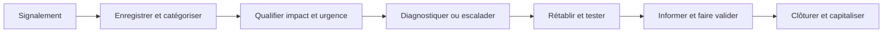
```mermaid
flowchart LR
    S["Signalement"] --> E["Enregistrer et catégoriser"]
    E --> P["Qualifier impact et urgence"]
    P --> D["Diagnostiquer ou escalader"]
    D --> R["Rétablir et tester"]
    R --> U["Informer et faire valider"]
    U --> C["Clôturer et capitaliser"]
```

Le ticket conserve le contexte, les actions et le résultat. L’**impact** décrit les conséquences métier ; l’**urgence** le délai acceptable pour agir ; la **priorité** résulte du croisement défini par l’organisation. Les délais 1 h, 8 h, 24 h et 48 h du support sont des exemples : appliquer les SLA réellement convenus. Un incident majeur peut nécessiter une procédure de crise et une communication spécifique.

L’**escalade fonctionnelle** mobilise une compétence ou un niveau de support adapté ; l’**escalade hiérarchique** mobilise les responsables pour arbitrage, ressources ou situation majeure. Un transfert doit inclure diagnostic, actions tentées et preuves ; le demandeur doit conserver un suivi clair.

### Problèmes, erreurs connues et événements

La gestion des problèmes peut être réactive ou proactive. Elle enregistre, classe, priorise et analyse les causes, documente les contournements et propose des changements si nécessaire. **Précision externe :** distinguer un problème en cours d’analyse d’une erreur connue documentée ; la KEDB sert à réutiliser le diagnostic et les contournements disponibles, pas à remplacer toute la base de connaissances.

Le support distingue événement normal, exception, avertissement et alerte. Définir seuils, filtrage, notification, action automatique éventuelle, intervention et clôture. Tous les événements ne sont pas des incidents ; une alerte nécessite une qualification. Les seuils doivent être adaptés et testés pour éviter de noyer le support dans des notifications inutiles.

## Cas guidé — panne de messagerie récurrente

Rétablir l’accès et informer l’utilisateur dans le ticket d’incident ; relier les récurrences à un dossier problème ; documenter un contournement utilisable ; évaluer la correction durable par le circuit de changement. Les mesures pertinentes portent sur les délais, récurrences, respect des engagements et satisfaction, sans oublier les écarts cachés par une clôture trop rapide.

**Mini-quiz.** 1. Faut-il trouver la cause avant tout rétablissement ? 2. Qui autorise l’accès ? 3. Toute alerte est-elle un incident ? 4. Escalader signifie-t-il perdre le suivi utilisateur ?

??? success "Réponses commentées"
    1. Non : un contournement maîtrisé peut rétablir le service avant l’analyse complète.
    2. L’autorité prévue par la politique et le circuit de validation.
    3. Non : qualifier l’état et ses effets.
    4. Non : transmettre les preuves et maintenir la coordination du suivi.

## Notions détaillées pour approfondir

Les notions détaillées ci-dessous conservent le périmètre et les exemples du support historique, avec une mise en page réparée. Les réserves et corrections exposées plus haut s’appliquent à cette relecture. Pour la formulation source exacte, utiliser **Cours Original**. Les captures sont des illustrations isolées du support, pas des schémas générés.

<section>
<h4>Sensibilisation ITIL</h4>

Module 06 – Les publications centrales

« Exploitation des services »

<h4>Objectifs</h4>
<ul><li>Définir le rôle de l’exploitation des services</li><li>Définir le centre de services</li><li>Différencier les types de support</li><li>Identifier les types d’architecture d’un centre de services</li><li>Identifier les processus</li></ul>
</section>
<section>

L’exploitation des services

<ul><li>Objectif<ul><li>Coordonner les activités des processus garantissant l’atteinte des niveaux de service convenus</li><li>Gérer l’exploitation au quotidien</li></ul></li><li>Ses missions<ul><li>Coordonner et réaliser les activités nécessaires à la fourniture des services<ul><li>Exploitation – Supervision – Pilotage – Support – Maintenance</li></ul></li><li>Être efficace puis efficient tout au long de la vie des services (coût)</li><li>Produire des indicateurs pour permettre à la phase d’amélioration continue de faire des propositions d’optimisation de la DSI</li></ul></li></ul>

L’exploitation des services

<ul><li>Stabilité<ul><li>Le SI fonctionne normalement et est disponible : on ne change plus rien</li><li>Réduction du nombre de changements et donc de Mises En Production au minimum (MEP)</li></ul></li></ul>
<ul><li>Réactivité<ul><li>Réaction aux sollicitations des métiers pour les rendre les plus performantes possibles</li></ul></li></ul>
<ul><li>Coûts par rapport à qualité<ul><li>Éviter la surqualité, réduire les coûts en gardant le niveau de qualité demandé : industrialisation de l’exploitation, supervision et pilotage</li></ul></li></ul>
<ul><li>Réactivité par rapport à proactivité<ul><li>Agir en fonction des évènements ou incidents</li><li>Essayer d’anticiper en recherchant des moyens d’optimiser le SI</li><li>Investir pour garantir un bon fonctionnement</li></ul></li></ul>
</section>
<section>

Les 4 fonctions ITIL v3

<figure>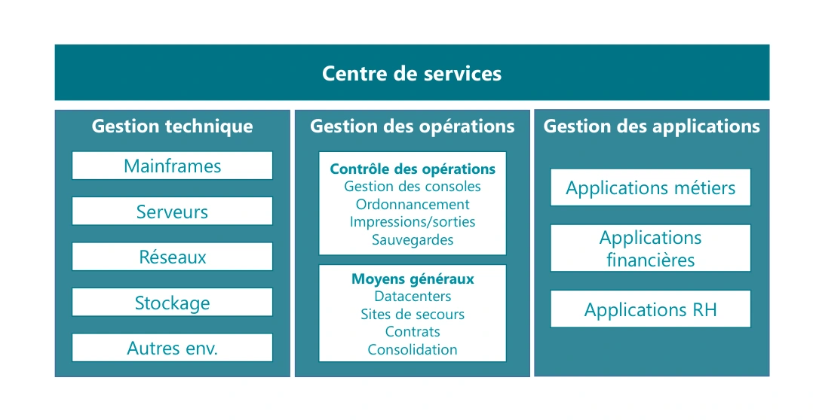<figcaption>Les quatre fonctions ITIL v3 — illustration isolée du support, page 3.</figcaption></figure>

Le centre de service : au cœur de l’exploitation

<figure>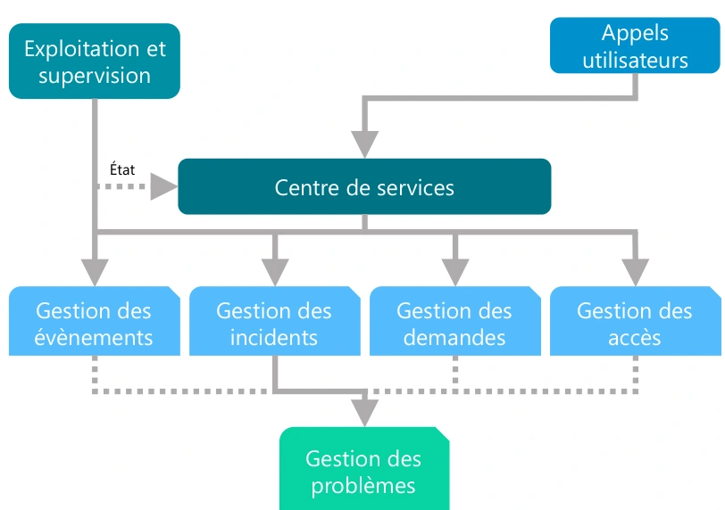<figcaption>Le centre de services au cœur de l’exploitation — illustration isolée du support, page 3.</figcaption></figure>
</section>
<section>

Fonction centre de service

Ses missions

<ul><li>Le « service desk »</li></ul>
<ul><li>Être point de contact unique pour les utilisateurs</li></ul>
<ul><li>Porter toute la relation avec les utilisateurs : relation bidirectionnelle</li></ul>
<ul><li>Servir les utilisateurs et les satisfaire</li></ul>
<ul><li>Garantir la bonne image de la DSI auprès des utilisateurs</li></ul>
<ul><li>Être vitrine du département informatique</li></ul>
<ul><li>Répondre aux questions et demandes des utilisateurs</li></ul>
<ul><li>Restaurer le service dans un état normal, standard le plus rapidement possible dans le respect des délais définis et contractuels</li></ul>
<ul><li>Assurer les activités de N1, gérer les escalades aux groupes supérieurs et coordonner</li></ul>

Fonction centre de service

Les concepts

<ul><li>Le centre d’appels (Call Center)</li></ul>
<ul><li>Le centre d’assistance (Help Desk)</li></ul>
<ul><li>Le centre de services (Service Center)</li></ul>
<figure>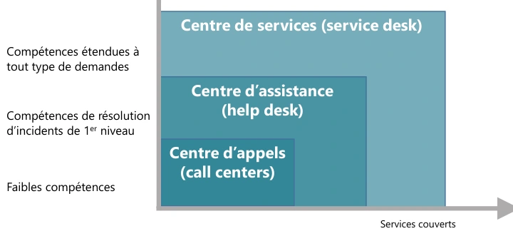<figcaption>Centre d’appels, assistance et centre de services — illustration isolée du support, page 4.</figcaption></figure>
</section>
<section>

Le centre d’appels

<ul><li>Prendre des appels</li><li>Passer des appels en masse</li><li>Un standard téléphonique est en place<ul><li>On l’appelle / Il nous rappelle</li><li>On s’identifie (nom, numéro de contrat, etc.)</li><li>On explique les raisons de l’appel</li><li>La réponse du centre d’appel est souvent : « On vous rappellera », « Un technicien vous rappellera »</li><li>Très peu de valeur ajoutée, réponse minimale pour l’appelant</li><li>Il est le niveau 0</li><li>Gère très peu d’actions, amène une forte frustration des utilisateurs</li><li>Transfert le ticket d’appel</li></ul></li></ul>

Le centre d’assistance

<ul><li>Gère les pannes et les dysfonctionnements remontés par les utilisateurs</li></ul>
<ul><li>Gère et coordonne toutes les activités liées au dépannage de l’utilisateur</li></ul>
<ul><li>Donne des informations sur l’avancement du dépannage si l’utilisateur le demande</li></ul>
<ul><li>Est dans des actions de type réactif</li></ul>
<ul><li>Attend que l’utilisateur appelle pour le renseigner</li></ul>
<ul><li>Le centre d’assistance<ul><li>Est là en support des utilisateurs qui appellent</li><li>Répond aux sollicitations des utilisateurs</li><li>À peu ou pas d’actions proactives vers les utilisateurs</li></ul></li></ul>
</section>
<section>

Le centre de service

<ul><li>Est un surensemble du centre d’assistance en ajoutant des activités de proactivité</li><li>Intervient dans tous les processus de l’exploitation des services</li><li>Et dans une partie des activités de deux processus de la transition des services</li></ul>
<ul><li>La gestion des changements</li><li>La gestion des déploiements et des mises en production</li><li>Ses activités<ul><li>La prise en compte de l’appel de l’utilisateur</li><li>Ouverture du ticket d’appel dans l’outil de gestion du centre de services</li><li>Enregistrement des informations liées à l’appel de l’utilisateur</li><li>La catégorisation</li></ul></li></ul>

Le centre de service

<ul><li>Ses activités suite<ul><li>La codification</li><li>L’investigation et le diagnostic</li><li>La réponse dépendra de la demande utilisateur</li><li>Escalade vers les groupes support de niveau 2 et de niveau 3 si nécessaire</li><li>Le suivi de l’appel</li><li>La résolution / clôture du ticket</li><li>La gestion des enquêtes de satisfaction des utilisateurs</li><li>La mise à jour de la base de connaissance</li></ul></li></ul>
</section>
<section>

Le centre de service : configuration et architecture

<ul><li>Le périmètre (fonctionnalités, horaires, etc.)</li><li>La typologie des appels gérés</li><li>Les périodes de charge et les périodes creuses</li><li>Les moyens nécessaires (les outils)</li></ul>

Va dépendre de

différents paramètres

<ul><li>Le centre de services local</li><li>Le centre de services centralisé</li><li>Le centre de services virtuel</li><li>Le centre de services qui suit le soleil</li></ul>

Quatre types d’architecture

Le centre de service local

<ul><li>Implanté sur le même site que les utilisateurs</li></ul>
<ul><li>Architecture souvent représentée par un guichet, un bureau où les utilisateurs peuvent venir</li></ul>
<ul><li>Implémente des environnements très spécialisés avec des besoins spécifiques</li></ul>
<ul><li>Proximité des utilisateurs</li><li>Forte réactivité, délai d’intervention rapide</li><li>Meilleure compréhension de la problématique des utilisateurs</li><li>Connaissance des utilisateurs eux-mêmes Avantages</li></ul>
<ul><li>Pas de mutualisation des ressources et leur optimisation</li><li>Moins de partage de connaissance avec les autres centres de services locaux Inconvénients</li></ul>
</section>
<section>

Le centre de service local

<figure>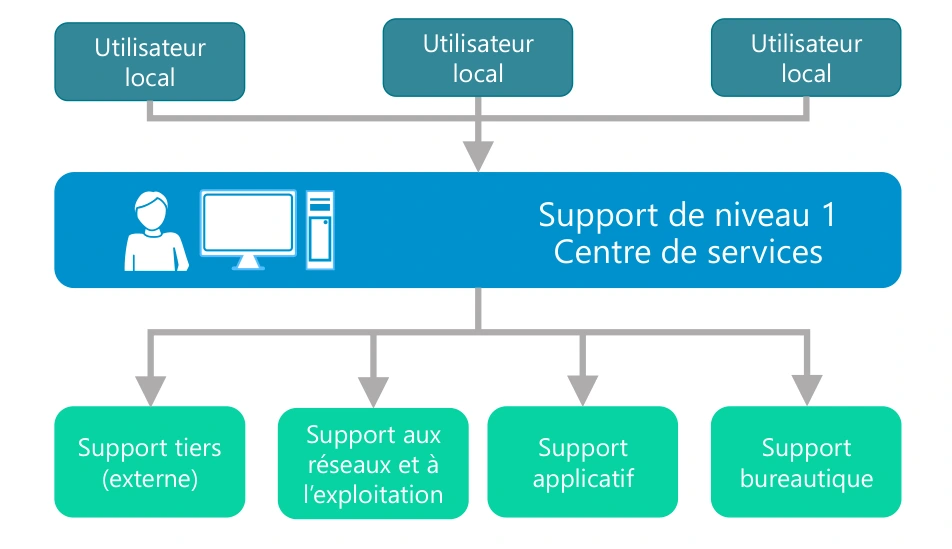<figcaption>Centre de services local — illustration isolée du support, page 8.</figcaption></figure>

Le centre de service centralisé

<ul><li>Implanté sur un site unique</li></ul>
<ul><li>Externalisé</li></ul>
<ul><li>Contacté par des canaux de télécommunication (téléphone, e-mail, intranet)</li></ul>
<ul><li>Mutualisation des ressources et des moyens</li><li>Meilleur partage de l’information et des connaissances : Procédures homogènes Avantages</li></ul>
<ul><li>Pas de proximité avec les utilisateurs</li><li>La réactivité sera moins forte Inconvénients</li></ul>
<ul><li>Outils de prise en mains à distance, technicien de proximité, mixité centre de service local Pour limiter ces</li></ul>

inconvénients

</section>
<section>

Le centre de service centralisé

<figure>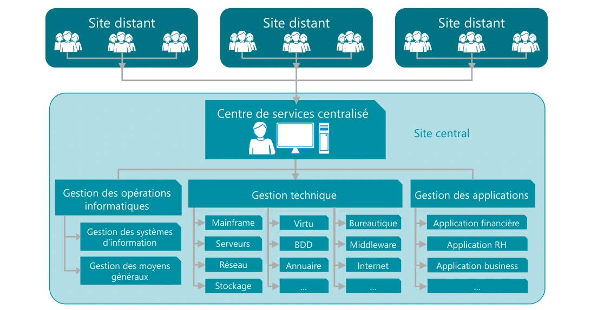<figcaption>Centre de services centralisé — illustration isolée du support, page 9.</figcaption></figure>

Le centre de service virtuel

<ul><li>Mettre le demandeur en relation avec le technicien possédant le meilleur profil</li></ul>
<ul><li>En fonction de :<ul><li>L’heure</li><li>Du pays ou du site d’appel</li><li>Du profil de l’utilisateur appelant</li><li>Du métier du demandeur</li></ul></li></ul>
<ul><li>Une meilleure crédibilité et réactivité Avantages</li></ul>
<ul><li>Mise en place d’outils téléphoniques spécifiques avec SVI</li><li>Problème de coordination des différentes entités</li><li>Pour limiter ces inconvénients : utilisation d’un responsable unique Inconvénients</li></ul>
</section>
<section>

Le centre de service virtuel

<figure>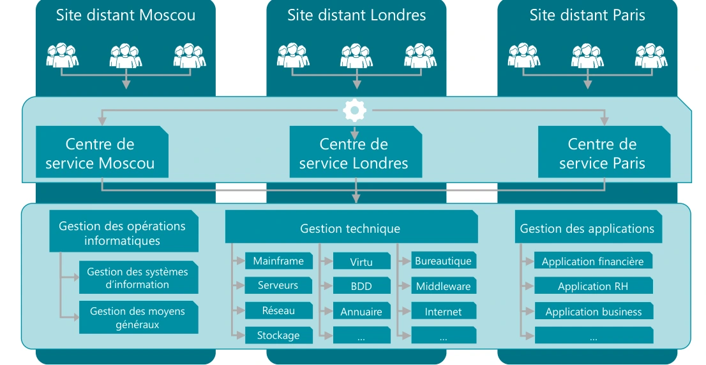<figcaption>Centre de services virtuel — illustration isolée du support, page 10.</figcaption></figure>

Le centre de service qui suit le soleil

<ul><li>Couvre une problématique particulière</li></ul>
<ul><li>Fonctionne 24h/24</li></ul>
<ul><li>Réparti dans plusieurs entités aux quatre coins du monde dans des faisceaux horaires différents</li></ul>
<ul><li>À toute heure du jour ou de la nuit, l’appel est aiguillé vers un centre ou une équipe de jour présente</li></ul>
<ul><li>Choix des moyens et des outils</li></ul>
<ul><li>Avoir des procédures et des escalades communes et partagées</li></ul>
<ul><li>Avoir une langue commune (souvent l’anglais)</li></ul>
</section>
<section>

Le centre de service qui suit le soleil

<figure>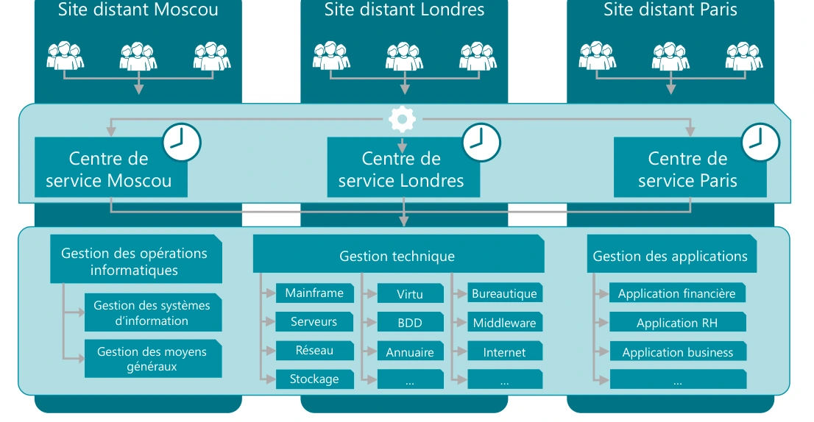<figcaption>Centre de services qui suit le soleil — illustration isolée du support, page 11.</figcaption></figure>

Le centre de service : les outils

<ul><li>L’autocommutateur téléphonique intelligent</li><li>Serveur Vocal Interactif</li><li>Couplage téléphonique informatique</li><li>Logiciel de relation utilisateur (CRM)</li><li>Intégration avec les autres outils<ul><li>Le CMS</li><li>La base des erreurs connues (KEDB)</li><li>La gestion documentaire de l’entreprise (SKMS)</li><li>Les outils de gestion de services</li></ul></li><li>Centre de services dit en libre-service (utilisateurs autonomes)</li></ul>

TAPEZ 1

TAPEZ 2

TAPEZ 3

</section>
<section>

Les processus de l’exploitation des services

<ul><li>L’exécution des requêtes<ul><li>Traiter les demandes de services provenant des utilisateurs</li></ul></li><li>La gestion des accès<ul><li>Traiter les requêtes relatives à l’accès, aux droits et aux privilèges des utilisateurs</li></ul></li><li>La gestion des incidents<ul><li>Restauration au plus vite du service dégradé ou arrêté dans les délais impartis</li></ul></li><li>La gestion des problèmes<ul><li>Rechercher les causes et solutions à des incidents récurrents</li></ul></li><li>La gestion des évènements<ul><li>Interpréter et gérer tous les faits détectables qui arrivent sur l’infrastructure, qu’ils soient normaux ou anormaux</li></ul></li></ul>

L’exécution des requêtes

<ul><li>Objectifs<ul><li>Fournir un canal privilégié vers la DSI aux utilisateurs pour émettre et traiter leurs demandes</li><li>Fournir de l’assistance auprès des utilisateurs sur l’utilisation des services</li><li>Approvisionner des composants standards des services suivant les demandes des utilisateurs</li><li>Fournir un canal pour faire remonter les plaintes des utilisateurs vers la DSI</li></ul></li><li>Une requête : demande de service provenant d’un utilisateur<ul><li>Assistance</li><li>Conseil</li><li>Information</li><li>Changement standard simple</li></ul></li></ul>
<ul><li>Approvisionnement de consommable</li><li>Accès à un service</li><li>Une plainte</li><li>Tout ce qui n’est pas un incident</li></ul>
</section>
<section>

L’exécution des requêtes

<ul><li>Une requête va réaliser une action<ul><li>Limitée dans le temps</li><li>À faible risque et coût</li><li>Traitée par une seule personne</li></ul></li><li>Le catalogue des requêtes<ul><li>Base du fonctionnement de ce processus</li><li>Liste précise et détaillée des demandes de services provenant des utilisateurs</li><li>Identifie précisément quel profil d’utilisateur a le droit de demander telle requête</li><li>Diffusion et promotion de ce catalogue auprès de tous les utilisateurs sont un enjeu majeur</li></ul></li></ul>

La gestion des accès

<ul><li>Objectifs<ul><li>Mettre en place les procédures définies par :<ul><li>La politique de sécurité de la DSI</li><li>Les recommandations de la gestion de la disponibilité</li><li>Les procédures doivent aussi être connues et diffusées auprès de tous</li></ul></li><li>Fournir aux utilisateurs les droits et privilèges d’un service ou d’un groupe de services</li></ul></li><li>Les droits<ul><li>Ensemble des règles qui vont définir les types d’accès à un service ou un groupe de services</li></ul></li><li>L’identité<ul><li>Gestion d’une identification fiable des utilisateurs qui vont accéder à ce service</li></ul></li></ul>
</section>
<section>

La gestion des accès

<ul><li>L’accès au service<ul><li>Est le niveau, le périmètre de fonctionnalités ou de données auquel un utilisateur peut avoir accès</li><li>Notions de confidentialité, gestion des mots de passe et règles associées (initialisation, validation et revalidation)</li></ul></li><li>L’identité des groupes<ul><li>Cartographie des groupes de l’entreprise nécessaire</li><li>Notions de groupe de services offerts à un utilisateur ou groupe d’utilisateurs</li><li>Cartographie des services mettant en avant les familles de services en fonction des droits</li></ul></li></ul>

La gestion des incidents

<ul><li>Objectifs<ul><li>Rétablir le service dans un état normal de plus rapidement possible conformément au SLA</li><li>Rétablir c’est trouver une solution, un palliatif, qui va relancer le service dans son état normal</li><li>Minimiser l’impact de l’incident sur les utilisateurs (les conséquences pour l’utilisateur)</li><li>Rétablir le service dans les délais contractuels (engagement auprès du client)</li><li>Ce processus ne s’occupe pas de trouver la cause de l’incident</li></ul></li></ul>
</section>
<section>

La gestion des incidents

<ul><li>Définition d’un incident<ul><li>Ne pas confondre incident, évènement et problème</li><li>Un évènement est un fait détectable qui arrive du SI alors que l’incident est un évènement qui altère ou dégrade le service rendu</li><li>Il survient lorsque le service est arrêté ou quand la qualité du service est diminuée</li><li>L’incident a pour origine un évènement (détecté ou non), mais tous les évènements ne créent pas d’incident</li><li>Il est détecté soit par un utilisateur, des outils de supervision ou de pilotage par la gestion des évènements</li></ul></li></ul>

La gestion des incidents

<ul><li>Codifier un incident : c’est déterminer la priorité que l’on va lui attribuer</li><li>Pour cela :<ul><li>Identifier l’impact de l’incident</li><li>Identifier l’urgence de l’incident</li><li>Utilisation d’une matrice ou d’un référentiel applicatif</li></ul></li><li>Détermination du délai de rétablissement</li></ul>

Toutes ces notions devront être notées dans les SLA pour chaque service et négociées avec les clients avant la mise en exploitation du service.

</section>
<section>

La gestion des incidents

<ul><li>L’impact : effet de l’incident sur l’utilisation d’un service<ul><li>Perte d’exploitation :<ul><li>Nombre d’utilisateurs bloqués</li><li>Non-respect des dispositions légales</li></ul></li><li>Positionné sur une échelle de 1 à 3 ou de 1 à 5 (1 élevé, 3 ou 5 faible)</li></ul></li></ul>
<ul><li>L’urgence : temps dont dispose la DSI pour rétablir le service<ul><li>Positionnée sur une échelle de 1 à 3 ou de 1 à 5</li></ul></li></ul>
<table><caption>Code de priorité : croisement impact et urgence</caption><thead><tr><th scope="col">Impact / urgence</th><th scope="col">Élevée</th><th scope="col">Moyenne</th><th scope="col">Faible</th></tr></thead><tbody><tr><td>Élevé</td><td>1</td><td>2</td><td>3</td></tr><tr><td>Moyen</td><td>2</td><td>3</td><td>4</td></tr><tr><td>Faible</td><td>3</td><td>4</td><td>5</td></tr></tbody></table>
<table><caption>Délais d’exemple du support</caption><thead><tr><th scope="col">Code de priorité</th><th scope="col">Description</th><th scope="col">Durée de résolution prévue</th></tr></thead><tbody><tr><td>1</td><td>Critique</td><td>1 heure</td></tr><tr><td>2</td><td>Élevée</td><td>8 heures</td></tr><tr><td>3</td><td>Moyen</td><td>24 heures</td></tr><tr><td>4</td><td>Faible</td><td>48 heures</td></tr><tr><td>5</td><td>Planification</td><td>Best effort</td></tr></tbody></table>
<table><tbody><tr><td></td><td></td><td></td><td></td><td></td><td></td><td>Code de priorité</td><td>Description</td><td>Durée de résolution prévue</td></tr><tr><td>Code</td><td>de priorité</td><td>Elevée</td><td>Urgence Moyenne</td><td>Faible</td><td></td><td>1 2</td><td>Critique Elevée</td><td>1 heure 8 heures</td></tr><tr><td>Impact</td><td>Elevé Moyen Faible</td><td>1 2 3</td><td>2 3 4</td><td>3 4 5</td><td></td><td>3 4 5</td><td>Moyen Faible Planification</td><td>24 heures 48 heures Best effort</td></tr></tbody></table>

La gestion des incidents

<ul><li>L’incident majeur<ul><li>Fort impact sur les clients</li><li>Hors grille de codification</li><li>D’une priorité très élevée</li><li>Traité différemment des autres incidents</li><li>Utilisation d’une procédure dite de « crise »</li></ul></li></ul>
</section>
<section>

La gestion des incidents

<ul><li>Les escalades</li></ul>
<ul><li>Survient quand une équipe est dans l’incapacité de réaliser un traitement (diagnostic ou rétablissement)</li><li>Transfert vers un niveau supérieur ou de mêmes niveaux d’expertise, mais dans un autre domaine Escalade fonctionnelle</li></ul>
<ul><li>Escalade à la hiérarchie pour une situation particulière</li><li>Incidents majeurs potentiels</li><li>Impact fort sur les branches métier</li><li>Blocage dû à un manque de ressources, moyens… Escalade hiérarchique</li></ul>

La gestion des incidents

<ul><li>Concepts<ul><li>Période de fourniture des services : définir un calendrier d’utilisation des services</li><li>Arbre de résolution<ul><li>Modèle d’incident – Branche de l’arbre la plus souvent parcourue</li><li>Listing de dépannage – Check-list</li></ul></li><li>Base de connaissance : liste des incidents connus et leurs solutions</li><li>Incident majeur : gravité importante pour les clients</li><li>Crises : incident majeur à résoudre tout de suite. Peut donner suite à un Post-Mortem</li></ul></li></ul>
</section>
<section>

La gestion des incidents

<figure>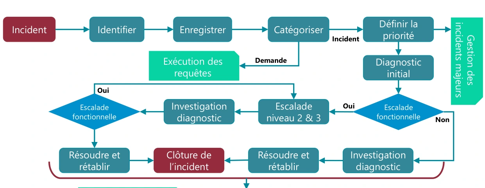<figcaption>Processus de gestion des incidents : circuit principal — illustration isolée du support, page 18.</figcaption></figure>
<figure><figcaption>Processus de gestion des incidents : escalades hiérarchiques — illustration isolée du support, page 18.</figcaption></figure>

La gestion des problèmes

<ul><li>Objectifs<ul><li>Faire diminuer le nombre d’incidents</li><li>Prévenir l’apparition de nouveaux incidents et problèmes</li><li>Minimiser l’impact des incidents</li><li>Optimiser l’efficacité des équipes supports</li><li>Contrôler les problèmes : les transformer en erreurs connues</li><li>Gérer les erreurs</li><li>La proactivité<ul><li>Participe à maintenir le niveau de qualité de service demandé</li><li>Prend l’initiative de la recherche de situations qui dégradent ce niveau</li></ul></li></ul></li></ul>
</section>
<section>

La gestion des problèmes

<ul><li>Un problème<ul><li>Situation dont on recherche la cause inconnue d’un ou plusieurs incidents</li><li>La gestion des incidents traite en temps réel les situations (front line)</li><li>La gestion des problèmes traite les causes de ces situations (back-office)</li><li>Tous les incidents ne déclenchent pas de problèmes</li><li>On ouvre un problème dans le cas d’incidents récurrents ou dans un contexte d’incident majeur</li></ul></li><li>Une erreur connue<ul><li>Problème dont on connaît la cause et dont on a identifié une solution temporaire ou définitive</li><li>La base des erreurs connues (KEDB) contient l’ensemble de ces problèmes transformés en erreurs connues</li><li>Base mise à disposition du centre de services sous la responsabilité des groupes support</li></ul></li></ul>

La gestion des problèmes

<figure>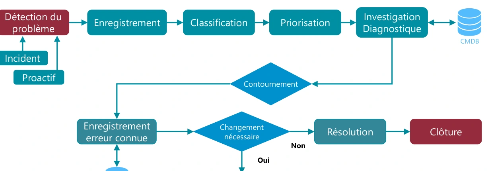<figcaption>Processus de gestion des problèmes : circuit principal — illustration isolée du support, page 19.</figcaption></figure>
<figure><figcaption>Processus de gestion des problèmes : connaissance et changements — illustration isolée du support, page 19.</figcaption></figure>
</section>
<section>

La gestion des évènements

<ul><li>Objectifs<ul><li>Minimiser le nombre d’incidents</li><li>Objectif principal<ul><li>Plus d’efficacité dans la gestion des évènements entraîne moins d’incidents</li><li>Surveiller les évènements et les comprendre</li><li>Positionner des seuils et des alarmes</li></ul></li><li>Garantir le niveau de qualité de service<ul><li>Anticiper les situations pouvant détériorer le niveau de qualité de service</li><li>Avoir une action proactive sur la gestion des évènements pour maintenir et garantir le niveau de qualité de service</li><li>Positionner des seuils sur les composants clés</li></ul></li></ul></li></ul>

La gestion des évènements

<ul><li>Définition d’un évènement<ul><li>Fait détectable arrivant sur le système d’information ou sur la fourniture d’un service</li><li>Changement d’état d’un ou plusieurs composants de l’infrastructure</li><li>Aléatoire, observable et mesurable</li><li>Des outils sont nécessaires pour le détecter et le mesurer</li><li>Sans outillage, pas d’évènement</li></ul></li><li>4 types d’évènements</li></ul>

Normal Exception Avertissement Alerte (ou alarme)

</section>
<section>

La gestion des évènements

<ul><li>Évènement normal<ul><li>Indique un fonctionnement normal, dans la Baseline.</li></ul></li><li>Évènement exception<ul><li>Évènement anormal survenu sur l’infrastructure</li><li>Peut-être visible par les utilisateurs sans dégrader le niveau de qualité de service offert</li><li>Peut se transformer en incident si la situation impacte le niveau de qualité de service</li></ul></li></ul>
<ul><li>Évènement avertissement<ul><li>Évènement inhabituel, un avertissement (Approche d’un seuil critique, un pic d’activité)</li></ul></li><li>Évènement alerte<ul><li>Exception nécessitant une intervention</li><li>Prédéfini en avance avec positionnement d’un seuil</li><li>Des consignes préétablies vont permettre d’intervenir</li><li>Un travail préliminaire sur l’identification des seuils est nécessaire</li></ul></li></ul>

La gestion des évènements

<figure>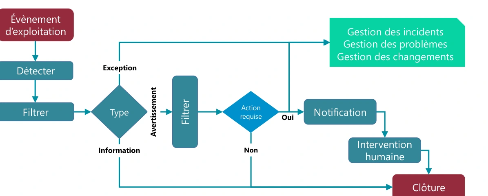<figcaption>Processus de gestion des événements — illustration isolée du support, page 21.</figcaption></figure>
</section>

## Pratiquer et réviser

- [Fiche de révision du module](../../revision/itil/module-06-exploitation-des-services.md)
- [Retour à la séquence](index.md)
