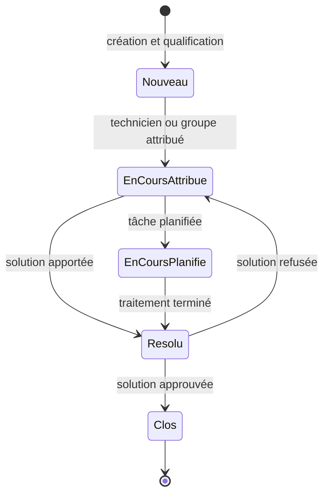
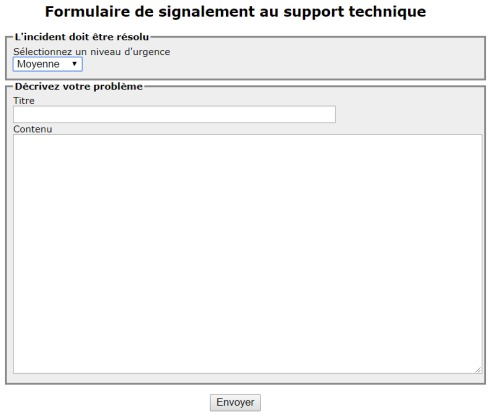

# Module 09 — Assistance avec GLPI

**Séquence :** Sensibilisation ITIL et gestion de parc  
**Importance :** socle de la progression officielle  
**Sources consolidées :** 1 support(s) de cours, 1 énoncé(s), 1 correction(s)

!!! warning "Périmètre et versions"
    La progression suit principalement les publications du cycle de vie ITIL v3, complétées par une introduction à ITIL 4. Cette structure historique est conservée car elle constitue l’ordre officiel des supports.

## Objectifs et compétences

- Créer et qualifier un ticket.
- Prendre en charge, suivre et résoudre.
- Documenter une solution dans la base de connaissances.
- Clôturer après validation par l’utilisateur.

!!! tip "Façon simple de le comprendre"
    Ce module sert à passer de la notion « Assistance avec GLPI » à une méthode que l’on peut expliquer, appliquer, vérifier et dépanner.

## Méthode de travail

1. Lire les concepts dans l’ordre du support.
2. Reproduire les exemples dans un environnement de laboratoire.
3. Noter le résultat attendu avant de modifier une configuration.
4. Vérifier avec l’outil ou la commande appropriée.
5. Revenir à l’état initial si le résultat diverge.

## Cycle de vie d’un ticket

Le support distingue « résolu » de « clos » : la clôture intervient après approbation de la solution par le demandeur ou selon la règle prévue.

<figure class="tssr-source-figure">
  
  <figcaption>Exemple d’interface anonyme de création d’un ticket, sans donnée personnelle. Source : support Administration GLPI, module 04, page 3.</figcaption>
</figure>

## Module 09 - Support de cours

### Sensibilisation ITIL

#### Module 09 — Assistance avec GLPI

- Découvrir la création d’un ticket

- Découvrir le traitement d’un ticket

- Appréhender la base de connaissance

- Dans le monde de l’informatique, tout fonctionne à base de ticket

- Cela va permettre de solliciter la DSI

- Un ticket passera par plusieurs statuts : cycle de vie du ticket

- Peut-être de type incident ou demande

- Doit compter un minimum d’informations

- De nombreux avantages

#### Le ticket

#### Traçabilité Détection des

#### problèmes

#### Répartition des

#### tâches Communication

#### Utilisation d’un outil de gestion de ticket

- Système de gestion de tickets / outil de ticketing

- Conforme aux bonnes pratiques ITIL

- Recueil des sollicitations utilisateur pour une gestion centralisée

- Différents canaux de communication possibles

- Saisie, suivi et traitement du ticket

- Cycle de vie des tickets

- Statistiques possibles

#### L’assistance sous GLPI

### Trois grandes façons de créer un ticket

#### Flux d’entrée

- Interface d’ouverture de tickets anonymes

- Interface simplifiée

- Interface standard

#### Depuis GLPI

- Envoi d’un mail dans une boîte mail support

- Configuration d’un collecteurMail

- Création du ticket par téléphone

- Utilisation de l’interface standard par le technicien Téléphone

#### Cycle de vie d’un ticket

- Ni groupes et utilisateurs sur le ticketNouveau

- En attente d’éléments =&gt; Modification manuelleEn attente

- Au moins un utilisateur/groupe est attribuéEn cours attribué

- Une tâche vient d’être planifiéeEn cours planifié

- Une solution vient d’être apportée au ticketRésolu

- La solution est approuvée par le demandeurClos

### Traitement d’un ticket : aperçu

- Utilisateurs, groupes ou fournisseurs

- Représente les techniciens ou groupes de compétence en charge

#### du ticket

- Utilisé lors des escalades fonctionnelles

- Raccourci pour s’attribuer nominativement le ticket

- Peut être automatisé en fonction de critères à la création du ticket

- Ticket visible pour traitement par les groupes et utilisateurs

#### attribués

#### Traitement d’un ticket : attribution

#### Attribution

### critères

- Utilisé lors des escalades hiérarchiques

- Utilisateurs et groupes

- Notifications sans traitement possible du ticket

- Va permettre de suivre l’évolution d’un ticket

- Peuvent être ajoutés automatiquement à la création en fonction de

#### Traitement d’un ticket : observateurs

#### Ajout

- Doivent être facilement identifiables

- Le type : temps de résolution

- La durée maximum de résolution souhaitée

- Possibilité de créer des niveaux d’escalade

#### Traitement d’un ticket : SLA

#### Dépasser la date butoir de résolution

#### n’est pas bloquant, juste informatif

### Traitement d’un ticket : validation

- Un ticket peut nécessiter une validation hiérarchique

- Manuelle ou automatique à la création

- Non bloquant pour le traitement du ticket

- Droits spécifiques pour pouvoir être « valideur »

- Demandes multiples possibles

- Les valideurs reçoivent une notification de validation

- Ils approuvent ou refusent en accédant au ticket à valider.

#### Comment ?

#### Traitement d’un ticket : validation

#### Liste de ses tickets à valider

#### Depuis notre vue personnelle

- Onglet Traitement du ticket

- Quatre possibilités

- Suivi

- Tâche

- Solution

- Document

#### Traitement d’un ticket : traitement

### téléphone)

- La clôture du ticket s’effectue à l’approbation de la solution

- Peut être effectuée par le demandeur ou le rédacteur (ticket par

- Accessible par le mail de validation ou le menu ticket de l’interface

#### simplifiée

- Commentaire obligatoire en cas de refus

- Possibilité de planifier ou rendre la clôture immédiate à la résolution

#### Traitement d’un ticket : clôture

- Liaison de CI possible à la création d’un ticket

- Utile pour le diagnostic

- Utile pour les statistiques

- Nécessite une CMDB à jour et bien renseignée

#### Ticket : éléments liés

- Objectifs

- Centraliser des connaissances internes aux différents techniciens

- Mettre à disposition des utilisateurs des informations (FAQ)

- Accessible depuis Outils =&gt; Base de connaissances

- Restriction à un nombre d’acteurs

- Validation de publications d’articles

- Gestion des révisions

- Liaisons possibles avec les tickets et les éléments d’inventaire (CI)

- FAQ : sous-partie de la base de connaissances à destination des

#### utilisateurs

- Organisation possible par catégories et restrictions temporelles

#### Base de connaissances : article

- Création d’un article

- Ajout des cibles

- Usage public ou non

- Article sans cible = Article non publié

- Apparaît dans Gérer

- Visible que par son créateur

#### Base de connaissances : création

### Base de connaissances : cibles

- Vont permettre de publier l’article à différentes personnes

- Entité — Profil — Groupe - Utilisateur

- Éviter la création systématique d’un ticket

- FAQ (Foire Aux Questions)

- Accessible depuis l’interface simplifiée

- Accès rapide ou par catégories

#### Base de connaissances publiques

### Démo

#### Création et gestion

#### des tickets

#### TP

#### L'exploitation des

#### services

## Mise en pratique

- [Travaux pratiques du module](../../tp/itil/module-09/index.md)
- [Fiche de révision du module](../../revision/itil/module-09-assistance-avec-glpi.md)

## Questions flash

1. Comment expliquer simplement « Assistance avec GLPI » à un collègue ?
2. Quelles étapes ou notions doivent être maîtrisées avant la manipulation ?
3. Quel contrôle permet de prouver que le résultat est correct ?
4. Quel est le premier risque ou piège à écarter ?

??? success "Éléments de réponse"
    - Créer et qualifier un ticket.
    - Prendre en charge, suivre et résoudre.
    - Documenter une solution dans la base de connaissances.
    - Clôturer après validation par l’utilisateur.

## Voir aussi

- [Présentation de la séquence](index.md)
