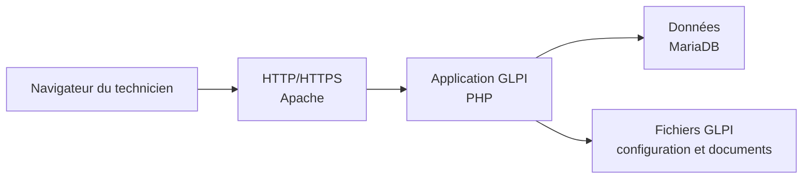

# Module 01 — Présentation de l’environnement — Installation de GLPI

**Séquence :** Administration GLPI  
**Importance :** socle de la progression officielle  
**Sources consolidées :** 1 support(s) de cours, 1 énoncé(s), 1 correction(s)

!!! warning "Périmètre et versions"
    Le laboratoire cible GLPI 9.5, PHP 7.4 et FusionInventory. Pour GLPI 10 et 11, l’inventaire est natif et FusionInventory n’est plus pris en charge ; les déploiements actuels doivent suivre la documentation GLPI et utiliser GLPI Agent. Référence : [Documentation GLPI](https://help.glpi-project.org/documentation), [FAQ inventaire GLPI](https://help.glpi-project.org/faq/glpi/inventory).

## Objectifs et compétences

- Comprendre l’architecture Apache, PHP et MariaDB.
- Préparer une base et un compte SQL dédiés.
- Installer les fichiers GLPI avec des permissions adaptées.
- Finaliser l’assistant, supprimer les comptes par défaut et sécuriser l’accès.

!!! tip "Façon simple de le comprendre"
    Ce module sert à passer de la notion « Présentation de l’environnement — Installation de GLPI » à une méthode que l’on peut expliquer, appliquer, vérifier et dépanner.

## Méthode de travail

1. Lire les concepts dans l’ordre du support.
2. Reproduire les exemples dans un environnement de laboratoire.
3. Noter le résultat attendu avant de modifier une configuration.
4. Vérifier avec l’outil ou la commande appropriée.
5. Revenir à l’état initial si le résultat diverge.

## Architecture de l’application



<p class="tssr-caption">Pour diagnostiquer une installation, suivre le trajet de la requête : écoute d’Apache, exécution PHP, accès MariaDB puis droits sur les fichiers de l’application.</p>

## Commandes repérées dans les supports

```text
mysql&gt;create database glpidata;
mysql&gt;grant all privileges on glpidata.* to root@localhost identified by ‘MotDePass’;
Mysql&gt;create database glpidb;
Mysql&gt;show databases ;
Mysql&gt;grant all privileges on glpidata.* to root@localhost identified by ‘motdep ass’;
Mysql&gt;show grants for root@localhost;
tar xvzf /var/www/glpi-xxxx.tar.gz
rm glpi-xxxx.tar.gz
chown -R root glpi
systemctl reload apache2.service
```

!!! warning
    Une commande extraite d’un support n’est pas à exécuter aveuglément. Vérifier la version, les droits, la cible et l’existence d’une sauvegarde avant toute action destructive.

## Module 01 - Support de cours

### Administration GLPI

#### Module 01 — Présentation de l'environnement - Installation de GLPI

- Présentation de l’environnement de formation

- Présentation du projet GLPI par son site internet

- Présentation des principaux composants logiciels nécessaires

- Installation du service de base de données MySQL/MariaDB

- Installation du service Web Apache2

- Installation de l’interpréteur PHP et des modules requis par GLPI

- Récupération du code de GLPI et lancement du paramétrage initial

### Présentation de l'environnement — Installation de GLPI

#### Installation de GLPI

#### Présentation de l'environnement — Installation de GLPI

#### Environnement de la semaine

#### srv-glpi srv-CD01

#### PFSENSE

#### VMNET 18

#### Réseau de salle

192.168.1.1192.168.1.2 192.168.1.254

#### DHCP

#### Administrateur système / bureautique

- Mise en place d’un GLPI au sein de l’entreprise

- La gestion et l’hébergement par Olympus

- Authentification centralisée et habilitations GLPI dynamiques

- Inventaire du matériel d’Olympus

- Traitement uniformisé et automatisé des tickets

- Inventaire régulier des machines de l’entreprise Olympus

#### Contexte

#### Présentation de l'environnement — Installation de GLPI

#### Présentation de GLPI

- G.L.P .I :Gestion Libre de Parc Informatique

- ITSM (IT Service Management) conforme ITIL

- Logiciel libre sous licence GPL 100% libre

- Logiciel complet pour la gestion de parc et centre de services

- Plusieurs langues et plug-ins de disponibles

- Installation possible sous Windows et Linux

- Pour les petits comme les grands systèmes d’information

#### Présentation de GLPI

#### Présentation de l'environnement — Installation de GLPI

#### Les composants de GLPI

- Application web : nécessite un serveur web avec le moteur PHP

- Linux : Apache2 ou Windows : IIS avec PHP ou Nginx avec PHP

- Installation sous Linux : paquets apache2.4 et php7.4

- Extensions PHP obligatoires / recommandées :

#### Installation — Serveur Web

- php-mysql

- php-mbstring

- php-curl

- php-gd

- php-xml

- php-ldap

- php-xmlrpc

- php-imap

- php-intl

- php-zip

- php-bz2

- php-apcu-bc

- php-cas

#### Présentation de l'environnement — Installation de GLPI

#### Installation — Serveur de base de données

- GLPI a besoin de stocker des informations en base de données et pour

#### cela il utilise un SGBD (Système de Gestion de Base de Données)

#### Installation — Serveur de base de données

- SGBD pris en charge par GLPI

- MySQL

- MariaDB

- Installation de MariaDB

- Paquet : mariadb-server

- Composants du serveur GLPI

#### Fonctionnement — Serveur de base de données

#### Présentation de l'environnement — Installation de GLPI

#### Sécurisation du serveur de base de données MariaDB

#### Sécurisation - Serveur de bases de données

#### # apt install mariadb-server mariadb-client

#### # mysql_secure_installation

Change the root password? [Y/n] n # mot de passe pour l’utilisateur root dans MySQL Remove anonymous users? [Y/n] Y # ne permettre l’accès à mariadb que pour root Disallow root login remotely? [Y/n] Y # empêcher un accès distant à mariadb Remove test database and access to it? [Y/n] Y # supprimer la base de données de test Reload privilege tables now? [Y/n] Y # recharger mariadb avec cette nouvelle configuration

#### Sécurisation du serveur de base de données MariaDB

- Paramétrage du serveur de base de données MariaDB

- Connexion au Shell du SGBD MariaDB

- Création d’une base de données

- Affectation des droits à l’utilisateur root de mariadb

#### Paramétrage - Serveur de bases de données

#### # mysql —u root —p

`mysql&gt;create database glpidata;`

`mysql&gt;grant all privileges on glpidata.* to root@localhost identified by ‘MotDePass’;`

#### Toutes les commandes MySQL doivent se

terminer par un point-virgule.

#### Présentation de l'environnement — Installation de GLPI

- Récupération de l’archive GLPI sur le site de l’éditeur

- Décompression à la racine du serveur web (/var/www/)

- Accès à l’interface web de GLPI via l’URL «http://@ipSrvGLPI/glpi »*

#### * URL par défaut d’accès à l’application pouvant varier

#### Installation — Application GLPI

- Post configuration - Language

#### Configuration — Application GLPI

#### Présentation de l'environnement — Installation de GLPI

- Post configuration - Installation ou mise à jour

#### Configuration — Application GLPI

- Post configuration - Test des prérequis

#### Configuration — Application GLPI

#### Présentation de l'environnement — Installation de GLPI

- Post configuration - Accès à la base de données

#### Configuration — Application GLPI

127.0.0.1

#### root

#### Mot de passe de root mariadb

- Post configuration - Initialisation d'une base de données

#### Configuration — Application GLPI

#### Présentation de l'environnement — Installation de GLPI

- Comptes par défauts

- glpi/glpi pour le compte administrateur

- tech/tech pour le compte technicien

- normal/normal pour le compte normal

- post-only/postonly pour le compte postonly

- Changement des mots de passe par défaut

- Désactivation du fichier « install/install.php »

- Définition d’un nom d’hôte d’accès à l’application

#### Configuration — Application GLPI

#### Configuration — Application GLPI

## Mise en pratique

- [Travaux pratiques du module](../../tp/glpi/module-01/index.md)
- [Fiche de révision du module](../../revision/glpi/module-01-presentation-de-l-environnement-installation-de-glpi.md)

## Questions flash

1. Comment expliquer simplement « Présentation de l’environnement — Installation de GLPI » à un collègue ?
2. Quelles étapes ou notions doivent être maîtrisées avant la manipulation ?
3. Quel contrôle permet de prouver que le résultat est correct ?
4. Quel est le premier risque ou piège à écarter ?

??? success "Éléments de réponse"
    - Comprendre l’architecture Apache, PHP et MariaDB.
    - Préparer une base et un compte SQL dédiés.
    - Installer les fichiers GLPI avec des permissions adaptées.
    - Finaliser l’assistant, supprimer les comptes par défaut et sécuriser l’accès.

## Voir aussi

- [Présentation de la séquence](index.md)
