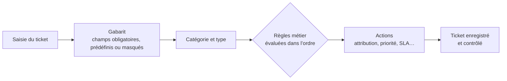
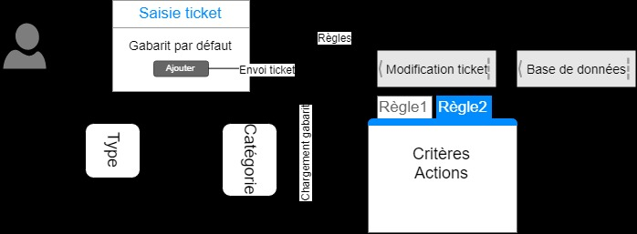

# Module 04 — Assistance — Traitements automatisés des tickets

**Séquence :** Administration GLPI  
**Importance :** socle de la progression officielle  
**Sources consolidées :** 1 support(s) de cours, 1 énoncé(s), 1 correction(s)

!!! warning "Périmètre et versions"
    Le laboratoire cible GLPI 9.5, PHP 7.4 et FusionInventory. Pour GLPI 10 et 11, l’inventaire est natif et FusionInventory n’est plus pris en charge ; les déploiements actuels doivent suivre la documentation GLPI et utiliser GLPI Agent. Référence : [Documentation GLPI](https://help.glpi-project.org/documentation), [FAQ inventaire GLPI](https://help.glpi-project.org/faq/glpi/inventory).

## Objectifs et compétences

- Configurer catégories et gabarits de tickets.
- Créer des règles métiers avec critères et actions.
- Définir calendriers, SLM, SLA et escalades.
- Tester l’ordre de traitement sur des tickets représentatifs.

!!! tip "Façon simple de le comprendre"
    Ce module sert à passer de la notion « Assistance — Traitements automatisés des tickets » à une méthode que l’on peut expliquer, appliquer, vérifier et dépanner.

## Méthode de travail

1. Lire les concepts dans l’ordre du support.
2. Reproduire les exemples dans un environnement de laboratoire.
3. Noter le résultat attendu avant de modifier une configuration.
4. Vérifier avec l’outil ou la commande appropriée.
5. Revenir à l’état initial si le résultat diverge.

## Du gabarit à la règle métier

Tester avec des tickets représentatifs permet de vérifier à la fois les critères, les actions et l’effet de l’ordre des règles.

<figure class="tssr-source-figure">
  
  <figcaption>Le support illustre le chargement du gabarit puis l’évaluation de règles avec critères et actions. Source : support Administration GLPI, module 04, page 7.</figcaption>
</figure>

## Module 04 - Support de cours

### Administration GLPI

#### Module 04 — Assistance — Traitements automatisés des tickets

- Le suivi opérationnel par des tickets

- Les différentes solutions pour créer un ticket

- Les gabarits de ticket : personnalisation du masque de saisie

- Déclencheurs du chargement d’un gabarit de ticket

- Les règles métiers pour modifier dynamiquement un ticket

- La gestion des niveaux de services (SLA)

- Ordre de création pour un traitement automatisé

### Assistance — T raitements automatisés des tickets

#### Rappels sur les tickets

#### Assistance — T raitements automatisés des tickets

- Dans le monde de l’informatique, tout fonctionne à base de ticket

- Il va permettre de solliciter le centre de service

- Un ticket passera par plusieurs statuts : c’est le cycle de vie

#### d’un ticket

- Il peut être de type « incident » ou « demande »

- Il doit compter un minimum d’informations

#### Le ticket

#### Traçabilité Détection des

#### problèmes

#### Répartition des

#### tâches Communication

#### Utilisation d’un outil de gestion de ticket

#### Trois façons de créer un ticket

#### Flux d'entrée

- Interface d’ouverture de tickets anonymes

- Interface simplifiée

- Interface standard

#### Depuis GLPI

- Envoi d’un mail dans une boîte mail support

- Configuration d’un collecteurMail

- Création du ticket par téléphone

- Utilisation de l’interface standard par le technicien Téléphone

#### Assistance — T raitements automatisés des tickets

- http(s)://&lt;@glpi&gt;/front/helpdesk.html

- Aucune authentification requise

- Possibilité de désactivation

- Personnalisation possible : HTML/CSS

- Par défaut, rattaché à l’entité racine

#### Création ticket : interface anonyme

- Accessible après authentification

- Formulaire à compléter et géré par

#### un gabarit

- Si une délégation est configurée,

#### possibilité de sélectionner un

#### utilisateur

- Ajout possible de document

#### (imprime écran, manuel, etc.)

- Suivi par mail possible

- Association possible des CI concernés

- Récapitulatif de tous ses tickets

#### depuis l’accueil

#### Création ticket : interface simplifiée

#### Assistance — T raitements automatisés des tickets

- Assistance =&gt; Tickets =&gt;

- Ticket par téléphone

- Utilisé par le support N1

#### et N2

- Accès à plus d’éléments

- Vu en détail par la suite

#### Création ticket : interface standard

#### Gabarits de ticket

#### Assistance — T raitements automatisés des tickets

- Personnalisation de l’interface de saisie d’un ticket en fonction

#### du type et d’une catégorie de ticket

- Interface standard et simplifiée

- Champs obligatoires

- Champs masqués

- Champs prédéfinis

- Notion de gabarit par défaut

- Accessibles depuis le menu listant les tickets

#### Le gabarit : généralités

#### Le gabarit : fonctionnement

#### Assistance — T raitements automatisés des tickets

- Assistance =&gt; Tickets =&gt;

- Attention à l’entité active : récursivité possible

#### Le gabarit : création

- Personnalisation visuelle

- Rendu côté utilisateur

- Liaison avec catégorie / type

- Depuis la catégorie

- On commence par créer ses différentes catégories

- Création des gabarits nommés ainsi : « catégorie-type »

- Jusqu’à deux gabarits par catégorie (incidents et demandes)

- Liaison entre les gabarits et les catégories pour chaque type

#### Le gabarit : bonnes pratiques

- On évite au maximum d’inclure

#### dans le gabarit le paramétrage du

#### ticket (priorité, SLA, etc.)

- Gabarit uniquement pour le visuel

- Utilisation de règles métier pour la

#### configuration du ticket

#### Assistance — T raitements automatisés des tickets

- « Administration =&gt; règles »

- Permettre une configuration automatisée des tickets saisis

- Maintenance simplifiée : configuration centralisée au travers

#### de règles

#### Règles métier pour les tickets

- Règles uniquement lues à la création du ticket

- Toutes les règles sont interprétées

- Importance de l’ordre =&gt; Champs concurrent

- Critères : permettre d’identifier les tickets *

- Type

- Catégorie

- Actions : définir des champs hors de portée de l’utilisateur *

- Priorité

- Techniciens / groupes de techniciens

- SLA

- etc.

#### Règles métier pour les tickets

#### * Donnés à titre d’exemples

#### Assistance — T raitements automatisés des tickets

- Objectif : attribuer un temps de résolution ou de prise en charge

- Saisie manuelle d’une date/heure ou utilisation des objets SLA

#### sous GLPI

- Attribution des objets SLA manuelle ou automatique via des

#### règles

#### Niveaux de services

#### Sélection d’un SLA

#### Priorité SLA

#### 1 2h

#### 2 8h

#### 3 2j

#### Calcul effectué en fonction du

#### calendrier de travail

- « Configuration =&gt; Niveaux de services »

#### Niveaux de services : objets SLA

- Doivent être facilement

#### identifiables

- Le type : temps de

#### résolution/prise en charge

- La durée max de résolution

#### souhaitée

- Possibilité de créer des

#### niveaux d’escalades

#### Dépasser la date butoir de résolution

#### n’est pas bloquant, juste informatif

#### Assistance — T raitements automatisés des tickets

- Permettre une modification automatisée du ticket pendant son

#### cycle de vie

- Se configure à travers des objets SLA qu’on applique à un ticket

- Identifiable par un nom

- Configuration d’un déclencheur temporelle par rapport au temps

#### de résolution

- Vont ensuite s’appuyer sur des critères (optionnels) pour réaliser

#### des actions

- Critères et actions applicables aux différents champs du ticket

#### Niveaux de services

#### Ordre de création

- Matériel

- Logiciel =&gt; Bureautique

- Logiciel =&gt; Infographiste

#### Créer les catégories de ticket

- Personnalisation de l’interface

- Champs obligatoires

- Champs masqués

#### Créer les gabarits de ticket puis les

#### lier aux catégories suivant le type

- Temps de prise en charge

- Temps de résolutionCréer les SLAs

- Critère (catégories, type, temps restant…)

- Action (élévation de priorité, affection à un niveau supérieur…)Créer les escalades de SLAs

- Critère (type (incident, demande), catégorie de ticket)

- Action (affectation technicien, SLA, priorité…)

#### Créer les règles métier

#### pour les tickets

## Mise en pratique

- [Travaux pratiques du module](../../tp/glpi/module-04/index.md)
- [Fiche de révision du module](../../revision/glpi/module-04-assistance-traitements-automatises-des-tickets.md)

## Questions flash

1. Comment expliquer simplement « Assistance — Traitements automatisés des tickets » à un collègue ?
2. Quelles étapes ou notions doivent être maîtrisées avant la manipulation ?
3. Quel contrôle permet de prouver que le résultat est correct ?
4. Quel est le premier risque ou piège à écarter ?

??? success "Éléments de réponse"
    - Configurer catégories et gabarits de tickets.
    - Créer des règles métiers avec critères et actions.
    - Définir calendriers, SLM, SLA et escalades.
    - Tester l’ordre de traitement sur des tickets représentatifs.

## Voir aussi

- [Présentation de la séquence](index.md)
