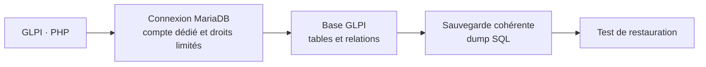

# Module 05 — Les bases de MySQL et MariaDB

**Séquence :** Administration GLPI  
**Importance :** socle de la progression officielle  
**Sources consolidées :** 1 support(s) de cours, 1 énoncé(s), 1 correction(s)

!!! warning "Périmètre et versions"
    Le laboratoire cible GLPI 9.5, PHP 7.4 et FusionInventory. Pour GLPI 10 et 11, l’inventaire est natif et FusionInventory n’est plus pris en charge ; les déploiements actuels doivent suivre la documentation GLPI et utiliser GLPI Agent. Référence : [Documentation GLPI](https://help.glpi-project.org/documentation), [FAQ inventaire GLPI](https://help.glpi-project.org/faq/glpi/inventory).

## Objectifs et compétences

- Se connecter à la base GLPI avec un compte autorisé.
- Afficher bases, tables et structure.
- Écrire des SELECT avec filtres, tris et agrégats.
- Sauvegarder avant toute requête de modification.

!!! tip "Façon simple de le comprendre"
    Ce module sert à passer de la notion « Les bases de MySQL et MariaDB » à une méthode que l’on peut expliquer, appliquer, vérifier et dépanner.

## Méthode de travail

1. Lire les concepts dans l’ordre du support.
2. Reproduire les exemples dans un environnement de laboratoire.
3. Noter le résultat attendu avant de modifier une configuration.
4. Vérifier avec l’outil ou la commande appropriée.
5. Revenir à l’état initial si le résultat diverge.

## GLPI et sa base de données



<p class="tssr-caption">Une sauvegarde n’est validée qu’après contrôle du fichier produit et test de restauration dans un environnement isolé.</p>

## Commandes repérées dans les supports

```text
MariaDB
mysql —u root -p
mysql&gt;SHOW databases;
mysql&gt;CONNECT glpidata;
mysql&gt;SHOW tables;
mysql&gt;DROP database glpidata;
mysql&gt;SELECT * FROM clients;
mysql&gt;SELECT Nom, Ville FROM clients;
mysql&gt;SELECT Prénom, Nom FROM clients WHERE Ville='Caen';
mysql&gt;SELECT Prénom, Nom FROM clients WHERE ID &gt; 3;
mysql&gt;SELECT Prénom, Nom FROM clients WHERE ID &gt;= 2 AND ville = 'Caen';
mysql&gt;SELECT Prénom, Nom FROM clients WHERE (ID &gt;= '2' AND ville = 'Caen') OR (ID
mysql&gt;SELECT Prénom, Nom FROM clients WHERE age = NULL;
mysql&gt;SELECT Prénom FROM clients ORDER by age, nom;
mysql&gt;SELECT Prénom FROM clients ORDER by age LIMIT '2' OFFSET '1';
mysql&gt;SELECT COUNT(age) FROM clients;
mysql&gt;SELECT Prénom as Firstname FROM clients ORDER by age;
mysql&gt;SELECT AVG(age) FROM clients;
```

!!! warning
    Une commande extraite d’un support n’est pas à exécuter aveuglément. Vérifier la version, les droits, la cible et l’existence d’une sauvegarde avant toute action destructive.

## Module 05 - Support de cours

### Administration GLPI

#### Module 05 — Les bases de MySQL et MariaDB

- Rappels sur les SGBD et le langage d’interrogation SQL
- Utilisation des commandes de bases de MySQL/MariaDB
- Se connecter à une base de données et en afficher la structure
- Ce qu’est une table dans une base de données
- Effectuer une recherche d’enregistrements selon certains critères
- Utiliser les fonctions de base du langage SQL
- Afficher par des requêtes SQL, la liste des utilisateurs de GLPI
- Effectuer une sauvegarde de la base de données de GLPI

### Rappels sur les SGBD

- Sert à stocker, administrer, effectuer des opérations, récolter des

données (data) sur un support facilement consultable.

- Création des SGBDR - Système de Gestion de Base de Données

#### Relationnelle (DB2, Oracle, SQL Server, PostgreSQL, MySQL…)

- Un SGBD est rarement utilisé seul
- Il est souvent utilisé par des logiciels tiers comme :
- Un serveur internet
- Des logiciels de comptabilité
- Les serveurs de messagerie
- Etc.

### SGBD - Système de Gestion de Bases de Données

- MySQL a été créé en 1994
- Michael Widenius est un des co-créateurs
- My (prénom de la fille de Widenius) et SQL

#### (Structured Query Language)

- Double licence GPL et propriétaire

#### (Oracle Corporation depuis 2009)

- En 2009, Widenius a créé MariaDB qui est open source

#### (Maria, prénom de sa deuxième fille)

#### Historique

- Contrairement à Bash par exemple, SQL ne s’exécute pas de

manière séquentielle mais analyse globalement une requète.

- La création d’une base de données et de sa structure (tables et clés)

doit être mûrement réfléchie en amont ; c’est l’étape du MCD (Modèle Conceptuel de Données).

- On fabrique d’abord les étagères de la bibliothèque et on organise

#### à vide avant de vouloir tout bouger une fois que les livres sont

dessus.

#### Le langage

- mysql est la commande qui permet, entre autres, de se connecter à

`MariaDB`

- Ici, se connecter en tant que root avec son mot de passe
- SHOW — commande qui permet de lister
- Ici, permet de voir toutes les bases de données présentes
- CONNECT — commande qui permet de se connecter à une base de

#### données

- Ici, permet de se connecter à la base de données glpidata

#### Des commandes de base

`mysql —u root -p`

`mysql&gt;SHOW databases;`

`mysql&gt;CONNECT glpidata;`

### base de données

- DROP — commande qui permet de supprimer
- Ici, permet de supprimer la base de données glpidata
- SHOW — commande qui permet de lister
- Ici, permet de voir toutes les tables présentes une fois connecté à une
- UPDATE / INSERT — commandes qui permettent d’ajouter du

#### contenu à une base de données

- Ces commandes ne seront pas vues dans ce cours.

#### Des commandes de base

`mysql&gt;SHOW tables;`

`mysql&gt;DROP database glpidata;`

- Dans une base de données, les informations sont contenues

#### dans des tables (ou relations)

- Une relation est constituée de deux sous-ensembles :
- L’en-tête est composé d’attributs (colonnes)
- Le corps est composé de lignes
- La table clients définit cinq attributs (ID, Prénom, Nom, Ville et Age)

#### et se compose de quatre lignes (1, 2, 3 et 4)

#### La structure

#### ID Prénom Nom Ville Age

#### 1 Fred Enlefrigau Stockholm 45

#### 2 François Belététoi Pyongyang 26

#### 3 Gilles Edenotre Rennes 32

#### 4 Yann Apourtous Caen

### attributs d’une table

- Cette commande sert à lister les données d’un ou plusieurs
- SELECT * FROM nom_de_la_table
- * veut dire tous les attributs
- Exemple : lister tous les attributs de la table clients

#### La commande SELECT

`mysql&gt;SELECT * FROM clients;`

#### +------+--------------+----------------+-----------------+-----------+

#### | ID | Prénom | Nom | Ville | Age |

#### +------+--------------+----------------+-----------------+-----------+

#### | 1 | Fred | Enlefrigau | Stockholm | 45 |

#### | 2 | François | Belététoi | Pyongyang | 26 |

#### | 3 | Gilles | Etdenotre | Rennes | 32 |

#### | 4 | Yann | Apourtous | Caen | NULL |

#### +------+--------------+----------------+------------------+-----------+

- SELECT nom_de_l’attribut, nom_d’un_deuxième_attribut

#### FROM nom_de_la_table

- Liste les attributs « Nom » et « Ville » de la table clients

#### La commande SELECT

`mysql&gt;SELECT Nom, Ville FROM clients;`

#### +----------------+------------------+

#### | Nom | Ville |

#### +----------------+------------------+

#### | Enlefrigau | Stockholm |

#### | Belététoi | Pyongyang |

#### | Etdenotre | Rennes |

#### | Apourtous | Caen |

#### +----------------+------------------+

### est la ville

- WHERE permet de mettre une condition à notre recherche
- Liste les attributs « Prénom » et « Nom » de la table clients si Caen

#### La condition WHERE à la commande SELECT

`mysql&gt;SELECT Prénom, Nom FROM clients WHERE Ville='Caen';`

#### +----------------+------------------+

#### | Prénom | Nom |

#### +----------------+------------------+

#### | Yann | Apourtous |

#### +----------------+------------------+

- WHERE permet d’utiliser des symboles pour définir des critères plus précis

#### de recherche

- = égal
- &lt; inférieur
- &lt;= inférieur ou égal
- &gt; supérieur
- &gt;= supérieur ou égal
- &lt;&gt; ou != différent
- &lt;=&gt; égal (fonctionne aussi si la valeur est NULL)
- Liste les attributs « Prénom » et « Nom » de la table clients si l’ID est strictement

supérieur à 3.

#### Les opérateurs de comparaison

`mysql&gt;SELECT Prénom, Nom FROM clients WHERE ID &gt; 3;`

#### +----------------+------------------+

#### | Prénom | Nom |

#### +----------------+------------------+

#### | Yann | Apourtous |

#### +----------------+------------------+

### critères

- Il existe aussi des opérateurs qui permettent de combiner plusieurs
- AND et
- OR ou
- XOR ou exclusif (ou, mais pas les deux)
- NOT non (sauf)
- Liste les attributs « Prénom » et « Nom » de la table clients si l’ID

est supérieur ou égal à 2 et la ville est Caen.

#### La combinaison de critères

`mysql&gt;SELECT Prénom, Nom FROM clients WHERE ID &gt;= 2 AND ville = 'Caen';`

#### +----------------+------------------+

#### | Prénom | Nom |

#### +----------------+------------------+

#### | Yann | Apourtous |

#### +----------------+------------------+

- Si vous souhaitez utiliser plusieurs opérateurs de combinaison
- ( ) met la priorité sur les opérateurs combinés
- Liste les attributs « Prénom » et « Nom » de la table clients si

#### (l’ID est supérieur ou égal à 2 et la ville est Caen) ou (l’ID est

strictement supérieur à 2 et la ville est Rennes).

#### Les sélections complexes

`mysql&gt;SELECT Prénom, Nom FROM clients WHERE (ID &gt;= '2' AND ville = 'Caen') OR (ID`

&gt; 2 AND ville = 'Rennes');

#### +----------------+------------------+

#### | Prénom | Nom |

#### +----------------+------------------+

#### | Yann | Apourtous |

#### | Gilles | Etdenotre |

#### +----------------+------------------+

### colonne is NOT NULL

- Le marqueur NULL représente qu’il n’y a pas de valeur
- Le marqueur NOT NULL représente qu’il existe une valeur
- On peut utiliser, colonne = NULL ou colonne is NULL
- Idem pour NOT NULL, colonne = NOT NULL ou
- Liste les attributs « Prénom » et « Nom » de la table clients si l'âge

#### n’est pas renseigné

#### Les valeurs NULL et NOT NULL

`mysql&gt;SELECT Prénom, Nom FROM clients WHERE age = NULL;`

#### +----------------+------------------+

#### | Prénom | Nom |

#### +----------------+------------------+

#### | Yann | Apourtous |

#### +----------------+------------------+

- Si vous souhaitez trier vos données en sortie
- ORDER BY colonne tri en fonction de la colonne choisie
- ASC tri par ordre croissant
- DESC tri par ordre décroissant
- Par défaut, sans préciser ASC ou DESC, c’est un ordre ascendant
- Liste les attributs « Prénom » de la table clients triés par âge puis

par nom.

#### Le tri des données

`mysql&gt;SELECT Prénom FROM clients ORDER by age, nom;`

#### +----------------+

#### | Prénom |

#### +----------------+

#### | Yann |

#### | François |

#### | Gilles |

#### | Fred |

#### +----------------+

### compte le nombre de lignes souhaitées

- Si vous souhaitez restreindre le nombre de lignes en résultat
- LIMIT nombre_de_ligne OFFSET à_partir_de_quelle_ligne
- OFFSET est optionnel et dans ce cas, il est égal à 0
- OFFSET différent de 0, permet de déterminer à partir de quelle ligne on
- Liste les attributs « Prénom » de la table clients triés par âge à partir

de la deuxième ligne et que deux lignes.

#### Choisir le nombre de lignes récupérées

`mysql&gt;SELECT Prénom FROM clients ORDER by age LIMIT '2' OFFSET '1';`

#### +----------------+

#### | Prénom |

#### +----------------+

#### | François |

#### | Gilles |

#### +----------------+

- Si vous souhaitez compter le nombre de lignes en résultat
- COUNT vous donne le nombre de lignes en résultat
- Un attribut NULL ne compte pas
- Compte le nombre d’attributs « âge » de la table clients.

#### Compter le nombre de lignes récupérées

`mysql&gt;SELECT COUNT(age) FROM clients;`

### Utilisation d'un alias

- Il est possible de modifier le nom d’une colonne à l’affichage
- Nom_de_la_colonne as nom_d’affichage
- Liste les attributs « Prénom » de la table clients trier par âge en changeant le

nom de la colonne Prénom par Firstname.

`mysql&gt;SELECT Prénom as Firstname FROM clients ORDER by age;`

#### +----------------+

#### | Firstname |

#### +----------------+

#### | Yann |

#### | François |

#### | Gilles |

#### | Fred |

#### +----------------+

- Quelques fonctions qui permettent un traitement numérique
- MAX(Nom_de_la_colonne) affiche la valeur maximum d’une colonne
- MIN(Nom_de_la_colonne) affiche la valeur maximum d’une colonne
- SUM(Nom_de_la_colonne) affiche la somme d’une colonne
- AVG(Nom_de_la_colonne) affiche la moyenne d’une colonne
- Liste la moyenne des âges de la table clients.

#### Quelques fonctions d'agrégation

`mysql&gt;SELECT AVG(age) FROM clients;`

### (contrainte d’unicité)

- Une clé primaire identifie de manière unique une ligne
- Dans la table client et la table achat, il s’agit de l’ID
- Elle identifie une ou plusieurs colonnes (création d’index que nous ne

#### verrons pas dans ce cours)

- Une clé primaire ne peut pas être NULL.

#### La clé primaire (primary key)

#### ID Prénom Nom Ville Age

#### 1 Fred Enlefrigau Stockholm 45

#### 2 François Belététoi Pyongyang 26

#### 3 Gilles Edenotre Rennes 32

#### 4 Yann Apourtous Caen

#### ID Nom ID_client Prix Pateforme

#### 1 Overwatch 4 14,99 XBOX ONE

#### 2 Call of Duty 2 69,99 PS4

#### 3 Minecraft 1 23,95 SWITCH

#### 4 League of Legends 4 0 PC

#### 5 Mario Kart 8 DELUXE 4 43,99 SWITCH

#### 6 Civilization VI 3 29,99 PC

#### Table client Table achat

- Une clé étrangère permet de gérer des relations entre

#### plusieurs tables

- Elle vérifie l'intégrité de notre base.
- Dans notre table achat, il s’agit de ID_client et vérifie que le client existe bien

dans la table client.

- Si vous indiquez un ID_client qui n’existe pas, MySQL vous indiquera une

erreur et c’est pour cela qu’on appelle les clés des contraintes (CONSTRAINT).

- À la création d’une clé étrangère, un index est automatiquement créé.
- La colonne ID_client est la clé étrangère de la table achat en relation avec la

colonne ID de la table client. La colonne ID de la table client DOIT être une clé primaire.

#### La clé étrangère (foreign key)

### requête (l’avantage des tables relationnelles)

- L’idée est de pouvoir associer plusieurs tables dans une même
- Lorsque l’on fait une jointure, on crée une table virtuelle qui réunit les 2

tables avec ID de la table client qui correspond à ID_client de la table achat

#### Les jointures

#### ID Prénom Nom Ville Age

#### 1 Fred Enlefrigau Stockholm 45

#### 2 François Belététoi Pyongyang 26

#### 3 Gilles Edenotre Rennes 32

#### 4 Yann Apourtous Caen

#### ID Nom Prix Pateforme ID_client

#### 1 Overwatch 14,99 XBOX ONE 4

#### 2 Call of Duty 69,99 PS4 2

#### 3 Minecraft 23,95 SWITCH 1

#### 4 League of Legends 0 PC 4

#### 5 Mario Kart 8 DELUXE 43,99 SWITCH 4

#### 6 Civilization VI 29,99 PC 3 Table client

#### Table achat

- INNER JOIN
- Jointure interne
- Condition vraie dans les 2 tables
- SELECT * FROM table_A INNER JOIN table_B ON table_A.clé = table_B.clé

#### La jointure interne

#### A B

#### La jointure représente l’intersection de A et B

#### * Il existe d’autres jointures que nous ne verrons pas dans ce cours

### de la table client et sur la colonne ID_client de la table achat

- Si je souhaite connaître le nom des jeux qu’a achetés Yann :
- SELECT achat.nom : # je sélectionne ce que je veux afficher
- FROM achat : # sur quelle table je travaille
- INNER JOIN client : # je la joins à la table client
- ON client.id = achat.id_client : # on fait la jointure sur la colonne ID
- WHERE client.Prénom = ‘yann’; : # ID_client à 4 correspond à Yann

#### La jointure interne

`mysql&gt;SELECT achat.nom FROM achat INNER JOIN client ON client.id = achat.id_client where`

client.prénom = ‘yann’;

#### +------------------------------+

#### | Nom |

#### +------------------------------+

#### | Overwatch |

#### | League of Legends |

#### | Mario Kart 8 DELUXE |

#### +------------------------------+

## Mise en pratique

- [Travaux pratiques du module](../../tp/glpi/module-05/index.md)
- [Fiche de révision du module](../../revision/glpi/module-05-les-bases-de-mysql-et-mariadb.md)

## Questions flash

1. Comment expliquer simplement « Les bases de MySQL et MariaDB » à un collègue ?
2. Quelles étapes ou notions doivent être maîtrisées avant la manipulation ?
3. Quel contrôle permet de prouver que le résultat est correct ?
4. Quel est le premier risque ou piège à écarter ?

??? success "Éléments de réponse"
    - Se connecter à la base GLPI avec un compte autorisé.
    - Afficher bases, tables et structure.
    - Écrire des SELECT avec filtres, tris et agrégats.
    - Sauvegarder avant toute requête de modification.

## Voir aussi

- [Présentation de la séquence](index.md)
