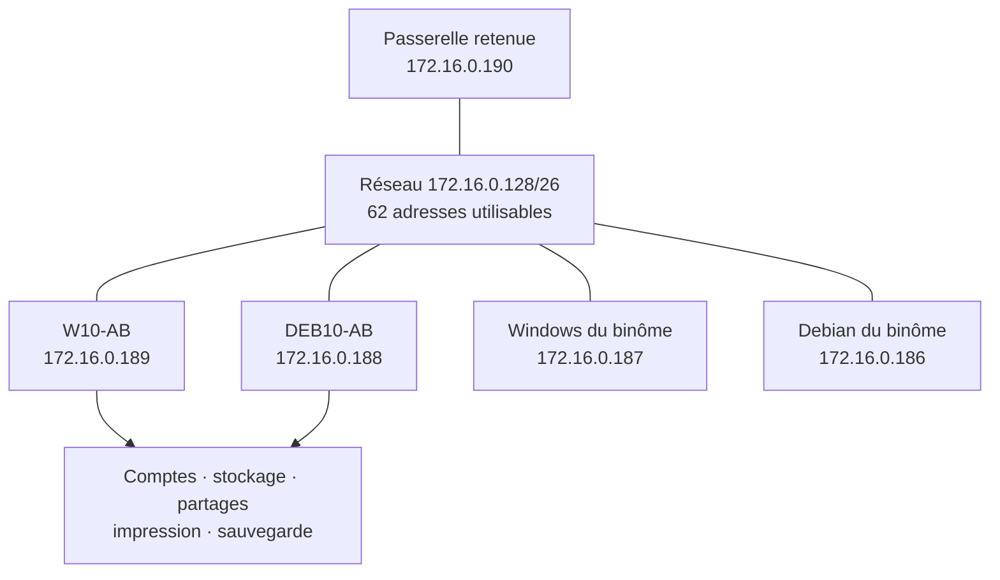

# Module 01 — MSP Systèmes clients

**Séquence :** Mise en situation professionnelle — Systèmes clients  
**Importance :** socle de la progression officielle  
**Sources consolidées :** 0 support(s) de cours, 1 énoncé(s), 1 correction(s)

!!! warning "Périmètre et versions"
    Le dossier contient un énoncé, un ancien modèle de correction et une solution consolidée plus récente. Le portail sépare strictement l’énoncé de la correction, privilégie les scripts consolidés et ne publie aucun secret en clair.

## Objectifs et compétences

- Analyser une architecture et un plan d’adressage en /26.
- Préparer postes Windows et Debian.
- Gérer comptes, groupes, stockage, partages et impression.
- Automatiser avec CMD, PowerShell et Bash.
- Produire les tableaux, vérifications et preuves attendus.

!!! tip "Façon simple de le comprendre"
    Ce module sert à passer de la notion « MSP Systèmes clients » à une méthode que l’on peut expliquer, appliquer, vérifier et dépanner.

## Méthode de travail

1. Lire les concepts dans l’ordre du support.
2. Reproduire les exemples dans un environnement de laboratoire.
3. Noter le résultat attendu avant de modifier une configuration.
4. Vérifier avec l’outil ou la commande appropriée.
5. Revenir à l’état initial si le résultat diverge.

## Architecture du laboratoire



<p class="tssr-caption">Topologie reconstruite d’après l’énoncé et la correction consolidée. Les identités et valeurs de laboratoire doivent être contrôlées avant exécution.</p>

<figure class="tssr-figure">
  <div class="tssr-figure__canvas">
    <div class="tssr-pipeline" style="--steps:5" role="img" aria-label="Progression de la mise en situation professionnelle systèmes clients">
      <div class="tssr-pipeline__step"><span><b>1 · Installer</b>Windows et Debian en VM</span></div>
      <div class="tssr-pipeline__step"><span><b>2 · Identifier</b>Comptes, groupes et environnements</span></div>
      <div class="tssr-pipeline__step"><span><b>3 · Publier</b>Stockage, partages et imprimantes</span></div>
      <div class="tssr-pipeline__step"><span><b>4 · Automatiser</b>CMD, PowerShell et Bash</span></div>
      <div class="tssr-pipeline__step"><span><b>5 · Prouver</b>Tests, captures, tableaux et retour arrière</span></div>
    </div>
  </div>
  <figcaption>La MSP rassemble les compétences des semaines précédentes dans un environnement commun et documenté.</figcaption>
</figure>

## Commandes repérées dans les supports

```text
ipconfig /all
show plutôt que de recopier aveuglément /dev/sda4.
ping 172.16.0.188
ping 172.16.0.187
ping 172.16.0.186
ip -br a
ip route
cat /etc/resolv.conf
ping -c 4 172.16.0.189
ping -c 4 172.16.0.187
ping -c 4 172.16.0.186
ping ...
net localgroup l_direction /add /comment:"Groupe local du service Direction"
net localgroup l_comptabilite /add /comment:"Groupe local du service Comptabilite"
net user rgrimes * /add /fullname:"Rick Grimes" /comment:"Direction" /expires:never
net localgroup l_direction rgrimes /add
net user eporter * /add /fullname:"Eugene Porter" /comment:"Comptabilite" /expires:never
net localgroup l_comptabilite eporter /add
```

!!! warning
    Une commande extraite d’un support n’est pas à exécuter aveuglément. Vérifier la version, les droits, la cible et l’existence d’une sauvegarde avant toute action destructive.

## Concepts essentiels

Le support de cours autonome n’est pas présent dans l’archive. La progression ci-dessus et les travaux pratiques associés constituent la matière exploitable de ce module ; le portail ne complète pas artificiellement les parties absentes.

## Mise en pratique

- [Travaux pratiques du module](../../tp/msp/module-01/index.md)
- [Fiche de révision du module](../../revision/msp/module-01-msp-systemes-clients.md)

## Questions flash

1. Comment expliquer simplement « MSP Systèmes clients » à un collègue ?
2. Quelles étapes ou notions doivent être maîtrisées avant la manipulation ?
3. Quel contrôle permet de prouver que le résultat est correct ?
4. Quel est le premier risque ou piège à écarter ?

??? success "Éléments de réponse"
    - Analyser une architecture et un plan d’adressage en /26.
    - Préparer postes Windows et Debian.
    - Gérer comptes, groupes, stockage, partages et impression.
    - Automatiser avec CMD, PowerShell et Bash.
    - Produire les tableaux, vérifications et preuves attendus.

## Voir aussi

- [Présentation de la séquence](index.md)
