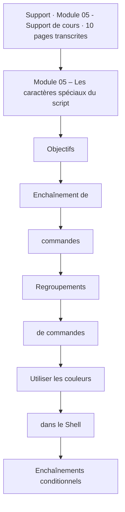
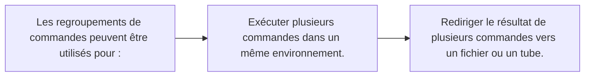

# Module 05 — Les caractères spéciaux du script

[Travaux pratiques](../../tp/11-initiation-scripting-bash/module-05/index.md)

Les parties ci-dessous reprennent le cours original, dans le même ordre. Les encadrés et les schémas répètent ses formulations.

## Parcours de lecture

1. Support · Module 05 - Support de cours · 10 pages transcrites
2. Module 05 – Les caractères spéciaux du script
3. Objectifs
4. Enchaînement de
5. commandes
6. Regroupements
7. de commandes
8. Utiliser les couleurs
9. dans le Shell
10. Enchaînements conditionnels
11. Enchaînements conditionnels

**Visuel externe**


```mermaid
flowchart TD
    N1["Support · Module 05 - Support de cours · 10 pages transcrites"]
    N2["Module 05 – Les caractères spéciaux du script"]
    N3["Objectifs"]
    N4["Enchaînement de"]
    N5["commandes"]
    N6["Regroupements"]
    N7["de commandes"]
    N8["Utiliser les couleurs"]
    N9["dans le Shell"]
    N11["Enchaînements conditionnels"]
    N1 --> N2
    N2 --> N3
    N3 --> N4
    N4 --> N5
    N5 --> N6
    N6 --> N7
    N7 --> N8
    N8 --> N9
    N9 --> N11
```

SOURCE DRIVE · TRANSCRIPTION DU SUPPORT

Le contenu des documents du dossier TSSR est transcrit ci-dessous, page par page. Les textes et tableaux sont intégrés à la page Web. Aucun fichier PDF, aucune diapositive entière ni aucune reproduction de page n’est affiché. Seuls des croquis ou visuels isolés et vérifiés peuvent accompagner la transcription. Les versions et les consignes restent celles des supports de formation. Les compléments IA sont conservés dans leur onglet distinct.

## Support · Module 05 - Support de cours · 10 pages transcrites

!!! note "À retenir"
    Le texte, les tableaux et le code sont transcrits d’après le PDF de formation.

Le texte, les tableaux et le code sont transcrits d’après le PDF de formation. Les sauts de ligne suivent la présentation du support. Les exemples historiques sont commentés dans le cours optimisé.

## Page 1

## Module 05 – Les caractères spéciaux du script

## Objectifs

!!! note "À retenir"
    Savoir enchaîner plusieurs commandes Conditionner une commande au résultat d'une autre Regrouper les commandes Colorier la console

**Visuel externe**


```mermaid
flowchart LR
    N1["Savoir enchaîner plusieurs commandes"]
    N2["Conditionner une commande au résultat d'une autre"]
    N3["Regrouper les commandes"]
    N4["Colorier la console"]
    N1 --> N2
    N2 --> N3
    N3 --> N4
```

- Savoir enchaîner plusieurs commandes
- Conditionner une commande au résultat d'une autre
- Regrouper les commandes
- Colorier la console

## Page 2

## Enchaînement de

## commandes

### Enchaînement de commandes

!!! note "À retenir"
    2 types d’enchaînement de commandes Inconditionnel Conditionnel

2 types d’enchaînement de commandes

Inconditionnel Conditionnel

## Page 3

### Enchaînement inconditionnel

### ;

### L’enchaînement sans condition

!!! note "À retenir"
    Pour enchaîner des commandes quel que soit le résultat de leur exécution, on utilise le « ; » entre celles-ci.

!!! example "Exemple"
    Dans cet exemple, l’utilisateur n’a pas le droit de créer un répertoire à la racine (mkdir en erreur).

Pour enchaîner des commandes quel que soit le résultat de leur exécution, on utilise le « ; » entre celles-ci.

```
$ mkdir /data ; touch /data/file1 ; cat /home/bonjour.txt
mkdir: cannot create directory `./data': Permission denied
touch: cannot touch `./data/file1': No such file or directory
Bonjour le monde !
```

- Dans cet exemple, l’utilisateur n’a pas le droit de créer un répertoire à la racine (mkdir en erreur).
- La commande de création d’un fichier dans le répertoire échoue aussi (touch en erreur).
- La dernière commande (sans lien avec les précédentes) aboutit.

### Enchaînement inconditionnel

### L’enchaînement sans condition ;

!!! note "À retenir"
    Dans un script, le traitement des commandes est séquentiel.

Dans un script, le traitement des commandes est séquentiel. Le « ; » est substitué par un retour à la ligne.

```
$ mkdir /data ; touch /data/file1 ; cat /home/bonjour.txt
```

```
mkdir /data
```

Traitement

séquentiel

```
touch /data/file1
cat /home/bonjour.txt
```

## Page 4

### Enchaînement conditionnel

### Le “et” logique &&

!!! note "À retenir"
    L’opérateur « && » conditionne l’enchaînement de commandes au résultat d’exécution positif de la commande précédente.

L’opérateur « && » conditionne l’enchaînement de commandes au résultat d’exécution positif de la commande précédente.

- Cette structure peut se traduire par :

Si la commande aboutit alors je fais la suivante.

```
$ mkdir /data && touch /data/file1
mkdir: cannot create directory `./data': Permission denied
$ mkdir ./data && touch ./data/file1
$ ls -l ./data/
-rw-r--r-- 1 Gilles Gilles 0 2021-12-26 02:12 file1
```

### Enchaînement conditionnel

### Le “et” logique &&

!!! note "À retenir"
    Le système s’appuie sur le code retour de la commande précédente (variable réservée $?) : Si $?

Le système s’appuie sur le code retour de la commande précédente (variable réservée $?) :

- Si $? = 0 (pas d’erreur) : alors la commande suivante est exécutée
- Si $? ≠ 0 (erreur) : alors la commande suivante n’est pas exécutée

## Page 5

### Enchaînement conditionnel

### Le “ou” logique ||

- L’opérateur « || » conditionne l’enchaînement de commandes à l’échec d’exécution de la commande précédente.
- Cette structure peut se traduire par : Si la commande n’a pas abouti alors je fais la suivante.

```
mkdir ./data 2>/dev/null || echo "Erreur de création du répertoire 'data'"
Erreur de création du répertoire 'data'
```

### Enchaînement conditionnel

### Le “et” logique &&

Le système s’appuie sur le code retour de la commande précédente (variable réservée $?) :

- Si $? = 0 (pas d’erreur) : alors la commande suivante n’est pas exécutée
- Si $? ≠ 0 (erreur) : alors la commande suivante est exécutée

## Page 6

### Les caractères spéciaux du script

Démo

Enchaînement conditionnel et inconditionnel de commandes

## Regroupements

## de commandes

## Page 7

### Les regroupements de commandes

**Visuel externe**


```mermaid
flowchart LR
    N1["Les regroupements de commandes peuvent être utilisés pour :"]
    N2["Exécuter plusieurs commandes dans un même environnement."]
    N3["Rediriger le résultat de plusieurs commandes vers un fichier ou un tube."]
    N1 --> N2
    N2 --> N3
```

- Les regroupements de commandes peuvent être utilisés pour :
- Exécuter plusieurs commandes dans un même environnement.
- Rediriger le résultat de plusieurs commandes vers un fichier ou un tube.
- Deux syntaxes de regroupement de commandes sont utilisables : (« regroupement ») et \{« regroupement »\}.

### Les regroupements de commandes

### Regroupement avec création de sous-shell

- Pour regrouper dans un environnement enfant l’exécution de plusieurs commandes, on utilise la syntaxe suivante :

```
$ (cmd1 ; cmd2)
```

- Dans un script, pour plus de lisibilité, le regroupement sera écrit ainsi :

```
(
   cmd1
   cmd2
)
```

Exemple :

```
$ (ls /bin/ ; ls /usr/bin) | wc –l
```

pour afficherle nombretotal de fichiers contenusdans /bin et /usr/bin

## Page 8

### Les regroupements de commandes

### Regroupement sans création de sous-shell

- Pour regrouper dans un environnement enfant l’exécution de plusieurs commandes, on utilise la syntaxe suivante :

```
$ { cmd1 ; cmd2 ; cmd3 ; }
```

À la difference de la syntaxe du (), un “;” doit être mis juste avant l’accolade fermante. Ne pas oublier le point-virgule suivant la dernière commande et les espaces après et avant les accolades.

- Dans un script, pour plus de lisibilité, le regroupement sera écrit ainsi :

```
{
   cmd1
   cmd2
}
```

## Utiliser les couleurs

## dans le Shell

## Page 9

### Utiliser les couleurs dans le Shell

- Il est possible d’utiliser quelques couleurs dans le Shell ou dans les scripts.
- Elles peuvent être utiles pour mettre en valeur des informations importantes.

| Couleur | Caractères | Fond |
| --- | --- | --- |
| Noir | 30 | 40 |
| Rouge | 31 | 41 |
| Vert | 32 | 42 |
| Jaune | 33 | 43 |
| Bleu | 34 | 44 |
| Magenta | 35 | 45 |
| Cyan | 36 | 46 |
| Gris clair | 37 | 47 |

| Code | Attribut des caractères |
| --- | --- |
| 0 | aucun |
| 1 | gras |
| 4 | souligné |
| 7 | inversé |
| 8 | invisible |
| 9 | barré |

### Utiliser les couleurs dans le Shell

**Visuel externe**


```mermaid
flowchart LR
    N1["Pour coloriser une information, les codes couleur seront à encadrer pour :"]
    N2["Annoncer la couleur : \033( ou \e("]
    N3["Finir la définition de couleur : m"]
    N4["Remettre la valeur initiale : \033(0m"]
    N1 --> N2
    N2 --> N3
    N3 --> N4
```

- Pour coloriser une information, les codes couleur seront à encadrer pour :
- Annoncer la couleur : \033[ ou \e[
- Finir la définition de couleur : m
- Remettre la valeur initiale : \033[0m

```
$ echo -e "voici du \033[1;32mvert\033[0m"
```

Exemple

```
voici du vert
```

## Page 10

### Les caractères spéciaux du script

Démo

Les couleurs dans le shell

Référence du document : 1eRNrkmTjYjrApMM5-dm81IiX4craP22S · SHA-256 57232cfa34197b31…

| Support · Module 05 - Support de cours · 10 pages transcrites | Le texte, les tableaux et le code sont transcrits d’après le PDF de formation. |
| Objectifs | Savoir enchaîner plusieurs commandes Conditionner une commande au résultat d'une autre Regrouper les commandes Colorier la console |
