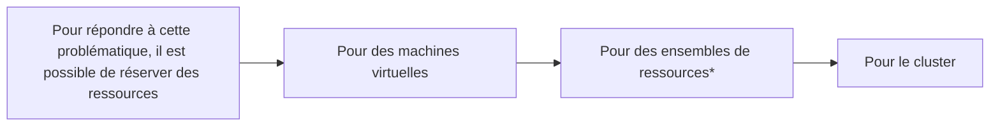
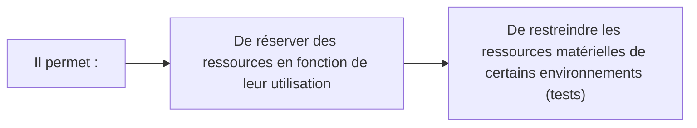
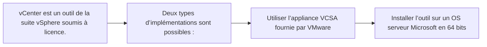

# Module 08 — Gestion du datacenter

[Travaux pratiques](../../tp/13-virtualisation-serveurs/module-08/index.md)

Les parties ci-dessous reprennent le cours original, dans le même ordre. Les encadrés et les schémas répètent ses formulations.

## Parcours de lecture

1. Support · Module 08 - Support de cours · 13 pages transcrites

**Visuel externe**

```mermaid
flowchart TD
    N1["Support · Module 08 - Support de cours · 13 pages transcrites"]
```

SOURCE DRIVE · TRANSCRIPTION DU SUPPORT

Le contenu des documents du dossier TSSR est transcrit ci-dessous, page par page. Les textes et tableaux sont intégrés à la page Web. Aucun fichier PDF, aucune diapositive entière ni aucune reproduction de page n’est affiché. Seuls des croquis ou visuels isolés et vérifiés peuvent accompagner la transcription. Les versions et les consignes restent celles des supports de formation. Les compléments IA sont conservés dans leur onglet distinct.

## Support · Module 08 - Support de cours · 13 pages transcrites

#### Module 08 – Gestion du datacenter

Gestion du datacenter

#### Objectifs

!!! note "À retenir"
    Administrer les éléments du datacenter Augmenter la sécurité en limitant les privilèges des utilisateurs Gestion du datacenter

- Administrer les éléments du datacenter
- Augmenter la sécurité en limitant les privilèges des utilisateurs

Gestion du datacenter

#### Contexte et actions de gestion

!!! note "À retenir"
    Dans ce chapitre seront abordées les principales tâches de gestion d’un environnement vSphere Certaines tâches sont réalisables sur des hôtes autonomes, d’autres nécessitent que les hôtes soient dans un contexte de datacenter (vCenter requis) Gestion du datacenter La gestion des ressources La gestion des ressources

- Dans ce chapitre seront abordées les principales tâches de gestion d’un environnement vSphere
- Certaines tâches sont réalisables sur des hôtes autonomes, d’autres nécessitent que les hôtes soient dans un contexte de datacenter (vCenter requis)

| Tâche | Disponibilité sur des hôtes autonomes | Disponibilité dans un contexte de datacenter |
| --- | --- | --- |
| Gestion des ressources et pools de ressources | Oui | Oui |
| Utilisation du web client vSphere | Non | Oui |
| Utilisation de vMotion et Storage vMotion | Non | Oui |
| Gestion de modèles VMTX | Non | Oui |
| Gestion des rôles, utilisateurs et privilèges | Oui | Oui |

Gestion du datacenter

La gestion des ressources

La gestion des ressources

#### La réservation de ressources

**Visuel externe**

```mermaid
flowchart LR
    N1["Pour répondre à cette problématique, il est possible de réserver des ressources"]
    N2["Pour des machines virtuelles"]
    N3["Pour des ensembles de ressources*"]
    N4["Pour le cluster"]
    N1 --> N2
    N2 --> N3
    N3 --> N4
```

- Il est possible d’affecter à l’ensemble des VM d’un hôte plus de ressources que celles dont il dispose réellement (toutes les VM n’étant pas en fonctionnement en même temps)
- La problématique se pose si une VM « plus importante » qu’une autre ne peut être démarrée faute de ressources
- Pour répondre à cette problématique, il est possible de réserver des ressources

Hôte

- Pour des machines virtuelles
- Pour des ensembles de ressources*
- Pour le cluster

RAM

CPU

* Point abordé dans la diapositive suivante

Réservé pour environnement

de production

VM PROD

La gestion des ressources

#### Gestion des pools de ressources

**Visuel externe**

```mermaid
flowchart LR
    N1["Il permet :"]
    N2["De réserver des ressources en fonction de leur utilisation"]
    N3["De restreindre les ressources matérielles de certains environnements (tests)"]
    N1 --> N2
    N2 --> N3
```

- Le pool de ressources : objet logique auquel est affectée une partie des ressources physiques (CPU et RAM) réelles
- Il permet :
- De réserver des ressources en fonction de leur utilisation
- De restreindre les ressources matérielles de certains environnements (tests)
- La configuration de pools peut permettre de garantir la disponibilité de ressources pour les besoins les plus cruciaux pour l’entreprise

Gestion du datacenter

vCenter et le contexte

de datacenter

vCenter et le contexte de datacenter

vCenter et le datacenter

- L’ajout d’un vCenter à une infrastructure va permettre :
- De créer un datacenter et de lui affecter des hôtes afin de les regrouper au sein d’une même entité de gestion
- De disposer d’objets (réseau et stockage) uniques et utilisables sur tous les hôtes du datacenter
- D’utiliser les fonctionnalités de déplacement de VM à chaud (vMotion)
- De créer un contexte de cluster (non abordé ici) et de bénéficier des fonctionnalités de haute disponibilité associées
- vCenter est un élément indispensable à la mise en œuvre et au fonctionnement d’un ensemble de services
- Il est recommandé qu’il soit installé sur une machine virtuelle hautement disponible de l’infrastructure

vCenter et le contexte de datacenter

vCenter Serveur VS VCSA

!!! note "À retenir"
    vCenter est un outil de la suite vSphere soumis à licence.

**Visuel externe**

```mermaid
flowchart LR
    N1["vCenter est un outil de la suite vSphere soumis à licence."]
    N2["Deux types d’implémentations sont possibles :"]
    N3["Utiliser l’appliance VCSA fournie par VMware"]
    N4["Installer l’outil sur un OS serveur Microsoft en 64 bits"]
    N1 --> N2
    N2 --> N3
    N3 --> N4
```

- vCenter est un outil de la suite vSphere soumis à licence.
- Deux types d’implémentations sont possibles :
- Utiliser l’appliance VCSA fournie par VMware
- Installer l’outil sur un OS serveur Microsoft en 64 bits

|  | VCSA | vCenter Serveur |
| --- | --- | --- |
| Nb d’hôtes maximum | 5 ESXi | 1000 ESXi |
| Nb VM maximum | 50 VM | 10 000 VM |
| Avantages | Simplicité de mise en œuvre | Capacité de prise en charge supérieures |
| Inconvénients | Limites de prise en charge | Mise en œuvre plus complexe et coûteuse |

vCenter et le contexte de datacenter

#### Méthodes d’accès à l’appliance vCenter

!!! note "À retenir"
    Les actions de gestion du vCenter sont réalisées depuis le client Web vSphere (via un navigateur) Les actions propres à la gestion du VCSA peuvent être effectuées via une connexion HTTPS au port 5480 Gestion du datacenter Les modèles de machines virtuelles Les modèles de machines virtuelles

- Les actions de gestion du vCenter sont réalisées depuis le client Web vSphere (via un navigateur)

| Port | Protocole | Outil |
| --- | --- | --- |
| 5480 | HTTPS | Gestion du VCSA |
| 9443 | HTTPS | Gestion vSphere |
| 443 | HTTPS | Gestion vSphere |

- Les actions propres à la gestion du VCSA peuvent être effectuées via une connexion HTTPS au port 5480

Gestion du datacenter

Les modèles de machines

virtuelles

Les modèles de machines virtuelles

#### Les modèles

!!! note "À retenir"
    Un fichier OVA est une archive compressée qui contient les éléments du dossier OVF Les modèles de machines virtuelles

|  | Modèle OVF | Modèle VMTX |
| --- | --- | --- |
| Prise en charge | Toutes les solutions VMware (Player, Workstation, vSphere), VirtualBox, XenServer | Suite VMware vSphere dans un contexte de datacenter |
| Action possibles | Possibilité d’import / export de l’élément | Cloner VM vers Template. Dupliquer VM vers Template. Déployer VM depuis Template. Possibilité de customisation. |
| Contexte d’utilisation | Pour toute mise à disposition d’une machine virtuelle | Base utilisée pour la mise en œuvre de l’OS et ses correctifs sur de nouvelles VM |

OVF ou OVA ? Un fichier OVA est une archive compressée qui contient les éléments du dossier OVF

Les modèles de machines virtuelles

#### Les modèles VMTX

**Visuel externe**

```mermaid
flowchart LR
    N1["Ils peuvent intégrer :"]
    N2["Un système d’exploitation"]
    N3["Des pilotes"]
    N4["Des applications"]
    N5["Des correctifs et mises à jour"]
    N1 --> N2
    N2 --> N3
    N3 --> N4
    N4 --> N5
```

- Les modèles VMTX sont des images de machines virtuelles qui sont utilisées pour permettre un déploiement optimisé de nouvelles machines virtuelles dans l’infrastructure vSphere
- Ils peuvent intégrer :
- Un système d’exploitation
- Des pilotes
- Des applications
- Des correctifs et mises à jour
- Ils sont généralement personnalisés pour leur utilisation dans le contexte de l’entreprise

Les modèles de machines virtuelles

#### Gestion des modèles VMTX

- Les tâches de gestion peuvent être initiées :
- Depuis la catégorie « VM et modèles » de l’inventaire
- Depuis le composant « Modèle » des actions proposées sur une machine virtuelle
- Deux types d’action peuvent être entreprises :

Convert to template

VM

Modèle

- La conversion permet de transformer une VM en modèle ou inversement

Convert to VM

VM

Modèle

Modèle

+

!!! note "À retenir"
    Clone to template VM VM Le clonage conserve l’élément original

Clone to template

VM

VM

- Le clonage conserve l’élément original

et le duplique en modèle ou VM

+

!!! note "À retenir"
    Deploy VM from this template VM Modèle Modèle Les modèles de machines virtuelles

Deploy VM from this template

VM

Modèle

Modèle

Les modèles de machines virtuelles

#### Personnalisation des modèles

- La personnalisation du système post déploiement permet d’automatiser les tâches de :
- Renommage de la machine pour son système d’exploitation
- Modification de son adressage IP
- Régénération de son identifiant de sécurité
- Prérequis de personnalisation :
- Les outils d’intégration VMware doivent être installés sur la VM
- SYSPREP doit être implémenté sur le vCenter s’il ne l’est pas nativement sur le SE invité

SYSPREP non intégré

SYSPREP intégré

Les modèles de machines virtuelles

#### Étapes de mise en œuvre de templates VMTX

!!! note "À retenir"
    Préparer la machine virtuelle de référence Y installer les outils d’intégration (vmtools) Convertir cette machine virtuelle en modèle

- Préparer la machine virtuelle de référence
- Y installer les outils d’intégration (vmtools)
- Convertir cette machine virtuelle en modèle

#### Processus de personnalisation - optionnel

intégrer au besoin sysprep au serveur vCenter

depuis l’assistant personnalisation, fournir les informations nécessaires à la personnalisation

l’assistant personnalisation génère un fichier de personnalisation qui peut être importé / exporté

Les modèles de machines virtuelles

#### Les modèles OVF

- Le format de modèle OVF (Open Virtual machine Format) est proposé comme format standard de modèle de machines virtuelles
- Il facilite les actions d’import et d’export de machines virtuelles
- Les fichiers modèles ainsi générés peuvent facilement être intégrés au sein d’autres environnements et solutions de virtualisation
- Prise en charge de ce format :
- Sur les environnements de virtualisation VMware (Player, Workstation, vSphere)
- Par les solutions de virtualisation VirtualBox, et XenServer
- Des outils permettent son import pour Hyper-V, QEMU / KVM

Fichiers OVF

Gestion du datacenter

Utilisateurs et privilèges

Utilisateurs et privilèges

#### Gestion des utilisateurs, groupes et privilèges

- La gestion des utilisateurs et groupes peut être réalisée au niveau du vCenter ou au niveau de l’ESXi.

#### SSO et contexte de domaine

Si l’on est dans un contexte de domaine d’authentification, le SSO peut être configuré afin d’utiliser des utilisateurs et groupes du domaine.

vCenter

ESXi

Possibilité d’affectation de

privilèges VM

- Les permissions peuvent être accordées sur tous les objets de l’inventaire : vCenter, datacenter, cluster, datastore, ESXi, VM […]

Les utilisateurs créés sur le vCenter pourront disposer de privilèges sur toute l’infrastructure vSphere. Les utilisateurs créés sur l’ESXi pourront disposer de privilèges uniquement sur cet ESXi ou sur des VM qu’il héberge.

Utilisateurs et privilèges

#### Méthodologie d’affectation des utilisateurs

- Créer les utilisateurs
- Créer les groupes et leur affecter des utilisateurs
- Créer des rôles, leur affecter les privilèges détaillés souhaités
- Sélectionner l’objet d’inventaire sur lequel affecter les privilèges ; lui associer les groupes et rôles correspondants

Utilisateurs et privilèges

#### Privilèges d’accès – Bonnes pratiques

- Utiliser des groupes plutôt que des utilisateurs
- Ne pas affecter plus de privilèges que nécessaire : si un rôle offre plus de privilèges que nécessaire, il pourra être dupliqué et modifié
- Définir ses règles sur les éléments de plus haut niveau, l’héritage permettra leur propagation à l’ensemble d’éléments enfants

Gestion du datacenter

Déplacement de machines

virtuelles

Déplacement de machines virtuelles

#### Les actions de migration / Déplacement

- Une machine virtuelle a besoin pour son fonctionnement d’un ensemble de ressources
- Ces ressources lui sont mises à disposition par l’hôte qui l’héberge
- Certaines de ses ressources lui sont propres : CPU, RAM, réseau
- D’autres, tel que le stockage peuvent être externes et accessibles à un ensemble d’hôtes

Hôte

Configuration

Configuration

RAM

RAM

Stockage

VM

VM

CPU

CPU

Disque

Réseau

Réseau

Disque

Les fonctionnalités abordées dans les diapositives suivantes permettent le

déplacement des deux ensembles d’éléments présentés ici.

Déplacement de machines virtuelles

#### Les actions de migration

Les actions de migration accessibles sur les VM d’un datacenter utilisent :

- vMotion pour permettre le

déplacement à chaud d’une

machine virtuelle d’un hôte vers

un autre hôte

vMotion

Hôte

Configuration

RAM

Stockage

VM

CPU

Réseau

Disque

Hôte

Configuration

- Storage vMotion pour permettre le déplacement à chaud du

stockage d’une VM d’un datastore

vers un autre datastore

RAM

Stockage

VM

CPU

Réseau

Disque

Déplacement de machines virtuelles

vMotion / Storage vMotion – Mise en œuvre

Prérequis de mise en œuvre :

- La fonctionnalité vMotion doit être active sur au moins un vSwitch de l’hôte source et de destination
- L’adressage des hôtes sources et destination utilisée par la fonctionnalité doit être du même domaine de diffusion
- L’emplacement de stockage des VM à déplacer doit être accessible aux 2 hôtes

Déplacement :

- Dans le contexte du datacenter, choisir l’action de déplacement proposée sur la VM
- L’assistant permet alors de déplacer :
- La VM vers un autre hôte
- Le stockage de la VM vers un autre point de stockage

Quelques cas de problématiques de déplacement de VM : une image iso est présente dans la machine virtuelle ; le groupement de port de raccordement est inexistant sur l’hôte de destination ; le niveau de support d’instructions CPU ne concorde pas entre les deux hôtes.

Référence du document : 1lJwBs-wuJ3ZNnzcz-StT_e0Q41z8Be4D · SHA-256 b63201f3c1f1a2bc…
