# Module 01 - Présentation de l'environnement & installation

!!! abstract "Objectif"
    Déployer l'architecture **Olympus**, installer la pile web / base de données et rendre **GLPI accessible**.

## Architecture du TP

| Élément | Adresse / rôle |
|---|---|
| **VMNet18** | `192.168.1.0/24` |
| **srv-CD01** | `.1` - AD DS + DNS, domaine `Olympus.gr` |
| **srv-glpi** | `.2` - Debian 10 + GLPI |
| **pfSense LAN** | `.254` - WAN bridgé / DHCP |
| **Client Windows 10** | Joint au domaine |

### Contrôles réseau initiaux

- Vérifier la **résolution DNS externe** depuis `srv-CD01`.
- Vérifier le **ping externe** depuis `srv-glpi`.

!!! tip "Réflexe à retenir"
    Toujours valider **réseau + DNS** avant de commencer l'installation de GLPI.

## Pile logicielle

GLPI est présenté dans le cours comme une **application web libre** reposant sur :

- **Apache** : serveur web ;
- **PHP 7.3** + modules requis ;
- **MariaDB** : base de données ;
- **DNS** : publication de `glpi.olympus.gr`.

### Modules PHP cités

`mysql`, `mbstring`, `curl`, `gd`, `xml`, `ldap`, `xmlrpc`, `imap`, `intl`, `zip`, `bz2`, `APCu/CAS`.

## Commandes clés

### MariaDB

```bash
mysql_secure_installation
mysql -u root -p
```

```sql
CREATE DATABASE glpidata;
SHOW DATABASES;
```

### Extraction de GLPI

```bash
tar xvzf /var/www/glpi-xxxx.tar.gz
```

### Répertoires GLPI

```bash
mkdir /etc/glpi /var/lib/glpi /var/log/glpi
chown -R www-data /etc/glpi
chown -R www-data /var/lib/glpi
chown -R www-data /var/log/glpi
```

Après la configuration, **recharger Apache**.

## Méthode à retenir

```mermaid
flowchart LR
    A[Installer / nommer / adresser les VM] --> B[Configurer AD DS + DNS]
    B --> C[Configurer pfSense et la connectivité]
    C --> D[Installer Apache + MariaDB + PHP]
    D --> E[Sécuriser MariaDB]
    E --> F[Créer la BDD]
    F --> G[Extraire GLPI dans /var/www]
    G --> H[Déplacer config / données / logs]
    H --> I[Publier le vhost Apache]
    I --> J[Créer A + CNAME DNS]
    J --> K[Terminer l'assistant web]
```



### Procédure en 10 étapes

1. Installer, nommer et adresser les VM.
2. Mettre en place **AD DS + DNS**.
3. Configurer **pfSense** et vérifier la connectivité.
4. Installer **Apache + MariaDB + PHP**.
5. Sécuriser MariaDB.
6. Créer la base de données GLPI.
7. Extraire GLPI dans `/var/www`.
8. Séparer configuration, données et logs dans :
   - `/etc/glpi` ;
   - `/var/lib/glpi` ;
   - `/var/log/glpi`.
9. Publier le **VirtualHost Apache**.
10. Créer les enregistrements DNS **A + CNAME**, puis terminer l'assistant web.

## Exemple du cours

URL finale attendue :

```text
http://glpi.olympus.gr
```

## Incohérences détectées dans le support

!!! warning "BDD : glpidb vs glpidata"
    Le TP mélange `glpidb` lors de `CREATE DATABASE` et `glpidata` dans les commandes `SHOW/GRANT`. La fiche PDF demande de choisir un nom unique et utilise **`glpidata`**.

!!! warning "Chemins incorrects"
    Deux chemins du support utilisent `/var/ww/...` :

    - `/var/ww/glpi/files`
    - `/var/ww/glpi/marketplace`

    La correction donnée dans la fiche est : **`/var/www/glpi/...`**.

!!! warning "Versions anciennes"
    Debian 10, PHP 7.3 et GLPI 9.x correspondent à l'environnement pédagogique du TP.

## À retenir

- Toujours valider **réseau + DNS** avant GLPI.
- Séparer **code web**, **configuration**, **données variables** et **logs**.
- Adapter les droits à l'utilisateur web `www-data`.
- La résolution de `glpi.olympus.gr` constitue le dernier contrôle fonctionnel du module.

---
