# Corrections — Module 03 — Gestion de parc — Inventaire informatique

!!! warning
    Une correction décrit le contexte du laboratoire. Comparer la logique et les contrôles avant de reprendre une valeur, une version ou un chemin dans un autre environnement.

## M3 - Solution du TP - Gestion de parc

### GLPI

#### Gestion de parc

#### TP du Module 3 — Gestion de parc — Inventaire informatique

Avant de démarrer ce TP, il convient d’avoir suivi les vidéos des modules 1 à 3 et d’avoir réalisé les TP proposés.

- Inventorier son parc informatique

#### Prérequis

- Application GLPI fonctionnelle

#### Contexte

- ENI école vient de recevoir un ensemble de matériel qu’on vous demande d’inventorier

#### Principales tâches à réaliser

Pour toutes les demandes qui suivront, utiliser si possible des gabarits.

#### Création d’un centre de données (Datacenter)

- Datacenter dans « la salle des trésors » nommé « Olympus datacenter ».
- Créez la salle serveur avec deux emplacements de baies (1 ligne et 1 colonne) nommée

« Salle serveur 1 ».

#### Création de 2 serveurs Proliant DL380 GEN

- Créez un gabarit nommé « GAB-Proliant-DL380-GEN »

  - Nom « Proliant-DL380-GEN », mais avec incrémentation à quatre chiffres.
  - Lieu : créez une « salle de stock »et une « salle serveur » dans la salle des

trésors puis affecter le gabarit dans cette salle.

  - Créez un statut « en stock » pour ce gabarit.
  - Créez un type « Rack » pour ce gabarit.
  - Créez le fabricant « HP » pour ce gabarit.
  - Créez le modèle « Proliant-DL380 » pour ce gabarit :

- 15 kilos.
- 2 Unités.
- 2 alimentations.
- Ajouter les images « HP DL 380 Gen avant.png » et « HP DL 380 Gen

arrière.png » fournies par le formateur.

#### https://www.hpe.com/be/fr/product-catalog/servers/proliant-

#### servers/pip.specifications.hpe-proliant-dl380-gen10-

#### server.1010026818.html

- Créez 1 port réseau :

  - Numéro 0.
  - Nom « Port- ».
  - Type de port « RJ45 ».
  - Vitesse 10 Gbit/s.

- Créez 8 ports réseau :

  - Numéro 1 à 8.
  - Nom « Port- ».
  - Type de port « RJ45 ».
  - Vitesse 1Gbit/s.

- Créez le système d’exploitation « HPE iLO » pour ce gabarit et Architecture 64 bits.
- Créez deux processeurs pour ce gabarit :

  - Fabricant « Intel ».
  - Fréquence à 3.9 GHz.
  - 28 cœurs.

- Créez 6To (12 fois 512 Go) de mémoire pour ce gabarit :

  - Fabricant « HP ».
  - Fréquence « 2666 MHz ».
  - Type « DDR4 ».
  - Modèle « HPE ».

#### Création d’une baie

- Créez un gabarit nommé « GAB-Baie-HPE ».

  - Nom « Baie-HPE-1 ».
  - Lieu « salle serveur ».
  - Salle serveur « Salle serveur 1 ».
  - Orientation de la porte « Nord ».
  - Nombre d’unités « 42U ».
  - Fabricant « HP ».
  - Modèle « G2 Enterprise Pallet Rack ».
  - Type « 42U Rack ».
  - Statut « En stock ».
  - Largeur « 59.78cm ».
  - Hauteur « 200.66 cm ».
  - Profondeur « 112.52 cm ».
  - Poids max « 1361 kg ».
  - Couleur d’arrière-plan « noir ».

https://www.inmac-wstore.com/hpe-600mm-x-1075mm-g2-enterprise-pallet-rack-rack-

#### 42u/p7205391.htm

- Ajoutez la baie.

  - Position « colonne A, ligne 1 ».
  - Statut « en place ».

- Ajoutez les serveurs « Proliant-DL380-GEN-0001-0002 » dans la baie sur les U41-42 pour le

0001 et U16-17 pour le 0002.

#### Création d’un PDU

- Créez un gabarit nommé « GAB-PDU-HPE-G2-3.6kva ».

  - Lieu « salle de stock ».
  - Statut « En stock ».
  - Type « HPE-G2-Horizontale ».
  - Fabricant « HP ».
  - Modèle « PDU-HPE-G2-3.6kVA ».

- Poids « 3.9kg ».
- Unités requises « 1 U ».
- Profondeur « 1 ».
- Connexions d’alimentation « 8 ».
- Puissance max. « 4 ».
- Commentaires « 3,6 kVA ».
- Ajoutez les images « PDU G2 Avant.png » et « PDU G2 Arriere.png »

fournies par le formateur.

- Créez 2 PDU « PDU-HPE-G2-3.6kva-1 et -2 ».
- Ajoutez les 2 PDU -1 en U30 et -2 en U15-42 dans la baie avec le statut « En place » et le

lieu « salle serveur ».

#### Création des commutateurs

- Créez un gabarit nommé « GAB-JL356A-ARUBA-2540-48P » .

  - Nom « JL356A-ARUBA-2540-48P », mais avec incrémentation à quatre

chiffres.

  - Statut « En stock ».
  - Type « Switch-48P ».
  - Lieu « Salle de stock ».
  - 4 ports 0 à 3.

- Nom « Port- ».
- Vitesse « 100 Gbit/s ».
- Type « RJ45 ».

  - 44 ports 4 à 47.

- Nom « Port- ».
- Vitesse « 10 Gbit/s ».
- Type « RJ45 ».

  - Modèle « Switch-JL356A-48P ».

- Nom « Switch-JL356A-aruba-48P ».
- Poids « 4 kg ».
- Unités requises « 1 ».
- Puissance consommée « 459 Watts ».
- Ajoutez l’image « JL356A-aruba-48P-Avant.png » fournie par le

formateur.

- Créez 4 « JL356A-ARUBA-2540-48P-0001, 0002, 0003 et 0004 ».
- Ajoutez les Switchs 0001 en U40, 0002 en U29 et 0003 en U14 dans la baie avec le statut

« En place » et le lieu « salle serveur ».

- Créez un gabarit nommé « GAB-JL356A-ARUBA-2540-24P » .

  - Nom « JL356A-ARUBA-2540-24P », mais avec incrémentation à quatre

chiffres.

  - Statut « En stock ».
  - Type « Switch-24P ».
  - Lieu « Salle de stock ».
  - 4 ports 0 et 3.

- Nom « Port- ».
- Vitesse « 10 Gbit/s ».
- Type « RJ45 ».

  - 20 ports 4 à 23.

- Nom « Port- ».
- Vitesse « 1 Gbit/s ».
- Type « RJ45 ».

  - Modèle « Switch-JL356A-24P ».

- Nom « Switch-JL356A-aruba-24P ».
- Poids « 4 kg ».
- Unités requises « 1 ».
- Puissance consommée « 370 Watts ».
- Ajoutez l’image « JL356A-aruba-24P-Avant.png » fournie par le

formateur.

  - Ajoutez le fichier « manuel Aruba 24 ports.pdf » du manuel en document dans

la rubrique Manuel.

- Créez 6 « JL356A-ARUBA-2540-24P-0001 à 0006 ».
- Ajoutez le switch « JL356A-ARUBA-2540-24P-0001 » et le « JL356A-ARUBA-2540-24P-

0002 » dans le lieu « Temple de Zeus » avec le statut « En place ».

- Ajoutez le switch « JL356A-ARUBA-2540-24P-0003 » dans le lieu « Salle des trésors » avec

le statut « En place ».

- Ajoutez le switch « JL356A-ARUBA-2540-24P-0004 » dans le lieu « Temple d’Héra » avec

le statut « En place ».

- Ajoutez le switch « JL356A-ARUBA-2540-24P-0005 » dans le lieu « Hôtellerie » avec le statut

« En place ».

- Connectez le port-0001 de « JL356A-ARUBA-2540-24P-0001 » et de « JL356A-ARUBA-

2540-24P-0002 » au port-0001 et port-0002 du switch « JL356A-ARUBA-2540-48P-0001 ».

- Connectez le port-0001 de « JL356A-ARUBA-2540-24P-0003 » et de « JL356A-ARUBA-

2540-24P-0004 » au port-0001 et port-0002 du switch « JL356A-ARUBA-2540-48P-0002 ».

- Connectez le port -0001 de « JL356A-ARUBA-2540-24P-0005 » au port -0001 du switch

« JL356A-ARUBA-2540-48P-0003 ».

#### Création d’ordinateurs

- Créez un gabarit nommé « GAB-Alienware-M17 »

https://www.dell.com/fr-fr/work/shop/ordinateurs-portables-professionnels/nouveau-

#### alienware-m17/spd/alienware-m17-r3-laptop/n00awm17r303

  - Nom « Alienware-M17 », mais avec incrémentation à trois chiffres.
  - Lieu « salle de stock ».
  - Statut « en stock ».
  - Créez un type « Portable » pour ce gabarit.
  - Créez le fabricant « DELL » pour ce gabarit.
  - Créez le modèle « Alienware-M17 » pour ce gabarit :

- 3 kilos.
- 250 Watts.
- Avec les composants :

  - 1 processeur « I7-10750H » pour ce gabarit.

- Fabricant « Intel ».
- Fréquence par défaut « 2.6 MHz ».
- Fréquence « 5 GHz ».
- Six cœurs et douze threads.
- Modèle « 10750H ».

  - 1 carte réseau « RJ45-Killer-E3000 » pour ce gabarit.

- Fabricant « Killer Networking ».
- Débit « 10/100/1000 ».
- Modèle « E3000 ».

  - 1 carte réseau « Killer-WIFI-6-AX1650 ».

- Fabricant « Killer Networking ».
- Débit « 2.4 Gbit/s ».
- Modèle « AX1650 »

  - 1 carte graphique « GeForce-RTX-2070 ».

- Fabricant « Nvidia ».
- Mémoire « 8096 Mio ».
- Interface « PCIe ».
- Modèle « RTX-2070 ».

  - 2 disques durs « SSD-PCIe-M2 » et 1 volume pour la taille totale de chaque

disque C : et D :.

- Fabricant « Intel ».
- Capacité « 488281 Mio ».
- Interface « PCIe ».

  - 2 barrettes de mémoires « Corsaire-8Go-2666 ».

- Fabricant « Corsair ».
- Taille « 7629Mio ».
- Fréquence « 2666 ».
- Type « DDR4 ».

  - Créez 1 port réseau Ethernet pour ce gabarit.

- Numéro 0.
- Nom « Port- ».
- Type de port « RJ45 ».
- Vitesse 1 Gbit/s.
- Carte réseau « RJ45-Killer-E3000 ».

  - Créez 1 port réseau WIFI pour ce gabarit.

- Numéro 0.
- Nom « Port- ».
- Carte réseau « Killer-WIFI-6-AX1650 ».
- Mode WIFI « Géré ».
- Version du protocole « a/b/g/n/y ».

  - Créez le système d’exploitation « Windows 10 » pour ce gabarit.

- Architecture « 64 bits. ».
- Noyau « Hybride ».
- Version « 20H2 ».
- Edition « PRO ».

  - Créez un logiciel « Office365-ProPlus ».

- Éditeur « Microsoft ».
- Catégorie « Bureautique ».
- Version « ProPlus ».

  - Créez 60 licences « Office365-Proplus ».

- Éditeur « Microsoft ».
- Statut « attribué ».
- Type « volume ».
- Version utilisée « ProPlus — en stock ».
- Version d’achat « ProPlus — en stock ».
- Autorisez le dépassement de quota « non ».

  - Installez le logiciel « Office365-ProPlus » et affectez une licence sur ce gabarit.

- Créez autant de prise réseau que d’utilisateur dans chaque lieu.

  - Nom « Prise-1 », « Prise-2 », etc.
  - Quatre en « salle des trésors ».
  - Deux à « l’Hôtellerie ».
  - Quatre au « Temple d’Héra ».
  - Deux au « temple de Zeux ».

- Créez 12 Portables Alienware et affectez chaque ordinateur à un utilisateur d’Olympus.
- Connectez chaque Portable à un port de switch disponible dans le lieu où ils se trouvent

par les prises situées dans ces lieux.

#### Réservation

- Créez deux Portables Alienware supplémentaires et les rendre réservables.

  - En réserver un, pour un mois, au nom de Zeus pour ses virées nocturnes sur

terres.

#### Écrans

- Ajoutez deux écrans E 1913 S 19 et en lien un avec un optiplex et un en stock.

#### Imprimantes

- 5 imprimantes Aficio MP C5502AD avec les cartouches et le papier correspondant (1

dans le hall et les autres dans des salles au choix). Vous prévoirez 1 jeu de tonner supplémentaire pour spare ainsi que du papier d’avance.

#### Autre

- 1 BlackBerry Z30 assigné au directeur
- 1 webcam Logitech C920 assignée au Hall

## Captures de référence

### HP DL 380 Gen arrière.png

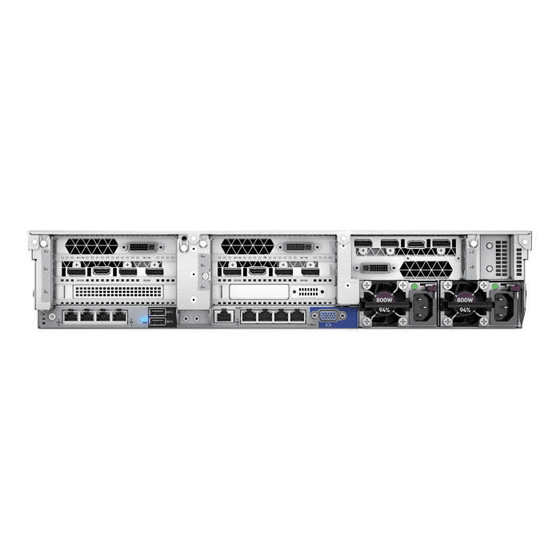
### HP DL 380 Gen avant.png

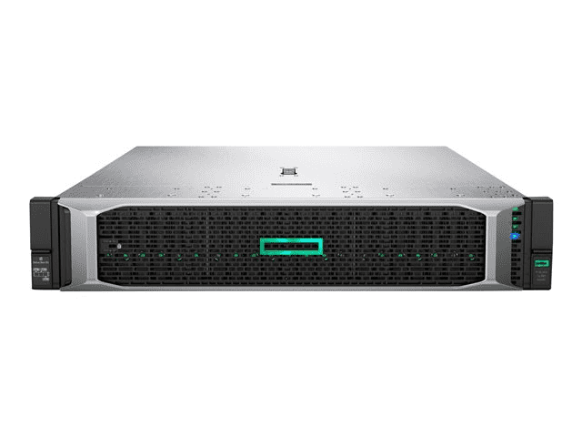
### JL356A-Aruba-24P-avant.png

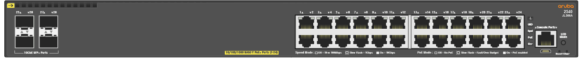
### JL357A-Aruba-48P-avant.png

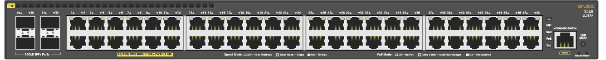
### PDU G2 Arriere.png

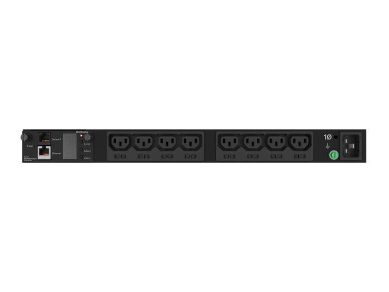
### PDU G2 Avant.png

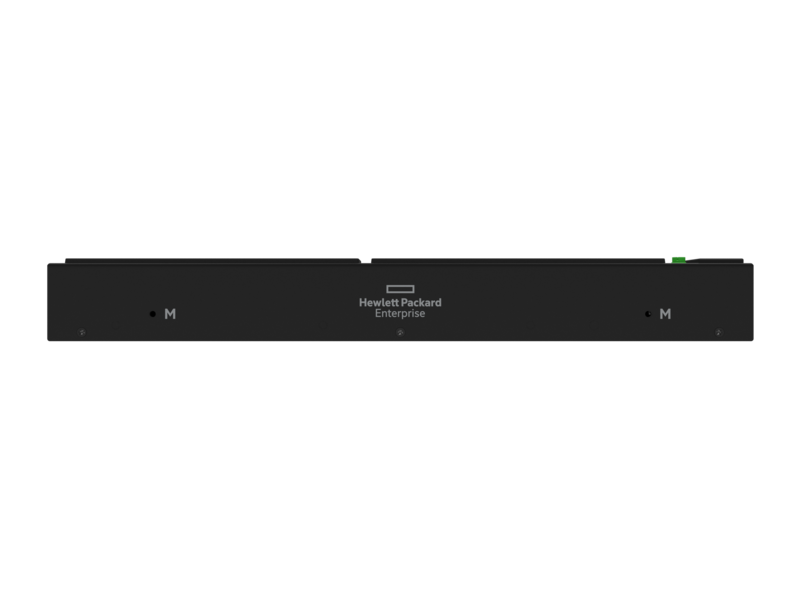
### Gabarit switch 24P.png

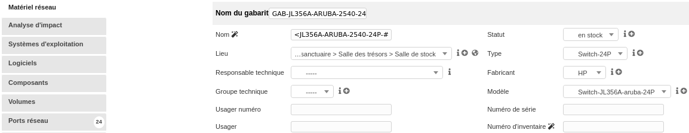
### Gabarit switch 48P.png

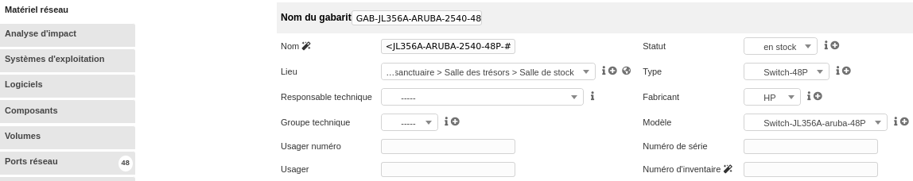
### HDD alienware.png

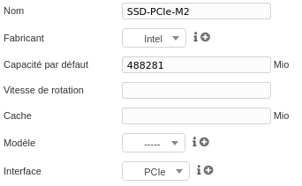
### Prise réseau.png

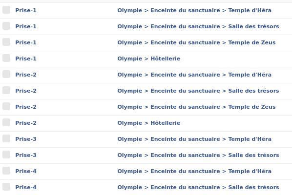
### TP3-RAM.png

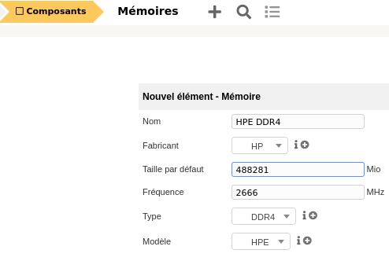
### TP3-datacenter.png

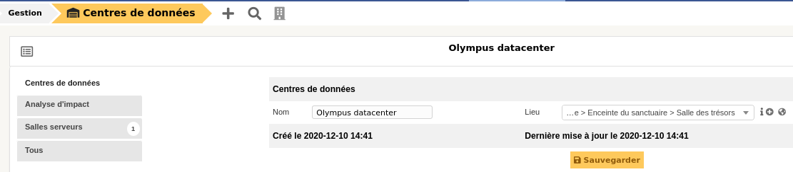
### TP3-port-proliant.png

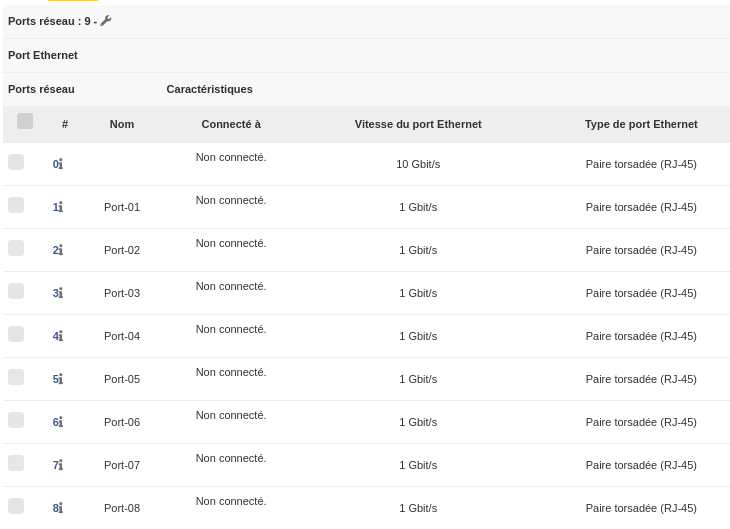
### TP3-salle serveur et datacenter.png

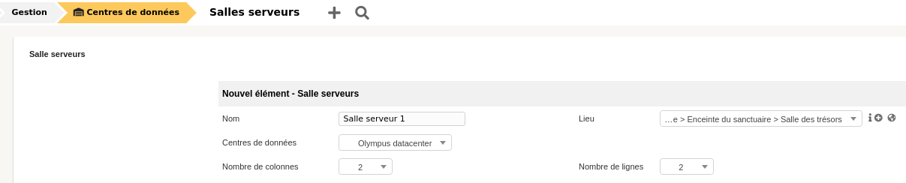
### baie avec images.png

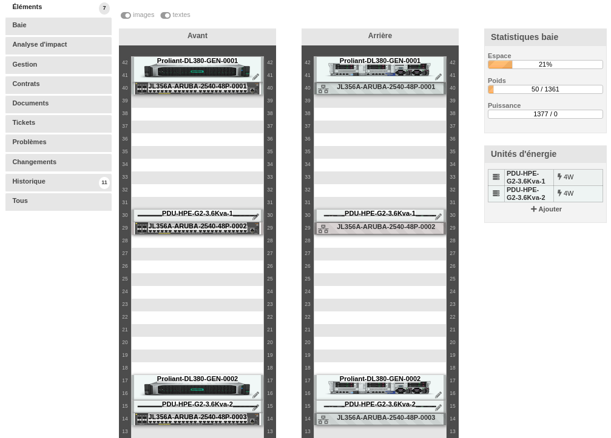
### baie.png

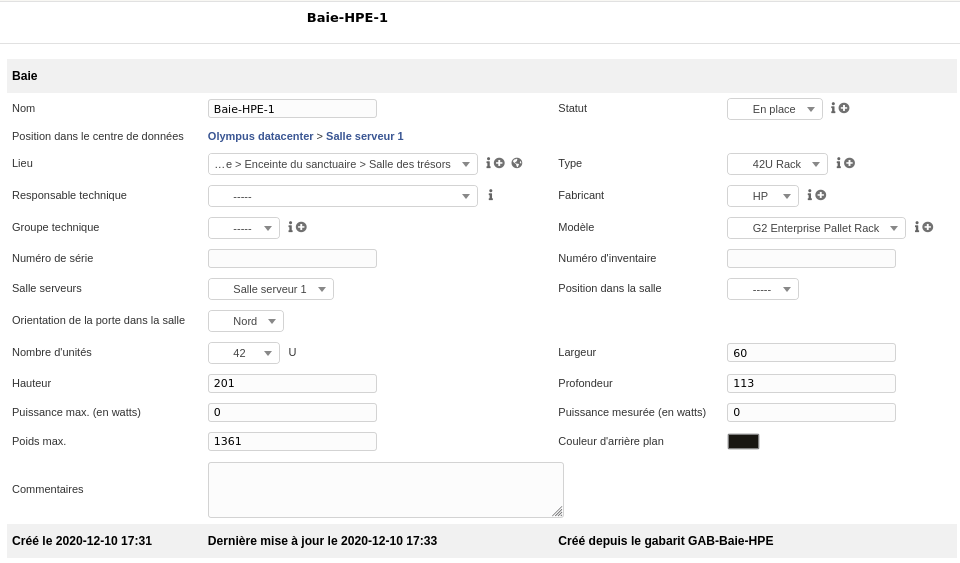
### carte graphique RTX 2070.png

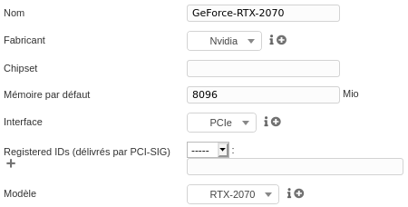
### carte réseau Killer E3000.png

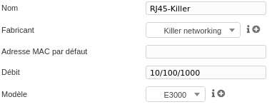
### gabarit composant alienware.png

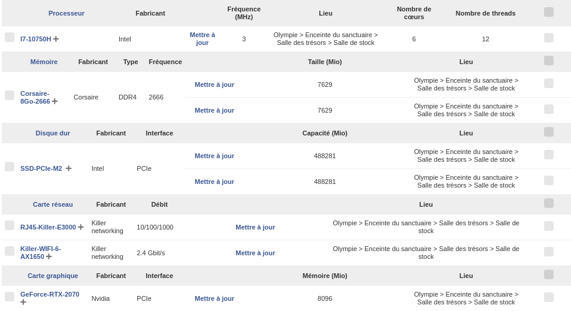
### gabarit logiciel alienware.png

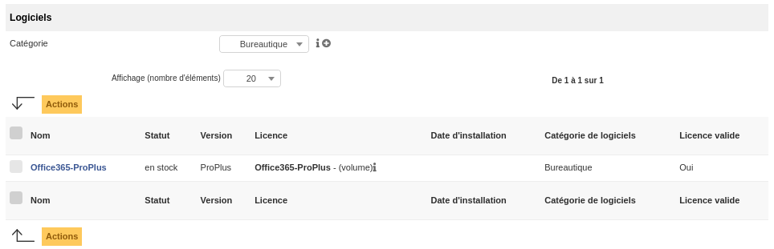
### gabarit os alienware.png

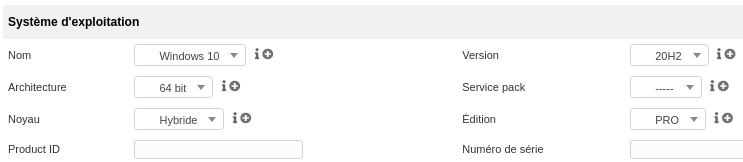
### gabarit port reseau alienware.png

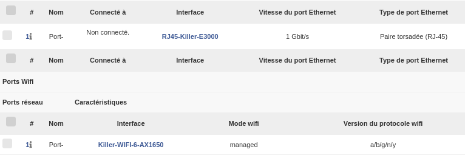
### gabarit volume alienware.png

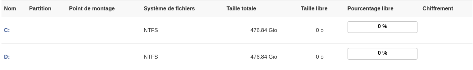
### licence o365 proplus.png

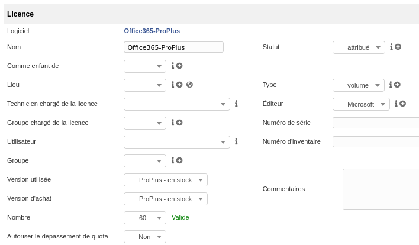
### logiciel o365 Proplus.png

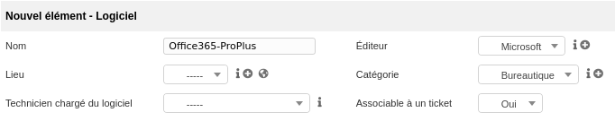
### modele pdu.png

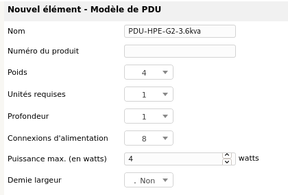
### modele switch 24P.png

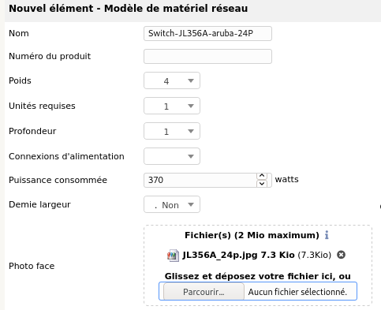
### modele switch 48P.png

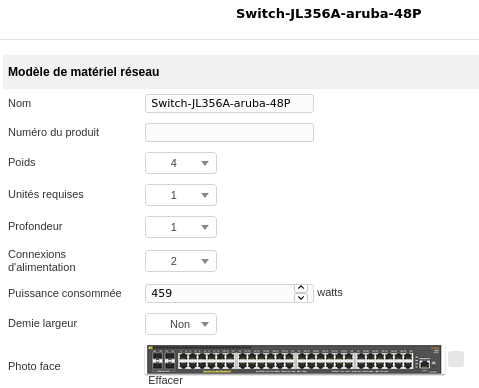
### modèle alieneware.png

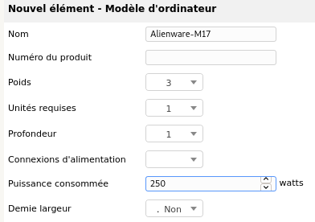
### port wifi alienware.png

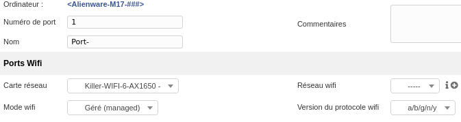
### processeur I7-10750H.png

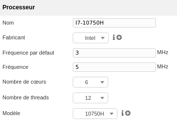
### server en baie.png

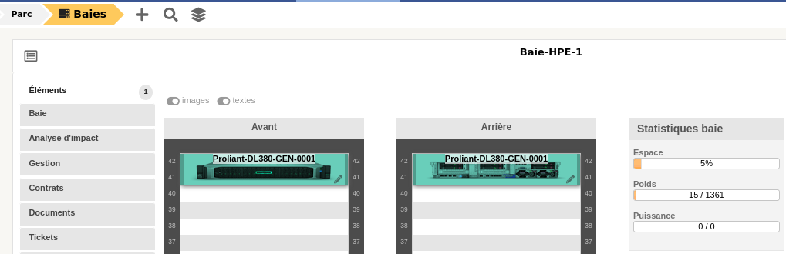
### switch 48P.png

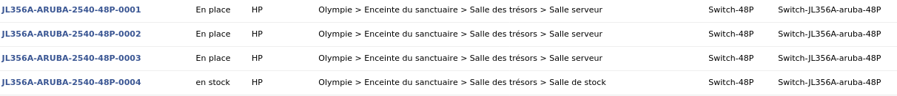
### version logiciel dans logiciel.png

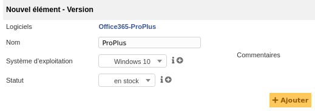
