# Corrections — Module 04 — Assistance — Traitements automatisés des tickets

!!! warning
    Une correction décrit le contexte du laboratoire. Comparer la logique et les contrôles avant de reprendre une valeur, une version ou un chemin dans un autre environnement.

## M4 - Solution du TP - Assistance

### GLPI

#### Assistance

#### TP du Module 4 — Assistance — Traitements automatisés des tickets

Avant de démarrer ce TP, il convient d’avoir suivi les vidéos des modules 1 à 4 et d’avoir réalisé les TP proposés.

#### Enoncé

- Correctement utiliser les gabarits de ticket et les règles métiers pour les tickets.

#### Prérequis

Application GLPI fonctionnelle.

#### Principales tâches à réaliser

Gabarit de ticket.

- Créez un gabarit de ticket « Incident serveur » :

  - Champs obligatoires :

- Titre.
- Catégorie.
- Type.
- Lieu.
- Description.
- Créez un gabarit de ticket « Incident Bureautique » :

Image de correction disponible dans les ressources.

  - Champs obligatoires :

- Titre.
- Catégorie.
- Type.
- Lieu.
- Description.
- Éléments associés.

  - Champs masqués :

- Urgence.
- Impact.
- Créez un gabarit de ticket « Demande Bureautique » :

Image de correction disponible dans les ressources.

  - Champs obligatoires :

- Titre.
- Catégorie.
- Type.
- Lieu.
- Description.

  - Champs masqués :

- Urgence.
- Impact.

#### Catégorie de ticket

- Créez les catégories :

Image de correction disponible dans les ressources.

  - Logiciel.
  - Bureautique comme enfant de logiciel.
  - Word comme enfant de bureautique.
  - Excel comme enfant de Bureautique.
  - Outlook comme enfant de bureautique.
  - Infographiste comme enfant de logiciel.
  - Serveur.
  - Virtualisation comme enfant de serveur.
  - Active Directory comme enfant de serveur.
  - Matériel.
  - Souris/clavier comme enfant de matériel.
  - Ecran comme enfant de matériel.

- Lier les catégories à leurs gabarits :

  - Catégorie « Bureautique », « Word » et « Excel » aux gabarits de ticket

« Incident bureautique » et « Demande bureautique ». Il est possible d’affecter un gabarit à plusieurs catégories avec la modification en masse. Image de correction disponible dans les ressources.

  - Catégorie « Serveur », « Virtualisation » et « Active Directory » au gabarit

« Incident serveur ».

#### Calendrier

- Tous les Incidents serveur seront traités sur un calendrier « cal serveur » en jours ouvrés

(lundi à jeudi) 08h00 — 18h00 et 8h00 — 17h-30 le vendredi.

#### Intitulés &gt; calendrier

Ajoutez le calendrier « cal serveur » avec les heures 8h/18h pour tous les jours ouvrés : Créez chaque jour avec les bons horaires. Image de correction disponible dans les ressources.

- Tous les autres incidents utiliseront un calendrier « cal utilisateurs » en jours ouvrés (lundi

à vendredi) 9h00 — 17h30.

#### Niveau de service

- Créez un niveau de service « SLA incident serveur » de l’entreprise Olympus avec les

#### spécificités suivantes :

  - Calendrier « cal serveur ».
  - SLA « Incident serveur ».

- Le temps de prise en charge pour les incidents de type « serveur »,

« virtualisation » et « Active Directory » devra être inférieur à 1h00.

- Le temps de résolution pour les incidents serveur devra être inférieur à

8h.

- Si incident de toutes les catégories « serveur », « virtualisation » et «

#### Active Directory » n’est pas prise en charge 10 minutes après la

#### création du ticket, le groupe « GG_GLPI_Super-Admin » sera

#### automatiquement positionné dessus ainsi qu e vous en tant

qu’observateur sur le ticket. Créez une escalade sur le temps de prise en charge. Attention, mettre OU comme opérateur logique pour les critères. Critères : catégories serveur, virtualisation et Active Directory. Action : observateur &gt; vous et groupe de technicien &gt; GG_GLPI_Super- Admin. Image de correction disponible dans les ressources.

- Si le ticket n’est pas résolu 4h avant la date butoir de résolution, le ticket passera en

priorité haute avec une escalade vers vous. Créez une escalade sur le temps de résolution à -4h. Attention, mettre OU comme opérateur logique pour les critères. Critères : catégories serveur, virtualisation et Active Directory.

#### Action : priorité &gt; haute et technicien &gt; vous

Image de correction disponible dans les ressources.

- Si le ticket n’est pas résolu 3h avant la date butoir de résolution, le ticket passera en

priorité très haute avec une escalade vers le directeur « Zeus ». Créez une escalade sur le temps de résolution à -3h. Attention, mettre OU comme opérateur logique pour les critères. Critères : catégories serveur, virtualisation et Active Directory.

#### Action : priorité &gt; très haute et technicien &gt; Zeus

Image de correction disponible dans les ressources.

- Créez un niveau de service « SLA incident bureautique » de l’entreprise Olympus avec

#### les spécificités suivantes :

  - Avec le calendrier « cal utilisateurs ».
  - Un SLA Temps de résolution de 2 jours.
  - Un SLA Temps de prise en charge 4h.

- Créez un niveau de service « SLA demande bureautique » de l’entreprise Olympus avec

#### les spécificités suivantes :

  - Avec le calendrier « cal utilisateurs ».
  - Un SLA Temps de résolution de 10 jours.
  - Un SLA Temps de prise en charge 4h.

#### Règles métier pour les tickets

- Créez une règle métier pour les tickets « règle SLA serveur ».

Attention, mettre OU comme opérateur logique pour les critères. Image de correction disponible dans les ressources.

  - Comme critères :

- Catégories « serveur », « virtualisation » et « Active Directory ».
- Type incident.

  - Comme actions :

- SLAs Temps de résolution « incident serveur ».
- SLAs Temps de prise en charge « incident serveur ».
- Priorité moyenne.
- Groupe de technicien « GG_GLPI_Technician ».
- Créez une règle métier pour les tickets « règle SLA incident bureautique ».

  - Comme critères :

- Catégories « Bureautique », « Word » et « Excel ».
- Type « incident ».

  - Comme actions :

- SLAs Temps de résolution « incident bureautique ».
- SLAs Temps de prise en charge « incident bureautique ».
- Priorité basse.
- Groupe de technicien « GG_GLPI_hotliner ».
- Créez une règle métier pour les tickets « règle SLA demande bureautique ».

  - Comme critères :

- Catégories « Bureautique », « Word » et « Excel ».
- Type « demande ».

  - Comme actions :

- SLAs Temps de résolution « demande bureautique ».
- SLAs Temps de prise en charge « demande bureautique ».
- Priorité très basse.
- Groupe de technicien « GG_GLPI_hotliner ».

Une solution est proposée pour ce TP sous la forme d'un PDF commenté, disponible dans les ressources à télécharger, accompagnée de captures d’écran pour vous guider.

## Captures de référence

### SLM incidents serveur.png

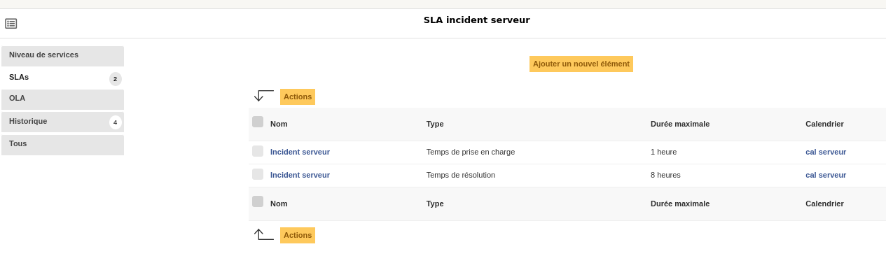
### affectation en masse gabarit et catégories.png

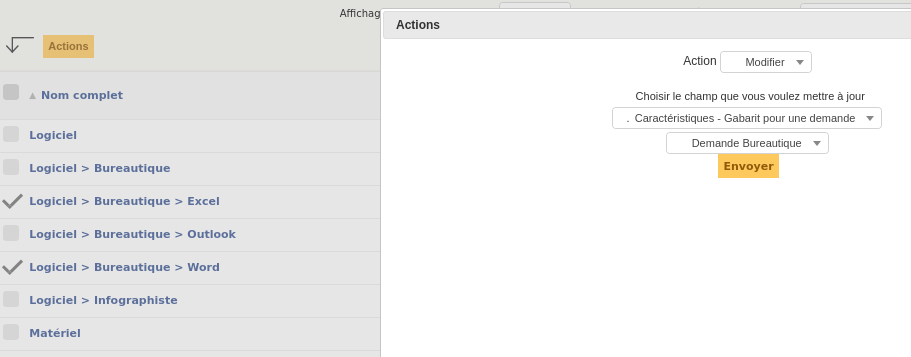
### cal serveur.png

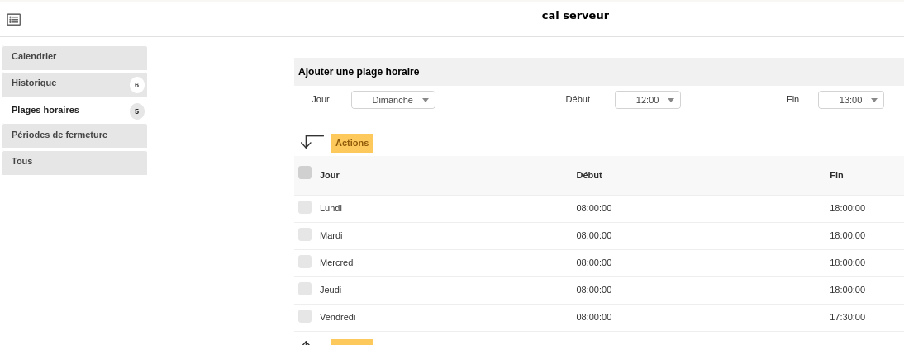
### cal utilisateurs.png

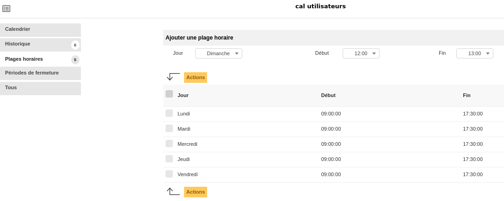
### catégories de ticket.png

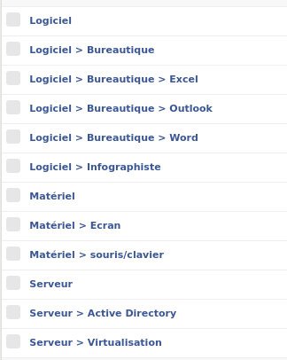
### escalade haute et tres haute resolution serveur.png

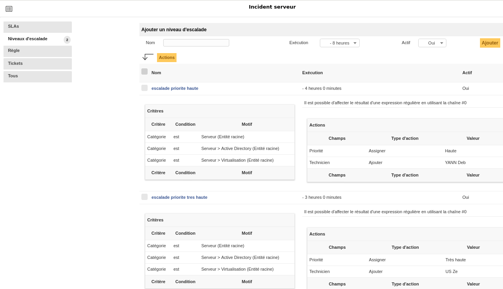
### escalade prise en charge serveur action et critere.png

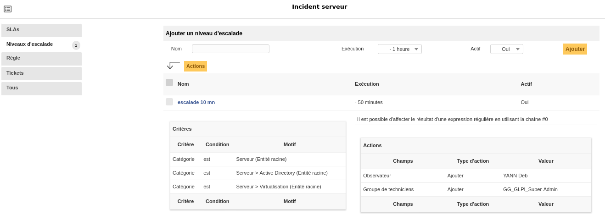
### escalade prise en charge serveur.png

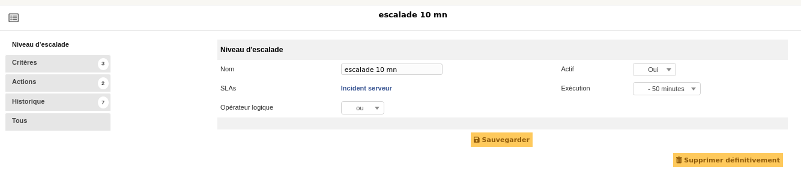
### gabarit ticket incident bureautique.png

### gabarit ticket incident serveur.png

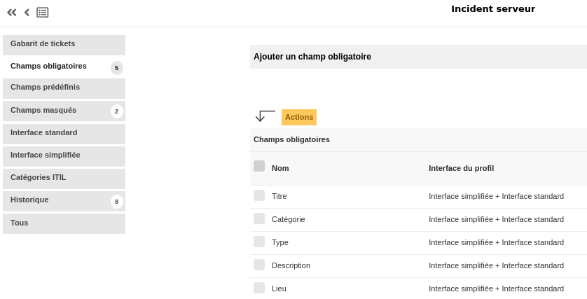
### regle sla serveur action.png

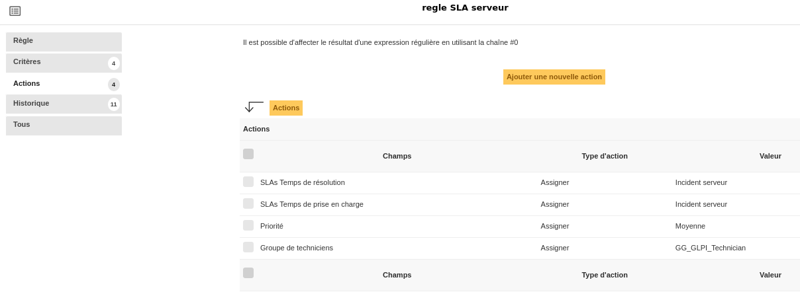
### regle sla serveur critere.png

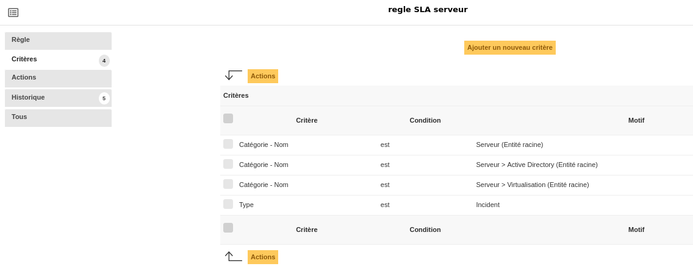
