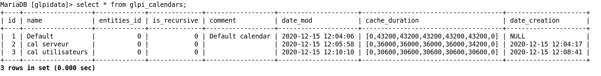
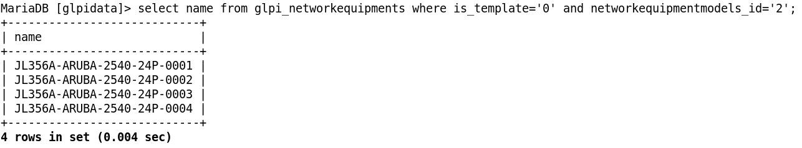
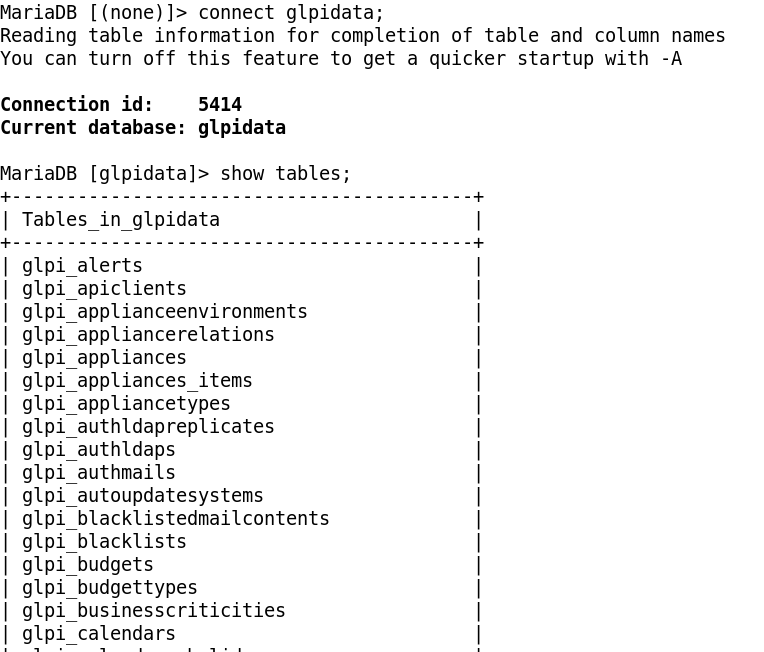
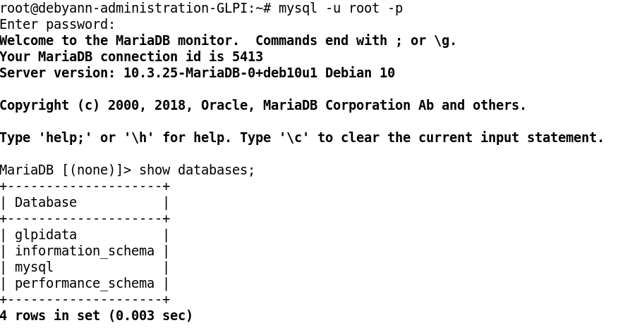
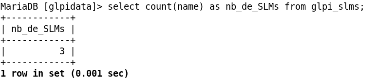
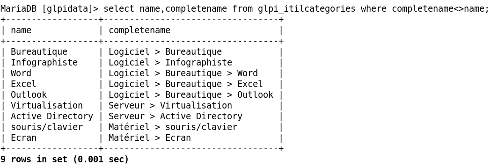
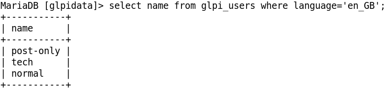
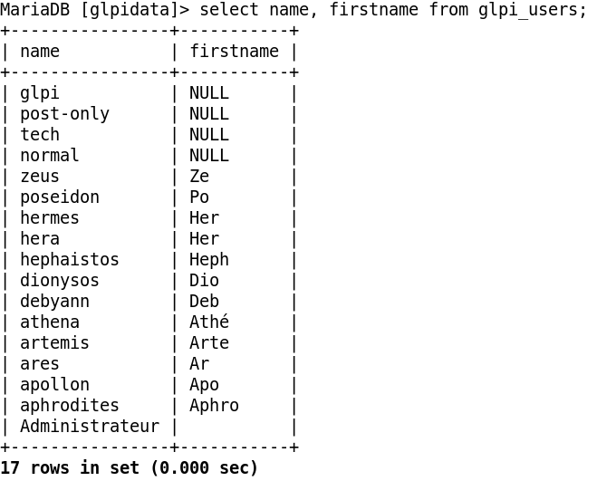
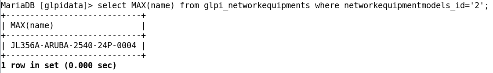

# Corrections — Module 05 — Les bases de MySQL et MariaDB

!!! warning
    Une correction décrit le contexte du laboratoire. Comparer la logique et les contrôles avant de reprendre une valeur, une version ou un chemin dans un autre environnement.

## M5 - Soution du TP - Requêtes SQL

### GLPI

#### Requêtes SQL

#### TP du Module 5 — Les bases de MySQL/MariaDB

Avant de démarrer ce TP, il convient d’avoir suivi les vidéos des modules 1 à 5 et d’avoir réalisé les TP proposés.

- Comprendre le fonctionnement des requêtes MySQL.

#### Prérequis

- Avoir fini les TP des modules précédents.

#### Contexte :

- Vous gérez l’application GLPI au sein du domaine de la société Olympus depuis

quelque temps et votre DSI vous demande des informations à extraire dans la base de données directement. Des images de correction sont disponibles dans les ressources.

#### Principales tâches à réaliser

Connexion à la base de données en ligne de commande de votre serveur GLPI

- Connectez-vous en Shell à votre base de données de GLPI avec le compte root que

#### vous avez configuré lorsque vous avez effectué la commande

`mysql_secure_installation.`

`mysql -u root -p`

- Affichez toutes les bases de données présentes dans votre serveur MariaDB.

`show databases;`

Attention, ne pas oublier le ; à chaque fin de ligne.

- Connectez-vous à la base de données glpidata puis affiche z toutes les tables

présentes. connect glpidata;

`show tables;`

- Affichez tous les attributs de la table des calendriers.

`select * from glpi_calendars;`

- Affichez les noms et prénoms des utilisateurs de GLPI.

`select name, firstname from glpi_users;`

- Affichez le nom des utilisateurs qui ont la langue en anglais (en_GB).

`select name from glpi_users where language=’en_GB’;`

- Affichez le nom et le nom complet des catégories de ticket qui sont enfants de.

  - Indice : utiliser un comparateur.

`select name, completename from glpi_itilcatégories where`

completename&lt;&gt;name;

#### Ou

`select name, completename from glpi_itilcatégories where level &gt; ‘1’;`

- Affichez le nom des switchs réseau qui ne sont pas des gabarits et qui sont liés au

modèle GAB-JL356A-ARUBA-2540-24P.

  - Indices :

- Utiliser les sélections complexes.

- Is_template à 1 est un gabarit.

- GAB-JL356A-ARUBA-2540-24P est networkequipmentmodels_id à 2.

`select n ame from glpi_networkequipments where is_template=’0’ and`

networkequipmentmodels_id=’2’;

- Comptez le nombre de SLMs et affichez en en-tête de colonne nb_de_SLMs.

  - Indice : utiliser un alias.

`select count(name) as nb_de_SLMs from glpi_slms;`

- Affichez le nom du switch avec le chiffre le plus haut qui utilise le modèle 24Ports.

  - Indice : utiliser une fonction d’agrégation.

`select MAX(name) from_glpinetworkequipments where`

networkequipmentmodels_id=’2’;

#### BONUS

- Affichez le(s) nom(s) de la catégorie de ticket et le nom du gabarit de ticket qui est

utilisé pour une demande dans les catégories de ticket.

  - Indice : utiliser une jointure interne.

Le but étant d’afficher le gabarit de ticket « demande bureautique » qui est le seul qui est de type demande rattaché à une catégorie.

#### Une solution :

`SELECT glpi_tickettemplates.name, glpi_itilcategories.name from`

#### glpi_tickettemplates INNER JOIN glpi_itilcategories ON

#### glpi_itilcategories.tickettemplates_id_demand=glpi_tickettemplates.id

where glpi_itilcategories.tickettemplates_id_demand=’3’;

#### BONUS

- Comptez-les en affichant le nom du gabarit utilisé et le nombre avec comme en -

tête « nombre de catégories qui utilise un gabarit de demande ».

`SELECT count(glpi_tickettemplates.name) as ‘nombre de catégories qui`

#### utilise un gabarit de demande’, glpi_tickettemplates.name from

#### glpi_tickettemplates INNER JOIN glpi_itilcategories ON

#### glpi_itilcategories.tickettemplates_id_demand=glpi_tickettemplates.id

where glpi_itilcategories.tickettemplates_id_demand=’3’;

## Captures de référence

### afficher les calendriers.png

### afficher switch non gabarit et du gab 24P.png

### connection à la bdd et affichage des tables.png

### connection et affichage bdd.png

### nb_de_SLMs.png

### nom complément de nom de catégorie enfant.png

### nom des users en anglais.png

### nom et prenom des utilisateurs.png

### numéro max du switch 24P.png

