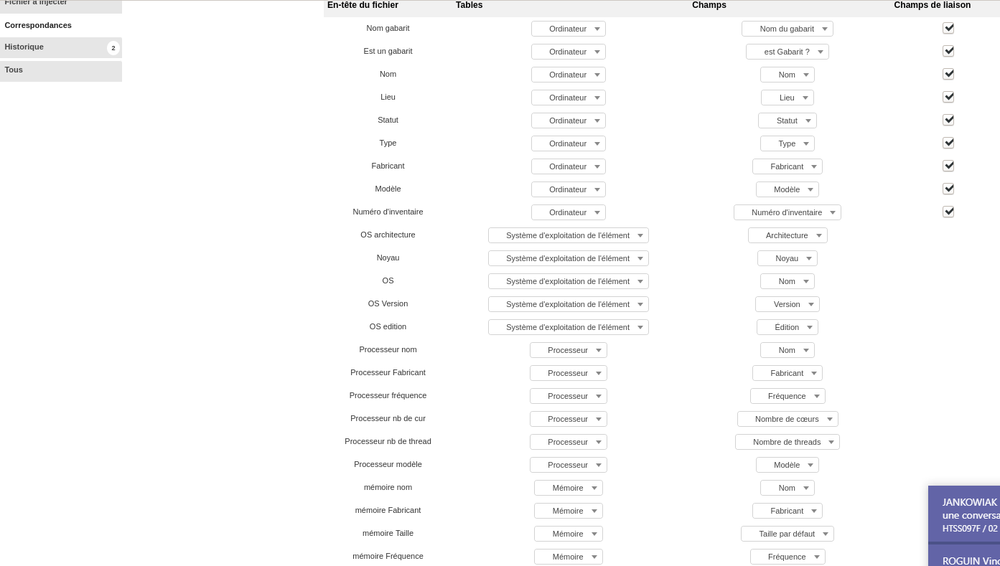
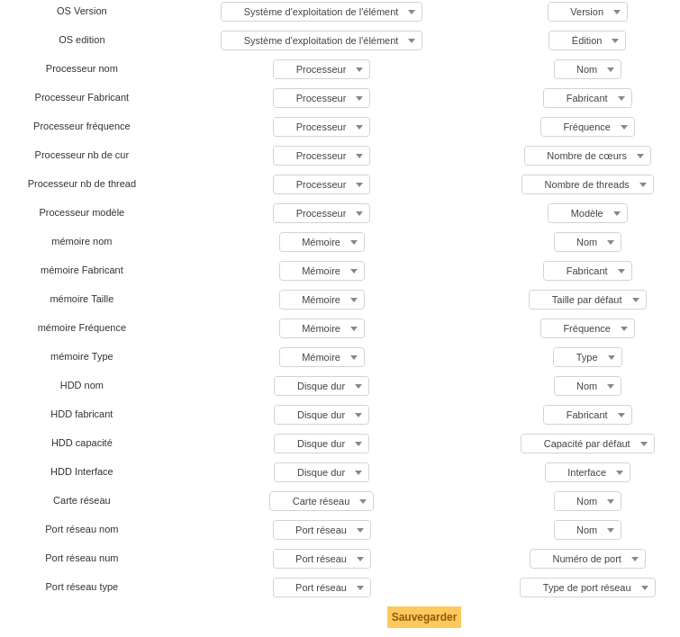
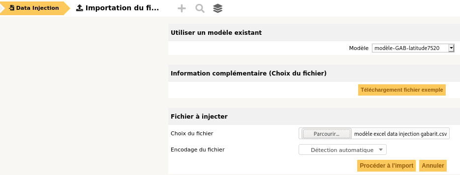
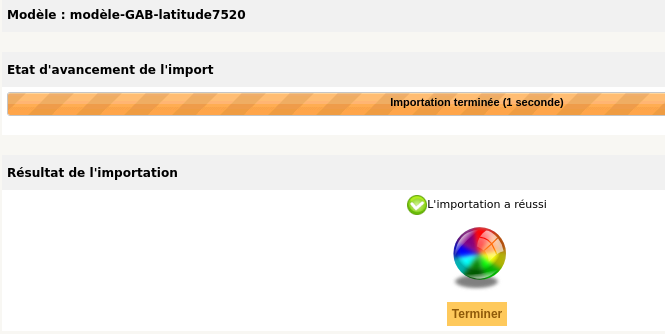
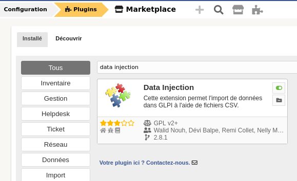

# Corrections — Module 06 — Plug-ins et inventaire

!!! warning
    Une correction décrit le contexte du laboratoire. Comparer la logique et les contrôles avant de reprendre une valeur, une version ou un chemin dans un autre environnement.

## M6 - Solution du TP - Plugins

### GLPI

#### Plugins

#### TP du Module 6 — Présentation des plugins — Inventaire avec

#### FusionInventory

Avant de démarrer ce TP, il convient d’avoir suivi les vidéos des modules 1 à 6 et d’avoir réalisé les TP proposés.

- Installer le plugin FusionInventory et l’agent.

#### Prérequis

- Avoir un serveur GLPI fonctionnel.

#### Contexte :

- La société Olympus vous demande d’installer le plugin FusionInventory et l’agent sur

l’application GLPI au sein de son domaine.

#### Adressage IP des VM : 192.168.1.0/24 + DHCP salle

#### srv-glpi srv-CD1

#### PFSENSE

#### VMNET 18

#### Réseau de salle

#### .1.2

192.168.1.0/24

#### .254

#### DHCP

#### Principales tâches à réaliser

Installation du Plugins FusionInventory.

- Récupérez depuis le serveur Debian, le fichier fusioninventory-9.5.0+1.0.tar.bz2.

Utilisez de WinSCP afin de récupérer le fichier.

- Extrayez l’archive fusioninventory-9.5.0+1.0.tar.bz2 dans le répertoire

/var/www/glpi/plugins.

`cp /home/debyann/ fusioninventory -9.5.0+1.0.tar.bz2`

#### /var/www/glpi/plugins/

`cd /var/www/glpi/plugins`

`tar xvjf fusioninventory-9.5.0+1.0.tar.bz2`

- Changez l’utilisateur propriétaire pour www -data sur ce répertoire et tout son

contenu.

`chown -R www-data /var/www/glpi/plugins`

- Installez et activez le plugin dans l’interface GLPI.

Menu Configuration - Plugins dans l’interface. Au bout de la ligne fusioninventory &gt; installer puis activer.

- Installez l’agent FusionInventory sur votre contrôleur de domaine Olympus.gr.

Image de correction disponible dans les ressources.

#### Bonus

- Activez le marketplace puis installez le plugin « Data injection ».

#### Allez sur le site

Image de correction disponible dans les ressources. Utilisez les 2 fichiers CSV disponibles avec les ressources des TPs.

- Un fichier avec seulement les en -têtes et un autre rempli est dis ponible auprès du

formateur.

## Captures de référence

### data injection correspondance 1.png

### data injection correspondance 2.png

### data injection import.png

### data injection rapport.png

### marketplace datainjection.png

