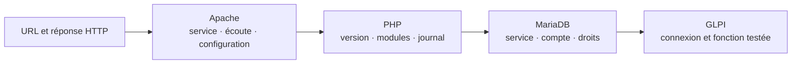

# Dépannage — GLPI inaccessible



<p class="tssr-caption">Isoler les couches dans l’ordre du trajet de la requête : serveur web, moteur PHP, base de données puis application.</p>

## Vérifications

```bash
systemctl status apache2 mariadb
ss -ltnp
journalctl -u apache2 -u mariadb --since today
apachectl configtest
php -v
```

- Si le port ne répond pas : service, écoute ou pare-feu.
- Si Apache répond en erreur 500 : journaux PHP/Apache et permissions.
- Si la page signale la base : état MariaDB, compte, hôte et droits SQL.
- Si l’authentification LDAP échoue : connectivité, DN de base, compte de liaison, TLS et filtres.

Après correction, tester l’URL, une connexion locale GLPI, puis la fonction concernée.
