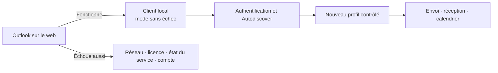

# Dépannage — Outlook ne se connecte pas

Outlook sur le web sépare rapidement un problème de boîte ou de service d’un problème propre au profil local.

1. Tester la boîte dans Outlook sur le web.
2. Vérifier réseau, date/heure, licence et état du service Microsoft 365.
3. Contrôler les identifiants et l’authentification multifacteur.
4. Lancer Outlook en mode sans échec pour écarter un complément.
5. Vérifier Autodiscover et le profil.
6. Créer un nouveau profil avant de supprimer l’ancien.
7. Contrôler envoi, réception, calendrier et carnet d’adresses.

Ne pas supprimer un fichier de données local sans en connaître le type et sans sauvegarde.
