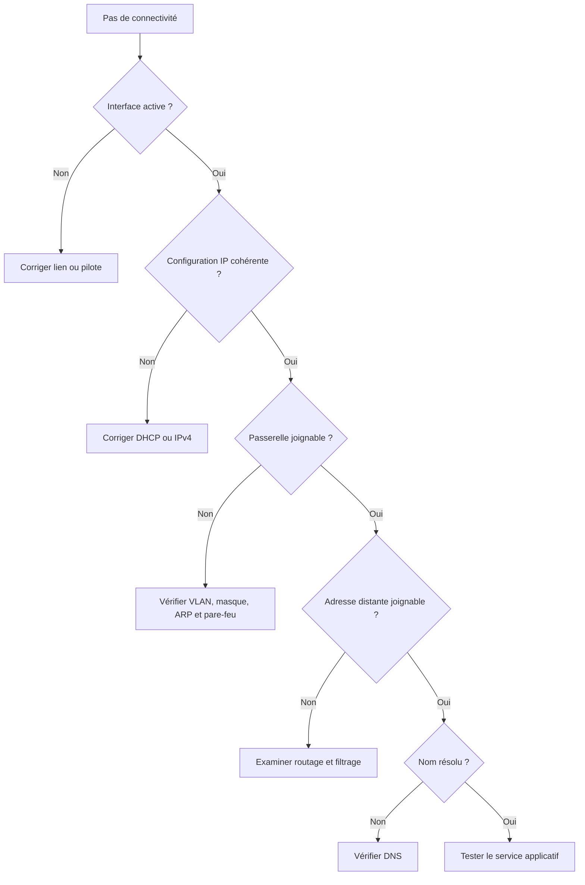

# Tutoriel — Diagnostiquer une panne réseau

## Objectif

Localiser la panne sans modifier plusieurs paramètres à la fois.

## Checklist

1. Vérifier le lien physique et l’état de l’interface.
2. Afficher adresse, masque, passerelle et DNS.
3. Tester la pile locale avec `ping 127.0.0.1`.
4. Tester sa propre adresse, puis la passerelle.
5. Tester une adresse distante connue.
6. Tester la résolution d’un nom.
7. Tracer le chemin si le réseau distant reste inaccessible.



## Commandes

=== "Windows"

    ```powershell
    Get-NetAdapter
    Get-NetIPConfiguration
    Test-NetConnection 1.1.1.1
    Resolve-DnsName example.org
    tracert -d 1.1.1.1
    ```

=== "GNU/Linux"

    ```bash
    ip link
    ip addr
    ip route
    ping -c 4 1.1.1.1
    getent hosts example.org
    traceroute -n 1.1.1.1
    ```

## Validation

- [ ] L’interface est active.
- [ ] L’adresse appartient au bon réseau.
- [ ] La passerelle répond.
- [ ] Une adresse distante répond.
- [ ] Le DNS résout le nom.
- [ ] Le service attendu écoute et répond.
