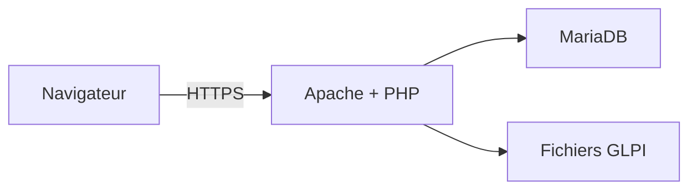

# Tutoriel — Installer GLPI sur une pile Apache, MariaDB et PHP

## Périmètre

Le support d’origine vise GLPI 9.5 et PHP 7.4. La procédure ci-dessous modernise les principes ; relever les prérequis exacts de la version choisie dans la [documentation GLPI](https://help.glpi-project.org/tutorials/procedures/install_glpi).

## Architecture



## Étapes essentielles

1. Mettre le système à jour et installer Apache, MariaDB, PHP et les extensions requises.
2. Exécuter la sécurisation initiale de MariaDB.
3. Créer une base et un compte GLPI dédiés.

```sql
CREATE DATABASE glpi CHARACTER SET utf8mb4 COLLATE utf8mb4_unicode_ci;
CREATE USER 'glpi'@'localhost' IDENTIFIED BY 'un-secret-long-et-unique';
GRANT ALL PRIVILEGES ON glpi.* TO 'glpi'@'localhost';
FLUSH PRIVILEGES;
```

4. Télécharger une archive depuis la publication officielle et vérifier sa provenance.
5. Déployer les fichiers hors d’un répertoire inscriptible par tous.
6. Configurer le VirtualHost, HTTPS et les répertoires de données/configuration recommandés.
7. Lancer l’assistant web avec le compte SQL dédié, jamais avec `root`.
8. Supprimer ou désactiver les éléments d’installation signalés et changer tous les comptes par défaut.

## Vérification

- [ ] La page d’état GLPI ne signale aucun prérequis bloquant.
- [ ] Le site répond en HTTPS.
- [ ] Le compte SQL n’accède qu’à la base GLPI.
- [ ] Les comptes par défaut ne conservent pas leur mot de passe d’origine.
- [ ] Une sauvegarde de la base et des fichiers a été testée.
